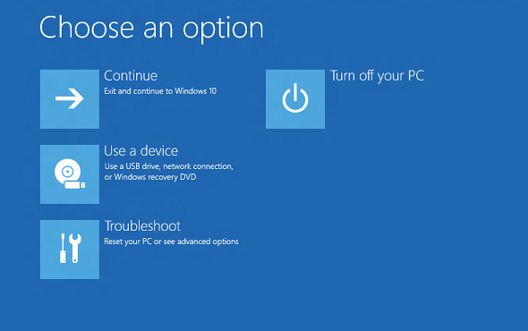

# Windows 恢复环境 (Windows RE)

Windows 恢复环境 (WinRE) 是一种恢复环境，可以修复无法启动操作系统的常见原因。 WinRE 基于 Windows 预安装环境 (Windows PE)，并且可以自定义使用其他驱动程序、 语言、 Windows PE 可选组件和其他故障排除和诊断工具。 默认情况下，是预先 WinRE 加载到 Windows 桌面版本 （家庭、 Pro、 企业和教育） 和 Windows 服务器 2016年安装 10。

## 什么是 WinRE 为 Windows 10 的新功能？

-   默认情况下，如果您安装了 Windows 使用 Windows 图像处理和配置设计器 (ICD) 创建的媒体将获得 （uefi） 和位于 Windows 分区后立即的 BIOS 设备，专用的 WinRE 工具分区。 这允许 Windows 替换并根据需要重新调整分区的大小。 （如果使用 Windows 安装程序安装 Windows 时，您将有相同的分区布局的 Windows 8.1）。
-   如果您[添加自定义工具 WinRE 启动选项菜单](add-a-custom-tool-to-the-windows-re-boot-options-menu.md)，它只能使用已被默认 WinRE 工具的可选组件。 例如，如果您有依赖于.NET 可选组件的 Windows 8 应用程序，您需要为 Windows 10 重写应用程序。
-   如果您[添加 WinRE 启动选项菜单的自定义工具](add-a-custom-tool-to-the-windows-re-boot-options-menu.md)，必须将它放置在\\源\\恢复\\工具文件夹，以便它可以继续在将来 WinRE 升级后使用。
-   将语言添加到按钮重置工具，您现在需要添加 WinPE HTA 的可选组件。

## 工具

WinRE 包括这些工具︰

-   **自动修复和其他疑难解答工具**。 有关更多信息，请参阅[Windows RE 故障诊断功能](windows-re-troubleshooting-features.md)。
-   **依靠以点击方式重置**(桌面版本，Windows 8.1 和仅 Windows 8 的 Windows 10)。 此工具允许您快速修复他们自己的 Pc，同时保留其数据和重要的自定义设置，而无需提前备份数据的用户。 更多的信息，请参阅[Push-Button 重置概述](push-button-reset-overview.md)。
-   **系统映像恢复**（Windows Server 2016、 Windows Server 2012 R2 和仅 Windows Server 2012）。 此工具可将整个硬盘。 有关更多信息，请参见[恢复操作系统或整个服务器](http://go.microsoft.com/fwlink/p/?LinkID=225039)。

此外，可以通过使用[Windows 图像处理 API](http://go.microsoft.com/fwlink/p/?LinkId=245837)，或通过使用[部署映像服务和管理 (DISM) API](http://go.microsoft.com/fwlink/p/?LinkID=245836)来创建您自己的自定义恢复解决方案。

## WinRE 入口点

您的用户可以访问通过**启动选项**菜单，可以在多种不同的方式从 Windows 启动 WinRE 功能︰

-   在登录屏幕中，单击关闭，然后选择**重新启动**时按住 Shift 键。
-   在 Windows 10 选择**启动** &gt; **设置** &gt; **更新和安全** &gt; **恢复**&gt;在**高级启动**，单击**立即重新启动**。
-   从引导恢复媒体。
-   使用[硬件恢复按钮 （或按钮组合）](add-a-hardware-recovery-button-to-start-windows-re.md)由 OEM 配置。

执行下列任一操作后，所有用户会话都注销并显示**启动选项**菜单。 如果用户选择在此菜单中，PC WinRE 功能重新启动进入 WinRE 和所选的功能将启动。

WinRE 检测以下问题后自动启动︰

-   两个连续失败尝试启动 Windows。
-   发生在两分钟内的两个连续意外的关机引导完成。
-   安全启动错误 （除了与 Bootmgr.efi 相关的问题）。
-   仅触摸设备 BitLocker 错误。

### 启动选项菜单

该菜单允许用户执行这些操作︰

-   启动恢复、 故障排除和诊断工具。
-   从一个设备 (只能 UEFI) 进行引导。
-   访问**固件**菜单 (仅 UEFI)。
-   选择哪种操作系统启动，如果在 PC 上安装了多个操作系统。

**请注意**  
**启动选项**菜单，您可以添加一个自定义的工具。 否则，这些不能进一步自定义菜单。 有关更多信息，请参阅[添加 Windows 重新启动选项菜单的自定义工具](add-a-custom-tool-to-the-windows-re-boot-options-menu.md)。

 

## 安全注意事项

当使用 WinRE 时，应注意这些安全注意事项︰

-   如果用户从 Windows 中打开**启动选项**菜单，并选择 WinRE 工具，它们必须提供具有管理员权限的用户名和密码的本地用户帐户。
-   默认情况下，WinRE 中，联网已被禁用。 您可以打开网络时需要它。 但是，我们建议您禁用时不需要连接网络。

## 自定义 WinRE

您可以通过添加软件包 （Windows PE 可选组件）、 语言、 驱动程序和自定义诊断或诊断工具定制 WinRE。 基本的 WinRE 映像包含这些 Windows PE 可选组件︰

-   Microsoft Windows 基础程序包
-   WinPE-EnhancedStorage
-   WinPE-Rejuv
-   WinPE 脚本
-   WinPE-SecureStartup
-   WinPE-安装程序
-   WinPE SRT
-   WinPE WDS 工具
-   WinPE WMI
-   （添加到 Windows 8.1 和 Windows Server 2012 R2 中的基图像） 的 WinPE-StorageWMI-包
-   WinPE HTA （添加到 Windows 10 中基本映像）

**请注意**  
程序包、 语言和驱动程序的数目受限制计算机上可用的内存量。 出于性能原因，建议您将语言、 驱动程序和工具，您将添加到映像的数目降至最低。

 

## 硬盘分区

通过使用 Windows 安装程序安装 Windows 时，WinRE 配置如下︰

1.  在 Windows 安装过程中 Windows 准备支持 WinRE 硬盘分区。
2.  最初，Windows 将在 Windows 分区中，WinRE 图像文件 (winre.wim) 放在\\Windows\\System32\\恢复文件夹。

    交付给您的客户的电脑之前, 可以修改或替换 WinRE 图像文件以包含其他语言、 驱动程序或程序包。

3.  在专业化配置阶段中，WinRE 图像文件被复制到恢复工具分区，以使该设备可以引导至恢复工具，即使 Windows 分区问题。

通过应用映像部署 Windows 时，您必须手动配置的硬盘分区。 当 WinRE 已安装在硬盘上时，则分区必须格式化为 NTFS。

从窗口和数据分区，基线 WinRE 工具图像 (winre.wim) 添加到一个单独的分区。 这使得用户可以使用 WinRE 即使 Windows 分区使用 Windows BitLocker 驱动器加密进行加密。 它还可以防止用户意外修改或删除 WinRE 工具。

我们建议 Windows 分区后立即将恢复工具存储在专用的分区。

有关配置硬盘分区的详细信息，请参阅[Configure UEFI/GPT-Based 硬驱动器分区](configure-uefigpt-based-hard-drive-partitions.md)或[Configure BIOS/MBR-Based 硬驱动器分区](configure-biosmbr-based-hard-drive-partitions.md)。

## 内存需求

为了引导 Windows RE 直接从内存 （即 RAM 磁盘启动），请连续物理内存 (RAM) 可以保存整个 Windows RE 映像 (winre.wim) 的部分都必须可用。 若要优化内存使用情况，制造商应确保其固件保留的内存位置的开头或末尾的物理内存地址空间。

## 请参见

<table>
<colgroup>
<col width="50%" />
<col width="50%" />
</colgroup>
<thead>
<tr class="header">
<th align="left">内容类型</th>
<th align="left">参考</th>
</tr>
</thead>
<tbody>
<tr class="odd">
<td align="left">
<strong>部署</strong>
</td>
<td align="left">
[自定义 Windows RE](customize-windows-re.md) | [部署 Windows RE](deploy-windows-re.md)
</td>
</tr>
<tr class="even">
<td align="left">
<strong>操作</strong>
</td>
<td align="left">
[REAgentC 命令行选项](reagentc-command-line-options.md)
</td>
</tr>
<tr class="odd">
<td align="left">
<strong>疑难解答</strong>
</td>
<td align="left">
[Windows RE 疑难解答功能](windows-re-troubleshooting-features.md)
</td>
</tr>
<tr class="even">
<td align="left">
<strong>加载项工具</strong>
</td>
<td align="left">
[向 Windows 重新启动选项菜单中添加自定义工具](add-a-custom-tool-to-the-windows-re-boot-options-menu.md) | [添加硬件恢复按钮来启动 Windows RE](add-a-hardware-recovery-button-to-start-windows-re.md) | [按钮重置概述](push-button-reset-overview.md)
</td>
</tr>
</tbody>
</table>

 
