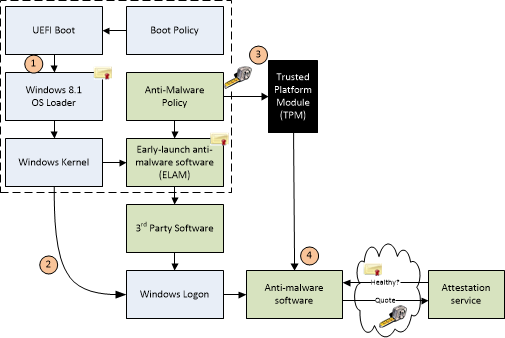
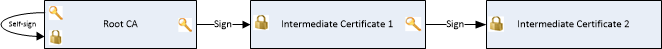
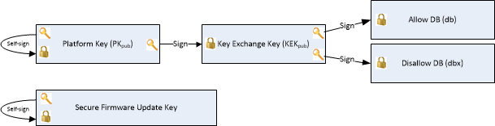
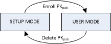

# <a name="windows-secure-boot-key-creation-and-management-guidance"></a>Windows 安全启动密钥创建和管理指南


**Vishal Manan，架构师，OEM 咨询**，<vmanan@microsoft.com>

**Van der Arie Hoeven、 架构师、 OEM 咨询**，<ariev@microsoft.com>

此文档可帮助指南 Oem 和 Odm 中创建和管理安全启动密钥和证书在制造环境中。 它解决了创建、 存储和检索的平台键 (Pk)、 安全固件更新密钥和密钥交换密钥 (KEKs) 的第三方的问题。

**注意︰**这些步骤并不特定于 PC Oem。 企业和客户也可以使用下列步骤来配置服务器以支持安全启动。 

（uefi） 和安全启动 Windows 要求见[Windows 硬件认证要求](http://go.microsoft.com/fwlink/p/?linkid=320504)。 本白皮书不引入了新的要求，也不代表官方的 Windows 程序。 它是作为指导超出认证要求，有助于构建高效、 安全的流程，用于创建和管理安全引导项。 这是重要的因为 UEFI 安全启动基于公钥基础结构来验证代码之前使用允许执行。

读者需要知道 UEFI，基本了解安全启动 (第 27 章[（uefi） 规范](http://go.microsoft.com/fwlink/p/?LinkID=220187)的) 和 PKI 安全模型的基本知识。

要求、 测试和验证在 Windows 安全启动的工具是目前可通过[Windows 硬件认证工具包 (HCK)](http://go.microsoft.com/fwlink/p/?linkid=254893)。 但是，这些 HCK 资源无法解决 Windows 部署的项的创建和管理。 本白皮书中讨论作为资源以帮助指南合作伙伴通过部署由固件使用的密钥的密钥管理。 它不是作为指导，并不包括任何新的要求。

在此页上︰

-   [1。 安全启动，Windows 和密钥管理](#securebootkeymanagement)包含启动安全和 PKI 体系结构的信息，如它适用于 Windows 和安全启动。

-   [2。 密钥管理解决方案](#keymanagementsolutions)旨在帮助合作伙伴设计适合他们需求的关键管理和设计解决方案。

-   [3。 摘要和资源](#summaryandresources)包括附录、 检查表、 Api 和其他引用。

本文作为起点在开发客户准备好的 Pc、 工厂部署工具并且密钥安全性最佳做法。

## <a name="span-idsecurebootkeymanagementspanspan-idsecurebootkeymanagementspanspan-idsecurebootkeymanagementspan1-secure-boot-windows-and-key-management"></a><span id="SecureBootKeyManagement"></span><span id="securebootkeymanagement"></span><span id="SECUREBOOTKEYMANAGEMENT"></span>1.安全引导、 Windows 和密钥管理


（uefi） （统一可扩展固件接口） 规范定义了一个称为安全启动固件执行身份验证过程。 作为一种行业标准，安全引导定义如何平台固件管理证书，验证固件和操作系统接口与此进程如何。

安全启动基于公钥基础结构 (PKI) 进程前允许它们执行身份验证模块。 这些模块可以包括固件驱动程序选项 Rom，UEFI 驱动程序对磁盘、 （uefi） 的应用程序或 UEFI 引导加载程序。 通过图像之前执行的身份验证，安全引导降低预启动恶意软件的攻击，如木马的风险。 Microsoft 在 UEFI 安全启动 Windows 8 中及以上依赖于为我们的客户提高平台安全性的信任引导安全体系结构的一部分。 定时器是 Windows 8，高于客户端 Pc 和 Windows 服务器 2016 年需要定义在 Windows 硬件兼容性要求。

安全引导过程的工作，如下所示，在图 1 中所示︰

1.  **固件启动组件︰**固件将验证 OS 加载程序是受信任 （Windows 或其他受信任操作系统。）

2.  **Windows 启动组件︰ BootMgr，WinLoad，Windows 内核启动。** Windows 启动组件验证每个组件上的签名。 任何不受信任的组件将不会加载，并改为触发安全启动修正。

    -   **防病毒和反恶意软件的初始化︰**此软件检查的特殊签名验证它受信任的启动关键驱动程序，Microsoft 发布的并将尽早在启动过程中启动。

    -   **启动关键驱动程序初始化︰**引导所必需的所有驱动程序签名签在 WinLoad 的安全启动验证的一部分。

3.  **其他操作系统初始化**

4.  **Windows 登录屏幕**



*图 1: Windows 信任引导体系结构*

实现 UEFI 安全引导是 Microsoft 的受信任引导体系结构，引入 Windows 8.1 中的一部分。 恶意软件攻击的发展过程中日益增长的趋势的目标引导路径作为首选的攻击媒介。 这类攻击已难以抵挡，因为可以通过恶意软件阻止它们完全加载禁用反恶意软件产品。 使用 Windows 信任引导体系结构和其建立信任与安全引导的根，客户免受恶意代码通过确保该只签名、 认证"已知正常"的代码执行的引导路径，引导加载程序可以执行操作系统本身之前加载。

### <a name="span-id11public-keyinfrastructurepkiandsecurebootspanspan-id11public-keyinfrastructurepkiandsecurebootspanspan-id11public-keyinfrastructurepkiandsecurebootspan11-public-key-infrastructure-pki-and-secure-boot"></a><span id="1.1_Public-Key_Infrastructure__PKI__and_Secure_Boot"></span><span id="1.1_public-key_infrastructure__pki__and_secure_boot"></span><span id="1.1_PUBLIC-KEY_INFRASTRUCTURE__PKI__AND_SECURE_BOOT"></span>1.1 公共密钥基础结构 (PKI) 和安全引导

PKI 建立真实性和系统中的信任。 安全引导利用 PKI 为高级别达到两个目的︰

1.  在启动，以确定是否信任执行早期启动模块。

2.  进行身份验证请求到服务请求包括安全引导数据库和更新对平台固件进行修改。

PKI 组成︰

-   证书颁发机构 (CA) 所颁发的数字证书。

-   注册机构验证从 CA 请求证书的用户的身份。

-   一个中央目录，用于存储和索引键中。

-   证书管理系统。

### <a name="span-id12publickeycryptographyspanspan-id12publickeycryptographyspanspan-id12publickeycryptographyspan12-public-key-cryptography"></a><span id="1.2_Public_Key_Cryptography"></span><span id="1.2_public_key_cryptography"></span><span id="1.2_PUBLIC_KEY_CRYPTOGRAPHY"></span>1.2 公钥加密

公钥加密使用数学上相关的加密密钥，称为公钥和私钥对。 如果您知道某一项，不能方便地计算，另一个是什么。 如果使用一个密钥来加密信息，相应的键可以解密该信息。 安全引导，使用私钥进行数字签名的代码并使用公钥来验证该代码才能证明它的真实性上签名。 如果私钥被泄露，然后使用相应的公钥系统不再是安全的。 这引导工具包的攻击，可能会，否则会损害的实体负责确保私钥的安全信誉。

安全启动公共密钥系统中您具有下列项目︰

-   **1.2.1 RSA 2048 加密**

    RSA 2048 是不对称的加密算法。 将 RSA 2048 模数存储在原始表单所需的空间是为 2048 位。

-   **1.2.2 自签名证书**

    由与该证书的公钥匹配的私钥签名的证书被称为自签名的证书。 根证书颁发机构 (CA) 证书属于此类别。

-   **1.2.3 证书颁发机构**

    证书颁发机构 (CA) 颁发签名证书，确认证书使用者的身份，并将该标识绑定到包含在证书中的公钥。 CA 通过使用其私钥对证书进行了签名。 它对所有相关方自签名的根 CA 证书中颁发相应的公钥。

    在安全的启动证书颁发机构 (Ca) 包括 OEM （或其代理） 和微软。 Ca 生成的密钥对，形成信任的根，然后使用私钥签名如允许早期引导 EFI 模块和固件为请求提供服务的合法操作。 对应的公钥安全启动启用 Pc 上都附带嵌入到 UEFI 固件和用于验证这些操作。

    （CAs 和密钥交换的用法的详细信息是随时可通过 internet 访问的安全启动模型与相关。

-   **1.2.4 公钥**

    公共平台键在 PC 上装运和辅助性或"公用"。 本文中我们将使用后缀"pub"来表示公钥。 例如，PKpub 表示公开的半部分的 PK.

-   **1.2.5 专用密钥**

    Pki 使用私钥需要安全地管理。 它应是可访问组织中的几个高度受信任的个人和在物理安全位置位于强访问策略设置限制。 在本文中我们将使用后缀"专用"表示专用密钥。 例如，PKpriv 表示专用的 PK.半

-   **1.2.6 证书**

    数字证书的主要用途是验证已签名的数据，如二进制文件等的来源。证书的一个常见用途是使用传输层安全性 (TLS) 或安全套接字层 (SSL) 的 internet 邮件安全。 验证已签名的数据的证书可以让收件人知道数据的来源和它有在运输中被更改。

    数码证书通常包含，在高级别、 可分辨的名称 (DN)、 一个公共密钥和签名。 DN 标识的实体，一家公司，例如者持有与证书的公钥匹配的私钥。 用私钥签名的证书并将证书中的签名将联结的私钥的公钥。

    证书可以包含其他类型的数据。 例如，X.509 证书包含证书，证书，该算法用于签署的证书，颁发证书、 名称和请求证书，以及该 CA 签名的实体的公钥的 CA 的名称的序列号的格式。

-   **1.2.7 链证书**

    从︰[证书链](http://go.microsoft.com/fwlink/?LinkId=321183)︰

    

    *图 2︰ 三个证书链*

    用户证书通常由不同的专用密钥，如 CA 的私钥签名。 这构成了两个证书链。 验证用户证书的真实性需要验证它需要 CA，其证书中的公钥的签名。 但封闭的 CA 证书，然后才能使用该 CA 的公钥需要验证。 CA 证书是自签名的因为用于验证证书的 CA 的公钥。

    用户证书不需要由根 CA 的私钥签名。 它可以由中间 CA 的私钥签名的证书的私钥签名。 这是三个证书链中的一个实例︰ 用户证书和中间证书，CA 证书。 但是，多个中介可能属于链，因此证书链可以是任意长度。

### <a name="span-id13securebootpkirequirementsspanspan-id13securebootpkirequirementsspanspan-id13securebootpkirequirementsspan13-secure-boot-pki-requirements"></a><span id="1.3_Secure_Boot_PKI_requirements"></span><span id="1.3_secure_boot_pki_requirements"></span><span id="1.3_SECURE_BOOT_PKI_REQUIREMENTS"></span>1.3 确保安全引导 PKI 需求

（uefi） 定义的信任根包含的平台键和 OEM 或 ODM 任何键包含固件核心中。 Pre UEFI 安全和信任的根得不到解决 UEFI 安全引导过程，而是按国家标准和技术协会 (NIST) 和受信任的计算组 (TCG) 本文中引用的出版物。

-   **1.3.1 安全启动要求**

    您将需要考虑用于实现安全启动以下参数︰

    -   客户需求

    -   Windows 硬件兼容性要求

    -   密钥生成和管理需求。

    您需要选择安全启动密钥管理等硬件安全模块 (Hsm) 的硬件，请考虑在 Pc 上的特殊要求，将商品送到政府和其他机构以及最后的创建、 填充和管理各种安全启动密钥的生命周期过程。

-   **1.3.2 安全启动相关项**

    安全启动所用的键如下︰

    

    *图 3︰ 与安全启动相关的键*

    上面的图 3 表示签名和与安全启动 PC 中的键。 该平台通过在制造过程中 OEM 安装固件中的平台键将其固定。 安全启动使用其他密钥来保护数据库的存储密钥，以允许或禁止的固件的执行权限。

    授权的数据库 (db) 包含公钥和证书表示信任的固件组件和操作系统加载程序。 禁止的签名数据库 (dbx) 包含恶意和易受攻击的组件的哈希值以及泄露密钥和证书和块执行恶意的那些组件。 这些策略的强度根据签名使用验证码和公钥基础结构 (PKI) 固件。 PKI 是为创建、 管理和吊销证书，在信息交换过程中建立信任一个完善过程。 PKI 是安全启动的安全模型的核心。

    以下是这些键的更多详细信息。

-   **1.3.3 平台键 (PK)**

    2.3.1 UEFI 堪误表 C 27.5.1 部分中，根据平台键建立平台所有者和平台固件之间的信任关系。 平台所有者注册键 (PKpub) 公开的半部分到**部分 7.2.1 UEFI 2.3.1 堪误表 C**中所指定的平台固件。此步骤安装模式从移动到用户模式的平台。 Microsoft 建议的平台键为类型的**EFI\_证书\_X509\_GUID**与公钥算法 RSA 公钥长度为 2048 位和签名算法 sha256RSA。 平台所有者可以使用类型**EFI\_证书\_RSA2048\_GUID**如果存储空间是个问题。 公钥被用来检查签名，此文档中前面所述。 随后，平台所有者可以使用键 (PKpriv) 的私有部分︰

    -   若要更改必须放到固件平台拥有 UEFI 定义的**安装模式下**禁用安全启动。 我们建议恢复为安装模式下，才需要执行此操作期间制造。
    
    -   对于桌面 PC，Oem 管理 PK 和与之相关联的必要 PKI。 对于服务器，默认的 Oem 管理 PK 和必要的 PKI。 企业客户或服务器的客户还可以定制 PK，OEM 信任 PK 替换为自定义专有 PK 锁定到自身 UEFI 安全启动固件中的信任。

    **1.3.3.1 的注册或更新密钥交换密钥 (KEK) 注册平台键**

    平台所有者注册平台键 (**PKpub**) 公开的半部分的调用中指定节 7.2.1 UEFI 规范 2.3.1 堪误表 C，作为 UEFI 引导服务 SetVariable() 和重置该平台。 如果平台处于安装模式下，则应与的对应**PKpriv**签名新**PKpub** 。 如果在用户模式下为平台，然后必须使用当前的**PKpriv**签名新**PKpub** 。 如果 PK 型**EFI\_证书\_X509\_GUID**，则这必须由即时**PKpriv**，不在 PK.下颁发的任何证书私钥签名

    **1.3.3.2 交换的平台键**

    通过调用具有可变的大小为 0 （uefi) 启动 Ser¬vice SetVariable() 和重置该平台，平台所有者清除平台键 (**PKpub**) 公开的半部分。 如果平台处于安装模式，然后不需要进行身份验证空变量。 如果在用户模式下为平台，然后空变量必须签名与当前**PKpriv**;部分 7.2 （变量服务） 下[UEFI 规范](http://go.microsoft.com/fwlink/p/?LinkID=220187)2.3.1 堪误表 C 有关的详细信息，请参阅。 强烈建议，生产 PKpriv 从未用于签名的包重置该平台，因为这使得以编程方式禁用安全引导。 这是主要的预生产测试方案。

    也将使用安全的特定于平台的方法清除的平台键。 在这种情况下，也必须为 1 更新全局变量的设置模式。

    

    *图 4︰ 平台键状态图*

    **1.3.3.3 PK 代**

    按照 UEFI 建议中的公共密钥必须存储在非易失性存储器，它是防篡改和溅在 PC 上删除。 私有密钥保持安全伙伴处或 OEM 的安全机构中，只有公共密钥加载到平台上。 有部分 2.2.1 和 2.3 下的更多详细信息。

    生成的 PK 数由平台所有者 (OEM) 的决定。 这些注册表项可能是︰

    1.  **一个每台 PC**。 有一个为每个设备的唯一键。 这可能要求政府机构、 金融机构或其他服务器客户提供高安全性的需求。 它可能需要额外的存储和加密处理能力的大量电脑生成私钥和公钥。 这将添加映射设备及其相应的 PK 的复杂性时推出固件更新到的设备在未来。 有几个不同 HSM 解决方案可用于管理大量基于 HSM 供应商的键。 有关更多信息，请参见[安全启动密钥生成使用 HSM](http://go.microsoft.com/fwlink/?LinkId=321184)。

    2.  **每个模型一个**。 让每个计算机模型的一个键。 这里的代价是，如果密钥被破解同一模型中的所有计算机都将易受攻击。 这被推荐由 Microsoft 的台式机个人电脑。

    3.  **生产线每出现一次**。 如果密钥被破解的整个产品线将易受攻击。

    4.  **OEM 每出现一次**。 这可能是最容易设置，如果密钥被破解，而您制造的所有 PC 将都受到攻击。 为了加快在工厂车间的操作，PK 和其他可能的密钥无法预先生成并存储在安全的地方。 这些可能以后检索和使用在装配线。 章节 2 和 3 有更多详细信息。

    **1.3.3.4 重新生成密钥的 PK**

    这可能会需要 PK 受到损害或作为一项要求的客户，为安全起见可以决定注册自己的 PK.

    重新生成密钥能为模型或基于已选择哪种方法创建 PK.的 PC 所有新的 Pc 将得到签名与新创建的 PK.

    更新生产 PC PK 需要签名的 PK 或固件更新程序包替换现有 PK 任一变量更新。 OEM 还可以创建一个 SetVariable() 包并和只是改变 PK.的 PowerShell 如一个简单的应用程序一起分发， 将由安全固件更新密钥签名和验证固件的固件更新软件包。 如果执行固件的更新 PK，应格外小心以确保 KEK，db，并保留 dbx。

    在所有的 Pc，建议不要使用 PK 安全固件更新键。 如果受到攻击 PKpriv，则安全固件更新键 （因为它们是相同的）。 在这种情况下要注册新的 PKpub 的更新可能无法因为更新的过程也已遭到破坏。

    SOCs Pc 上没有不用作安全固件更新键 PK 的另一个原因。 这是因为安全固件更新键永久刻录到满足 Windows 硬件认证要求的 Pc 上的保险丝。

-   **1.3.4 密钥交换密钥 (KEK)**密钥交换的密钥建立操作系统和平台固件之间的信任关系。 每个操作系统 （和可能需要的平台固件进行通信的每个第三方应用程序） 中注册平台固件到公钥 (**KEKpub**)。

    **1.3.4.1 的注册密钥交换密钥**

    密钥交换密钥存储在签名数据库[1.4 签名数据库 （Db 和 Dbx）](#signaturedatabase)中所述。 签名数据库将被视为已经过身份验证 （uefi） 变量。

    平台所有者注册密钥交换密钥由任一调用中指定部分 7.2 （变量服务） 下使用 EFI [UEFI 规范](http://go.microsoft.com/fwlink/p/?LinkID=220187)2.3.1 勘误表 C.作为 SetVariable()\_变量\_追加\_编写属性集和数据参数，其中包含将新的密钥，或通过阅读使用 GetVariable() 的数据库，将追加到现有密钥的新密钥交换密钥，然后编写使用 SetVariable （） 中的指定部分 7.2 （变量服务） 下[UEFI 规范](http://go.microsoft.com/fwlink/p/?LinkID=220187)2.3.1 堪误表 C 而不作为的数据库EFI\_变量\_追加\_写属性集。

    如果平台处于安装模式下，不需要进行签名的签名数据库变量但仍应作为准备到 SetVariable() 调用的参数指定的身份验证部分 7.2.1 变量。 平台是在用户模式下，必须使用当前的 PKpriv 签名签名数据库

    **1.3.4.2 交换 KEK**

    它是可能的"清除"（删除） KEK。 请注意，是否未安装在平台上的 PK，"清除"请求不需要签名。 如果它们已签署，然后清除 KEK 要求的 PK 签署的包，并以清除 db 或 dbx 需要签名的任意实体存在于 KEK 的包。

    **1.3.4.3 Microsoft KEK**

    Microsoft KEK 需通过更新 dbx 启用吊销映像损坏，并可能用于更新数据库，准备为新的 Windows 签名图像。

    包括 Microsoft Corporation KEK CA 2011 在 KEK 数据库中，用下面的值︰

    -   Sha-1 证书哈希︰ `31 59 0b fd 89 c9 d7 4e d0 87 df ac 66 33 4b 39 31 25 4b 30`。

    -   SignatureOwner GUID: `{77fa9abd-0359-4d32-bd60-28f4e78f784b}`。

    -   Microsoft 将向合作伙伴提供证书，并且可以添加作为**EFI\_证书\_X509\_GUID**或**EFI\_证书\_RSA2048\_GUID**类型签名。

    可以从下载的 Microsoft KEK 证书︰ <http://go.microsoft.com/fwlink/?LinkId=321185>。

    **1.3.4.4 KEKDefault**该平台供应商可能会提供一组默认的密钥交换密钥在 KEKDefault 变量中。 请参考[UEFI 规范](http://go.microsoft.com/fwlink/p/?LinkID=220187)27.3.3 节以获取更多信息。

    **1.3.4.5 OEM / 第三方 KEK-添加多个 KEK**

    客户和平台所有者不需要有自己 KEK。 在非-Windows RT Pc OEM 可能会有额外的 KEKs 允许其他 OEM 或受信任的数据库和 dbx 的第三方控件。
 
-   **1.3.5 安全启动固件更新键**安全固件更新密钥用于签名时它需要更新的固件。 此参数必须具有 RSA 2048 最小密钥长度。 所有固件更新必须进行安全都签名，由 OEM，ODM 或 IBV （独立 BIOS 供应商），如其受信任委托或安全的签名服务。

    按照[NIST 出版物 800-147 固件更新字段](http://go.microsoft.com/fwlink/?LinkId=321186)必须支持所有元素的准则︰

    对固件闪存存储任何更新必须由创建者签名。

    固件必须检查更新的签名。

-   **1.3.6 创建的密钥安全固件更新**

    相同的密钥用于签名以来公众一半将驻留在计算机的所有固件更新。 您可能还固件更新使用密钥进行签名的链接到安全固件更新密钥。

    可能每台 PC 像 PK 一个键或每个模型一个或生产线每出现一次。 如果每台 PC，可能意味着数以百万计的唯一更新包将需要生成一个密钥。 请考虑根据资源可用性对您是否有用什么方法。 每个模型或产品行的键是好的折衷方案。

    将存储公钥安全固件更新 （或哈希来节省空间） 在某些受保护的存储平台 — 通常保护闪烁 (PC) 或可编程一次-保险丝 (SOC)。

    如果仅此密钥的哈希值存储 （以节省空间），然后固件更新将包括键，并更新过程的第一阶段将验证该更新中的公钥匹配在平台上存储的哈希。

    马蹄形是依据操作系统可以将数据传递到 UEFI 环境跨重新启动方法。 Windows 调用 UEFI UpdateCapsule()，以提供系统和 PC 的固件更新。 在启动时调用 ExitBootServices （），Windows 将传递到 UpdateCapsule() 在 Windows 驱动程序存储区中找到任何新的固件更新。 UEFI 系统固件可以使用此过程来更新系统和 PC 固件。 通过利用此 Windows 固件支持 OEM 可以依靠相同的通用格式，同时系统的固件和 PC 固件更新过程。 为了支持 UEFI UpdateCapsule() for Windows，固件必须实现 ACPI ESRT 表。

    为实现对 Windows UEFI 固件更新平台支持的详细信息，请参阅以下文档︰ Windows UEFI 固件更新平台。

    更新马蹄形可以在内存或磁盘上。 Windows 支持的内存更新中。

    **1.3.6.1 胶囊 （胶囊中内存）**

    下面是工作内存中更新胶囊的事件流。

    1.  胶囊由操作系统中的应用程序放在内存中

    2.  设置邮箱事件通知挂起的更新的 BIOS

    3.  计算机将重新启动，验证马蹄形图像和更新通过 BIOS

-   **1.3.7 典型的固件更新的工作流**

    1.  下载并安装固件驱动程序。

    2.  重新启动。

    3.  操作系统加载程序会检测并验证固件。

    4.  操作系统加载程序将传递给 UEFI 的二进制的 blob。

    5.  （uefi） 执行固件更新 （这一过程拥有硅供应商）。

    6.  OS 加载器检测已成功完成。

    7.  操作系统完成启动。

### <a name="span-idsignaturedatabasespanspan-idsignaturedatabasespanspan-idsignaturedatabasespan14-signature-databases-db-and-dbx"></a><span id="SignatureDatabase"></span><span id="signaturedatabase"></span><span id="SIGNATUREDATABASE"></span>1.4 签名数据库 （Db 和 Dbx）

-   **1.4.1 允许签名数据库 (db)**

    内容的 EFI\_图像\_安全\_数据库 db 控制哪些图像受信任验证加载的图像时。 该数据库可能包含多个证书、 密钥和哈希值，以确定允许的图像。

    **Microsoft Windows 生产 PCA 2011**的 sha-1 证书哈希值与`58 0a 6f 4c c4 e4 b6 69 b9 eb dc 1b 2b 3e 08 7b 80 d0 67 8d`必须包括在数据库中以便 Windows 操作系统加载程序加载。 可以在此处下载 Windows CA: <http://go.microsoft.com/fwlink/p/?linkid=321192>。

    在非-Windows RT Pc OEM 应该考虑包括**Microsoft Corporation （uefi) CA 2011**的 sha-1 证书哈希值与`46 de f6 3b 5c e6 1c f8 ba 0d e2 e6 63 9c 10 19 d0 ed 14 f3`。 签名 UEFI 驱动程序和应用程序与该证书将允许 UEFI 驱动程序和应用程序从第三方在 PC 上运行，而无需用户执行其他步骤。 可以在此处下载 UEFI CA: <http://go.microsoft.com/fwlink/p/?linkid=321194>。

    在非-Windows RT Pc OEM 可能也有其他项目以允许其他操作系统或 OEM 审核 UEFI 驱动程序或应用程序，数据库中，但这些图像必须不损害以任何方式 PC 的安全性。

-   **1.4.2 DbDefault**︰ 平台供应商可能会提供一组默认的条目 dbDefault 变量中的特征码数据库。 有关详细信息请参阅 UEFI 规范的第 27.5.3 部分。

-   **1.4.3 禁止签名数据库 (dbx)**

    内容的**EFI\_图像\_签名\_DATABASE1**验证之前检查 db 和任何匹配的图像必须使该映像执行时必须选中 dbx。 该数据库可能包含多个证书、 密钥和哈希值，以确定被禁止的图像。 Windows 硬件认证要求的状态，因此任何虚拟的值，例如 sha-256 哈希，dbx 必须是存在的`0`，直到 Microsoft 开始提供 dbx 更新如次可能用作安全占位符。 [单击此处](http://www.uefi.org/revocationlistfile)可从 Microsoft 下载最新的 （uefi） 吊销列表。

-   **1.4.4 DbxDefault**︰ 平台供应商可能会提供一组默认的条目 dbxDefault 变量中的特征码数据库。 有关详细信息请参阅 UEFI 规范的第 27.5.3 部分。

### <a name="span-id15keysrequiredforsecurebootonallpcsspanspan-id15keysrequiredforsecurebootonallpcsspanspan-id15keysrequiredforsecurebootonallpcsspan15-keys-required-for-secure-boot-on-all-pcs"></a><span id="1.5_Keys_Required_for_Secure_Boot_on_all_PCs"></span><span id="1.5_keys_required_for_secure_boot_on_all_pcs"></span><span id="1.5_KEYS_REQUIRED_FOR_SECURE_BOOT_ON_ALL_PCS"></span>1.5 所需的所有电脑上的安全引导键

<table>
<colgroup>
<col width="25%" />
<col width="25%" />
<col width="25%" />
<col width="25%" />
</colgroup>
<thead>
<tr class="header">
<th align="left">键/db 名称</th>
<th align="left">变量</th>
<th align="left">所有者</th>
<th align="left">注释</th>
</tr>
</thead>
<tbody>
<tr class="odd">
<td align="left"><p>PKpub</p></td>
<td align="left"><p>PK</p></td>
<td align="left"><p>OEM</p></td>
<td align="left"><p>PK – 1 只。 必须是 RSA 2048 或更强。</p></td>
</tr>
<tr class="even">
<td align="left"><p>微软公司 KEK CA 2011</p></td>
<td align="left"><p>KEK</p></td>
<td align="left"><p>Microsoft</p></td>
<td align="left"><p>允许对 db 和 dbx 的更新︰</p>
<p>[http://go.microsoft.com/fwlink/p/?linkid=321185](http://go.microsoft.com/fwlink/p/?linkid=321185)。</p></td>
</tr>
<tr class="odd">
<td align="left"><p>Microsoft Windows 生产 CA 2011</p></td>
<td align="left"><p>db</p></td>
<td align="left"><p>Microsoft</p></td>
<td align="left"><p>此 CA 签名数据库 (db) 中的允许 Windows 启动︰ [http://go.microsoft.com/fwlink/?LinkId=321192](http://go.microsoft.com/fwlink/?LinkId=321192)。</p></td>
</tr>
<tr class="even">
<td align="left"><p>禁止的签名数据库</p></td>
<td align="left"><p>dbx</p></td>
<td align="left"><p>Microsoft</p></td>
<td align="left"><p>已知的坏键、 Ca 或来自 Microsoft 的图像列表</p></td>
</tr>
<tr class="odd">
<td align="left"><p>加强固件更新密钥的安全</p></td>
<td align="left"><p></p></td>
<td align="left"><p>OEM</p></td>
<td align="left"><p>建议是有其不同于 PK 此键</p></td>
</tr>
</tbody>
</table>

 

*表 1︰ 键/数据库所需的安全启动*


## <a name="span-idkeymanagementsolutionsspanspan-idkeymanagementsolutionsspanspan-idkeymanagementsolutionsspan2-key-management-solutions"></a><span id="KeyManagementSolutions"></span><span id="keymanagementsolutions"></span><span id="KEYMANAGEMENTSOLUTIONS"></span>2.密钥管理解决方案


下面是给定的某些度量我们用于比较。

### <a name="span-id21metricsusedspanspan-id21metricsusedspanspan-id21metricsusedspan21-metrics-used"></a><span id="2.1_Metrics_used"></span><span id="2.1_metrics_used"></span><span id="2.1_METRICS_USED"></span>2.1 标准

以下指标可以帮助您选择 HSM PC 基于[UEFI 规范](http://go.microsoft.com/fwlink/p/?LinkID=220187)2.3.1 堪误表 C 和您的需要的要求。

**公共密钥基础结构 (PKI) 相关**

-   它支持 RSA 2048 或更高版本？ - [UEFI 规范](http://go.microsoft.com/fwlink/p/?LinkID=220187)2.3.1 堪误表 C 建议的键是 RSA 2048 或更好。

-   未生成密钥和签名的能力？

-   它可以存储多少项？ 它不在 HSM 或连接的服务器上存储键？

-   检索密钥的身份验证方法。

    一些个人电脑上支持多个身份验证实体键检索存在。

**定价**

-   价格点是什么？ Hsm 的价格从 1500 美元至 $70000，具体取决于可用的功能范围。

**制造环境**

-   在工厂车间的操作的速度。 加密处理器可以加速键创建和访问。

-   便于安装、 部署和维护。

-   技能和所需的培训？

-   网络访问备份和高可用性

**标准和法规遵从性**

-   它有何种级别的 FIPS 兼容性？ 被篡改？

-   支持的其他标准，例如，MS 加密 Api。

-   它没有满足政府和其他机构的要求？

**可靠性和灾难恢复**

-   它是否允许密钥备份？

    可以将备份存储在安全的位置比 CA 计算机和 HSM 和/或在非现场位置不同的物理位置的现场。

-   它允许高可用性灾难恢复？

### <a name="span-id22keymanagementoptionsspanspan-id22keymanagementoptionsspanspan-id22keymanagementoptionsspan22-key-management-options"></a><span id="2.2_Key_Management_Options"></span><span id="2.2_key_management_options"></span><span id="2.2_KEY_MANAGEMENT_OPTIONS"></span>2.2 密钥管理选项

-   **2.2.1 硬件安全模块 (HSM)**

    根据上述条件这可能是最合适和安全的解决方案。 大多数的 HSM 有 FIPS 140-2 级别 3 的法规遵从性。 FIPS 140-2 3 级法规严格身份验证，需要密钥没有导出或导入从 HSM。

    它们支持密钥存储的多个的方法。 他们可以其本地在 HSM 本身或连接到 HSM 的服务器上存储。 这些密钥被加密并存储在服务器上也是需要大量的键存储解决方案更可取。

    加密模块的安全策略应该指定一个物理安全策略，包括如实现加密模块的物理安全机制、 篡改密封、 锁、 防篡改的响应和 zeroization 交换机和告警。 它还允许指定操作员以确保物理安全维护如篡改封条的定期检查或篡改响应和 zeroization 开关的测试所需的操作。

    **2.2.1.1 网络的 HSM**

    此解决方案是根据安全、 遵守标准、 密钥生成、 存储和检索其类中的最佳。 大部分这些 Pc 支持高可用性和具有备份密钥的能力。

    这些产品的成本可以在数以万计的美元根据他们提供的额外服务。

    **2.2.1.2 独立 HSM**

    这些完美结合的独立服务器。 人可以使用 Microsoft CAPI 和 CNG 或任何其他支持的 HSM 的安全 API。 这些 Hsm 有各种不同的形式因素支持 USB、 PCIe 和 PCMCIA 总线。

    他们选择支持密钥备份和高可用性。

-   **2.2.2 自定义解决方案提供商**

    公钥加密可以是富有挑战性的和需要了解的加密概念的可能新。 有自定义的解决方案提供商无法获取安全引导帮助在制造环境中工作。

    有种 BIOS 供应商、 HSM 公司和 PKI 咨询公司，来获取安全引导 PKI 在制造环境中工作所提供的自定义解决方案。

    下面列出了一些提供程序︰

    **2.2.2.1 BIOS 供应商**

    有某些 BIOS 供应商，他们可以提供自定义的解决方案。

    **2.2.2.2 HSM 供应商**

    一些 HSM 供应商可以提供自定义的咨询。 有关更多信息，请参见[安全启动密钥生成和签名使用 HSM （示例）](secure-boot-key-generation-and-signing-using-hsm--example.md)。

-   **2.2.3 受信任的平台模块 (TPM)**

    受信任的平台模块 (TPM) 是主板上用于存储加密密钥用于加密硬件芯片。 许多计算机包含 TPM，但如果电脑不包括它，不可行，若要添加一个。 一旦启用，受信任的平台模块可以帮助安全完整的磁盘加密产品，如 Microsoft BitLocker 的功能。 将保持锁定，或密封的直到电脑完成系统验证或身份验证过程的硬驱。

    TPM 可以生成、 存储和保护密钥加密和解密过程中使用。

    Tpm 的缺点是，它不可能有快速加密处理器，以加速处理在生产环境中。 它们还不适合用于存储大量的键。 备份和高可用性和标准符合 FIPS 140-2 级别 3 可能不可用。

-   **2.2.4 智能卡**

    智能卡可以生成并存储密钥。 它们共享的 HSM 的支持，如身份验证和篡改校对，某些功能，但它们不包括多密钥存储或备份。 他们需要手动干预，并可能不适合于自动化和在生产环境中用作也许较低的性能。

    智能卡的缺点是类似于 Tpm。 他们可能没有快速加密处理器，以加速处理在生产环境中。 它们还不适合用于存储大量的键。 备份和高可用性和标准符合 FIPS 140-2 级别 3 可能不可用。

-   **2.2.5 扩展验证证书**

    EV 证书是高确定性的证书的私钥存储在硬件令牌中。 这将有助于建立更强的密钥管理实践。 EV 证书具有与智能卡相同的缺点。     

-   **2.2.6 软件为中心的方法 （不推荐）**

    使用加密 Api 密钥管理。 这可能涉及将密钥存储在密钥容器加密硬盘上，并可能为其它沙箱处理和安全使用虚拟机。

    这些解决方案不是尽可能安全使用 HSM，并公开更高的攻击媒介。

    **2.2.6.1 Makecert （不推荐）**

    Makecert 是一个 Microsoft 工具，可用于如下密钥生成。 若要确保攻击面最小化需要"空气间隙"电脑。 对 PKpriv 的 PC 不应该连接到网络中。 它应在安全的位置，理想情况下至少使用智能卡读卡器，如果不是真正的 HSM。

    ``` syntax
    makecert -pe -ss MY -$ individual -n "CN=your name here" -len 2048 -r
    ```

    有关详细信息，请参阅[证书创建工具 (Makecert.exe)](http://go.microsoft.com/fwlink/p/?linkid=211849)。

    不推荐此解决方案。

### <a name="span-id23hsmkeygenerationandstorageforsecurebootkeysspanspan-id23hsmkeygenerationandstorageforsecurebootkeysspanspan-id23hsmkeygenerationandstorageforsecurebootkeysspan23-hsm-key-generation-and-storage-for-secure-boot-keys"></a><span id="2.3_HSM_Key_generation_and_storage_for_Secure_Boot_keys"></span><span id="2.3_hsm_key_generation_and_storage_for_secure_boot_keys"></span><span id="2.3_HSM_KEY_GENERATION_AND_STORAGE_FOR_SECURE_BOOT_KEYS"></span>2.3 HSM 密钥生成和存储的安全启动密钥

-   **2.3.1 存储私钥**

    每个 RSA 2048 键的空间要求是为 2048 位。 密钥存储的实际位置取决于选择的解决方案。 HSM 是一种好的方法来存储密钥。

    在工厂车间的 Pc 的物理位置都需要像安全笼受限的用户访问受保护的区域。

    根据您的要求这些键可以同时存储在不同的地理位置或备份到其他位置。

    重新生成密钥的要求这些注册表项可能会有所不同根据客户 （见附录 A 以重新生成密钥的准则的联邦桥证书颁发机构）。

    这些无法进行每年一次。 您可能需要 （具体取决于重新生成密钥要求等等.） 达 30 年的时间里有权访问这些密钥。

-   **2.3.2 检索私钥**

    键可能需要检索的原因有很多。

    1.  PK 可能需要检索问题由于它受到更新的 PK，或遵守政府 / 其他机构的管理法规。

    2.  KEKpri 将用于更新数据库和 dbx。

    3.  安全固件更新密钥-pri 将用于签名较新的更新。

-   **2.3.3 身份验证**

    根据 FIPS 140-2 身份验证基于级别的访问权限。

    **2 级**

    安全级别 2 的要求，在最小的、 基于角色的身份验证的加密模块验证操作员承担特定的角色，并执行一组对应的服务的授权。

    **第 3 级**

    安全级别 3 要求的基于身份的身份验证机制加强指定的安全级别 2 的基于角色的身份验证机制所提供的安全性。 加密模块验证操作员的身份，并验证标识的运算符有权承担特定的角色，并执行一组对应的服务。

    Pc 像 HSM 的支持安全级别 3，这就需要基于标识的"k m 身份验证"。 这意味着 k 实体授予访问令牌但给定时刻 HSM 至少 k m 标记不需要身份验证工作，以获得 HSM 访问密钥的存在。

    例如，可能有 3 个 5 令牌进行身份验证来访问 HSM。 这些成员可能的安全官员，事务授权方和/或来自管理层的成员。

    **HSM 的标记**

    在 HSM 需要存在的标记，可能具有一个策略︰

    -   本地

    -   远程

    -   配置为自动执行

    作为一个好的做法，请使用的标记和每个令牌密码组合。

### <a name="span-id24securebootand3rdpartysigningspanspan-id24securebootand3rdpartysigningspanspan-id24securebootand3rdpartysigningspan24-secure-boot-and-3rd-party-signing"></a><span id="2.4_Secure_Boot_and_3rd_party_signing"></span><span id="2.4_secure_boot_and_3rd_party_signing"></span><span id="2.4_SECURE_BOOT_AND_3RD_PARTY_SIGNING"></span>2.4 安全引导和第三方签名

-   **2.4.1 UEFI 驱动程序签名**

    UEFI 驱动程序必须由 CA 或与文档中其他部分所描述的 db 中的键签名或已包含在 db 驱动程序图像的哈希值。 Microsoft 将提供类似于 WHQL 驱动程序签名服务使用**Microsoft Corporation （uefi) CA 2011**UEFI 驱动程序签名服务。 此签名的任何驱动程序将在包括 Microsoft UEFI CA 任何 Pc 上无缝运行。 还有可能为 OEM 签名可靠的驱动程序，包括 OEM CA 数据库中或数据库中包含驱动程序的哈希值。 在所有情况下 UEFI 驱动程序 (选项 ROM) 不应执行如果在数据库中不受信任。

    系统固件映像中包括的任何驱动程序不需要进行重新验证。 在整体的系统映像的一部分提供足够保证该驱动程序受信任的电脑上。

    Microsoft 有可供任何人对 UEFI 驱动程序进行签名。 此证书是 Windows HCK 安全启动测试的一部分。 请按照 [此博客] ((https://blogs.msdn.microsoft.com/windows_hardware_certification/2013/12/03/microsoft-uefi-ca-signing-policy-updates/) 来阅读更多关于 UEFI CA 签名策略和更新。

-   **2.4.2 引导加载程序**

    驱动程序签名的证书可用于签署其它 OSs Microsoft （uefi)。 例如，Fedora 的 Linux 引导加载程序将通过它进行签名。

    此解决方案不需要任何更多的证书添加到数据库的密钥。 除了成本效益之外，它可以用于任何 Linux 分发。 此解决方案将使它可用于范围广泛的硬件支持 Windows 的任何硬件的工作。

    可以在此处下载 UEFI CA: <http://go.microsoft.com/fwlink/p/?LinkID=321194>。 下面的链接具有 Windows HCK UEFI 签名和提交的详细信息︰

    -   [Windows 开发人员中心硬件仪表板](http://go.microsoft.com/fwlink/p/?LinkID=321287)

    -   [Windows 认证仪表板管理](http://go.microsoft.com/fwlink/?LinkId=321286)

    -   [UEFI 固件签名](http://go.microsoft.com/fwlink/?LinkId=321285)

    -   [Windows 硬件认证博客︰ UEFI 签名 CA 更新](http://go.microsoft.com/fwlink/p/?linkid=398267)

## <a name="span-idsummaryandresourcesspanspan-idsummaryandresourcesspanspan-idsummaryandresourcesspan3-summary-and-resources"></a><span id="SummaryAndResources"></span><span id="summaryandresources"></span><span id="SUMMARYANDRESOURCES"></span>3.摘要和资源


本部分旨在总结前面几节和显示的步骤的方法︰

1.  **建立安全 CA 或标识合作伙伴安全地生成和存储密钥**

    如果您没有使用第三方解决方案︰

    1.  **安装和配置 HSM 软件 HSM 服务器上。** 请检查您 HSM 参考安装说明手册。 服务器将连接或者可以连接到独立服务器或网络的 HSM。

        有关 HSM 配置的信息，请参阅的 2.2.1 节，2.3 和附录 c。

        大多数的 Hsm 提供 FIPS 140-2 级别 2 和 3 的法规遵从性。 配置 2 级或 3 级法规遵从性的 HSM。 3 级法规遵从性有更严格的要求，围绕身份验证和密钥的访问权限，因此更安全。 建议 3 级。

    2.  **高可用性、 备份和验证配置 HSM。** 请检查您的 HSM 参考手册 》。

        关于设置高可用性和备份 HSM 按照 HSM 提供指导原则。

        此外，网络的 Hsm 通常具有多个网络端口隔离流量;使服务器与网络 Hsm 网络单独与常规生产网络上进行通信。

        一次团队已发现了属于安全小组的成员和分配给他们的标记。 您将需要安装 HSM 硬件万 k 的身份验证。

    3.  **安全启动密钥和证书预先生成。** 请参见部分 1.3 到 1.5

        使用 HSM 的 Api 来预生成 （预先生成） PK 和固件更新密钥和证书。

        所需的 PK （每个模型的建议 1）、 固件更新键 （建议 1 每个模型），Microsoft KEK Db、 DbxNOTE: Microsoft KEK、 数据库，以及 dbx 不必由 OEM 和提到出于完整性的考虑。可选 – OEM / 第三方 KEK db、 dbx 和任何其他键这可以转到 OEM Db。

2.  **将 Windows 映像应用到电脑中。**

3.  **安装 Microsoft db 和 dbx**。 请参阅 1.3.6 一节和[附录 B – 安全引导 Api](#securebootapis)。

    1.  **Microsoft Windows 生产 PCA 2011**安装到数据库中。

    2.  如果 Microsoft 不提供，安装空 dbx。 Windows 将自动更新 DBX 最新 DBX 通过 Windows Update 上第一个重新启动。

    **请注意**  
    使用 PowerShell cmdlet Windows HCK 测试的一部分或使用 BIOS 供应商所提供的方法。

     

4.  **安装 Microsoft KEK**。 请参见部分 1.3.3。

    UEFI KEK 数据库中安装 Microsoft KEK

    **警告︰**  
    使用 PowerShell cmdlet Windows HCK 测试的一部分或使用 BIOS 供应商所提供的方法。

     

5.  **可选步骤-OEM / 第三方安全引导组件**。 请参见部分 1.3.4 和 1.4。

    1.  如果您需要创建 OEM / 第三方 KEK、 数据库和 dbx。

    2.  对 OEM / 第三方数据库和 OEM 使用 dbx / KEK(generated earlier) 的第三方使用 HSM API。

    3.  安装 OEM / 第三方 KEK、 数据库和 dbx。

6.  **UEFI 驱动程序签名**--请参阅一节 2.4。

    如果支持外接卡或其他 UEFI 驱动程序/应用程序/bootloaders，到 UEFI db 安装**Microsoft Corporation （uefi) CA 2011** 。

7.  **安全引导固件更新密钥**-请参阅一节 1.3.5。

    1.  只有非 Windows RT Pc︰ 安装安全固件更新公共密钥或哈希以节省空间。

    2.  在 SoC 只，您可能需要执行不同的操作，例如，刻录安全固件更新密钥︰ 公钥或哈希。

8.  **启用安全启动**。 请参阅[附录 B – 安全引导 Api](#securebootapis)。

    1.  安装 OEM/ODM PKpub （证书首选，但关键是无妨） 到 （uefi) PK.

    2.  注册使用安全引导 API PK。 安全启动应对现在启用 PC。

    **请注意**  
    如果在安装结束时，MS KEK 中，db 在 PK，dbx 不需要签名--没有 SignerInfo 必须存在。 这是一个快捷方式。

     

9.  **测试安全启动**︰ 执行任何专门测试和 Windows HCK 测试按照说明进行操作。 请参阅[附录 B – 安全引导 Api](#securebootapis)。

10. **装运平台**︰ PKpriv 将可能永远不会被再次使用，保证安全。

11. **服务**︰ 将来的固件更新安全地用安全固件更新""私钥签名使用签名服务。

### <a name="span-id31resourcesspanspan-id31resourcesspanspan-id31resourcesspan31-resources"></a><span id="3.1_Resources"></span><span id="3.1_resources"></span><span id="3.1_RESOURCES"></span>3.1 资源

安全策略白皮书- <http://go.microsoft.com/fwlink/p/?linkid=321288>

Windows HCK 提交-<http://go.microsoft.com/fwlink/p/?linkid=321287>

## <a name="span-idsecurebootpkichecklistspanspan-idsecurebootpkichecklistspanspan-idsecurebootpkichecklistspanappendix-a-secure-boot-pki-checklist-for-manufacturing"></a><span id="SecureBootPKIChecklist"></span><span id="securebootpkichecklist"></span><span id="SECUREBOOTPKICHECKLIST"></span>附录 A – 引导 PKI 安全检查表的制造


下面高级清单汇总启用在非-Windows RT Pc 的安全启动所需的步骤。

**安全启动设置**

1.  定义安全策略 （识别威胁、 预防和反应战略定义） 根据第 4 节中的白皮书。

2.  标识安全小组根据第 4 节中的白皮书。

3.  建立安全 CA 或标识 （推荐解决方案） 的合作伙伴安全地生成和存储密钥。

4.  确定策略的频率则会被重新加密键。 这可能取决于如果您有任何特殊的客户需求，如政府或其他机构。

5.  有应急计划，以防安全启动密钥被破解。

6.  确定多少 PK 和其他键将您要生成根据 1.3.3 和 1.5 节。

    这将基于客户群、 密钥存储解决方案，Pc 的安全性。

    如果您使用的使用第三方密钥管理的推荐的解决方案，可以跳过步骤 7-8。

7.  密钥管理采购服务器和硬件。 --网络或独立 HSM 每 2.2.1 节。 考虑是否需要将一个或几个 Hsm 实现高可用性和您的密钥备份战略。

8.  确定至少 3-4 团队成员在 HSM 有身份验证令牌的身份验证。

9.  使用 HSM 或第三方预生成安全启动相关的密钥和证书。 这些键将取决于计算机类型︰ SoC，Windows RT 或 Windows 直角 更多的信息，请参阅节 1.3 至 1.5。

10. 与相应的键来填充的固件。

11. 注册安全引导的平台键以启用安全引导。 有关详细信息，请参阅附录 B。

12. 执行任何专门测试和 HCK 安全启动测试按照说明进行操作。 有关详细信息，请参阅附录 B。

13. 寄送电脑。 PKpriv 将可能永远不会被再次使用，保证安全。

**服务 （更新固件）**

您可能需要更新固件更新 （uefi） 组件或修复安全启动密钥泄露或定期重新生成密钥的安全启动键等的原因。

有关更多信息，请参见 1.3.5 和部分 1.3.6。

## <a name="span-idsecurebootapisspanspan-idsecurebootapisspanspan-idsecurebootapisspanappendix-b-secure-boot-apis"></a><span id="SecureBootAPIs"></span><span id="securebootapis"></span><span id="SECUREBOOTAPIS"></span>附录 B – 定时器 Api


1.  **安全引导 API**

    与 UEFI/安全引导相关的以下 Api:

    1.  [GetFirmwareEnvironmentVariableEx](http://go.microsoft.com/fwlink/?LinkId=398262)︰ 检索指定的固件环境变量的值。

    2.  [SetFirmwareEnvironmentVariableEx](http://go.microsoft.com/fwlink/?LinkId=398263)︰ 设置指定的固件环境变量的值。

    3.  [GetFirmwareType](http://go.microsoft.com/fwlink/?LinkId=398264)︰ 检索固件类型。

2.  **设置主键**

    使用一组 SecureBootUEFI cmdlet 开启安全启动。 代码设置 PK 后，安全引导系统实施直到下次重新启动时不会不会生效。 在重新启动时，可以调用您的代码，GetFirmwareEnvironmentVariableEx() 或 PowerShell cmdlet︰ 获取-SecureBootUEFI 确认安全启动数据库的内容。

3.  **验证**

    您可以使用 Msinfo32.exe 或 PowerShell cmdlet 检查安全启动变量状态。 没有 WMI 界面。 此外可以通过让某人插入不正确签名的可引导 USB 棒，（例如，从 Windows HCK 安全启动手册徽标测试），并验证它无法启动通过测试。

4.  **安全启动 Powershell Cmdlet**

    -   **确认 SecureBootUEFI**:"ON"，True 或 False 则 UEFI 定时器吗？

        SetupMode = = 0 & & SecureBoot = = 1

    -   **一组 SecureBootUEFI**︰ 集或附加验证 SecureBoot （uefi） 变量

    -   **获得 SecureBootUEFI**︰ 获取身份验证 SecureBoot UEFI 变量值

    -   **格式 SecureBootUEFI**︰ 创建 EFI\_签名\_列表和 EFI\_变量\_身份验证\_2 序列化

5.  **Windows HCK 和安全引导指令**

    以下步骤适用于系统测试和非类驱动程序电脑测试。

    1.  禁用安全启动保护。

        输入您的 BIOS 配置和禁用安全启动。

    2.  安装 HCK 客户端软件。

    3.  运行所有的 Windows HCK 测试，以下情况除外︰

        -   BitLocker TPM 和恢复密码与 PCR 测试\[7\]

        -   BitLocker TPM 和恢复密码的 ARM Pc 安全启动测试

        -   安全启动徽标测试

        -   安全启动手动徽标测试

    4.  输入您的 BIOS 配置、 启用安全引导，并还原到默认配置的安全启动。

    5.  运行下面的 BitLocker 和安全启动测试︰

        -   BitLocker TPM 和恢复密码与 PCR 测试\[7\]

        -   BitLocker TPM 和恢复密码的 ARM Pc 安全启动测试

        -   安全启动徽标测试 （自动）

    6.  输入 BIOS 配置和清除安全启动配置。 通过删除 PK 和其他键，这将电脑还原到安装模式。

        **请注意**  
        对交换的支持是必需的 x86/x64 的 Pc。

         

    7.  安全启动手动徽标测试运行。

        **请注意**  
        安全启动需要 Windows HCK 签名或 VeriSign 驱动程序在非-Windows RT Pc

         

6.  **Windows HCK 安全启动徽标测试 （自动）**

    此测试将检查正确的现成的安全的引导配置。 这包括︰

    -   启用安全启动。

    -   没有已知，测试 PK.PK。

    -   KEK 包含 Microsoft KEK 的生产。

    -   数据库包含生产 Windows CA。

    -   dbx 存在。

    -   许多 1 kB 变量是创建/删除。

    -   32 kB 变量是创建/删除。

7.  **Windows HCK 安全启动手动测试文件夹布局**

    Windows HCK 安全启动手册徽标测试文件夹布局的说明如下︰

    -   `“\Test”`在具有下列文件夹︰

        -   制造和维修测试

        -   将安全的启动以编程方式启用在测试配置

        -   服务测试

        -   将证书添加到数据库中，请验证函数

        -   将哈希值追加到 dbx、 验证函数

        -   将证书附加到 dbx、 验证函数

        -   Dbx 追加 600 多哈希值、 验证大小

        -   以编程方式更改 PK

    -   `“\Generate”`文件夹具有脚本显示如下︰

        -   如何创建测试证书

        -   将包含测试证书和私钥

        -   所有测试的创建方式

        -   打开证书和到已签名的软件包的哈希值

        -   您可以运行此自己，替换为您自己的证书

    -   `“\certs”`文件夹包含所有需要启动 Windows 的证书︰

        **请注意**  
        请不要使用中的方法"ManualTests\\生成\\TestCerts"以生成密钥和证书。 这是意味着 Windows HCK 仅用于测试目的。 它使用密钥存储在磁盘，这是非常不安全，并不建议这样做。 这并不意味着在生产环境中使用。

         

    -   `“ManualTests\example\OutOfBox”`文件夹中的脚本，您可以利用在生产的 Pc 上安装安全启动。

        "ManualTests\\生成\\测试\\subcreate\_outofbox\_example.ps1"演示如何生成这些示例，合作伙伴可以替换其 PK 和其他元数据时，有"TODO"部分。

8.  **Windows HCK UEFI 签名和提交**

    下面的链接了解详细信息︰

    -   [开发人员中心硬件仪表板](http://go.microsoft.com/fwlink/p/?linkid=321287)

    -   [UEFI 固件签名](http://go.microsoft.com/fwlink/p/?linkid=321285)

    -   [Windows 认证仪表板管理](http://go.microsoft.com/fwlink/p/?linkid=321286)

    -   [Windows 硬件认证博客︰ UEFI CA 签名策略更新](http://go.microsoft.com/fwlink/?LinkId=398267)

## <a name="span-idfbcacertificatepolicyassurancemappingsspanspan-idfbcacertificatepolicyassurancemappingsspanspan-idfbcacertificatepolicyassurancemappingsspanappendix-c-federal-bridge-certification-authority-certificate-policy-assurance-mappings"></a><span id="FBCACertificatePolicyAssuranceMappings"></span><span id="fbcacertificatepolicyassurancemappings"></span><span id="FBCACERTIFICATEPOLICYASSURANCEMAPPINGS"></span>附录 C – 联邦桥证书颁发机构的证书策略保证映射


1.  **初级**

    该级别提供了最低程度的保证有关的人员的标识。 这一级别的主要功能之一是提供数据完整性与被签名的信息。 此级别是与环境视为恶意活动的风险较低相关。 它不适用于交易记录需要进行身份验证，和通常不足以交易需保密，但可以用于后者具有更高级别的保证证书不可。

2.  **基本**

    该级别提供基本级别的保证相关的环境风险和后果的数据受损，但他们都不是主要的意义。 这可能包括访问私有信息的恶意访问的可能性不高。 假定在此安全级别，用户没有可能是恶意。

3.  **中等深浅**

    此级别是与中等的风险和后果的数据被破坏的环境。 这可能包括交易记录具有实实在在的货币价值或欺诈行为或涉及访问私有信息的风险明显的恶意访问的可能性。

4.  **高**

    此级别是适合使用对数据的威胁都高，或安全服务失败的后果很高的位置。 这可能包括价值非常高的交易记录或高层次的欺诈风险。

## <a name="span-idrelatedtopicsspanrelated-topics"></a><span id="related_topics"></span>相关的主题


[安全启动密钥生成和签名使用 HSM （示例）](secure-boot-key-generation-and-signing-using-hsm--example.md)

[（uefi） 验证选项 ROM 验证指南](uefi-validation-option-rom-validation-guidance.md)

[安全引导概述](secure-boot-overview.md)

 

 


