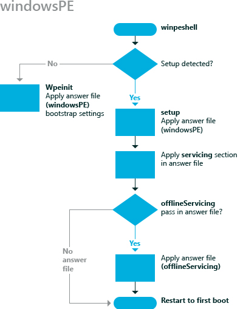

# windowsPE

在**windowsPE**配置阶段用于配置特定于 Windows® 预安装环境 (Windows PE) 除适用于安装设置的设置。

例如，可以指定 Windows PE 的显示分辨率日志文件和其他 Windows PE 相关设置的保存位置。

下图说明**windowsPE**配置阶段。

在**windowsPE**配置阶段还使您能够指定 Windows 安装程序相关的设置，包括︰

-   分区和格式化硬盘。

-   选择特定的 Windows 映像进行安装，该图像的路径，然后访问该映像所需的任何凭据。

-   选择您将 Windows 安装在目标计算机上的分区。

-   应用产品密钥和管理员密码。

-   在 Windows 安装过程中运行特定的命令。

## 相关的主题

[配置阶段的工作](how-configuration-passes-work.md)

[auditSystem](auditsystem.md)

[auditUser](audituser.md)

[一般化](generalize.md)

[offlineServicing](offlineservicing.md)

[oobeSystem](oobesystem.md)

 

 

