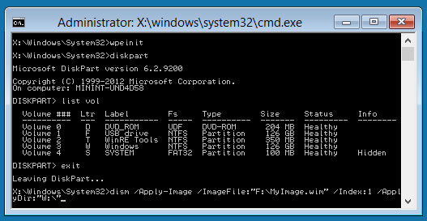

# Windows PE (WinPE)

Windows 10 为 Windows PE (WinPE) 是用来安装、 部署和桌面版 （家庭、 Pro、 企业和教育），修复 Windows 10 小操作系统 Windows 服务器 2016 和其他 Windows 操作系统。 从 Windows PE 中，您可以︰

-   在安装 Windows 之前设置您的硬盘驱动器。
-   通过使用应用程序或脚本从网络或本地驱动器中安装 Windows。
-   捕获和应用 Windows 映像。
-   未运行时，可以修改 Windows 操作系统。
-   设置自动恢复工具。
-   无法启动设备中恢复数据。
-   添加您自己的自定义外壳程序或 GUI 来自动执行这种任务。

## 何处下载它？

若要获取 Windows PE，使用内置于 Windows 评估及部署工具包 (Windows ADK) 安装程序。 有关详细信息，请参阅[WinPE︰ 创建 USB 可启动驱动器](winpe-create-usb-bootable-drive.md)， [WinPE︰ 创建启动 CD、 DVD、 ISO 或 VHD](winpe-create-a-boot-cd-dvd-iso-or-vhd.md)，或请参阅[演示︰ USB 驱动器上安装 Windows PE](http://go.microsoft.com/fwlink/?LinkId=279081)。

## 许多 Windows 功能的支持

Windows PE 运行 Windows 命令行环境，并且支持这些 Windows 功能︰

-   **批处理文件和脚本**，包括支持 Windows 脚本宿主 (WSH) 和 ActiveX 数据对象 (ADO) 和可选 PowerShell 支持。
-   **应用程序**，包括 Win32 应用程序编程接口 (Api) 和可选支持的 HTML 应用程序 (HTA)。
-   **驱动程序**，包括可运行网络、 图形和大容量存储设备驱动程序的通用集合。
-   **图像捕获和服务**，包括部署映像服务和管理 (DISM)。
-   **网络**，包括连接到文件服务器通过 TCP/IP 局域网通过使用 TCP/IP 和 NetBIOS。
-   **存储**，包括 NTFS，DiskPart BCDBoot。
-   **安全工具**，包括可选支持 BitLocker 和受信任的平台模块 (TPM)、 安全引导和其他工具。
-   **Hyper-V**，包括 VHD 文件、 鼠标集成、 大容量存储和网络驱动程序使 Windows PE 运行在虚拟机监控程序。

## 硬件要求

Windows PE 具有相同要求窗口形式有以下例外︰

-   没有硬盘是必需的。 您可以完全从内存运行 Windows PE。
-   基本版本要求只有 512 MB 的内存。 （如果添加驱动程序、 程序包或应用程序，您将需要更多的内存）。
-   为了引导 Windows PE 直接从内存 （即 RAM 磁盘启动），请连续物理内存 (RAM) 可以保存整个 Windows PE (WIM) 映像的一部分必须可用。 若要优化内存使用情况，制造商应确保其固件保留的内存位置的开头或末尾的物理内存地址空间。

32 位版本的 Windows PE 可以引导 32 位 UEFI BIOS 电脑和 64 位 BIOS Pc。

64 位版本的 Windows PE 可以启动 64 位 （uefi） 和 BIOS 的电脑。

## 限制

Windows PE 不是一般用途的操作系统。 它不可能用于部署和恢复以外的任何目的。 它不应作为瘦客户端或嵌入式的操作系统使用。 有其他 Microsoft 产品，如 Windows 嵌入式 CE，可能用于这些目的。

为了防止其用作生产的操作系统，Windows PE 自动停止运行外壳和 72 小时的连续使用后重新启动。 这段时间内是不可配置的。

当重新启动 Windows PE 时，所有更改都都将丢失，包括驱动程序、 驱动器号和 Windows PE 注册表的更改。 若要进行持久更改，请参阅[WinPE︰ 安装和自定义](winpe-mount-and-customize.md)。

默认的 Windows PE 安装使用 FAT32 文件格式，从而造成其自身的限制，包括最大的 4 GB 文件大小和最大 32 GB 的驱动器大小。 若要了解详细信息，请参阅[WinPE︰ 一个 USB 密钥用于 WinPE 和 WIM 文件 (.wim)](winpe--use-a-single-usb-key-for-winpe-and-a-wim-file---wim.md)。

Windows PE 不支持下列任一项︰

-   文件服务器或终端服务器使用。
-   连接到网络域。
-   从连接到 IPv4 网络 Windows PE IPv6 网络上。
-   远程桌面。
-   .MSI 安装文件。
-   从包含非英文字符的路径引导。
-   运行 32 位版本的 Windows PE 的 64 位应用程序。
-   添加绑定到 DISM （.appxbundle 软件包） 的应用程序数据包。

**请注意** 一般情况下，使用最新版本的 WinPE 部署 Windows。 如果您使用的自定义的 Windows 10 的 WinPE 映像，您可能想要继续使用现有的 Windows PE 映像和从网络位置运行 DISM 的最新版本。 若要了解详细信息，请参阅[将 DISM 复制到另一台计算机](copy-dism-to-another-computer.md)。

 

**在 Windows PE 中运行 Windows 安装程序的说明︰**

-   可以使用 32 位版本的 Windows PE 和 Windows 安装程序来安装 64 位版本的 Windows。 有关详细信息，请参阅[Windows 安装程序支持的平台和跨平台部署](windows-setup-supported-platforms-and-cross-platform-deployments.md)。
-   虽然 Windows PE 支持动态磁盘，Windows 安装程序将不执行。 如果安装 Windows 时动态磁盘创建在 Windows PE 中，动态磁盘无法在 Windows 中使用。
-   支持 （uefi） 和传统 BIOS 模式基于 UEFI 的计算机，Windows PE 需要以便正确安装 Windows 引导处于正确的模式。 有关详细信息，请参阅[WinPE: UEFI 或旧版 BIOS 模式中的启动](winpe-boot-in-uefi-or-legacy-bios-mode.md)。

## 请参见

<table>
<colgroup>
<col width="50%" />
<col width="50%" />
</colgroup>
<thead>
<tr class="header">
<th align="left">内容类型</th>
<th align="left">参考</th>
</tr>
</thead>
<tbody>
<tr class="odd">
<td align="left">
<strong>产品评估</strong>
</td>
<td align="left">
[是什么在 Windows PE 中新](whats-new-in-windows-pe-s14.md)
</td>
</tr>
<tr class="even">
<td align="left">
<strong>部署</strong>
</td>
<td align="left">
[WinPE︰ 创建可引导 USB 驱动器](winpe-create-usb-bootable-drive.md) | [演示︰ USB 驱动器上安装 Windows PE](http://go.microsoft.com/fwlink/?LinkId=279081) | [WinPE︰ 创建启动 CD、 DVD、 ISO 或 VHD](winpe-create-a-boot-cd-dvd-iso-or-vhd.md) | [WinPE︰ 硬驱动器 （平面引导或非 RAM） 上安装](winpe-install-on-a-hard-drive--flat-boot-or-non-ram.md) | [WinPE: UEFI 或旧版 BIOS 模式中的启动](winpe-boot-in-uefi-or-legacy-bios-mode.md) | [为 UEFI 模式或传统 BIOS 模式启动](boot-to-uefi-mode-or-legacy-bios-mode.md) | [WinPE: WinPE 和 WIM 文件 (.wim) 使用一个 USB 密钥](winpe--use-a-single-usb-key-for-winpe-and-a-wim-file---wim.md)
</td>
</tr>
<tr class="odd">
<td align="left">
<strong>操作</strong>
</td>
<td align="left">
[WinPE︰ 安装和自定义](winpe-mount-and-customize.md) | [WinPE︰ 添加驱动程序](winpe-add-drivers.md) | [WinPE︰ 存储区域网络 (SAN) 策略](winpe-storage-area-network--san--policy.md) | [WinPE︰ 创建应用程序](winpe-create-apps.md) | [WinPE︰ 优化并缩小图像](winpe-optimize.md)
</td>
</tr>
<tr class="even">
<td align="left">
<strong>疑难解答</strong>
</td>
<td align="left">
[WinPE 网络驱动程序︰ 初始化和添加驱动程序](winpe-network-drivers-initializing-and-adding-drivers.md) | [WinPE︰ 调试应用程序](winpe-debug-apps.md) |
</td>
</tr>
<tr class="odd">
<td align="left">
<strong>工具和设置</strong>
</td>
<td align="left">
[Copype 命令行选项](copype-command-line-options.md) | [Drvload 命令行选项](drvload-command-line-options.md) | [Makewinpemedia 命令行选项](makewinpemedia-command-line-options.md) | [Wpeinit 和 Startnet.cmd︰ 使用 WinPE 启动脚本](wpeinit-and-startnetcmd-using-winpe-startup-scripts.md) | [WinPE︰ 使用脚本确定驱动器号](winpe-identify-drive-letters.md) | [Wpeutil 命令行选项](wpeutil-command-line-options.md) | [WinPE︰ 添加软件包 （可选的组件参考）](winpe-add-packages--optional-components-reference.md)
</td>
</tr>
<tr class="even">
<td align="left">
<strong>基于 Windows PE 的技术</strong>
</td>
<td align="left">
[Windows 安装程序](windows-setup-technical-reference.md) | [Windows 恢复环境](windows-recovery-environment--windows-re--technical-reference.md) | [诊断和恢复工具集](http://go.microsoft.com/fwlink/?LinkId=294156)
</td>
</tr>
</tbody>
</table>

 

 

 

