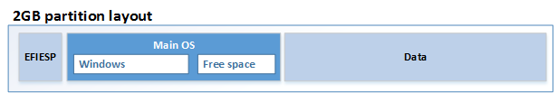
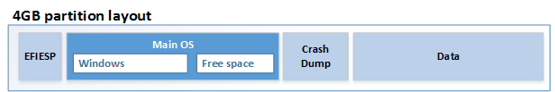

# <a name="iot-device-layout"></a>IoT 设备布局

当修改 IoT 核心板支持包 (BSP) 时，您可以通过修改 DeviceLayout 文件更改驱动器分区和布局。

## <a name="partition-layout"></a>分区布局

IoT 核心支持 UEFI (GPT) 和传统 BIOS (MBR) 分区布局。 大多数 IoT 核心设备使用 （uefi） 和风格的 GPT 分区，尽管 Raspberry Pi 2 使用 MBR 样式分区。 若要了解有关 （uefi） 的详细信息，请阅读[引导和 UEFI](https://msdn.microsoft.com/windows/hardware/drivers/bringup/boot-and-uefi) [窗口和 GPT 的常见问题解答](https://msdn.microsoft.com/en-us/library/windows/hardware/dn640535(v=vs.85).aspx)。  

在 ADK 加载项中包含的示例分区布局︰
-  \iot-adk-addonkit\Common\Packages\DeviceLayout.GPT4GB\devicelayout.xml
-  \iot-adk-addonkit\Common\Packages\DeviceLayout.GPT2GB\devicelayout.xml
-  \iot-adk-addonkit\Common\Packages\DeviceLayout.MBR4GB\devicelayout.xml
-  \iot-adk-addonkit\Common\Packages\DeviceLayout.MBR2GB\devicelayout.xml

这些文件使用三个组件的文件︰
-  * * DeviceLayout。<Name>。 pkg.xml︰ 打包文件、 DeviceLayout 和 OEMDevicePlatform.xml 创建包。
-  **DeviceLayout.xml**︰ 指定的设备分区布局
-  **OEMDevicePlatform.xml**︰ 指定设备，被压缩的分区中的可用空闲块。

### <a name="partition-layout-devicelayoutxml"></a>分区布局 (DeviceLayout.xml)

IoT 核心要求 3 强制性的分区 （EFIESP、 MainOS 和数据）。  您可以选择包括其他分区，例如，故障转储分区。 将计算中扇区的大小，默认扇区 512 字节。 

受支持的属性︰

**EFI**︰ 固定大小磁盘分区的启动管理器，启动配置数据库。 此分区，则需要两个 MBR/GPT 型设备。

- 名称︰`EFIESP`
    
- 类型︰ 对于 MBR，使用`0x0C`。 对于 GPT，使用`{c12a7328-f81f-11d2-ba4b-00a0c93ec93b}`
    
- 文件系统︰`FAT`
    
- 扇区总数︰ `65536` （= 32 MB）
    
- 引导︰`true`
    
- RequiredToFlash:`true`
    
**MainOS**︰ 操作系统和 OEM 预加载应用程序。 此分区进行正常操作需要普通扇区 (MinFreeSectors) 的最小数量。 

- 名称︰`MainOS`

- 类型︰ 对于 MBR，使用`0x07`。 对于 GPT，使用`{ebd0a0a2-b9e5-4433-87c0-68b6b72699c7}`
    
- 文件系统︰`NTFS`
    
- MinFreeSectors: `1048576` （= 512 MB）
    
- ByteAlignment:`0x800000`
    
- ClusterSize: `0x1000` （此大小建议为使分区大小易于管理。
    
**数据**︰ 用户数据分区、 用户注册表配置单元、 应用程序、 应用程序数据。 此分区通常被设置为使用设备上的存储空间的其余部分。 (UseAllSpace︰ 真)
    
- 名称︰`Data`
    
- 类型︰ 对于 MBR，使用`0x07`。 对于 GPT，使用`{ebd0a0a2-b9e5-4433-87c0-68b6b72699c7}`
    
- 文件系统︰`NTFS`
    
- UseAllSpace:`true`
    
- ByteAlignment:`0x800000`
    
- ClusterSize: `0x4000` （此分区往往更大，因此建议 0x4000。 0x1000 也是确定。

**故障转储分区**︰ 可选分区，用来收集崩溃转储的数据。 使用时，在总扇区中指定大小。

-    名称︰`CrashDump`
   
-    类型︰ 对于 MBR，使用`0x07`。 对于 GPT，使用`{ebd0a0a2-b9e5-4433-87c0-68b6b72699c7}`
    
-    文件系统︰`FAT32`
   
-    扇区总数︰ `1228800` （= 600 MB）

### <a name="required-fields"></a>必填的字段

这些字段是必需的对于 IoTCore 支持以下值︰ 

-    版本：`IoTUAP`

-   SectorSize:`512`

-   块区大小︰`128`

-   DefaultPartitionByteAlignment:`0x200000`
    
### <a name="storage-size-estimations"></a>存储大小估计值 

下图概述了两种配置。 

**2 GB 配置** （2048 MB，通常有 1843 MB 存储）



|分区    |内容   |MB   |扇区 |备注                    |
|-------------|-----------|-----|--------|---------------------------|
|EFIESP       |EFIESP     |32   |65536   |EFIESP 大小                |
|主操作系统      |主操作系统    |800  |1638400 |MainOS （估计）          |
|主操作系统      |可用空间 |128  |262144  |MainOS 发展预留空间            |
|Data         |Data       |883  |1808384 |展开以填充可用空间 |
|**总计**        |           |**1843** |**3774464** |                           |


**4 GB 配置︰** （4096 MB，通常有 3600 mb 可用空间用于存储）



|分区    |内容   |MB   |扇区 |备注                    |
|-------------|-----------|-----|--------|---------------------------|
|EFIESP       |EFIESP     |32   |65536   |EFIESP 大小                |
|主操作系统      |主操作系统    |800  |1638400 |MainOS （估计）          |
|主操作系统      |可用空间 |512  |1048576 |MainOS 发展预留空间            |
|故障转储    |故障转储 |600  |1228800 |故障转储大小             |
|Data         |Data       |1656 |3391488 |展开以填充可用空间 |
|**总计**        |           |**3600** |**7372800** |         |


### <a name="device-platform-layout-oemdeviceplatformxml"></a>设备平台布局 (OEMDevicePlatform.xml)

OEMDevicePlatform.xml 指定设备，被压缩的分区中的可用空闲块。 示例：
   ``` syntax
   <?xml version="1.0" encoding="utf-8"?>
   <OEMDevicePlatform xmlns:xsi="http://www.w3.org/2001/XMLSchema-instance" xmlns:xsd="http://www.w3.org/2001/XMLSchema" xmlns="http://schemas.microsoft.com/embedded/2004/10/ImageUpdate">
      <MinSectorCount>7372800</MinSectorCount>
      <DevicePlatformIDs>
        <ID>*</ID>
      </DevicePlatformIDs>
     <CompressedPartitions>
       <Name>MainOS</Name>
     </CompressedPartitions>
   </OEMDevicePlatform>
   ```

## <a name="bsp-samples-in-iot-adk-addonkit"></a>BSP 样本 IoT-ADK-AddonKit

IoT ADK AddOnKit 包含 BSP 下板，每一个都包含这些文件的示例︰

- {_弧_} \Source-\BSP\\{_BSPName_}
  - \OEMInputSamples: OEM 示例输入文件
  - \Packages: BSP 特定程序包和功能清单文件

对于其他源文件，请参阅[Windows 10 IoT 核心板支持软件包源文件](https://github.com/ms-iot/bsp)。

### <a name="arm-rpi2"></a>ARM: RPi2

Raspberry Pi 2 BSP。

### <a name="arm-customrpi2"></a>ARM: CustomRPi2

在自定义的 GPIO 驱动程序和设备布局的使用位置 Raspberry Pi 2 BSP 的自定义的版本。  由于使用自定义的驱动程序，设备目标组件更改为类属元件。 

### <a name="x86-mbm"></a>x86: MBM

英特尔 MinnowBoard 最大 BSP 由 Microsoft 服务和支持。 这是英特尔 MinnowBoard 最大上。

### <a name="x86-custommbm"></a>x86: CustomMBM

CustomMBM 是英特尔 MinnowBoard 最大板 BSP，在自定义的 GPIO 驱动程序和设备布局的使用位置的自定义的版本。 由于使用自定义的驱动程序，设备目标组件更改为类属元件。

## <a name="related-topics"></a>相关的主题
[Windows 10 IoT 核心板支持软件包源文件](https://github.com/ms-iot/bsp)

[创建您自己的主板支持包 (BSP)](create-a-new-bsp.md)

[引导和 （uefi）](https://msdn.microsoft.com/windows/hardware/drivers/bringup/boot-and-uefi) 
[窗口和 GPT 的常见问题解答](https://msdn.microsoft.com/en-us/library/windows/hardware/dn640535(v=vs.85).aspx)。  
