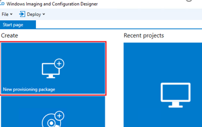
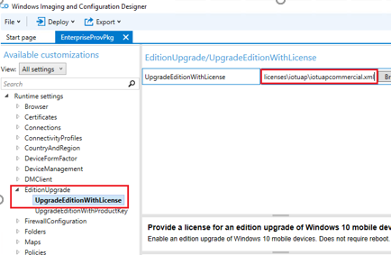

# <a name="iot-core-deployment-and-imaging"></a>IoT 核心部署和图像处理


Windows 10 IoT 核心 （IoT 核心） 带来了丰富的互联网的事情与 Microsoft Windows 的威力。 开发人员现在可以生成并提供自己的自定义 Windows 10 图像 IoT 核心设备在其生态系统。

## <a name="span-idintendedaudiencespanspan-idintendedaudiencespanspan-idintendedaudiencespanintended-audience"></a><span id="Intended_audience"></span><span id="intended_audience"></span><span id="INTENDED_AUDIENCE"></span>目标的读者


Oem 和 Odm 自定义并部署映像 IoT 设备。

## <a name="span-iddownloadandinstallthekitsandpackagesspanspan-iddownloadandinstallthekitsandpackagesspanspan-iddownloadandinstallthekitsandpackagesspandownload-and-install-the-kits-and-packages"></a><span id="Download_and_install_the_kits_and_packages"></span><span id="download_and_install_the_kits_and_packages"></span><span id="DOWNLOAD_AND_INSTALL_THE_KITS_AND_PACKAGES"></span>下载并安装的包和包


然后可以创建 IoT 核心映像︰

-   下载[Windows 评估和部署工具包 (ADK)](http://go.microsoft.com/fwlink/p/?LinkId=526740)
-   下载的[IoT 核心 OS 程序包](https://www.microsoft.com/en-us/download/details.aspx?id=53898)。
-   可选︰ 下载[Windows 10 IoT 核心 Pro 更新控制文件](https://www.microsoft.com/en-us/download/details.aspx?id=53899) 

这些安装完成后，请确认您有在您的计算机的 c︰ 中调用*FMFiles*、 *MSPackages*和*OEMInputSamples*的目录\\程序文件 (x86)\\窗口工具包\\10 个目录。

## <a name="span-idcreateanimagespanspan-idcreateanimagespanspan-idcreateanimagespancreate-an-image"></a><span id="Create_an_image"></span><span id="create_an_image"></span><span id="CREATE_AN_IMAGE"></span>创建映像


有两个选项的工具，用于创建图像的 IoT 核心。

-   使用 IMGGEN 创建图像
-   创建具有 Windows 图像处理和配置设计器 (ICD) 的图像。

稍后在本主题中，您还将了解如何自定义软件包，将要求您在创建图像使用这些工具之一。 您可以使用哪些工具是完全取决于您。

### <a name="span-idoptiononecreateanimagewithimggenspanspan-idoptiononecreateanimagewithimggenspanspan-idoptiononecreateanimagewithimggenspanoption-one-create-an-image-with-imggen"></a><span id="Option_One__Create_an_image_with_IMGGEN"></span><span id="option_one__create_an_image_with_imggen"></span><span id="OPTION_ONE__CREATE_AN_IMAGE_WITH_IMGGEN"></span>选项 1︰ 使用 IMGGEN 创建图像

部署和图像处理工具环境中或 IMGGEN，是图像配置设计器命令行替代方法。 可以自动或通过脚本使用 IMGGEN 完成的图像创建。

1.  打开**部署和图像处理工具环境**的应用程序，在搜索栏中键入内容**部署和图像处理工具环境**。
2.  按以下顺序设置以下环境变量︰`SET PATH=%KITSROOT%tools\bin\i386;%PATH%  SET AKROOT=%KITSROOT%`
3.  执行下面的命令基于设备环境︰
    -   **英特尔 Minnowboard 最大值︰**

        `imggen.cmd IoTCore.ffu "%KITSROOT%OEMInputSamples\MBM\ProductionOEMInput.xml" "%KITSROOT%MSPackages" x86`

    -   **树莓 Pi 2 或 Qualcomm Dragonboard:**

        `imggen.cmd IoTCore.ffu "%KITSROOT%OEMInputSamples\RPi2\ProductionOEMInput.xml" "%KITSROOT%MSPackages" arm`

### <a name="span-idoptiontwocreateanimagewithwindowsicdspanspan-idoptiontwocreateanimagewithwindowsicdspanspan-idoptiontwocreateanimagewithwindowsicdspanoption-two-create-an-image-with-windows-icd"></a><span id="Option_Two__Create_an_image_with_Windows_ICD"></span><span id="option_two__create_an_image_with_windows_icd"></span><span id="OPTION_TWO__CREATE_AN_IMAGE_WITH_WINDOWS_ICD"></span>选择方案二︰ 使用 Windows ICD 创建图像

若要创建具有 Windows ICD IoT 核心映像，请参见[生成和部署 Windows 10 IoT 核心 （IoT 核心） 图像](https://msdn.microsoft.com/library/windows/hardware/dn916104)。

以下各节描述了如何自定义图像。

## <a name="span-idcreatecustomizedoemconfigurationpackagesspanspan-idcreatecustomizedoemconfigurationpackagesspanspan-idcreatecustomizedoemconfigurationpackagesspancreate-customized-oem-configuration-packages"></a><span id="Create_customized_OEM_configuration_packages"></span><span id="create_customized_oem_configuration_packages"></span><span id="CREATE_CUSTOMIZED_OEM_CONFIGURATION_PACKAGES"></span>创建自定义的 OEM 配置程序包


无论您使用来创建您的映像，它 IMGGEN 还是 Windows ICD 的工具，您可能需要自定义程序包部署为品牌的设备或使用独特的情况。 应用程序、 证书和设备上的设置可能需要进行配置，以符合您的要求。 这就要求自定义程序包。

### <a name="span-idcreatethepackagesspanspan-idcreatethepackagesspanspan-idcreatethepackagesspancreate-the-packages"></a><span id="Create_the_packages"></span><span id="create_the_packages"></span><span id="CREATE_THE_PACKAGES"></span>创建程序包

创建包的过程是相同的 IoT 核心因为它是为 Windows 10 移动。 请参阅的说明进行操作以创建您的程序包[创建移动包](https://msdn.microsoft.com/library/dn756642)。

### <a name="span-idinstallingtestcertificatesspanspan-idinstallingtestcertificatesspanspan-idinstallingtestcertificatesspaninstalling-test-certificates"></a><span id="Installing_test_certificates"></span><span id="installing_test_certificates"></span><span id="INSTALLING_TEST_CERTIFICATES"></span>安装测试证书

OEM 测试证书提供包签名的信任关系。 它们需要只安装一次。 为了安装测试证书

1.  使用管理员权限打开部署和图像处理工具环境 (IMGGEN)。
2.  设置环境变量，使用以下命令︰
    -   `set W10_KITROOT=%ProgramFiles(x86)%\Windows Kits\10`
    -   `set WPDKCONTENTROOT=%W10_KITROOT%`
    -   `set W10_TOOL=%W10_KITROOT%\bin\x86;%W10_KITROOT%\Tools\bin\i386`
    -   `set PATH=%PATH%;%W10_TOOL%;`

3.  使用以下实用程序命令安装 OEM 证书︰

    `Installoemcerts.cmd`

4.  请验证该 W10\_KITROOT 设置到 %programfiles%\\窗口工具包\\10。

### <a name="span-idauthorthefeaturemanifestxmlspanspan-idauthorthefeaturemanifestxmlspanspan-idauthorthefeaturemanifestxmlspanauthor-the-feature-manifest-xml"></a><span id="Author_the_feature_manifest_xml"></span><span id="author_the_feature_manifest_xml"></span><span id="AUTHOR_THE_FEATURE_MANIFEST_XML"></span>创作功能指令清单 xml

XML 文件定义的包创建和部署过程的每一步的内容。 Windows ICD 和 IMGGEN 取决于 OEM 输入文件，%KITSROOT%OEMInputSamples 在\[设备\]目录 (例如 c:\\程序文件 (x86)\\窗口工具包\\10\\OEMInputSamples\\MBM)。 平台功能清单文件引用该 OEM 输入文件。 此文件包含的程序包包含在创建的图像中，列表和其他必需的还是可选的 OEM 的参考功能清单文件。 有关详细信息，请参阅[OEMInput 文件的内容](https://msdn.microsoft.com/library/windows/hardware/dn756778)。 功能清单文件引用包和压缩文件 (CAB) 以包括在映像中。 有关详细信息，请参阅[功能清单文件的内容](https://msdn.microsoft.com/library/windows/hardware/dn756745)。 有关如何构建映像中使用的包的详细信息，请参阅[资源调配的包](https://msdn.microsoft.com/library/windows/hardware/mt147447)。

作为示例，下面的目录中提供了三个 OEM 功能清单文件 IoT 核心。

-   **英特尔 Minnowboard 最大**C:\\程序文件 (x86)\\窗口工具包\\10\\FMFiles\\x86\\MBMFM.xml
-   **Raspberry 2 Pi**C:\\程序文件 (x86)\\窗口工具包\\10\\FMFiles\\arm\\RPi2FM.xml
-   **Qualcomm Dragonboard 410 c**C:\\程序文件 (x86)\\窗口工具包\\10\\FMFiles\\arm\\QCDB410CFM.xml

这些清单包含以下各节︰

-   基础产品包
-   系统信息包
-   设备信息包
-   设备平台软件包
-   基于功能包

基础产品包和功能包，分别转到基本程序包和功能基于包的部分中，可以添加。

下面是一个示例 OEM 功能清单文件。

```
<?xml version="1.0" encoding="utf-8"?> 
<FeatureManifest xmlns:xsi="http://www.w3.org/2001/XMLSchema-instance" 
   xmlns:xsd="http://www.w3.org/2001/XMLSchema" 
   xmlns="http://schemas.microsoft.com/embedded/2004/10/ImageUpdate">   
   <BasePackages>      
      <PackageFile Path="$(mspackageroot)\Retail\$(cputype)\$(buildtype)" 
         Name="OEMCoreFeature1.cab" 
         FeatureIdentifierPackage="true"/>      
      <PackageFile Path="$(mspackageroot)\Retail\$(cputype)\$(buildtype)" 
         Name="OEMCoreFeature2.cab" />   
   </BasePackages>   
   <Features>     
      <Microsoft />     
         <MSFeatureGroups />     
      <OEM>
         <PackageFile 
            Path="$(mspackageroot)\Retail\$(cputype)\$(buildtype)" 
            Name="OEMOptionalFeature1.cab"  
            FeatureIdentifierPackage="true">         
            <FeatureIDs>           
               <FeatureID>OEM_OPTIONAL_1</FeatureID>         
            </FeatureIDs>       
         </PackageFile>       
         <PackageFile Path="$(mspackageroot)\Retail\$(cputype)\$(buildtype)" 
            Name="OEMOptionalFeature2.cab" 
            FeatureIdentifierPackage="true">         
            <FeatureIDs>           
               <FeatureID>OEM_OPTIONAL_2</FeatureID>         
            </FeatureIDs>       
         </PackageFile>     
      </OEM>     
   <OEMFeatureGroups />   
   </Features> 
</FeatureManifest>
```

下面是示例的 IoT 核心功能清单文件中可以包含的程序包。 在每种情况下，包必须是 OEMFM.xml 文件的一部分。

-   向图像中添加一个文件。
    ```
    <?xml version="1.0" encoding="utf-8"?> 
    <Package xmlns="urn:Microsoft.WindowsPhone/PackageSchema.v8.00"    
    Owner="OEMName"    
    OwnerType="OEM"        
    ReleaseType="Test"    
    Platform="PlaformName"    
    Component="ComponentName"    
    SubComponent="SubName">    
       <Components>       
          <OSComponent>          
             <Files>             
                <File Source="$(_RELEASEDIR)\test_file1.dll"/>             
                <File Source="$(_RELEASEDIR)\toBeRenamed.dat"               
                      DestinationDir="$(runtime.system32)\test" Name="test.dat"/>          
             </Files>      
          </OSComponent>    
       </Components> 
    </Package>
    ```

-   向图像中添加一个注册表设置。
    ```
    <?xml version="1.0" encoding="utf-8"?> 
    <Package xmlns="urn:Microsoft.WindowsPhone/PackageSchema.v8.00"    
    Owner="OEMName"    
    OwnerType="OEM"        
    ReleaseType="Test"    
    Platform="PlaformName"    
    Component="ComponentName"    
    SubComponent="SubName">    
       <Components>       
          <OSComponent>          
             <RegKeys>             
                <RegKey KeyName="$(hklm.software)\OEMName\test">                
                   <RegValue Name="StringValue" Value="Test string" Type="REG_SZ"/>                
                   <RegValue Name="DWordValue" Value="12AB34CD" Type="REG_DWORD"/>                
                   <RegValue Name="BinaryValue" Value="12,AB,CD,EF" Type="REG_BINARY"/>             
                </RegKey>             
                <RegKey KeyName="$(hklm.software)\OEMName\EmptyKey"/>          
             </RegKeys>       
          </OSComponent>    
       </Components> 
    </Package>
    ```

-   将驱动程序添加到映像。
    ```
    <?xml version="1.0" encoding="utf-8"?> 
    <Package xmlns="urn:Microsoft.WindowsPhone/PackageSchema.v8.00"    
    Owner="OEMName"    
    OwnerType="OEM"        
    ReleaseType="Production"    
    Platform="PlaformName"    
    Component="ComponentName"    
    SubComponent="SubName">    
       <Components>     
          <Driver       
          InfSource="$(_RELEASEDIR)\Driver1\driver1.inf">       
             <Reference         
             Source="$(_RELEASEDIR)\Driver1\driver1.sys" />       
             <Files>         
                <File Source="$(_RELEASEDIR)\Driver1\driver1.sys" />       
             </Files>     
          </Driver>    
       </Components> 
    </Package> 
    ```

**生成包**

1.  在零售设备或**ProductionOEMInput.xml** **RetailOEMInput.xml**命名为生产设备的 OEM 输入 XML 文件添加到 OEMFM.xml 文件的引用。
2.  包生成器工具 (pkggen.exe) 生成软件包和压缩文件 (。CAB) 列入 IoT 核心映像。 此工具默认安装的 %WPDKCONTENTROOT%\\工具\\bin\\。
3.  使用管理员权限打开**部署和图像处理工具环境**的命令提示符。
4.  发出适当 PKGGEN 的命令为每个文件包添加到映像。
    -   **PKGGEN 驱动程序︰**`PkgGen SampleDriver.pkg.xml /config:"%WPDKCONTENTROOT%\Tools\bin\i386\pkggen.cfg.xml" /version:1.0.0.0 /cpu:x86 /build:fre /variables:"HIVE_ROOT=%WPDKCONTENTROOT%\CoreSystem"`
    -   **PKGGEN 文件或注册表项︰**`PkgGen [package project file name] /config:"%WPDKCONTENTROOT%\Tools\bin\i386\pkggen.cfg.xml" /version:1.0.0.0 /cpu:x86 /build:fre`

    **请注意** 运行包生成器时，应始终递增修改的程序包的 /version 字段

     

5.  将所有 OEM 包都复制到的目录映射到设备的体系结构。 *例如︰ c:\\程序文件 (x86)\\窗口工具包\\10\\MSPackages\\零售\\x86\\帧*

### <a name="span-idaddinganoempackageduringimagecreationspanspan-idaddinganoempackageduringimagecreationspanspan-idaddinganoempackageduringimagecreationspanadding-an-oem-package-during-image-creation"></a><span id="Adding_an_OEM_package_during_image_creation"></span><span id="adding_an_oem_package_during_image_creation"></span><span id="ADDING_AN_OEM_PACKAGE_DURING_IMAGE_CREATION"></span>在映像创建过程中添加 OEM 包

若要添加 OEM 包到 IoT 核心图像作为映像创建过程的一部分，请完成以下步骤︰

1.  如上面所述创作包并将它添加到设备的体系结构的 OEM 包目录 (例如 c:\\程序文件 (x86)\\窗口工具包\\10\\MSPackages\\零售\\x86\\帧。
2.  添加的功能清单文件 (OEMFM.xml) 并将其复制到功能清单文件目录 (例如 c:\\程序文件 (x86)\\窗口工具包\\10\\FMFiles\\x86\\)
3.  在生产和零售文件夹下在 OEMInputFML.xml 中添加 OEM 功能清单文件和功能 ID 的引用。
4.  创建一个新映像，使用 Windows ICD 或 IMGGEN 上面所述。

### <a name="span-idaddingoempackagestoadeployedimageatruntimespanspan-idaddingoempackagestoadeployedimageatruntimespanspan-idaddingoempackagestoadeployedimageatruntimespanadding-oem-packages-to-a-deployed-image-at-runtime"></a><span id="Adding_OEM_Packages_to_a_deployed_image_at_runtime"></span><span id="adding_oem_packages_to_a_deployed_image_at_runtime"></span><span id="ADDING_OEM_PACKAGES_TO_A_DEPLOYED_IMAGE_AT_RUNTIME"></span>向已部署在运行时映像中添加 OEM 包

若要添加 OEM 包到 IoT 核心图像作为映像创建过程的一部分，请完成以下步骤︰

1.  将软件包复制到设备
2.  连接到设备通过 SSH 或 Powershell
3.  运行以下命令

    `ApplyUpdate.exe -stage C:\OEM\Package1.cab`

    `ApplyUpdate.exe -commit`

设备将重新启动到操作系统更新，完成安装，然后回主操作系统重新启动。 根据包的大小，此步骤可能需要 10 分钟时间。

### <a name="span-idaddingoemfmfileandoptionalfeaturestotheoeminputxmlspanspan-idaddingoemfmfileandoptionalfeaturestotheoeminputxmlspanspan-idaddingoemfmfileandoptionalfeaturestotheoeminputxmlspanadding-oem-fm-file-and-optional-features-to-the-oem-input-xml"></a><span id="Adding_OEM_FM_file_and_optional_features_to_the_OEM_Input_XML"></span><span id="adding_oem_fm_file_and_optional_features_to_the_oem_input_xml"></span><span id="ADDING_OEM_FM_FILE_AND_OPTIONAL_FEATURES_TO_THE_OEM_INPUT_XML"></span>对 OEM 输入 XML 中添加 OEM FM 文件和可选功能

有两个示例功能清单文件作为 IoT 核心套件的一部分安装。 您可以在此处找到它们。

-   C:\\程序文件 (x86)\\窗口工具包\\10\\OEMInputSamples\\MBM\\ProductionOEMInput.xml
-   C:\\程序文件 (x86)\\窗口工具包\\10\\OEMInputSamples\\MBM\\RetailOEMInput.xml

### <a name="span-idauthoringoemcustomizationpackagesspanspan-idauthoringoemcustomizationpackagesspanspan-idauthoringoemcustomizationpackagesspanauthoring-oem-customization-packages"></a><span id="Authoring_OEM_Customization_Packages"></span><span id="authoring_oem_customization_packages"></span><span id="AUTHORING_OEM_CUSTOMIZATION_PACKAGES"></span>创作的 OEM 自定义程序包

OEMCustomization.cmd 实用程序允许在设备启动时自定义项。 在每个引导过程中，由于计划任务调用此脚本文件。 OEMCustomization.cmd 脚本文件不存在，默认情况下，图像中，并且需要由 OEM 创作。 下面的自定义项的允许和建议︰

1.  激活具有设备网络用户管理员管理员级别权限的用户"\[插入所需的管理员密码\]"创作 OEMCustomization.cmd /active:yes。 您将需要创建一个密码，用以替换"\[插入所需的管理员密码\]"在下面的代码示例。

    ```
    ::OEM CUSTOMIZATION Script File
    ::Enable Administrator Password
    net user Administrator "[insert desired Administrator password]" /active:yes
    ```

2.  启用 OEM 应用程序的安装。
    ```
    ::Enable Application Installation
    call c:\OEM\AppInstall.bat
    ```

3.  作者 OEMCustomization.pkg.xml 指向 OEMCustomization.cmd 脚本。
    ```
    <?xml version="1.0 encoding="utf-8"?>
    <Package
      xmlns:xsi="http://www.w3.org/2001/XMLSchema-instance"
      xmlns:xsd="http://www.w3.org/2001/SMLSchema"
      Owner="OEM"
      Component="OEMApp1"
      OwnerType"OEM"
      ReleaseType="Production"
      xmlns="urn:Microsoft.WindowsPhone/PackageSchema.v8.00">
      <Components>
        <OSComponent>
          <Files>
            <File Source="C:\OEM\OEMCustomization.cmd" />
          </Files>
        </OSComponent>
      </Component>
    </Package>
    ```

4.  创建使用 pkggen.exe 软件包的 CAB 文件。
5.  启用 Bitlocker。

## <a name="span-idoemappsspanspan-idoemappsspanspan-idoemappsspanoem-apps"></a><span id="OEM_apps"></span><span id="oem_apps"></span><span id="OEM_APPS"></span>OEM 应用程序


为了帮助您入门 IoT 核心为编写应用程序，我们已上载到 GitHub 的某些批处理文件。 您将需要从<https://github.com/ms-iot/content/blob/develop/en-US/Samples/AppInstaller.md>下载这些文件

1.  将这些文件复制到 c:\\OEM 在开发计算机上的目录。
    **请注意** 从 GitHub 的文件可能不会显示在记事本的友好格式，可能需要在类似 Visual Studio 开发环境中打开。

     

2.  APPX 和 CET 文件复制到 c:\\OEM。
3.  编辑 AppInstall.bat 脚本文件
    -   设置 defaultappx = \[appx 的文件名称\]
    -   设置 certslist = \[appx 的证书名称\]（多个证书可能会加入，由空格分隔）

4.  编辑 DeployApp.bat 文件
    -   设置 defaultappx = \[appx 的文件名称\]
    -   设置 defaultappid = \[appx 的 ID\]
    -   设置 depenencylist =\[包括如果您 appxes 有需要您 appx 之前安装的依赖项。 允许多个依赖项名称，以空格分隔。

    **请注意** 注意︰ Oem 必须选择在默认情况下"的-瓜"，设备运行的应用程序。 此应用程序将永远不会被更新。 需要切换回此安装 OOBE，以确保在应用程序的安装过程中没有资源冲突或更新操作系统

     

5.  作者应用程序包中，称为 OEMApp.pkg.xml，如下面的示例所示。

    ```
    <?xml version="1.0 encoding="utf-8"?>
    <Package
      xmlns:xsi="http://www.w3.org/2001/XMLSchema-instance"
      xmlns:xsd="http://www.w3.org/2001/SMLSchema"
      Owner="Oem"
      Component="OEMApp1"
      OwnerType"OEM"
      ReleaseType="Production"
      xmlns="urn:Microsoft.WindowsPhone/PackageSchema.v8.00">
      <Components>
        <OSComponent>
          <Files>
            <File Source="C:\OEM\AppInstall.bat" DestinationDir="C:\Windows\AppInstall"/>
            <File Source="C:\OEM\DeployAppx.bat" DestinationDir="C:\Windows\AppInstall"/>
            <File Source="C:\OEM\OEMApp1.appx" DestinationDir="C:\Windows\AppInstall"/>
            <File Source="C:\OEM\OEMApp1.cer" DestinationDir="C:\Windows\AppInstall"/>
          </Files>
        </OSComponent>
      </Component>
    </Package>
    ```

6.  将创建的文件和相关的资源在开发设备的目录如下︰
    -   **C:\\Windows\\appinstall:**
        -   约
        -   appx(s) 依赖项
        -   临时 appx （可选）
        -   证书
        -   AppInstall.bat
        -   DeployApp.bat
    -   **C:\\Winodws\\system32:**
        -   Oemcustomization.cmd

7.  重新启动设备。 设备重新启动时，将自动安装指定的 appx。

### <a name="span-idimage-timeconfigurationsspanspan-idimage-timeconfigurationsspanspan-idimage-timeconfigurationsspanimage-time-configurations"></a><span id="Image-time_configurations"></span><span id="image-time_configurations"></span><span id="IMAGE-TIME_CONFIGURATIONS"></span>图像实时配置

以下是可能想要包括在您的 OEMImageCustomization.cmd 中的配置设置的示例。

-   无外设配置

    `call reg add HKEY_LOCAL_MACHINE\SYSTEM\currentcontrolset\control\wininit /v Headless /t REG_DWORD /d 1 /f`

-   故障转储配置

    `call reg add HKEY_LOCAL_MACHINE\SYSTEM\CurrentControlSet\Control\CrashControl /v AutoReboot /t REG_DWORD /d 1 /f`

    `call reg add HKEY_LOCAL_MACHINE\SYSTEM\CurrentControlSet\Control\CrashControl /v CrashDumpEnabled /t REG_DWORD /d 1 /f`

    `call reg add HKEY_LOCAL_MACHINE\SYSTEM\CurrentControlSet\Control\CrashControl /v DedicatedDumpFile /t REG_SZ /d c:\1.sys /f`

    `call reg add HKEY_LOCAL_MACHINE\SYSTEM\CurrentControlSet\Control\CrashControl /v DumpFile /t REG_EXPAND_SZ /d c:\1.dmp /f`

    `call reg add HKEY_LOCAL_MACHINE\SYSTEM\CurrentControlSet\Control\CrashControl /v DumpFileSize /t REG_DWORD /d 600 /f`

### <a name="span-idrun-timeconfigurationsspanspan-idrun-timeconfigurationsspanspan-idrun-timeconfigurationsspanrun-time-configurations"></a><span id="Run-time_configurations"></span><span id="run-time_configurations"></span><span id="RUN-TIME_CONFIGURATIONS"></span>运行时配置

生成带有 Windows ICD 的供应包中应包含下面列出的允许运行时设置。 这些设置必须包含在单个资源调配产品包和资源调配的包应该包装到一个 OEM 包。

-   证书
-   防火墙配置
-   启动应用程序
-   版本升级
-   策略更新

## <a name="span-idconfiguringiotcoreupdatesettingsspanspan-idconfiguringiotcoreupdatesettingsspanspan-idconfiguringiotcoreupdatesettingsspanconfiguring-iot-core-update-settings"></a><span id="Configuring_IoT_Core_update_settings"></span><span id="configuring_iot_core_update_settings"></span><span id="CONFIGURING_IOT_CORE_UPDATE_SETTINGS"></span>配置 IoT 核心更新设置


要配置要接收仅操作系统更新的图像，您必须配置一般的 POP 包。 一般的 POP 包位于以下位置;替换在下面的示例。

-   **英特尔 Minnowboard 最大**
    -   C:\\程序文件 (x86)\\窗口工具包\\10\\MSPackages\\零售\\X86\\帧\\Intel.Generic.DeviceInfo.cab
    -   C:\\程序文件 (x86)\\窗口工具包\\10\\MSPackages\\零售\\X86\\帧\\Intel.Generic.DeviceTargetingInfo.cab
    -   替换为︰ c:\\程序文件 (x86)\\窗口工具包\\10\\FMFiles\\x86\\MBMFM.xml
-   **树莓 Pi 2**
    -   C:\\程序文件 (x86)\\窗口工具包\\10\\MSPackages\\零售\\ARM\\帧\\RASPBERRYPI。Generic.DeviceInfo.cab
    -   C:\\程序文件 (x86)\\窗口工具包\\10\\MSPackages\\零售\\ARM\\帧\\RASPBERRYPI。Generic.DeviceTargetingInfo.cab
    -   替换为︰ c:\\程序文件 (x86)\\窗口工具包\\10\\FMFiles\\arm\\RPi2FM.xml
-   **Qualcomm Dragonboard 410 c**
    -   C:\\程序文件 (x86)\\窗口工具包\\10\\MSPackages\\零售\\ARM\\帧\\Qualcomm.Generic.DeviceInfo.cab
    -   C:\\程序文件 (x86)\\窗口工具包\\10\\MSPackages\\零售\\ARM\\帧\\Qualcomm.Generic.DeviceTargetingInfo.cab
    -   替换为︰ c:\\程序文件 (x86)\\窗口工具包\\10\\FMFiles\\arm\\QCDB410CFM.xml

## <a name="span-idcreatinganenterpriseiotcoreuapprovisioningpackagespanspan-idcreatinganenterpriseiotcoreuapprovisioningpackagespanspan-idcreatinganenterpriseiotcoreuapprovisioningpackagespancreating-an-enterprise-iot-core-uap-provisioning-package"></a><span id="Creating_an_enterprise_IoT_Core_UAP_provisioning_package"></span><span id="creating_an_enterprise_iot_core_uap_provisioning_package"></span><span id="CREATING_AN_ENTERPRISE_IOT_CORE_UAP_PROVISIONING_PACKAGE"></span>创建企业 IoT 核心 UAP 资源调配产品包


若要创建可部署到 IoT 核心设备企业资源调配产品包，请按照下列步骤。

1.  下载到开发设备 IoT 核心许可证文件。 有关此步骤的详细信息可以位于[IoT 核心商品化](https://www.windowsforiotdevices.com/)。
2.  创建新的供应包 Windows ICD，如下图，选择"新建资源调配包"中包含的许可证文件，然后单击**下一步。**
3.  在**输入项目详细信息**窗口中，输入**名称**、**项目文件夹**和 （可选）**描述**资源调配的程序包，然后单击**下一步**。
4.  在**选择 Windows 版本**窗口中，选择 IoT 核心，然后单击**下一步**。
5.  在可选的**导入设置包**窗口中，单击**完成。**
6.  在**自定义**页中，添加[upgradeeditionwithlicense](https://msdn.microsoft.com/library/windows/hardware/mt573160.aspx)自定义。 该自定义项提供 iot 核心设备的版本升级许可证。 
7.  通过单击主菜单中的**导出**下拉列表，然后选择**设置包**，添加所需的程序包信息导出设置包并指定包的选项。 单击**下一步**，然后指定用于保存包。
8.  单击**生成**以开始构建图像。 项目信息将显示在生成页上，进度条会指示生成的状态。 如果您需要取消该生成，请单击**取消**。 这取消当前的构建过程、 关闭向导，并将您带到**自定义**页上的后退。

    在图像生成过程中，生成输出窗口中显示生成过程中发生的情况很多。 此窗口显示︰

    -   在构建映像时可能会出现的警告。
    -   详细生成消息，以指示在图像内的阶段生成过程。
    -   例如，当输入的文件具有架构错误或图像的生成会失败的错误消息。

    如果生成失败，则将显示一条错误消息。 您可以查看生成日志以确定问题，通过单击记事本中的视图。

    如果您的生成成功，则将显示图像和它的位置的名称。

9.  创建一个 OEM 包中，并将新创建的资源调配包包装在 OEM 包，如以下示例所示︰
    ```
    <?xml version="1.0" encoding="utf-8"?>
    <Package
       xmlns:xsi="http://www.w3.org/2001/XMLSchema-instance"
       xmlns:xsd:"http:///www.w3.org/2001/XMLSchema"
       Owner="OEM"
       Component="Enterprise"
       SubComponent="ProvisioningPackage"
       OwnerType="OEM"
       ReleaseType="Production"
       xmlns="urn:Microsoft.WindowsPhone/PackageSchema.v8.00">
       <Components>
          <OSComponent>
             <Files>
                <File Source="C:\ICD\EnterpriseSKU\EnterpriseProvisioningPkg.ppkg" DestinationDir="C:\OEM" />
             </Files>
          </OSComponent>
       </Components>
    </Package>
    ```

10. 最后一步是生成具有 IMGGEN 或 Windows ICD 的新 IoT 核心图像，添加资源调配的软件包，如中所述[生成并应用设置软件包](https://msdn.microsoft.com/library/windows/hardware/dn916107)。

## <a name="span-idrelatedtopicsspanrelated-topics"></a><span id="related_topics"></span>相关的主题


[下载 Windows 10 IoT 核心](https://developer.microsoft.com/windows/iot/downloads)

 

 


