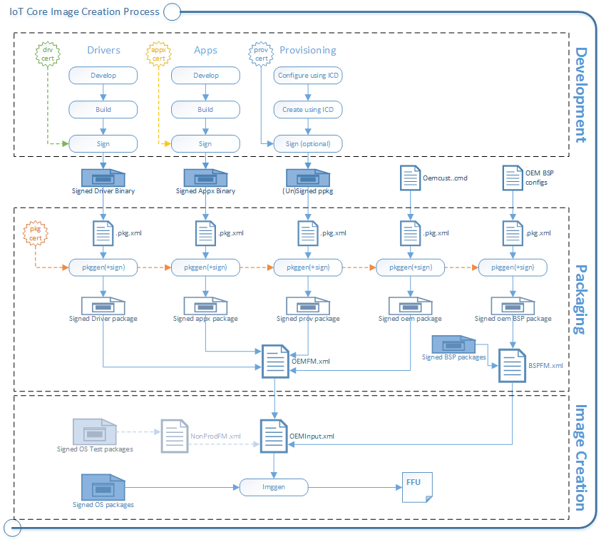

# IoT 核心制造指南

考虑 mass-producing 运行 Windows 10 IoT 核心设备吗？ 使用[Windows ADK IoT 核心加载项](iot-core-adk-addons.md)来创建图像，您可以快速闪烁到新设备。 

您可以创建**测试图像**，其中包括用于快速访问和修改设备的工具。 测试图像非常适合︰
-  开发人员、 硬件供应商和制造商 (Oem)，他们为了试验新设备设计。
-  业余爱好者和组织正在创建非网络或控制网络环境中运行而设计的设备。

您可以创建**零售图像**，从而可以进行更安全的公用网络或企业网络同时仍然可以接收更新。

您可以添加自定义设置，包括应用程序、 设置、 硬件配置和板级支持包 (Bsp)。

对于 OEM 样式的图像，将包 (.cab) 文件到包装您的自定义。 包可用于 Oem、 Odm、 开发商和 Microsoft 工作在一起以帮助到您的设备中提供的安全性和功能更新，无需 stomping 对彼此的工作。

## 方案
-   [获取自定义 Windows IoT 核心所需的工具](set-up-your-pc-to-customize-iot-core.md)
-   [实验室 1a︰ 创建基本映像](create-a-basic-image.md)
-   [实验室 1b︰ 将应用程序添加到映像](deploy-your-app-with-a-standard-board.md)
-   [实验室 1 c︰ 向图像中添加一个文件和注册表设置](add-a-registry-setting-to-an-image.md)
-   [实验室 1 d︰ 将网络和其他设置的包添加到映像](add-a-provisioning-package-to-an-image.md)
-   [实验室 1e︰ 将驱动程序添加到映像](add-a-driver-to-an-image.md)
-   [实验室 1f︰ 构建零售映像](build-retail-image.md)
-   [实验室 2︰ 创建您的主板支持包](create-a-new-bsp.md)
-   [实验室 3︰ 更新应用程序](../../service/iot/updating-iot-core-apps.md)

[（本指南的以前的版本）︰ IoT 核心部署和图像处理](iot-core-deployment-and-imaging.md)
## 概念

可以作为指南使用演练来构建您的测试和零售的图像。 在一般条款︰

1.  测试自定义设置，包括应用程序、 设置、 驱动程序和 Bsp，以确保它们的工作。
2.  在您的计算机上安装测试证书并打包成.cab 文件自定义设置。
2.  创建一个包含所有自定义，以及 IoT 核心包中，并从硬件制造商提供的任何更新的测试映像。
3.  闪存设备图像并对其进行测试。 使用内置的测试图像的测试工具来解决任何新问题。
4.  如果可行，签署您的自定义设置，并将它们重新打包成新的.cab 文件。
5.  使用已签名的文件，创建零售映像并使用它来制造新的设备。

### 软件包

包是 IoT 核心逻辑构建块。 它们包含所有文件、 库、 注册表设置、 可执行文件和设备上的数据。 设备驱动程序的系统文件，从每个组件必须包含在包中。 该模块化体系结构允许精确地控制更新︰ 包是在设备上的最小维修单位。

每个包中包含︰
-   包，如签名的驱动程序二进制文件或签名的 appx 二进制文件的内容。
-   包定义 (。 pkg.xml) 文件指定的包和它们在最终图像中放置的位置的内容。 请参阅 %src\_DIR %\\软件包\\的软件包文件的各种示例目录。
-   一个签名。 这可以测试或零售证书。

`pkggen`工具将这些项合并到已签名的软件包。 我们示例包括脚本︰ `createpkg`， `createprovpkg` ， `createupdatepkgs`，它调用 pkggen 来创建我们的驱动程序、 应用程序和设置的包。

过程是类似于使用 Windows 10 移动的。 若要了解有关创建对象包的详细信息，请参阅[创建移动包](https://msdn.microsoft.com/library/windows/hardware/dn756642)。

### 功能清单 (FMs)

您已经将一切放入包后，您将使用 FM 文件列表到所属的程序包在最终图像。

您可以使用任意多个图像到 FMs。 在本指南中，我们参考下面的 FMs:

-   **OEMFM.xml**包括 OEM 可能会添加到设备，如应用程序和配置包的功能。
-   **BSPFM.xml**包括硬件制造商可能使用定义主板的功能。 例如，OEM\_RPi2FM.xml 包括所有用于 Raspberry Pi 2 的功能。
-   **ProdFM.xml**包括构成 IoT 核心的功能。 ProdFM 是指完全签名版本的操作系统。

过程是类似于使用 Windows 10 移动的。 若要了解详细信息，请参阅[功能清单文件的内容](https://msdn.microsoft.com/library/windows/hardware/dn756745)。

将列出它的功能，通过使用这些标记来添加︰

-   &lt;BasePackages&gt;︰ 软件包，您始终包含在您的图像，例如，基本应用程序。
-   &lt;功能&gt;\\&lt;OEM&gt;︰ 可能是特定于特定的产品设计其他各个包。

### 在创建映像︰ ImgGen 和映像配置文件 (OEMInput.xml)

若要创建最终的图像，您将使用`imggen`与**OEMInput.xml 文件**映像配置文件的工具。

这些是相同的工具，用于创建 Windows 10 移动图像。 若要了解详细信息，请参阅[OEMInput 文件的内容](https://msdn.microsoft.com/library/windows/hardware/dn756778)。

列出映像配置文件︰

-   (FMs) 的功能清单，想要从每个安装的程序包。
-   **SoC**芯片标识符，用来帮助设置设备分区。 此值是必需的的即使您不使用列出的设备之一。 开头的值与您的设备最相似的硬件︰

    **RPi2**: Raspberry Pi 2 或树莓 Pi 3 (ARM)

    **MBM**︰ 英特尔 Minnowboard 最大 (x86)

    **DB**: Qualcomm DragonBoard (ARM32)

-   ReleaseType （**生产**或**测试**）。

    **发布版本**︰ 我们建议您在开发过程中，以验证是否一切都将正常准备发运时尽早创建零售图像。

    这些版本包含的所有安全功能已启用。

    若要使用此生成类型，所有代码必须签名使用零售 （而不是测试） 代码签名证书。

    有关示例，请参阅 %src\_DIR %\\产品\\SampleA\\RetailOEMInput.xml。

    **测试生成**︰ 使用这些试验的应用程序和驱动程序由您和您的硬件制造商合作伙伴创建新版本。

    这些生成了一些安全功能被禁用，这样您可以使用测试签名或生产签名软件包。

    这些版本还包括开发工具，如调试传输、 SSH 和 PowerShell，可以用来帮助解决问题。

    有关示例，请参阅 %src\_DIR %\\产品\\SampleA\\TestOEMInput.xml。

    <table>
    <colgroup>
    <col width="33%" />
    <col width="33%" />
    <col width="33%" />
    </colgroup>
    <thead>
    <tr class="header">
    <th align="left"></th>
    <th align="left">零售版本</th>
    <th align="left">测试生成</th>
    </tr>
    </thead>
    <tbody>
    <tr class="odd">
    <td align="left">图像发布类型</td>
    <td align="left">ReleaseType︰<strong>生产</strong></td>
    <td align="left">ReleaseType︰<strong>测试</strong></td>
    </tr>
    <tr class="even">
    <td align="left">包版本类型</td>
    <td align="left">支持仅生产类型软件包</td>
    <td align="left">支持生产类型或测试类型</td>
    </tr>
    <tr class="odd">
    <td align="left">测试签名的包</td>
    <td align="left">不受支持</td>
    <td align="left">支持
    
IOT_ENABLE_TESTSIGNING 功能必须被包括在内。
</td>
    </tr>
    <tr class="even">
    <td align="left">代码完整性检查</td>
    <td align="left">支持。 默认情况下，这被启用。</td>
    <td align="left">不受支持
    
IOT_DISABLE_UMCI 功能必须被包括在内
</td>
    </tr>
    </tbody>
    </table>

### 板级支持包 (Bsp)
板级支持包包含一套软件、 驱动程序和特定的主板，通常由主板制造商提供的启动配置。 主板制造商可能定期提供的主板，您的设备可以接收并应用该更新。 

## 好吧，让我们试一试 ！

从这里开始︰[获取自定义 Windows IoT 核心所需的工具](set-up-your-pc-to-customize-iot-core.md)。

## 相关的主题

[了解有关 Windows 10 IoT 核心](https://developer.microsoft.com/windows/iot/iotcore)

[IoT 核心开发人员资源](https://developer.microsoft.com/windows/iot)

[什么是在 Windows ADK IoT 核心加载项](iot-core-adk-addons.md)

[IoT 核心功能列表](iot-core-feature-list.md)

[IoT 核心加载项的命令行选项](iot-core-adk-addons-command-line-options.md)

 

 

