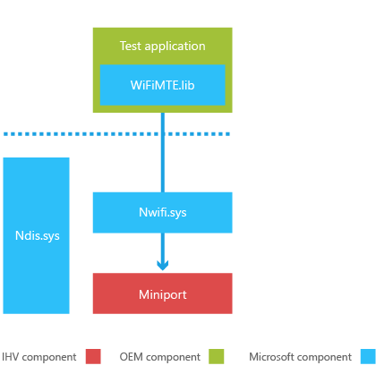

# 添加 Wi-Fi 制造的 OID 接口的测试支持

若要确保所有设备组件已被都集成，这将正常运行，正确，校准，并满足所有管理法规要求，Oem 运行标准特别测试，以确保所有问题都找到和更正，然后在设备进入零售数量。 在零售商店，以检查有正确的组件操作中也偶尔运行这些测试。 由硬件供应商 (Ihv) 执行这些测试接口和机制的实现。

本部分介绍了扩展现有的[Wi-Fi OID 文档](http://msdn.microsoft.com/library/ff560670.aspx)以便 Ihv 可以实现一组标准接口，Oem 可以使用能够创建测试应用程序。

## 假设

若要执行这些制造测试，必须在称为制造模式的特殊操作模式中操作设备。 在制造模式下，为了启用正确执行的组件测试加载只是操作系统的特定部分。 当设备在制造模式下运行时，普通 Wi-Fi 操作，如扫描和自动连接到网络中，被禁用。

在制造环境中或在客户服务的过程中，可以输入制造模式。 写入到设备资源调配分区 (DPP) 只可以在制造环境中执行。 如果在非制造环境中调用写入 DPP OID，则写入 DPP 的尝试将失败。 生产操作应仅暂时性影响的系统上，并且应该不会在重新引导后保留状态。

## 驱动程序要求

Wi-Fi 微型端口驱动程序必须能够在正常模式或制造测试模式下运行，它必须能够在任何时间的模式之间切换。 驱动程序在初始化过程中通过查询特定的注册表项将决定相应的模式。

下面的插图显示制造测试的体系结构环境。

## 在这一节

[报告运营模式功能](reporting-operating-mode-capabilities.md)  
描述要求和制造测试模式中运行的驱动程序报告更改的行为。

[在制造模式下支持更新的 OID 行为](supporting-updated-oid-behavior-in-manufacturing-mode.md)  
介绍了 Wi-Fi 微型端口驱动程序必须支持的更新的 Oid。

[在制造模式下支持现有的 OID 命令](supporting-existing-oid-commands-in-manufacturing-mode.md)  
介绍了现有的 Oid 的 Wi-Fi 微型端口驱动程序必须支持。

[支持新的 OID 命令制造模式](supporting-new-oid-commands-for-manufacturing-mode.md)  
介绍了 Wi-Fi 微型端口驱动程序必须支持新 Oid。

[支持新的回调的制造模式](supporting-new-callbacks-for-manufacturing-mode.md)  
描述新的 Wi-Fi 微型端口驱动程序必须支持的 OID 回调。

 

 

