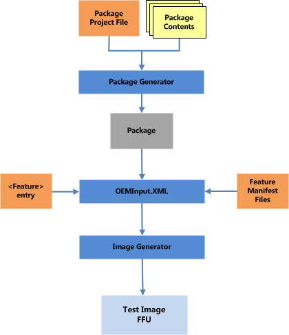

# <a name="create-a-feature-and-include-it-in-an-image"></a>创建特征，并将其包括在映像中


本主题演示如何创建特征，并将其添加到图像。

## <a name="a-href-idprocess-overview---adding-a-test-app-featureaprocess-overview-adding-a-test-app-feature"></a><a href="" id="process-overview---adding-a-test-app-feature"></a>过程概述 – 添加测试应用程序功能


若要创建特征并将其添加到图像，您必须完成以下步骤。

1.  生成包含该测试应用程序的包。

2.  创建功能清单引用的文件的包。

3.  将功能清单文件和测试应用程序功能添加到 OEMInput.xml 文件中。

4.  生成图像、 签名图像，以及其闪存设备。

5.  验证功能按预期方式工作。



## <a name="a-href-idwalkthrough---adding-a-test-app-to-a-test-imageawalkthrough-adding-a-test-app-to-a-test-image"></a><a href="" id="walkthrough---adding-a-test-app-to-a-test-image"></a>演练 – 测试映像中添加一个测试应用程序


本节介绍的步骤，您需要执行测试映像中添加一个测试应用程序。 在开始本演练之前，您必须首先创建一个简单的测试应用程序。 在创建应用程序之后，可以继续本演练。

### <a name="generate-the-test-app-package"></a>生成测试应用程序软件包

本演练假定您已经创建了一个名为*TestApplication.exe*的测试应用程序。 生成一个包，其中包含此应用程序中，通过完成以下步骤。

1.  创建名为*TestApplication*的目录并复制到该目录在 Visual Studio 中，创建的 TestApplication.exe 文件。

2.  创建一个名为*TestApplication.pkg.xml* ，其中包含以下程序包定义 XML 文本文件。

    ``` syntax
    <?xml version="1.0" encoding="utf-8" ?> 
      <Package xmlns="urn:Microsoft.WindowsPhone/PackageSchema.v8.00" Owner="Contoso" 
    OwnerType="OEM" 
    ReleaseType="Test" 
    Platform="DCD600" 
    Component="TestApps" 
    SubComponent="TestApplication"
    Partition="Data">

     <Macros>
      <Macro Id="testDir" Value="\test" /> 
     </Macros>
     
     <Components>
       <OSComponent>
         <Files>
           <File Source="TestApplication.exe" DestinationDir="$(testDir)" /> 
         </Files>
       </OSComponent>
      </Components>
    </Package>
    ```

    您可以更新您的组织名称和您的设备的名称的名称相匹配的所有者和平台属性。 这些属性更改将修改生成的包的名称。

    &lt;宏&gt;元素用于指定*\\数据\\测试*设备上的目标目录。

3.  打开管理员命令提示符窗口中生成软件包。

4.  通过在命令提示符窗口中键入**设置**显示环境变量。 *WPDKCONTENTROOT*以确认正确配置了生成环境中寻找。在 Windows 64 位 PC 上，路径应类似于以下。

    ``` syntax
    ...
    WPDKCONTENTROOT=C:\Program Files (x86)\Windows Phone Kits\10
    ```

5.  生成使用 PkgGen 软件包。 提供的版本 1.0.0.0 数。 /Config 参数指向 pkggen.cfg.xml 文件的位置。

    ``` syntax
    C:\TestApplication>PkgGen TestApplication.pkg.xml /version:1.0.0.0 /config:" %WPDKCONTENTROOT% \Tools\bin\i386\pkggen.cfg.xml"
    ```

6.  如果 PkgGen 成功地创建了软件包，则应返回与下面类似的输出。

    ``` syntax
    Microsoft (C) pkggen 8.0.12134.0

    info: Using external macro file: 'C:\Program Files (x86)\Windows Phone Kits\10\
    Tools\bin\i386\pkggen.cfg.xml'
    info: Building project file C:\TestApplication\TestApplication.
    pkg.xml
    info: Building package '.\Contoso.TestApps.TestApplication.spkg'
    info: Adding file 'TestApplication.exe' to package '.\Contoso.TestApps.TestApplication.spkg' as '\test\TestApplication.exe'
    info: Done package ".\Contoso.TestApps.TestApplication.spkg"
    info: Packages are generated to . successfully
    ```

有关如何使用软件包的详细信息，请参阅[创建程序包](creating-mobile-packages.md)。

### <a name="create-the-feature-manifest-file"></a>创建功能清单文件

创建将定义测试的功能清单文件\_应用程序的 OEM 功能通过完成以下步骤。

1.  创建以下目录中名为*OEMCustomAppFM.xml*的功能清单文件︰

    ``` syntax
    %WPDKCONTENTROOT%\FMFiles
    ```

2.  定义测试\_到*OEMCustomAppFM.xml*文件中添加以下 XML 应用程序功能。

    ``` syntax
    <?xml version="1.0" encoding="utf-8"?>  
    <FeatureManifest xmlns:xsi="http://www.w3.org/2001/XMLSchema-instance" xmlns:xsd="http://www.w3.org/2001/XMLSchema" xmlns="http://schemas.microsoft.com/embedded/2004/10/ImageUpdate">  
    <!--  TEST_APP FM File 4/30/2015   -->
      <Features>  
        <OEM>  
          <PackageFile Path="C:\TestApplication\" Name="Contoso.TestApps.TestApplication.spkg">  
            <FeatureIDs>  
              <FeatureID>TEST_APP</FeatureID>  
            </FeatureIDs>  
          </PackageFile>  
        </OEM>  
      </Features>  
    </FeatureManifest>
    ```

有关功能清单的详细信息，请参阅[功能清单文件的内容](feature-manifest-file-contents.md)。

### <a name="add-the-feature-to-the-oeminput-file"></a>将此功能添加到 OEMInput 文件

添加测试\_OEMInput.xml 文件通过完成以下步骤的 OEM 应用程序功能。

1.  本演练假定您有一个现有的、 使 TShell 的功能测试 OEMInput 文件。 有关创建测试映像的详细信息，请参阅[构建和闪烁图像](building-and-flashing-images.md)。 有关指定可选功能的详细信息，请参阅[构建映像的可选功能](optional-features-for-building-images.md)。

2.  编辑 OEMinput.xml 文件包含您在上一步中创建的*OEMCustomAppFM.xml*功能清单文件。 将类似于以下 XML。

    ``` syntax
    ...
    <AdditionalFMs>
        ...
        <AdditionalFM>%WPDKCONTENTROOT%\FMFiles\OEMCustomAppFM.xml</AdditionalFM>
      </AdditionalFMs>
    ```

3.  下文中&lt;功能&gt;OEMInput.xml 文件的节中添加新测试\_应用程序功能到现有的功能的列表。

    ``` syntax
    <Features>
      <Microsoft>
       ...
      </Microsoft>
      <OEM>
        ...
        <Feature>TEST_APP</Feature>
      </OEM>
    </Features>
    ```

### <a name="generate-sign-and-flash-the-image"></a>生成、 签名和 flash 图像

完成以下步骤来生成、 签名和闪烁图像。

1.  生成使用 ImgGen 和 OEMInput.xml 文件，您在上一步中自定义的图像。

    ``` syntax
    C:\>ImgGen Flash.ffu OEMInput.xml "%WPDKCONTENTROOT%\10\MSPackages"
    ```

2.  可以对图像进行签名之前，首先必须通过[设置签名的环境](https://msdn.microsoft.com/library/windows/hardware/dn789236)中的步骤的电脑上安装 OEM 测试证书。

3.  签名使用 /pk 选项生成的目录。

    ``` syntax
    C:\> Set SIGN_OEM=1
    C:\> Sign.cmd /pk TestSigned.cat
    ```

4.  对 FFU 签名与签名的编录文件使用 ImageSigner。

    ``` syntax
    C:\> ImageSigner Sign Flash.FFU Flash.Cat
    ```

5.  闪烁的图像使用 FFUTool 的移动电话。

    ``` syntax
    C:\> FFUTool –Flash Flash.ffu
    ```

有关生成和闪烁图像的详细信息，请参阅[构建和闪烁图像](building-and-flashing-images.md)。

### <a name="verify-that-the-testapplication-executes-as-expected"></a>验证按预期方式执行 TestApplication

验证，TestApplication 按预期方式执行通过完成以下步骤。

1.  TShell 将连接配置为测试映像。

2.  建立与使用**开放设备**TShell 命令的设备的连接。 提供设备的 MAC 地址。

    ``` syntax
    PS C:\> Open-device 001122334455
    ```

3.  确认是设备上的 TestApplication 使用 TShell**目录设备**命令。 显示命令，DirD 的缩写形式。

    ``` syntax
    PS C:\> DirD \TestApplication.exe /s
    ```

4.  通过在 TShell 窗口中输入**执行设备**cmdlet 执行应用程序。 **执行设备**cmdlet 所连接的设备上启动一个进程。 默认情况下，**执行设备**cmdlet 等待返回之前退出的过程。 使用异步开关立即返回。 使用-displayoutput 参数回显输出。

    ``` syntax
    PS C:\> ExecD -displayoutput -filename \Data\Test\TestApplication.exe
    ```

5.  应显示与下面类似的输出。

    ``` syntax
    Output    : Testing console output
    Error     :
    Exit Code : 0
    ```

## <a name="related-topics"></a>相关的主题


[创建软件包](creating-mobile-packages.md)

[构建和闪烁的图像](building-and-flashing-images.md)

 

 

[发送有关此主题的意见的评论](mailto:wsddocfb@microsoft.com?subject=Documentation%20feedback%20%5Bp_phFlashing\p_phFlashing%5D:%20Create%20a%20feature%20and%20include%20it%20in%20an%20image%20%20RELEASE:%20%2810/4/2016%29&body=%0A%0APRIVACY%20STATEMENT%0A%0AWe%20use%20your%20feedback%20to%20improve%20the%20documentation.%20We%20don't%20use%20your%20email%20address%20for%20any%20other%20purpose,%20and%20we'll%20remove%20your%20email%20address%20from%20our%20system%20after%20the%20issue%20that%20you're%20reporting%20is%20fixed.%20While%20we're%20working%20to%20fix%20this%20issue,%20we%20might%20send%20you%20an%20email%20message%20to%20ask%20for%20more%20info.%20Later,%20we%20might%20also%20send%20you%20an%20email%20message%20to%20let%20you%20know%20that%20we've%20addressed%20your%20feedback.%0A%0AFor%20more%20info%20about%20Microsoft's%20privacy%20policy,%20see%20http://privacy.microsoft.com/default.aspx. "发送有关此主题的意见的评论")


