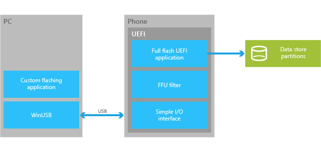
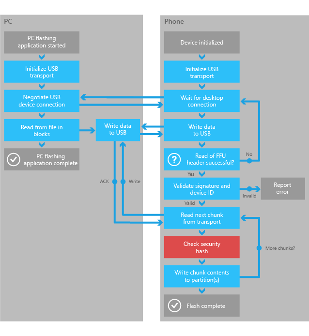

# 开发自定义 OEM 闪烁工具

Oem 可以使用全闪存更新 (FFU) 图像格式和简单 UEFI USB 协议来创建自定义的闪烁工具。 OEM 自定义闪烁工具可以将与现有系统集成和支持广泛的[闪烁工具](flashing-tools.md)中讨论的方案。

## UEFI 闪烁的应用程序

OEM 必须闪存使用特定图像布局[FFU 图像格式](ffu-image-format.md)中所讨论的 （uefi） 应用程序的设备。

此关系图概述了从 PC 闪烁工具与设备使用 UEFI 简单 Windows Phone I/O 协议通信流。

获得可用 USB Api，请参阅[UEFI 闪烁协议](https://msdn.microsoft.com/windows/hardware/dn917884.aspx)的详细信息。

## 闪烁的 PC 的应用程序

将图像传送到设备运行 UEFI 闪烁应用程序使用简单的 PC 端的客户端程序。 PC 应用程序建立与设备的 USB 连接，并通过该连接将数据。 验证和验证的图像出现在 UEFI 闪烁应用程序在设备上运行。

下图总结了 OEM 自定义闪烁的 PC 应用程序以及 （uefi） 应用程序的总体流程。

**请注意**  
此图显示了一个可能的解决方案。 鼓励，OEM 可以修改此方法以创建最适合他们需要的最佳解决方案。

 

## 检查前闪烁的 SMBIOS 值

若要确保正确的图像被刷新到正确的设备，OEM 必须检查设备上的 SMBIOS 系统信息结构值。 检查必须确认在图像中，该设备平台 ID 值匹配 SMBIOS 系统信息结构值在手机上。 Manufacturer.Family.ProductName.Version 或 Manufacturer.Family.ProductName 从 SMBIOS 闪烁可以继续执行操作之前都必须与图像中的值匹配。

设备平台 ID 字符串如下所示。

**Manufacturer.Family.ProductName.Version**

### 工程设备和空白的设备 Id

与新的工程设备，OEM 可以使用 SMBIOS 值，以确定它是否可以接受闪烁图像包含测试签名证书。 OEM 可能会确定该测试签名的图像可能有空白系统信息结构的值，其中生产签名图像必须有 SMBIOS 系统信息结构值已填充。

## 实现验证已签名的映像

FFU 图像包含元素，如哈希和签名必须用于验证映像的目录。 有关详细信息，请参阅[闪烁的自定义工具中实现图像完整性验证](implementing-image-integrity-validation-in-custom-flashing-tools.md)。

## UEFI 闪烁协议

[UEFI USB 功能协议](https://msdn.microsoft.com/library/windows/hardware/dn789231)  
介绍了**EFI\_USBFN\_IO\_协议**。

[UEFI 简单 I/O 协议](https://msdn.microsoft.com/library/windows/hardware/dn772121)  
介绍了**EFI\_简单\_WINPHONE\_IO\_协议**。

[（uefi） 检查签名协议](https://msdn.microsoft.com/library/windows/hardware/dn772115)  
介绍了**EFI\_CHECKSIG\_协议**。

## 相关的主题

[闪烁的工具](flashing-tools.md)

[制造](index.md)

 

 

