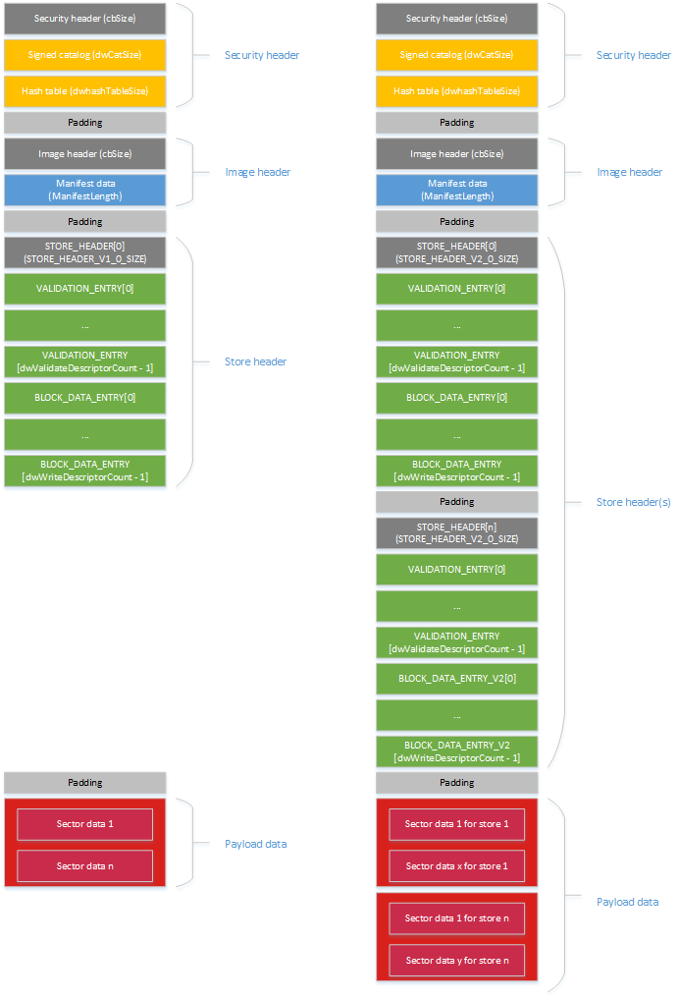

# <a name="ffu-image-format"></a>FFU 图像格式


下图显示了 V1 和 V2 FFU 格式。 主要更改引入 V2 FFU 格式是对多个数据存储的支持 – 每个存储区包含基于扇区的数据目标唯一的物理分区。



## <a name="span-idsecurityheaderregionspanspan-idsecurityheaderregionspanspan-idsecurityheaderregionspansecurity-header-region"></a><span id="Security_header_region"></span><span id="security_header_region"></span><span id="SECURITY_HEADER_REGION"></span>安全标头区域


<span id="cbSize"></span><span id="cbsize"></span><span id="CBSIZE"></span>cbSize  
安全的大小\_标头结构。 结合签字字符串中用于标识 FFU 安全标头。

<span id="Signature_string"></span><span id="signature_string"></span><span id="SIGNATURE_STRING"></span>签名的字符串  
标识为安全 FFU 图像此图像的"SignedImage"的硬编码 ASCII 字符串。

<span id="Chunk_size_in_KB"></span><span id="chunk_size_in_kb"></span><span id="CHUNK_SIZE_IN_KB"></span>区块大小，以 kb 为单位  
用于生成哈希表的数据块的大小。 用于将图像分为 hashable 区块为对照的哈希表条目进行验证，并确保图像未被篡改自创建以来。

<span id="Hash_algorithm_ID"></span><span id="hash_algorithm_id"></span><span id="HASH_ALGORITHM_ID"></span>哈希算法 ID  
定义的哈希算法用于生成哈希表。

<span id="Catalog_size"></span><span id="catalog_size"></span><span id="CATALOG_SIZE"></span>目录大小  
以字节为单位安全标头后的目录的大小。

<span id="Hash_table_size"></span><span id="hash_table_size"></span><span id="HASH_TABLE_SIZE"></span>哈希表的大小  
以字节为单位的安全标头和目录后的哈希表的大小。

**安全标头**中，字节数︰ cbSize

``` syntax
#define SECURITY_SIGNATURE "SignedImage "

typedef struct _SECURITY_HEADER
{
    UINT32 cbSize;            // size of struct, overall
    BYTE   signature[12];     // "SignedImage "
    UINT32 dwChunkSizeInKb;   // size of a hashed chunk within the image
    UINT32 dwAlgId;           // algorithm used to hash
    UINT32 dwCatalogSize;     // size of catalog to validate
    UINT32 dwHashTableSize;   // size of hash table
} SECURITY_HEADER;
```

**签名的目录**中，字节数︰ dwCatalogSize

编录文件包含哈希表 blob，将签名必须匹配的设备上的证书之一的哈希值。 此方法允许检查而无完整图像闪烁之前设备上预先签名。 流式处理数据已收到针对哈希表项。

**哈希表数据**，字节数︰ dwHashTableSize

基本图像的每个区块实际哈希值。 区块验证映像标头起止日期 FFU 的末尾。

**填充**的下一步的部分开始于区块边界，字节计数︰ 变量

之后哈希表填充 （空白） 被添加到当前文本块填写。 这可确保完全安全标头、 目录和哈希表结尾处区块边界和实际图像头和场外都对齐的文本块。

## <a name="span-idimageheaderregionspanspan-idimageheaderregionspanspan-idimageheaderregionspanimage-header-region"></a><span id="Image_header_region"></span><span id="image_header_region"></span><span id="IMAGE_HEADER_REGION"></span>图像标题区域


<span id="cbSize"></span><span id="cbsize"></span><span id="CBSIZE"></span>cbSize  
以字节为单位的标题 struc 大小。 结合签字字符串中用于标识 FFU 图像标题。

<span id="Signature_string"></span><span id="signature_string"></span><span id="SIGNATURE_STRING"></span>签名的字符串  
硬编码的字符串，标识该图像作为 FFU 图像的"ImageFlash"。

<span id="Manifest_Length"></span><span id="manifest_length"></span><span id="MANIFEST_LENGTH"></span>清单的长度  
紧跟在映像标头的清单数据的字节数大小。

<span id="Chunk_size"></span><span id="chunk_size"></span><span id="CHUNK_SIZE"></span>区块大小  
用于生成哈希表的数据块的大小。 用于将图像分为 hashable 区块为对照的哈希表条目进行验证，并确保图像未被篡改自创建以来。 这应与安全标头中的块区大小相匹配。 仅在映像验证过程中使用。

**图像标题**，字节数︰ cbSize

``` syntax
#define FFU_SIGNATURE "ImageFlash  "

typedef struct _IMAGE_HEADER
{
    DWORD  cbSize;           // sizeof(ImageHeader)
    BYTE   Signature[12];    // "ImageFlash  "
    DWORD  ManifestLength;   // in bytes
    DWORD  dwChunkSize;      // Used only during image generation.
} ImageHeader;
```

**清单数据**的字节数计数︰ ManifestLength

清单中包含的设备布局和包括在 FFU 有效载荷的说明。

**填充**字节计数︰ 变量

之后填充 （空白） 的清单将被添加到当前文本块填写。 这可确保后面的数据开始在块边界上。

## <a name="span-idstoreheaderregionspanspan-idstoreheaderregionspanspan-idstoreheaderregionspanstore-header-region"></a><span id="Store_header_region"></span><span id="store_header_region"></span><span id="STORE_HEADER_REGION"></span>商店的页眉区域


### <a name="span-idstoreheaderspanspan-idstoreheaderspanspan-idstoreheaderspanstore-header"></a><span id="Store_header"></span><span id="store_header"></span><span id="STORE_HEADER"></span>存储区标头

<span id="Store_header__byte_count__STORE_HEADER_V1_0_SIZE__248_bytes_"></span><span id="store_header__byte_count__store_header_v1_0_size__248_bytes_"></span><span id="STORE_HEADER__BYTE_COUNT__STORE_HEADER_V1_0_SIZE__248_BYTES_"></span>**存储区标题**，字节计数︰ 商店\_头\_V1\_0\_大小 （248 个字节）  
存储区标头包含元数据，描述有效负载。 这包括更新类型、 验证大小、 数据大小和版本控制。 一些信息是多余的但包括为方便起见。

存储区标头包含双字节计数/长度字段描述验证和编写描述符部分。  这使得这些分区复制出来和稍后处理。

V1 FFU 格式，您应该看到一个商店头。 V2 FFU 格式，您应该会看到多个存储区标题，根据定义的 NumOfStores 结构的值。

<span id="Validation_descriptor_region"></span><span id="validation_descriptor_region"></span><span id="VALIDATION_DESCRIPTOR_REGION"></span>验证描述符区域  
验证描述符区域是一套验证\_条目结构。  有 dwValidateDescriptorCount 之一，而且该区域的总字节数是 dwValidateDescriptorLength。

<span id="Write_descriptor_region"></span><span id="write_descriptor_region"></span><span id="WRITE_DESCRIPTOR_REGION"></span>写描述符区域  
写描述符区域是块的集合\_数据\_条目结构。  有 dwWriteDescriptorCount，并且总的大小，以字节为单位的地区是 dwWriteDescriptorLength。

<span id="MajorVersion__MinorVersion"></span><span id="majorversion__minorversion"></span><span id="MAJORVERSION__MINORVERSION"></span>MajorVersion MinorVersion  
主要和次要版本存储区标头。

<span id="FullFlashMajorVersion__FullFlashMinorVersion_"></span><span id="fullflashmajorversion__fullflashminorversion_"></span><span id="FULLFLASHMAJORVERSION__FULLFLASHMINORVERSION_"></span>FullFlashMajorVersion FullFlashMinorVersion   
全闪存更新文件格式的主要和次要版本。

下表显示 V1 和 V2 ffu 图像格式的版本的值。

<table>
<colgroup>
<col width="33%" />
<col width="33%" />
<col width="33%" />
</colgroup>
<tbody>
<tr class="odd">
<td align="left"></td>
<td align="left">V1</td>
<td align="left">V2</td>
</tr>
<tr class="even">
<td align="left"><p>MajorVersion</p></td>
<td align="left"><p>1</p></td>
<td align="left"><p>2</p></td>
</tr>
<tr class="odd">
<td align="left"><p>MinorVersion</p></td>
<td align="left"><p>0</p></td>
<td align="left"><p>0</p></td>
</tr>
<tr class="even">
<td align="left"><p>FullFlashMajorVersion</p></td>
<td align="left"><p>2</p></td>
<td align="left"><p>2</p></td>
</tr>
<tr class="odd">
<td align="left"><p>FullFlashMinorVersion</p></td>
<td align="left"><p>0</p></td>
<td align="left"><p>0</p></td>
</tr>
</tbody>
</table>

 

**请注意**  
-   OEM 应该刷新到设备的图像，除非版本的图像匹配这些值。

 

<span id="NumOfStores__V2_only_"></span><span id="numofstores__v2_only_"></span><span id="NUMOFSTORES__V2_ONLY_"></span>NumOfStores （第 2 版）  
商店和在此 FFU 其有效载荷数。

<span id="StoreIndex__V2_only_"></span><span id="storeindex__v2_only_"></span><span id="STOREINDEX__V2_ONLY_"></span>StoreIndex （第 2 版）  
当前存储索引从 1 开始。

<span id="StorePayloadSize__V2_only_"></span><span id="storepayloadsize__v2_only_"></span><span id="STOREPAYLOADSIZE__V2_ONLY_"></span>StorePayloadSize （第 2 版）  
以字节为单位，不包括填充存储区负载的大小。

<span id="DevicePathLength__V2_only_"></span><span id="devicepathlength__v2_only_"></span><span id="DEVICEPATHLENGTH__V2_ONLY_"></span>DevicePathLength （第 2 版）  
设备路径，如下所示，字符，而不包括终止空值字符的大小。

<span id="DevicePath__V2_only_"></span><span id="devicepath__v2_only_"></span><span id="DEVICEPATH__V2_ONLY_"></span>DevicePath （第 2 版）  
针对存储实际的设备路径。 这应该是设备路径 （uefi） 协议从中检索相同︰ 设备\_路径\_TO\_文本\_协议。 ConvertDevicePathToText()

<pre><code>
typedef struct _STORE_HEADER
{
    UINT32 dwUpdateType; // indicates partial or full flash
    UINT16 MajorVersion, MinorVersion; // used to validate struct
    UINT16 FullFlashMajorVersion, FullFlashMinorVersion; // FFU version, i.e. the image format
    char szPlatformId[192]; // string which indicates what device this FFU is intended to be written to
    UINT32 dwBlockSizeInBytes; // size of an image block in bytes – the device’s actual sector size may differ
    UINT32 dwWriteDescriptorCount; // number of write descriptors to iterate through
    UINT32 dwWriteDescriptorLength; // total size of all the write descriptors, in bytes (included so they can be read out up front and interpreted later)
    UINT32 dwValidateDescriptorCount; // number of validation descriptors to check
    UINT32 dwValidateDescriptorLength; // total size of all the validation descriptors, in bytes
    UINT32 dwInitialTableIndex; // block index in the payload of the initial (invalid) GPT
    UINT32 dwInitialTableCount; // count of blocks for the initial GPT, i.e. the GPT spans blockArray[idx..(idx + count -1)]
    UINT32 dwFlashOnlyTableIndex; // first block index in the payload of the flash-only GPT (included so safe flashing can be accomplished)
    UINT32 dwFlashOnlyTableCount; // count of blocks in the flash-only GPT
    UINT32 dwFinalTableIndex; // index in the table of the real GPT
    UINT32 dwFinalTableCount; // number of blocks in the real GPT
    <b>UINT16 NumOfStores; // Total number of stores (V2 only)</b>
    <b>UINT16 StoreIndex; // Current store index, 1-based (V2 only)</b>
    <b>UINT64 StorePayloadSize; // Payload data only, excludes padding (V2 only)</b>
    <b>UINT16 DevicePathLength; // Length of the device path (V2 only)</b>
    <b>CHAR16 DevicePath[1]; // Device path has no NUL at then end (V2 only)</b>
} STORE_HEADER;
</code></pre>

### <a name="span-idvalidationentriesspanspan-idvalidationentriesspanspan-idvalidationentriesspanvalidation-entries"></a><span id="Validation_Entries"></span><span id="validation_entries"></span><span id="VALIDATION_ENTRIES"></span>验证项

**验证条目**，元素计数︰ dwValidateDescriptorCount，字节数︰ dwValidateDescriptorLength

验证部分仅用于部分更新。 它包含一组验证\_条目结构。 每个验证条目包含一个字节数组和磁盘进行比较的范围。 如果验证条目中的数据与磁盘上的数据相匹配，则证明该验证条目。 当且仅当所有验证条目都已都确认，部分更新可以安全地应用于该设备。

**验证条目**，字节计数︰ 变量

每个验证\_条目结构在磁盘上，其数据应与字节数组中的条目描述一个位置。

``` syntax
typedef struct _VALIDATION_ENTRY
{
    UINT32 dwSectorIndex;
    UINT32 dwSectorOffset;
    UINT32 dwByteCount;
    BYTE rgCompareData[1]; // size is dwByteCount
} VALIDATION_ENTRY;
```

### <a name="span-idblockdataentriesspanspan-idblockdataentriesspanspan-idblockdataentriesspanblock-data-entries"></a><span id="Block_data_entries"></span><span id="block_data_entries"></span><span id="BLOCK_DATA_ENTRIES"></span>块数据条目

**块数据条目**，元素计数︰ dwWriteDescriptorCount，字节数︰ dwWriteDescriptorLength

块数据条目描述如何将数据写入到磁盘。 很可能不止一次写入磁盘的单个区域或写入相同的数据在磁盘上，以便压缩负载多个位置。 写描述符区域组成块\_数据\_条目结构。 每个项都有大小和一个字节数组，数组的位置写入到磁盘。

确定需要排放的所有分区重新刷新设备所需的最后一个块条目用于字段**dwFlashOnlyTableIndex**和**dwFlashOnlyTableCount** 。 如果所有达块和包括此块成功快闪设备，该设备可以是重新 flashed 而不需要任何的硅片供应商或 OEM 代码。

**块的数据条目**，字节计数︰ 变量

每个块的数据条目描述的存储数据一节中的数据块。 每一项描述在磁盘上的数据块，并应该编写的位置数。 AccessMethod 使用如 accessMethod 在 SetFilePointer，也就是说它提供了对 blockIndex 的含义。

``` syntax
enum DISK_ACCESS_METHOD
{
    DISK_BEGIN  = 0,
    DISK_END    = 2
};

typedef struct _DISK_LOCATION
{
    UINT32 dwDiskAccessMethod;
    UINT32 dwBlockIndex;
} DISK_LOCATION; 

typedef struct _BLOCK_DATA_ENTRY
{
    UINT32 dwLocationCount;
    UINT32 dwBlockCount;
    DISK_LOCATION rgDiskLocations[1];
} BLOCK_DATA_ENTRY;
```

### <a name="span-idpaddingspanspan-idpaddingspanspan-idpaddingspanpadding"></a><span id="Padding"></span><span id="padding"></span><span id="PADDING"></span>填充

**填充**– 允许下一节，在块边界，开始字节计数︰ 变量

## <a name="span-idimagepayloadregionspanspan-idimagepayloadregionspanspan-idimagepayloadregionspanimage-payload-region"></a><span id="Image_payload_region"></span><span id="image_payload_region"></span><span id="IMAGE_PAYLOAD_REGION"></span>图像有效负载区域


阻止数据被写入磁盘的字节数计数的有效负载部分︰ 变量。

这是一个数据块的数组。 每个数据块包含， **BytesPerBlock**字节， **BytesPerBlock**商店头中定义的位置。

V1 FFU 格式，您应该看到一个图像有效载荷地区。 V2 FFU 格式，您应该会看到大量的图像取决于定义的 NumOfStores 结构的值的有效负载区域。

## <a name="span-idrelatedtopicsspanrelated-topics"></a><span id="related_topics"></span>相关的主题


[闪烁的工具](flashing-tools.md)

 

 


