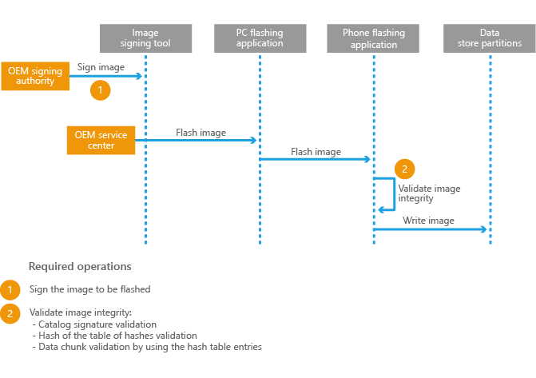

# 闪烁的安全要求

闪烁发生之前，所有 OEM 闪烁机制必须由 OEM 负责密钥链都验证加密签名图像中。 在图像上的加密签名此验证 （不上闪烁的桌面工具） 的设备上必须完成和图像刷新为 eMMC 内存之前，必须完成。 这一要求是为了防止设备遭到破坏的安全保护系统中的用户。 和可刷新或更新设备 （调试程序、 内存检查器等） 的状态，不适当的保护的机制可能用于攻击者绕过设备的安全机制。

实现的解决方案必须是完全有弹性，即使设备被实施反向工程 （即，即使用户了解安全代码 SoC 的固件中的操作）。

## 闪烁的安全要求摘要

在零售设备上的安全还必须满足以下要求︰

-   只有安全闪烁技术可包括零售设备上。

-   要刷新图像必须完成过程控制和验证由 OEM 或 Microsoft 加密签名。

-   要刷新图像上的加密签名必须经过前闪烁的设备上的代码。

-   验证设备上的加密签名的代码必须是篡改，并且必须在使用它的时间点可信赖加密密钥材料用于验证设备上。

-   必须使用足够大的加密算法 — — 至少，使用 sha-256 RSA 2048。

-   闪烁的工具必须检查前闪烁的 SMBIOS 设备标识值。 有关详细信息，请参阅[开发自定义 OEM 闪烁工具](developing-custom-oem-flashing-tools.md)。

-   闪烁的工具必须实现图像完整性验证可以防止篡改的图像。 有关详细信息，请参阅[开发自定义 OEM 闪烁工具](developing-custom-oem-flashing-tools.md)。

-   必须遵循业界最佳做法进行源的代码开发和供应链安全。

-   威胁模型必须应用于确定优先级的风险、 威胁和漏洞。

## 建议闪烁的解决方案

下图演示一个闪烁的解决方案，它符合闪烁的安全要求。 要刷新图像必须由 OEM 签名机构使用有案可稽的过程，确保高级别的控制和在整个过程中的安全签名。 要刷新使用可靠的密钥材料前闪烁的图像开始闪烁操作的组件必须执行验证加密签名。

应存储加密密钥，这样它到安全启动密钥材料 (OEM\_PK\_散列或 UEFI 变量 PK) 或与公钥加密验证安全启动的二进制文件中嵌入。 是不可接受的公用或专用密钥存储在 DPP，或任何其他未签名的和未经过验证的文件存储区中。

## 相关的主题

[开发自定义 OEM 闪烁工具](developing-custom-oem-flashing-tools.md)

[在闪烁的自定义工具中实现图像完整性验证](implementing-image-integrity-validation-in-custom-flashing-tools.md)

 

 

