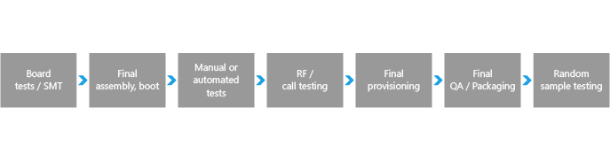
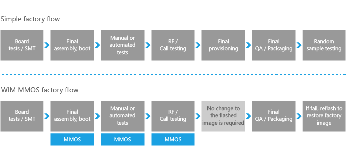
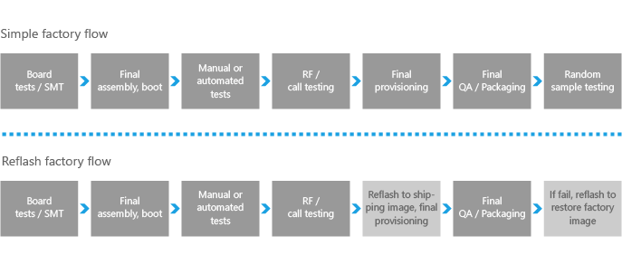

# 移动的制造

您已完成步骤中的指南准备设备覆盖后，焦点将转移到准备最终零售配置的设备。

在此过程中，设置最终配置值、 移除调试日志记录，以及优化装运的操作系统。 接下来，您确定操作系统向设备硬件制造行中的传输方式。

## 制造首字母缩写词

以下是可以使用一些常用缩写。

<table>
<colgroup>
<col width="50%" />
<col width="50%" />
</colgroup>
<tbody>
<tr class="odd">
<td align="left">
<strong>用餐</strong>
</td>
<td align="left">
自动的测试设备
</td>
</tr>
<tr class="even">
<td align="left">
<strong>BER</strong>
</td>
<td align="left">
错误的比特率
</td>
</tr>
<tr class="odd">
<td align="left">
<strong>BIST</strong>
</td>
<td align="left">
内置自检
</td>
</tr>
<tr class="even">
<td align="left">
<strong>COT</strong>
</td>
<td align="left">
测试的成本
</td>
</tr>
<tr class="odd">
<td align="left">
<strong>CIT 测试</strong>
</td>
<td align="left">
计算机交互测试 — — 半自动化测试设备。 在此阶段中，该设备连接到 PC 或工作站
</td>
</tr>
<tr class="even">
<td align="left">
<strong>DIB</strong>
</td>
<td align="left">
设备接口板
</td>
</tr>
<tr class="odd">
<td align="left">
<strong>售票</strong>
</td>
<td align="left">
为测试设计
</td>
</tr>
<tr class="even">
<td align="left">
<strong>DUT</strong>
</td>
<td align="left">
接受测试的设备
</td>
</tr>
<tr class="odd">
<td align="left">
<strong>ESD</strong>
</td>
<td align="left">
静电放电
</td>
</tr>
<tr class="even">
<td align="left">
<strong>EVM</strong>
</td>
<td align="left">
错误矢量模
</td>
</tr>
<tr class="odd">
<td align="left">
<strong>FA</strong>
</td>
<td align="left">
最终的程序集
</td>
</tr>
<tr class="even">
<td align="left">
<strong>FQC</strong>
</td>
<td align="left">
最终的质量检查
</td>
</tr>
<tr class="odd">
<td align="left">
<strong>NIST</strong>
</td>
<td align="left">
国家标准和技术
</td>
</tr>
<tr class="even">
<td align="left">
<strong>OOBT</strong>
</td>
<td align="left">
优秀的测试
</td>
</tr>
<tr class="odd">
<td align="left">
<strong>PIB</strong>
</td>
<td align="left">
探测器接口板
</td>
</tr>
<tr class="even">
<td align="left">
<strong>RTC</strong>
</td>
<td align="left">
实时时钟 — — 主板上硬件时钟用来跟踪的当前时间
</td>
</tr>
<tr class="odd">
<td align="left">
<strong>SCM</strong>
</td>
<td align="left">
转包制造商
</td>
</tr>
<tr class="even">
<td align="left">
<strong>SOC</strong>
</td>
<td align="left">
系统在一个芯片上
</td>
</tr>
<tr class="odd">
<td align="left">
<strong>UPH</strong>
</td>
<td align="left">
每小时单位
</td>
</tr>
<tr class="even">
<td align="left">
<strong>UUT</strong>
</td>
<td align="left">
单元测试
</td>
</tr>
</tbody>
</table>

 

## 一般的制造指南

Windows 10 移动的目标是，合作伙伴成功建立高效、 得力地跨越制造、 测试和维修的过程中。 为此，Microsoft 会的工具和过程，用于制造和 10 Windows Mobile 设备的支持提供指南。 本指南介绍的工具和技术，在制造过程中可供 Oem。

-   [生产流](#manufacturing-workflow)

-   [通过制造阶段的示例测试区域](#example-test)

-   [使用主机计算机重新启动到闪烁模式电话并获取版本信息](using-a-host-computer-to-reboot-a-phone-to-flashing-mode-and-get-phone-version-information.md)

## 制造的安全要求

最终零售映像必须配置以满足安全要求的集合。 为了确保其零售映像满足这些要求的 Oem，Windows 10 移动自动检查上述部分要求在第一次启动过程中。 其他要求必须由 Oem 进行验证。

## 移动部署和图像处理

准备进行生成和测试移动版 Windows 10？ 以下是实验室，遍历构建新的移动设备和自定义以满足客户的需求。

-   [移动部署和图像处理](mobile-deployment-and-imaging.md)

## 制造模式的完整的操作系统

制造模式是操作系统的一种完整，可以用于制造相关的任务，如组件并支持测试模式。

-   [制造模式](manufacturing-mode.md)

-   [启动模式管理 UEFI 协议](boot-mode-management-uefi-protocol.md)

## Microsoft 操作系统 (MMO) 制造

Microsoft 制造 OS (MMO) 是促进高效的制造系统的优化的配置。

-   [Microsoft 制造操作系统](microsoft-manufacturing-os.md)

-   [MMO 图像定义](mmos-image-definition.md)

-   [对设备的闪存 MMO](flash-mmos-to-the-phone.md)

-   [开发 MMO 测试应用程序](develop-mmos-test-applications.md)

-   [支持 Api 的生产测试环境](manufacturing-test-environment-supported-apis.md)

-   [部署和测试 MMO 在用户模式下测试应用程序](deploy-and-test-a-user-mode-test-application-in-mmos.md)

-   [使用 WIM MMO 图像](working-with-wim-mmos-images.md)

## 闪烁的工具

您可以开发自定义的闪烁工具，以满足设备的生命周期

-   [闪烁的工具](flashing-tools.md)

-   [开发自定义 OEM 闪烁工具](developing-custom-oem-flashing-tools.md)

## 生产流

Oem 需要确定制造工艺，以用于在其生产设施中实现 MMO。

讨论了制造过程中，简化的模型将制造线的使用工作流。 请注意，每个 OEM 将有一个独特的进程;此简化的模型可作为公共参考点。

### 简单的工厂流

**主板的测试/SMT** – 图像闪烁团伙程序员通过。

**最终的程序集，引导**-Marry 板用塑料;第一次在制造车间在引导设备。

**手动测试**– 行工作运行设备测试，例如声音、 振动、 摄像头、 键盘等等。

**RF/呼叫测试**– 自动化测试 tethered 设备启用电源和测试数据的记录。

**最后的资源调配**— 其中 IMEI 数据写入、 加载自定义，并在完成标记的自动过程。

**最终的 QA 包装**– 最终手动验证该设备，然后打包。

**随机样本测试**– 指定数目的设备从包装中删除并测试。 如果故障达到某个特定阈值时，可能会撤回整行。

### 制造流程选项

每个制造商都有不同的技术和工具，它们用于制造 10 Windows Mobile 设备。 下面将介绍两个选项，但鼓励 OEM 是组合方法，并根据需要进行创新。 最佳专业技能相关制造所在的人构建的 OEM 制造行。 选择适用于您的制造过程和业务指导。

此处提供了两个示例制造过程的摘要。

### 制造过程选项 1︰ 从 MMO WIM 映像的引导

可以暂时将 WIM （Windows 图像处理） Microsoft 制造 OS (MMO) 图像复制到设备，然后引导到该图像的易失性 RAM 内存中运行。 MMO 有关详细信息，请参阅[微软制造的操作系统](microsoft-manufacturing-os.md)。

测试将永远不会发货的 WIM MMO 图像设备上使用，所以这种方法使调配其它制造工具 （运输、 扩展）。 另外，Oem 可以使用任何函数的本机 Api 中测试映像。 其他工厂仅用于测试的驱动程序或其他软件可以包含在 WIM MMO 图像。

使用这种方法的优点之一是从 RAM 中的 WIM 映像启动快于闪烁图像。

有关更多信息，请参见[使用 WIM MMO 图像](working-with-wim-mmos-images.md)。

### 制造过程选项 2︰ 刷新设备

此过程将使用两个图像︰ 工厂测试，来个和最后黄金图像最终传送设备。 像 MMO WIM 映像，将永远不会发货的测试图像用于设备。 这意味着可以包含其它制造工具 （运输、 扩展程序），并且制造仅本机 Api 调用。

这种方法使成为可能，在适当情况下，可以使用不同版本的操作系统进行测试。 为正在测试的应用程序迁移到 Windows 10 手机，这可能是有用的过渡措施。

在此方法中的一个缺点是必须设计制造行以适应重新刷新发生接近制造过程的结束的时间。

闪烁的工具使用的详细信息，请参阅[闪烁工具](flashing-tools.md)。

## 通过制造阶段的示例测试区域

通过制造阶段的测试区域提供仅作为示例;每个制造商可能希望以不同的方式对测试进行排序。

**测试调制解调器 (RF / 蜂窝测试)**

<table>
<colgroup>
<col width="100%" />
</colgroup>
<tbody>
<tr class="odd">
<td align="left">
调制解调器射频校准
</td>
</tr>
<tr class="even">
<td align="left">
Wi-Fi RX/TX 电源
</td>
</tr>
<tr class="odd">
<td align="left">
Bluetooth RX 得克萨斯州电源
</td>
</tr>
</tbody>
</table>

 

**设备测试**

<table>
<colgroup>
<col width="100%" />
</colgroup>
<tbody>
<tr class="odd">
<td align="left">
显示
</td>
</tr>
<tr class="even">
<td align="left">
小键盘
</td>
</tr>
<tr class="odd">
<td align="left">
Sim 卡接口
</td>
</tr>
<tr class="even">
<td align="left">
存储卡
</td>
</tr>
<tr class="odd">
<td align="left">
照相机
</td>
</tr>
<tr class="even">
<td align="left">
RTC
</td>
</tr>
<tr class="odd">
<td align="left">
演讲者
</td>
</tr>
<tr class="even">
<td align="left">
麦克风
</td>
</tr>
<tr class="odd">
<td align="left">
传感器 — ALS
</td>
</tr>
<tr class="even">
<td align="left">
传感器-磁力仪
</td>
</tr>
<tr class="odd">
<td align="left">
传感器-近似
</td>
</tr>
<tr class="even">
<td align="left">
传感器-加速感应器
</td>
</tr>
<tr class="odd">
<td align="left">
电话听筒接口
</td>
</tr>
<tr class="even">
<td align="left">
电源的当前待机
</td>
</tr>
</tbody>
</table>

 

**设备资源调配**

<table>
<colgroup>
<col width="100%" />
</colgroup>
<tbody>
<tr class="odd">
<td align="left">
IMEI
</td>
</tr>
<tr class="even">
<td align="left">
Sim 卡锁
</td>
</tr>
<tr class="odd">
<td align="left">
Bluetooth MAC
</td>
</tr>
<tr class="even">
<td align="left">
传感器校准
</td>
</tr>
<tr class="odd">
<td align="left">
安全配置
</td>
</tr>
<tr class="even">
<td align="left">
密苏里州资源调配
</td>
</tr>
</tbody>
</table>

 

 

 

