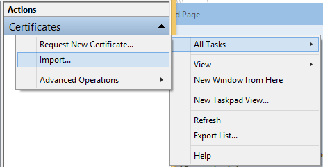
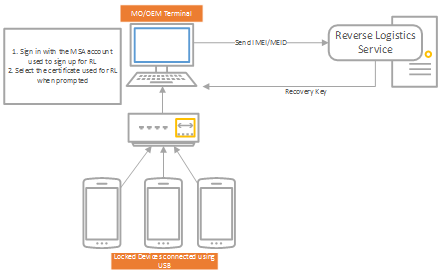

# <a name="reset-protection"></a>重置保护


重置保护帮助您安全设备，以防被盗。 其过程中必须启用设备上生产的时候。

重置保护由以下部分组成︰

-   **重置和重新激活保护**– 被盗的设备不能重复使用的重置或更新设备。 当用户执行重置该设备的工厂时，他们将被要求输入与该设备关联的 Microsoft 帐户凭据。 此外，如果设备用新的映像已刷新和重置保护处于打开状态，与其关联的 Microsoft 帐户凭据该设备需要完成 OOBE 和使用此设备。
-   启用**防回滚保护**– 如果重置保护，被盗的设备无法刷新为早期版本的操作系统不支持重置保护。

若要启用重置保护，您必须配置两个安全 UEFI 变量︰

-   **反\_被盗\_启用**– 此变量需要将由 Microsoft 提供的值用来设置并指示设备可以支持重置保护。 操作系统根据此设置设备上启用重置保护。 该变量是在 1A597235-6378-4910-9F8B-720FEE9357A3 命名空间中。
-   **DBX** -这变量必须包含到该设备无法回滚的生成的图像哈希。 这些图像哈希值是由 Microsoft 提供的。 该变量是在 EFI\_图像\_安全\_数据库\_GUID 命名空间。

## <a name="span-idturnonresetprotectioninyourimagesspanspan-idturnonresetprotectioninyourimagesspanspan-idturnonresetprotectioninyourimagesspanturn-on-reset-protection-in-your-images"></a><span id="Turn_on_Reset_Protection_in_your_images"></span><span id="turn_on_reset_protection_in_your_images"></span><span id="TURN_ON_RESET_PROTECTION_IN_YOUR_IMAGES"></span>打开您的图像中重置保护


有两种方法来打开您的图像中重置保护︰

**选项 1︰ 使用启用 oeminput.xml**

通过添加重置零售设备上启用重置保护\_到 OEMInput.xml 文件的保护功能。 当您将包含此功能时，设备的重置保护 UEFI 安全启动键调配作为计划任务运行一次在第一次启动到主操作系统，不会再次运行。 可用的可选功能的详细信息，请参见 O[为构建映像的可选功能](https://msdn.microsoft.com/library/windows/hardware/dn756780)。

**请注意** 如果您正在构建测试映像，使用重置\_保护\_内部相反。

 

**选项 2︰ 启用时提供安全启动密钥**

重置保护在设备上启用的资源调配 （uefi） 安全启动键，并分两个步骤︰

1.  **防回滚资源调配**— DBX 变量必须更新，以包含不支持重置保护生成的哈希值。 具体而言，创建 PK、 KEK、 数据库和 DBX 变量的示例脚本将修改在 DBX 变量中添加由 Microsoft 提供的哈希值的列表。 将由 Microsoft 在名为的文件中提供的哈希值列表**OEM\_RollbackHashes.bin**。 DBX 变量必须使用 OEM 证书进行签名。

    下面的摘录部分包含更改的脚本可创建 DBX 变量︰

    ``` syntax
    write-progress -activity "Making secure boot variables" -status "Creating DBX"
# add SHA256 hashes from the supplied file to the DBX variable
    $hashes = Get-Content .\OEM_RollbackHashes.bin
    format-sb-hashes "dbx" $ownerGuid $hashes
    ```

2.  **重置和重新激活保护资源调配**— 后设置 DBX 变量中，则还必须设置抗\_被盗\_启用身份验证的变量。 此变量的内容将提供在 microsoft **OEM\_ResetProtection\_启用\_Resource.bin**文件。 变量的名称是抗\_被盗\_启用和命名空间的 GUID 是 1A597235-6378-4910-9F8B-720FEE9357A3。 您可以设置此安全启动键的方式相同。

## <a name="span-idhowdoiupdatearetailimagewithresetprotectionspanspan-idhowdoiupdatearetailimagewithresetprotectionspanspan-idhowdoiupdatearetailimagewithresetprotectionspanhow-do-i-update-a-retail-image-with-reset-protection"></a><span id="How_do_I_update_a_retail_image_with_Reset_Protection_"></span><span id="how_do_i_update_a_retail_image_with_reset_protection_"></span><span id="HOW_DO_I_UPDATE_A_RETAIL_IMAGE_WITH_RESET_PROTECTION_"></span>如何重置保护与更新零售映像？


当提交一个更新时，重置保护不应更新的一部分。 但是，生成图像时，重置保护应包括在 oeminput.xml 文件中。 我们推荐使用以下步骤重置启用了保护更新零售映像︰

1.  当在开发图像重置\_在 oeminput.xml 文件中应包括保护可选功能。
2.  提交的软件包进行签名之前，您应该删除重置\_保护 oeminput.xml 文件中的可选功能。
3.  您将收到由 Microsoft 签名的软件包后，您必须添加重置\_保护保存到 oeminput.xml 文件的可选功能。

## <a name="span-idbootablewimfilesandmmosspanspan-idbootablewimfilesandmmosspanspan-idbootablewimfilesandmmosspanbootable-wim-files-and-mmos"></a><span id="Bootable_WIM_files_and_MMOS"></span><span id="bootable_wim_files_and_mmos"></span><span id="BOOTABLE_WIM_FILES_AND_MMOS"></span>可引导的 WIM 文件和 MMO


当在设备上使用重置保护，MMO 或支持该设备的可引导 WIM 文件必须依靠支持重置保护的工具的版本。 我们建议的设备图像的版本和 MMO 匹配的版本。

## <a name="span-idreverselogisticsspanspan-idreverselogisticsspanspan-idreverselogisticsspanreverse-logistics"></a><span id="Reverse_logistics"></span><span id="reverse_logistics"></span><span id="REVERSE_LOGISTICS"></span>反向物流


与反向物流，可以获取状态信息的重置保护设备，如设备 IMEI，或检查是否重置保护当前启用的设备上。 您可以使用此去重置保护，如果您有该设备的适当的恢复密钥。 逆向物流可以帮助您在翻新方案其中重置保护处于打开状态，但您没有 Microsoft 帐户凭据所需将其关闭。 我们如何在[便携式设备 COM API 示例](https://code.msdn.microsoft.com/windowsdesktop/Portable-Devices-COM-API-fd4a5f7d)中使用反向物流提供了示例代码。

### <a name="span-idhowtogetstartedusingreverselogisticsspanspan-idhowtogetstartedusingreverselogisticsspanspan-idhowtogetstartedusingreverselogisticsspanhow-to-get-started-using-reverse-logistics"></a><span id="How_to_get_started_using_reverse_logistics"></span><span id="how_to_get_started_using_reverse_logistics"></span><span id="HOW_TO_GET_STARTED_USING_REVERSE_LOGISTICS"></span>如何开始使用反向物流

为了使用 Microsoft 的自动反向物流程序，组织需要与[Microsoft 仪表板](https://sysdev.microsoft.com/)帐户注册和执行以下任务︰

-   购买一个验证码签名的证书。
-   可用于提交请求的所有计算机上安装该证书。
-   指定管理员来管理程序。
-   为您的公司需要参与到仪表板提交的每个用户，Microsoft 用户添加帐户和**逆向物流**的权限授予每个用户。 要授予权限，请单击**配置文件**，然后单击**权限。**

### <a name="span-idregisteryourcompanyspanspan-idregisteryourcompanyspanspan-idregisteryourcompanyspanregister-your-company"></a><span id="Register_your_company"></span><span id="register_your_company"></span><span id="REGISTER_YOUR_COMPANY"></span>注册您的公司

您的公司可能已经使用 Microsoft 仪表板帐户。 在这种情况下，您需要找到您的仪表板帐户的管理员。 要查找管理员，请单击**管理**，然后单击**我的管理员**。 我们建议以其他管理员添加反向物流管理器，以便更容易地审核用户反向物流要求。 管理员职责包括批准加入的公司，批准请求的权限，并在他们离开公司后删除用户的请求。有关详细信息，请参阅[管理用户和权限](https://msdn.microsoft.com/library/windows/hardware/br230781.aspx)。

如果您的公司还没有然后仪表板帐户，下面是如何开始︰

-   [获取代码签名证书](https://msdn.microsoft.com/library/windows/hardware/hh801887.aspx)
    -   为了使用 revers 物流，您**必须**购买标准的三级证书，不 EV 证书。
    -   请确保您建立您的公司用于购买证书的名称相同。 这是将向用户显示的名称。
-   [建立公司](https://msdn.microsoft.com/library/windows/hardware/br230795.aspx)

请确保您保存此证书并且可以访问。 您需要在本部分中稍后介绍的多台计算机上安装它。 我们建议将证书的副本保存在一个拇指驱动器，或可以轻松地访问内容。

### <a name="span-idaddusersforyourcompanyspanspan-idaddusersforyourcompanyspanspan-idaddusersforyourcompanyspanadd-users-for-your-company"></a><span id="Add_users_for_your_company"></span><span id="add_users_for_your_company"></span><span id="ADD_USERS_FOR_YOUR_COMPANY"></span>将用户添加为您的公司

注册您的公司后，添加其他用户需要反向物流的权限︰

-   第一个人，来注册一家公司成为该公司帐户管理员。
-   后续的用户需要使用 Microsoft 帐户注册。 在[面板](https://sysdev.microsoft.com/)的右上角，单击**注册**将自己添加到您的公司，并请求**其他权限请求**下**逆向物流**的权限。
-   管理员将收到通知，并批准该请求。

有关登录到仪表板的详细信息，请参阅[在登录之前](https://msdn.microsoft.com/library/windows/hardware/br230782.aspx)。

### <a name="span-idsetupyourworkstationforreverselogisticsspanspan-idsetupyourworkstationforreverselogisticsspanspan-idsetupyourworkstationforreverselogisticsspanset-up-your-workstation-for-reverse-logistics"></a><span id="Set_up_your_workstation_for_reverse_logistics"></span><span id="set_up_your_workstation_for_reverse_logistics"></span><span id="SET_UP_YOUR_WORKSTATION_FOR_REVERSE_LOGISTICS"></span>设置为反向物流工作站

### <a name="span-idprerequistesspanspan-idprerequistesspanspan-idprerequistesspanprerequistes"></a><span id="Prerequistes"></span><span id="prerequistes"></span><span id="PREREQUISTES"></span>先修课程

-   您需要运行 Windows 7 或更高版本并且具有浏览器访问互联网的工作站。
-   每个反向物流提交者必须有他或她自己的 Microsoft 帐户;不应在多个用户间共享帐户凭据。
-   仅有在本地安装的证书的计算机将能够执行反向物流。

### <a name="span-idprocessspanspan-idprocessspanspan-idprocessspanprocess"></a><span id="Process"></span><span id="process"></span><span id="PROCESS"></span>进程

1.  插入包含您购买了证书的 u 盘。
2.  打算用来反向物流的请求提交的每台计算机上以本地管理员身份登录并安装代码签名证书︰
    1.  打开命令提示符。
    2.  类型`mmc`，然后按 enter 键。
    3.  在**文件**菜单上单击**添加/删除管理单元**。
    4.  单击**添加**。
    5.  在添加独立管理单元对话框**中**，选择**证书**。
    6.  单击**添加**。
    7.  在**证书管理单元中**对话框中，选择**计算机帐户**，然后单击**下一步。**
    8.  在**选择计算机**对话框中，单击**完成**。
    9.  在添加/删除管理单元对话框**中**，单击**确定**。
    10. 在**控制台根节点**窗口中，单击**证书 （本地计算机）**以查看该计算机的证书存储区。
    11. 在**操作**窗格下的证书，选择**更多操作**，**所有任务**，然后再**导入**︰
    12. 单击**浏览**并查找您所购买的证书。
    13. 单击**确定**。 证书应安装在您的**个人**证书存储区中。

### <a name="span-idauthenticationandusespanspan-idauthenticationandusespanspan-idauthenticationandusespanauthentication-and-use"></a><span id="Authentication_and_Use"></span><span id="authentication_and_use"></span><span id="AUTHENTICATION_AND_USE"></span>身份验证和使用

下一步是提交请求，反向物流的调配工作站上创建客户端工具。 您将需要创建 Microsoft 客户与第三方应用程序。 该应用程序将使用浏览器允许用户输入凭据使用 Microsoft 帐户网站。 它将授予访问权限您获取要调用逆向物流 API 的适当标记的工具。 有关如何生成该应用程序的详细信息，请参阅[移动和 Windows 桌面应用程序](https://msdn.microsoft.com/library/hh826529.aspx)，并使用"dds.reverse\_物流"范围 （而不是"wl.basic") 来获取相应的标记。

您的工具具有标记后，它可以调用反向物流 API 使用该标记，您的客户端证书，以及目标 IMEI 检索目标设备的恢复密钥。



### <a name="span-idapispecificationspanspan-idapispecificationspanspan-idapispecificationspanapi-specification"></a><span id="API_specification"></span><span id="api_specification"></span><span id="API_SPECIFICATION"></span>API 规范

### <a name="span-idrequestspanspan-idrequestspanspan-idrequestspanrequest"></a><span id="Request"></span><span id="request"></span><span id="REQUEST"></span>请求

反向物流 API 端点︰

过账<https://cs.dds.microsoft.com/Command/ExternalClientCert/AdministrativeUnprotect/%7BPartnerName%7D/%7BDeviceId%7D>

{使用省略号} 应替换为其 Microsoft 帐户保护手机用户的电子邮件中将包括最终用户可读的字符串。

{DeviceId} 应替换以下的格式 （保留方括号和替换的文本以及包括大括号） 之一的字符串︰

-   ImeiOrMeid\[{IMEI 或设备的 MEID}\]
-   Duid\[{设备的 DUID}\]

请求授权标头中包含 Microsoft 帐户用户令牌。

使用为您的组织的仪表板配置的证书必须用作相互 HTTPS 的客户端证书。

### <a name="span-idresponsespanspan-idresponsespanspan-idresponsespanresponse"></a><span id="Response"></span><span id="response"></span><span id="RESPONSE"></span>响应

```
{
  "UnprotectResult": "{UnprotectResult}"
  "RecoveryKey": "{RecoveryKey}"
}

UnprotectResult will be a string value of the enum specified below:

    /// <summary>
    /// Result of the unprotect operation
    /// </summary>
    public enum UnprotectResult
    {
        /// <summary>
        /// Device was not found in DDS
        /// </summary>
        DeviceNotFound,

        /// <summary>
        /// Device was already unprotected
        /// </summary>
        DeviceAlreadyUnprotected,

        /// <summary>
        /// Device has been unprotected
        /// </summary>
        DeviceUnprotected,

        /// <summary>
        /// IF we find more than 1 device, we don&#39;t currently have a way to resolve the conflict. So, we don&#39;t unprotect.
        /// </summary>
        MultipleDevicesFound,
    }
```

响应代码︰

-   200︰ 成功。
-   400︰ 请求的格式不正确。
-   401︰ 请求未获授权。 您的组织可能不会正确提供，用户可能不会提供与组织，或可能有问题或与客户端证书或 Microsoft 帐户用户令牌不匹配。 响应可能包含文本给予授权问题的原因。
-   404︰ 未找到指定的设备的 API 路径。
-   500︰ 意外的错误。 如果此问题持续存在，请与 Microsoft 联系问题的解决。
-   503︰ 存储错误。 如果此问题持续存在，请与 Microsoft 联系问题的解决。

 

 


