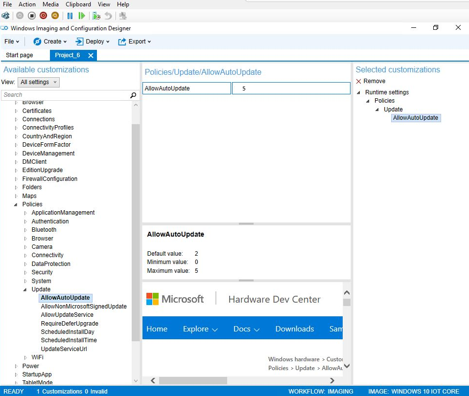
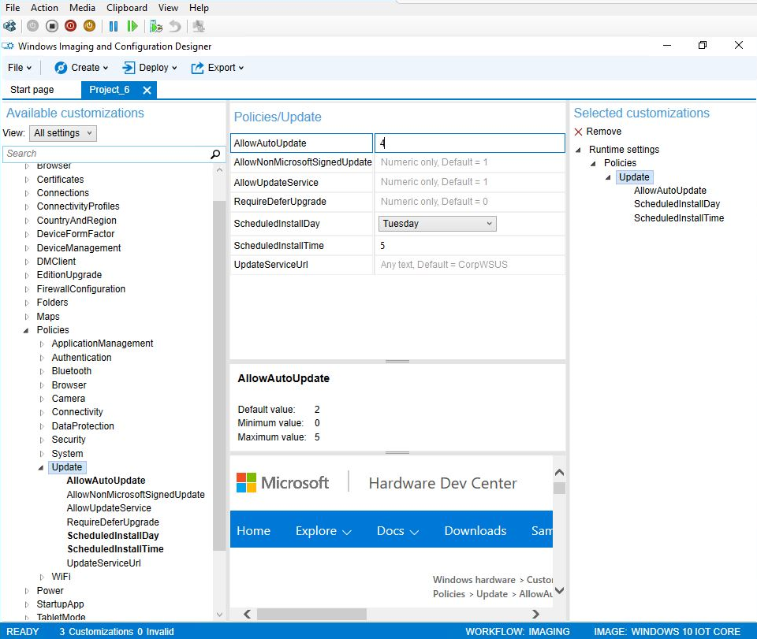
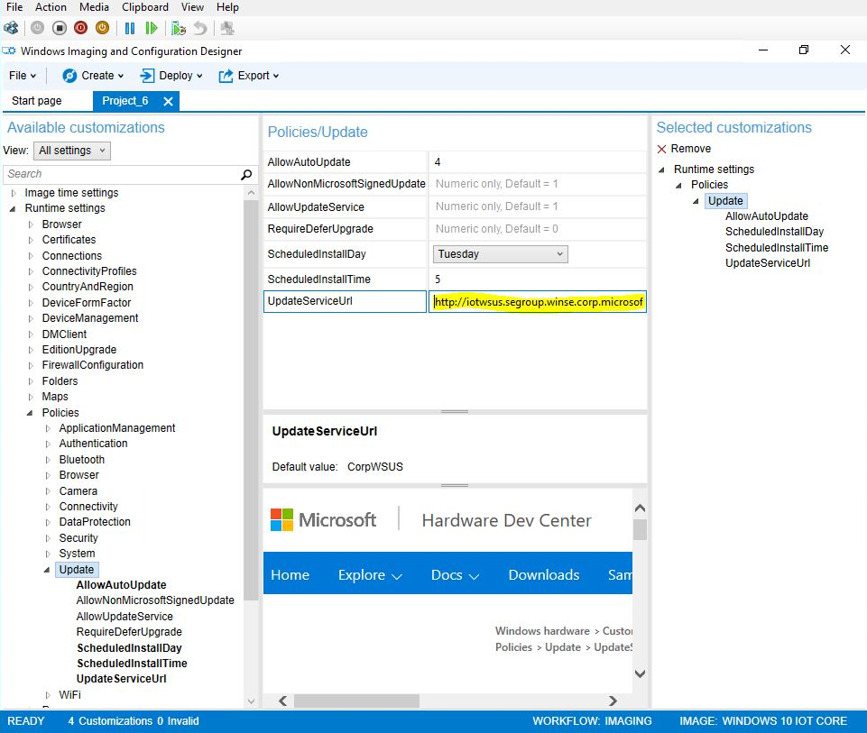
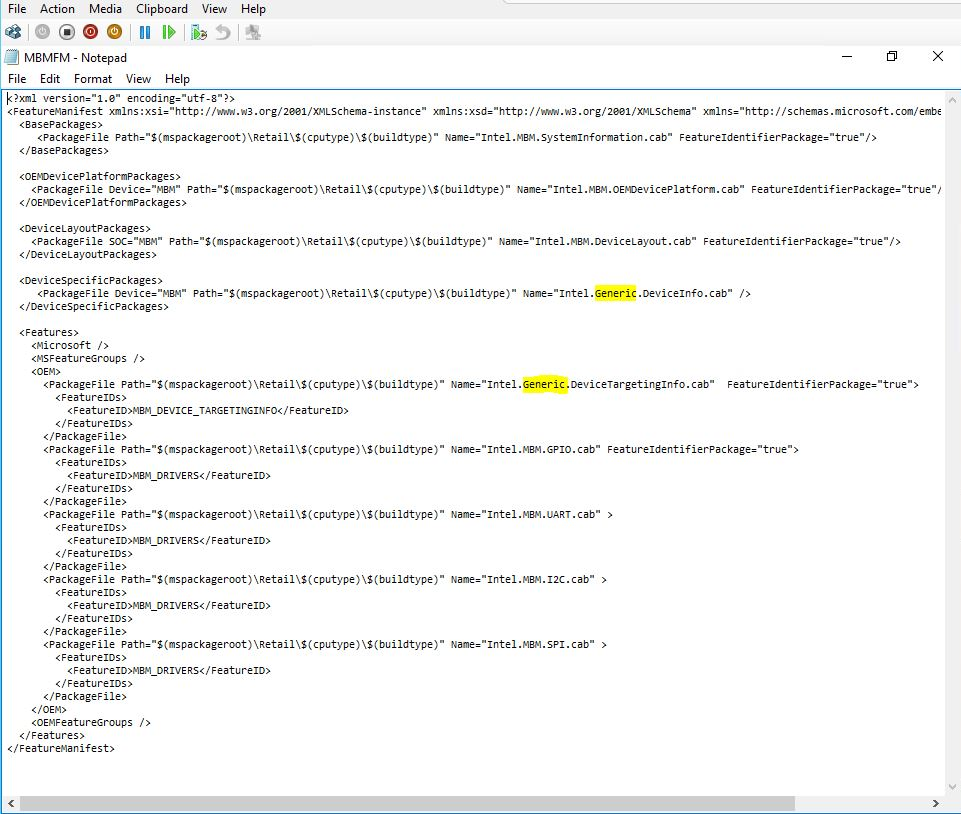

# 管理 IoT 核心设备更新

OEM 和企业客户使用 Windows 10 IoT 核心 Pro (IoT 核心 Pro) 可以利用设备管理配置服务提供程序 (Csp) 进行了一些控制设备更新过程。

**请注意** Windows 10 IoT 核心 （IoT 核心） 更新管理仅适用于 Windows 10 IoT 专业核心。 有关授权 Windows 10 IoT 核专业人员的详细信息，请参阅[Microsoft 商业条款的使用为 Windows 10 IoT 核心](http://go.microsoft.com/fwlink/?LinkID=614849)。

 

可以使用 Windows 图像处理和配置设计器 (ICD) 工具或移动设备管理 (MDM) 服务设置设备管理策略。 有关设备管理协议的更多详细信息，请参阅[移动设备管理](https://msdn.microsoft.com/windows/hardware/dn914769.aspx )。

## 若要打开或关闭更新的 AllowAutoUpdate

可以通过设置 AllowAutoUpdate 策略关闭 IoT 核心 Pro 的更新。

-   如果未配置的 AllowAutoUpdate 策略，设备将获得 IoT 核心更新照常在凌晨 3 点。
-   如果 AllowAutoUpdate 策略设置为**5**，IoT 核心的自动更新是否已关闭。

## AllowAutoUpdate 控制更新

AllowAutoUpdate 策略还可以控制 IoT 核心的计时的更新︰

如果 AllowAutoUpdate 策略设置为**4**，IoT 核心更新将自动安装并在指定的时间，设备将重新启动。 IT 管理员指定的安装日期/时间 （即每星期日凌晨 3 点）。 如果未不指定任何日期/时间，安装时将默认为每日凌晨 3 点。 更新所有最终用户相关的通知也被禁止。
查看在设定的时间` <LocURI>./Vendor/MSFT/PolicyManager/Device/Update/ScheduledInstallDay</LocURI>`或` <LocURI>./Vendor/MSFT/PolicyManager/Device/Update/ScheduledInstallTime</LocURI>`在**syncml**。

## 推迟更新

AllowAutoUpdate 策略还可以控制 IoT 核心的计时的更新︰

通过使用 Windows 服务器更新设备驱动程序列表），可以最多 120 天推迟 IoT 核心的非关键更新。 在此过程中，设备配置为使用 WSUS 服务器，而不是 Windows 更新的更新服务。 IT 管理员从 Microsoft 更新目录获取 IoT 核心更新并下载以后部署的更新。
**请注意** 当 WSUS 服务器配置 IoT 核心设备上时，将取消触发器来 ping 服务器的更新。

 

若要配置 WSUS IoT 核心映像︰

1.  在**Windows ICD 启动页**上，选择您想要修改 IoT 核心项目。
2.  在**可用的自定义项**，扩展到**运行时设置**，然后**策略**，并**更新**上。
3.  在**策略 / 更新**信息窗格中，将**UpdateServiceURL**改将使用 WSUS 服务器的地址。

在 WSUS 目录站点选择 IoT 核心更新︰

1.  在 WSUS 管理控制台中，选择**更新**，并在操作窗格中，单击**导入更新**。
2.  在 Microsoft 更新目录网站将会打开一个浏览器窗口。
3.  您可以通过设备、 OEM 和固件搜索 IoT 核心更新此网站。 当您找到所需的时则将它们添加到您的购物篮中。
4.  转到购物篮，单击**导入**以导入服务器的更新。 若要导入无直接下载这些更新，清除**导入直接到 Windows 服务器更新服务**复选框，将下载文件保存。

## 只有操作系统更新

可以设置 IoT 核心设备接收来自 Microsoft 和 OEM 的更新的操作系统更新︰

**对于 Windows 10、 版本 1607年**︰ 使用 IoT\_通用\_OemInput XML 中的 POP。 （您不能使用 Intel.Generic.DeviceInfo.cab，此文件已被删除）。

**对于 Windows 10、 版本 1511年**︰ 要配置设备以接收仅操作系统更新，您必须编辑 OEM 功能指令清单 XML 的设备。 在该设备上的下列目录位置找不到支持的设备的功能清单︰

-   **MinnowBoard 最大值︰**` C:\Program Files (x86)\Windows Kits\10\FMFiles\x86\MBMFM.xml`
-   **树莓 Pi 2:**` C:\Program Files (x86)\Windows Kits\10\FMFiles\arm\RPi2FM.xml`
-   **Qualcomm DragonBoard:**` C:\Program Files (x86)\Windows Kits\10\FMFiles\arm\QCDB410CFM.xml`

在**&lt;DeviceLayoutPackages&gt;**和**&lt;功能&gt;**部分，删除设备标识符并将替换为**泛型**。 例如， **Intel.MBM.DeviceInfo.cab**将成为**Intel.Generic.DeviceInfo.cab**。

 

 

