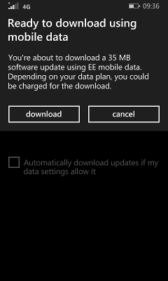

# 启用设备更新的 zero-rating （免费） 下载

移动操作员 (MOs) 可以启用设备来接收更新，而不被收取数据使用 Windows 更新服务器加到他们的零点税率的站点列表。

此方法仅允许为零点税率的 Windows 更新服务器中的更新。 其他网络通信，例如存储区更新或使用 Internet 连接共享 (ICS) 的设备的更新不是零点税率。

## 启用 zero-rating

添加到您的网络作为零点税率站点下面两个 Url:

-   http://wp.download.windowsupdate.com

-   http://wp.ds.download.windowsupdate.com

这些 Url 零点税率后，没有更多的动作如何才能获取零等级中的位置。 它将有效的 alldevices （运算符变体和公开市场的设备）。

## 测试 zero-rating

若要测试零评级，您将需要通过蜂窝是足够小，以保持您的密苏里州被定义的限制下触发更新 例如，密苏里州可能会限制 zero-rating 下载到 100 MB 或更少。

1.  从开始准备更新零售设备。

2.  卸下 SIM 卡 （如果有的话）。 检查它具有与之关联的当前期间多少数据使用情况。 请具体说明 MO 咨询。

3.  禁用所有 Wi-Fi 选项︰

    1.  在设置︰ **Wi-fi**:

        **关闭**更改**Wi-Fi 网络**。

        将**打开 Wi-fi 重新打开**更改为**手动**。

        点击 Wi-Fi 意义上讲，然后更改为**关闭**的**连接到 Wi-fi 热点**。

    2.  在**设置** &gt; **更新和恢复** &gt; **电话更新**，请清除**自动下载更新，如果我的数据设置允许**复选框。

4.  强制通过移动电话连接的更新︰

    1.  允许启动设备。

    2.  请关闭该设备，然后再插入 SIM 卡相关联的数据计划。

    3.  连接设备后，电源重新启动时，使用您的帐户登录。

    4.  搜索更新︰**设置** &gt; **更新和恢复** &gt; **电话更新**。 您应该能够强制进行更新，通过移动电话连接。

        请注意，您可能会看到一条警告，指出您可能需要付费下载︰

        

    5.  下载完成后，请检查以查看设备已收取该更新数据计划使用。

## 相关的主题

[更新](index.md)

 

 

