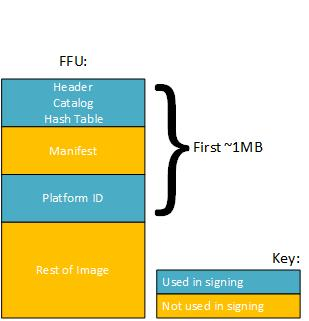

# <a name="ffu-catalog-signing"></a>FFU 编录签名


已创建了以简化工程设计和制造流程的工具调配到 PK （平台键） 存储在 UEFI Microsoft 证书。 这使 Microsoft 签名图像。 OEM 合作伙伴提供他们自己的证书启用 OEM 签名 FFU 的 PK 证书存储。

如果 OEM 将自己 UEFI 工具提供签名到 PK 存储根/中间，OEM 还可以签名 FFUs。 但是，这不建议，因为它引入了复杂程度和安全风险为您和 Microsoft 部分因为构建和维护 （uefi） 的工具和代码签名的证书的维护和基础结构非常复杂。 特别是小型或新 oem 泄漏的私钥将允许任意实体进行签名可以加载到 QRD OEM 设备上的 FFUs 和仍然需要与 Microsoft 通讯所有其他签署的。

因此，为了降低复杂性并简化 FFU 编录签名过程，接收客户端已更新具有新功能，以支持零售签名的 FFU 目录。

## <a name="span-idoemverificationspanspan-idoemverificationspanspan-idoemverificationspanoem-verification"></a><span id="OEM_Verification"></span><span id="oem_verification"></span><span id="OEM_VERIFICATION"></span>OEM 验证


为 OEM 签名 FFU 目录。 一个是 OEM B 设备有效 FFU 编录因为中间证书 Microsoft 规定到 PK 存储区是一个中间证书。 这被称为沟通匮乏的风险。 因此，若要防止创建某个 oem 从 flash 能拖到另一个 OEM 设备有意或无意地图像，用来签署 FFU 编录中接收客户端的最新版本的机制将处理不同于用于签署其它包的机制。 在通过检查中提交的 FFU 目录关联的元数据签名过程中将进行 OEM 验证。 包含在目录中的 OEM ID 将验证提交的 OEM ID。 如果值不匹配，FFU 编录签名请求将被拒绝。 此外，接收客户端会验证通过检查哈希值的目录的完整性传入 FFU 目录元数据。 下图描述了 FFU 目录和将用于此验证关联的元数据︰



例如，完成初始测试新的映像后，必须零售设备上测试图像。 创建 FFU 图像闪烁，且 FFU 目录必须由 Microsoft 签名的图像可以刷新为零售设备之前的零售。 使用接收客户端的`Initialize-FirmwareSubmission`使用的 cmdlet `-TypeOfSubmission FfuCatalog`，指定 FFU 图像的位置。 接收客户端将从 FFU 图像提取 FFU 目录和相关的元数据，并传递到 Microsoft 零售签署程序。 代码签名验证 FFU 目录的完整性，并检查依据的 OEM ID 提交通过签名请求的帐户目录的 OEM ID。 只要 FFU OEM ID 匹配的目录的签名请求 Microsoft 帐户的 OEM ID 将处理和签名 FFU 目录。 完成后，您可以使用`Get-SignedFirmwareSubmission`cmdlet 以获取零售重新回到 FFU 图像集成签名的编录，以便它可以刷新到设备以供测试前签名 FFU 目录。

## <a name="span-idffucatalogsigningexamplespanspan-idffucatalogsigningexamplespanspan-idffucatalogsigningexamplespanffu-catalog-signing-example"></a><span id="FFU_Catalog_Signing_Example"></span><span id="ffu_catalog_signing_example"></span><span id="FFU_CATALOG_SIGNING_EXAMPLE"></span>FFU 编录签名示例


准备要签名 FFU 目录︰

``` syntax
PS> Initialize-FirmwareSubmission -TypeOfProduct WindowsPhoneBlue -TypeOfSubmission FfuCatalog -UpdateHistoryPath c:\input\UpdateHistory.xml -OemInputPath c:\input -OutputFilePath c:\output -FfuPath c:\input\flash.ffu
```

 

 


