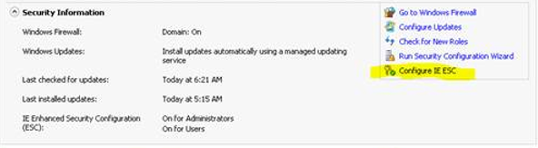
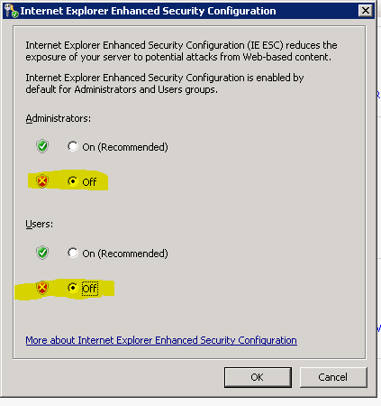

# <a name="ingestion-client-for-windows-phone"></a>接收客户端的 Windows Phone


接收客户端是一套用于与服务，以检索和提交代码签名并与 Microsoft 更新请求通信的[Windows PowerShell](http://go.microsoft.com/fwlink/p/?LinkId=389794) cmdlet。

-   [初始化 FirmwareSubmission cmdlet](initialize-firmwaresubmission-cmdlet.md)

-   [新 FirmwareSubmission cmdlet](new-firmwaresubmission-cmdlet.md)

-   [获得 SignedFirmwareSubmission cmdlet](get-signedfirmwaresubmission-cmdlet.md)

-   [新 RequestForUpdate cmdlet](new-requestforupdate-cmdlet.md)

-   [新 RequestForMicrosoftUpdate cmdlet](new-requestformicrosoftupdate-cmdlet.md)

-   [获得 RequestForUpdate cmdlet](get-requestforupdate-cmdlet.md)

-   [请求 UpdateCancellation cmdlet](request-updatecancellation.md)

若要使用接收客户端，将详细阐述的以下任务进一步本主题中，必须完成。

1.  按照发送 OEM x.509 证书和管理公共和私有密钥相关联的每个证书使用本主题中后面的[注册零售包签名和更新](#provision-certs)部分中的说明进行操作。

2.  请按照本主题后面的[安装必备软件](#install-pre)一节中的说明安装系统必备的软件，用于接收客户端。

3.  请按照[安装接收客户端](#install)在接收客户端的安装和配置接收客户端本主题后面部分中的说明进行操作，使用上一步中的提供的证书。

## <a name="span-idprovisioncertsspanspan-idprovisioncertsspansign-up-for-retail-package-signing-and-update-submissions"></a><span id="provision_certs"></span><span id="PROVISION_CERTS"></span>零售的包进行签名和更新提交注册


本节介绍有关零售包签名和更新注册时必须执行的步骤。 此过程完成后，您将能够提交软件包和更新到 Microsoft 零售签署的。 有关零售和测试的代码签名的一般信息，请参见[代码签名](https://msdn.microsoft.com/library/windows/hardware/dn756634)。

为确保 Oem 和 Microsoft 之间的通信安全，接收客户端进行身份验证使用 X.509 证书。 作为注册过程的一部分，OEM 必须将有效的 X.509 证书公用密钥发送给 Microsoft，接收客户端才能使用。 这使 Microsoft 能够识别的客户端，用户和授权相应访问其数据。 私钥是由 OEM 保留，用于访问更新服务器。

要注册包和更新签名，提交一个请求通过电子邮件发送到<WPSignOB@Microsoft.com>与主题标题的"服务请求的\[您的 OEM 公司名称\]"。 这封电子邮件必须包含以下附件︰

1.  您可以从[此处](http://go.microsoft.com/fwlink/p/?LinkId=394161)下载 OEM 服务形式。 分步指南，请参见[代码签名和更新服务的演练](http://cmsresources.windowsphone.com/devcenter/oem/downloads/Onboarding-for-Code-Signing-and-Updates.pptx)。

2.  一个或多个代码签名的身份验证证书。 为每个证书，包括︰

    1.  作为附加密钥的公共部分。CER 文件。

    2.  证书提供申请表。 窗体包含有关证书要求的详细信息和有关如何填写表单的信息。 您可以下载资源调配请求窗体从[此处](http://go.microsoft.com/fwlink/p/?LinkId=394159)的证书。

通常要花费大约一个工作日完成这些请求。 在 onboarded 后，您将收到一封电子邮件，其中将包括有关如何下载签名工具和文档，说明如何提交更新请求，以及其他额外的信息。

**X.509 证书准则**

-   OEM 拥有证书，并对其安全负责。 证书的专用密钥表示 OEM 的标识。 OEM 必须对其使用业界最佳做法进行管理并保护起来，作为重要的和机密的资产。 OEM 可以提供多个证书，但他们鼓励他们保持证书数目较小。 这将确保 OEM 将不承受频繁的基于时间的吊销策略的证书，并将减少操作开销。 通常情况下，OEM 地理站点将有一个或两个证书。

-   默认情况下，同一证书除非有专门的 OEM 否则要求用于生产和生产前环境配置。

-   OEM 必须通知 Microsoft 证书已被吊销，过期，或任何其他原因需要 Microsoft 来取消激活该证书。

## <a name="span-idinstallprespanspan-idinstallprespaninstall-the-prerequisite-software"></a><span id="install_pre"></span><span id="INSTALL_PRE"></span>安装必备软件


接收客户端需要 Windows 标识基础和 Windows PowerShell 3.0。

为客户端配置一台计算机的推荐的步骤如下所示︰

1.  安装 Windows Server 2012 R2、 Windows 8.1 或另一种受支持的操作系统。

2.  应用所有使用 Windows 更新的修补程序。

3.  如有必要，将计算机添加到 active directory 域中。

4.  计算机加入该域后，重新检查 Windows 更新并应用所有修补程序。

5.  Windows Server 版本，完成两个附加步骤︰

    1.  通过单击**配置 IE ESC**配置 Internet Explorer 增强的安全性。

        

    2.  在 Internet Explorer 增强的安全配置对话框中，选择**关闭**为管理员和用户**关闭**设置。

        

6.  安装 Windows 标识基础 (WIF)。 在 Windows 8 中 WIF 是一项操作系统功能可用。 通过使用"Windows 中的功能打开或关闭"控制面板、 程序和功能，可以安装它。 对于 Windows Server 2008 R2，请下载并安装<http://go.microsoft.com/fwlink/p/?LinkId=389793>WIF。

7.  安装 Windows PowerShell 3.0 (Windows 管理框架 3.0)。 在 Windows 8，PowerShell 是一项操作系统功能可用。 通过在控制面板、 程序和功能中**打开或关闭 Windows 功能**，可以安装它。 对于 Windows Server 2008 R2，从下载和安装 Windows PowerShell [http://go.microsoft.com/fwlink/p/?linkid=240290](http://go.microsoft.com/fwlink/p/?LinkID=240290)。

8.  使用 Windows 更新应用的所有修补程序。

9.  安装这些先决条件之后，接下来的步骤是提供 X.509 证书，安装接收客户端使用此文档中的说明。

## <a name="span-idinstallspanspan-idinstallspaninstall-the-ingestion-client"></a><span id="install"></span><span id="INSTALL"></span>接收客户端安装


**请注意**  
接收客户端的 64 位版本 12/9/2013 年不再受支持。 如果安装 64 位版本，则必须卸载，则必须安装 32 位版本。

 

接收客户端可以安装在以下操作系统上︰

-   Windows Server 2012 R2

-   Windows 8.1

-   Windows Server 2012

-   Windows 8

-   Windows Server 2008 R2

-   Windows 7

接收客户端必须通过从提升的命令提示符处执行**msiexec**安装。 本文档后面将介绍特定的值，将使用有关的信息。

可以通过编辑该 XML 配置文件创建在安装期间，%programfiles(x86)%以后更改这些值\\Microsoft\\WP 接收客户端\\模块\\Microsoft.Phone.PartnerServices.Client\\Microsoft.Phone.PartnerServices.Client.dll.config。

默认情况下，安装将提供一个用户界面。 若要防止用户界面显示，使用 /qn、 安静的选项。 **Msiexec**有关详细信息，请参阅[Msiexec](http://go.microsoft.com/fwlink/p/?LinkId=389794)。

**安装语法**

要安装客户端的命令需要以下参数︰

-   *BASEURI*: Microsoft 合作伙伴服务的 URI。

-   *命名空间*︰ 访问 Microsoft 合作伙伴服务的控制。

-   *MYCLIENTCERTIFICATEPATH*︰ 包含私钥的证书文件的完全限定的路径。

-   *PFXPASSWORD*: MYCLIENTCERTIFICATEPATH 参数中指定的证书文件的密码。

按以下格式指定参数︰

``` syntax
msiexec /I WPIngestionClient.msi 
    BASEURI="[Microsoft service environment URL]"
    NAMESPACE="[Microsoft access control identifier]" 
    MYCLIENTCERTIFICATEPATH="[Path of OEM PFX file]"
    PFXPASSWORD="[Password of PFX file]"
    /l*v install.log
```

获得有效的 X.509 证书后运行以下安装程序︰

-   生产 （零售映像签名）︰ 安装客户端提交或检索请求到 Microsoft 生产环境︰

    ``` syntax
    msiexec /I WPIngestionClient.msi 
        BASEURI="http://wp8partnerservicesv1.cloudapp.net:7159"
        NAMESPACE="wp8partnerservicesv1" 
        MYCLIENTCERTIFICATEPATH="C:\Certificates\OemSecretCertificateWithPrivateKey.pfx"
        PFXPASSWORD="Password-Of-OemSecretCertificateWithPrivateKey.pfx"
        /l*v install.log
    ```

在此示例中，"c:\\证书\\OemSecretCertificateWithPrivateKey.pfx"用作占位符表示由 OEM 创建有效的 X.509 证书的位置。

**请注意**  
-   证书的私钥文件并指定要安装的参数用于配置本地计算机的证书存储区中的 X.509 证书的密码。 密码并不存储在其他地方并不交换与 Microsoft。

 

除了安装接收客户端，安装命令创建文件夹 %programdata%\\Microsoft\\WP 接收客户端\\。 此文件夹包含子文件夹备份和日志。 备份子文件夹用于存储用于卸载客户端配置。 日志子文件夹用于存储客户端 cmdlet 诊断日志信息。

## <a name="span-idtroubleshootingspanspan-idtroubleshootingspantroubleshooting-the-ingestion-client"></a><span id="troubleshooting"></span><span id="TROUBLESHOOTING"></span>接收客户端故障排除


**例外情况**

`Microsoft.Phone.PartnerServices.Exceptions.UnknownErrorException.`时出错。 具有客户端身份验证方案匿名禁止 HTTP 请求...

如果"Microsoft.Phone.PartnerServices.Exceptions.UnknownErrorException"异常引发时使用的 cmdlet，问题很可能会引起由 OEM 的网络内的 HTTP 代理服务器设置。 在 HTTP 代理服务器配置的最大邮件大小限制太小，无法上载提交的程序包，或用于上载程序包的端口被阻止。 请尝试更正 OEM 的网络内的 HTTP 代理服务器设置，然后重试。

**详细选项**

这些 cmdlet 支持通过 PowerShell 常见**详细**参数处理的命令的其他信息。

默认情况下不会显示详细消息，但可以通过在任何命令指定公共参数更改。 当启用时，该 cmdlet 将文本写入 Windows PowerShell 的详细流。

请考虑检索现有的签名的固件提交的一个典型的例子。 这是此类 cmdlet 的简洁输出︰

``` syntax
PS> Get-SignedFirmwareSubmission –TicketId TKT-SIGN-TEST-BTUADL -DownloadDirectory C:\temp | Format-List

TicketId : TKT-SIGN-TEST-BTUADL
File     : c:\temp\OemTest.TKT-SIGN-TEST-BTUADL.zip
```

指定**详细**参数时，将显示与该服务进行交互的附加信息︰

``` syntax
PS> Get-SignedFirmwareSubmission –Verbose –TicketId TKT-SIGN-TEST-BTUADL -DownloadDirectory C:\temp | Format-List

VERBOSE: Parameter assignment: 'TicketId' = TKT-SIGN-TEST-BTUADL.
VERBOSE: Downloading OemTest.TKT-SIGN-TEST-BTUADL.zip in 4194304 byte chunks.
 File is 17341441 bytes long.
VERBOSE: Start reading chunk 0, 0 - 4194303 bytes.
VERBOSE: Start reading chunk 1, 4194304 - 8388607 bytes.
VERBOSE: Start reading chunk 2, 8388608 - 12582911 bytes.
VERBOSE: Start reading chunk 3, 12582912 - 16777215 bytes.
VERBOSE: Start reading chunk 4, 16777216 - 17341440 bytes.
VERBOSE: Writing block number 0 of size 4194304.
VERBOSE: Writing block number 1 of size 4194304.
VERBOSE: Writing block number 2 of size 4194304.
VERBOSE: Writing block number 3 of size 4194304.
VERBOSE: Writing block number 4 of size 564225.
VERBOSE: File successfully downloaded to OemTest.TKT-SIGN-TEST-BTUADL.

TicketId : TKT-SIGN-TEST-BTUADL
File     : c:\temp\OemTest.TKT-SIGN-TEST-BTUADL.zip
```

**诊断日志**

诊断输出从接收客户机的默认位置是:"c:\\ProgramData\\Microsoft\\WP 接收客户端\\日志"

**升级到 Microsoft 的问题**

若要将问题汇报给 Microsoft，可通过提交的 bug 使用 bug 系统您提供访问发送以下信息。

-   试图进行的方案的说明

-   屏幕抓图

-   日志文件

-   配置文件︰ Microsoft.Phone.PartnerServices.Client\\Microsoft.Phone.PartnerServices.Client.dll.config

-   票证 ID

-   关联的值。 这可从[Get SignedFirmwareSubmission cmdlet](get-signedfirmwaresubmission-cmdlet.md)。

 

 