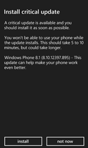
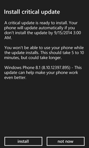
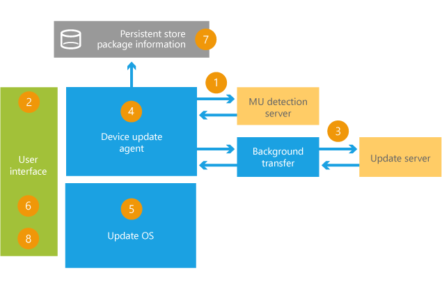

# 扫描、 下载并安装更新

设备可以自动检查更新、 下载它们，并提示用户进行安装适合于他们一次。 它们还可以标识已非常重要，将传递的更新。

## 强烈建议，普通和必需的更新

有些用户不希望被打扰的更新。 如果他们不知道它们是否重要，它们可能会无限期推迟。

若要帮助确定重要更新，请将它们标记为强烈建议的更新 (SSU) 或必需的更新，通过打开 Team Foundation Server (TFS) 更新请求，然后将此标记在笔记中。

我们将对此进行设置的 Windows 更新服务器上。

## 检测更新

默认情况下，设备定期检查更新。 此进程在后台发生，并不会中断的设备使用。

自动扫描时发生以下计划︰

-   每 6.2 天当蜂窝连接。 该操作将触发最早一天到 Wi-fi 连接是否可用。

-   该设备时交流电源和用户没有频繁使用该设备的每一天。

-   重新启动设备时，每次扫描开始 60 分钟后启动完毕。

自动扫描使用 Wi-Fi 或蜂窝连接︰

1.  对于第一次扫描中，设备扫描 Wi-fi 或蜂窝连接可用时。

2.  成功更新后第一次扫描，为设备扫描 Wi-fi 或蜂窝连接可用时。

3.  如果上一次扫描不到 6.2 天之后的时间，电话将只扫描 Wi-fi 连接是否可用。

4.  如果自上一次扫描为 6.2 天或如果 Wi-fi 或蜂窝连接电话将扫描更多，时间是可用的。

5.  更新完成后，设备将重新启动并执行即时扫描更新。

用户可以启用或禁用自动扫描的**电话更新**菜单︰**适用于手机的更新时通知我**。 默认情况下，此设置是不可见的并将检查的默认设置。 Oem 可以更改该设置是否可见，并更改其默认设置。 用户可以使用电话的更新菜单手动检查更新并跟踪更新的进度。

## 下载更新

默认情况下，如果该设备是 Wi-Fi 连接时，将自动下载更新。 如果选中自动下载，不是或蜂窝连接该设备时，设备可能会提示用户下载更新︰

-   为移动电话连接，如果设备检查以查看更新的大小是否小于更新大小限制。 默认大小是 100 MB，密苏里州通过可配置

-   如果该设备是在限制之下，会下载更新使用他们的移动电话连接的选项会提示他们。

    如果用户选择要通过其手机连接下载更新，用户可能会收取根据其数据计划的数据与他们密苏里州 密苏里州可以配置更新是免费提供给用户。 若要了解详细信息，请参阅[启用以进行设备更新的 zero-rating （免费） 下载](enable-zero-rating--no-charge--downloads-for-device-updates.md)。

如果他们推迟下载时，会提示他们以后︰

-   **正常更新**︰ 提示每 27 小时。

-   **强烈建议更新**︰ 提示每 27 小时 3 重试次数。 在此之后，它会提示每 4 小时一次。

-   **必需的更新**︰ 提示每 4 小时一次。

是否有不可恢复的错误 （例如没有足够空间） 下载过程，使重试更新。 关键错误，更新阶段会返回更新的扫描，并再次启动。

用户可以启用或禁用自动**更新电话**菜单中的下载︰**自动下载更新，如果我的数据设置允许它**。 将检查默认设置。 Oem 不能更改默认值。

更新程序成功下载该更新后，设备将对它进行验证并安装阶段它。

## 同时处理多个更新

如果需要完全重新启动 (硬 stop) 设备的任何上述更新，它处理的那些更新第一次。

如果有多个更新挂起，和如果任何这些更新都强烈建议的更新，并如果没有这些更新要求重新启动，它将它们全部作为一个大的更新，使用户可以一次全部接受它们。

## 安装更新程序

1.  下载此更新并将其转移后，设备会检查以查看是否安装了更新的好时机。 对于非 SD 卡更新，电池必须收取 30%以上。 SD 更新电池必须充电 60%以上。
2.  接下来，它会询问用户是否安装更新的好时机。 以下是他们将看到︰

    <table>
    <colgroup>
    <col width="33%" />
    <col width="33%" />
    <col width="33%" />
    </colgroup>
    <tbody>
    <tr class="odd">
    <td align="left">
普通的更新
</td>
    <td align="left">
强烈建议的更新
</td>
    <td align="left">
必需的更新
</td>
    </tr>
    <tr class="even">
    <td align="left">
提交更新时，您可以编写通知。 对于小的更新，我们建议一个简单、 鼓励说明，像这样︰

    
<strong>&quot;此更新可以帮助您更好的设备。&quot;</strong>
</td>
    <td align="left"></td>
    <td align="left"></td>
    </tr>
    </tbody>
    </table>

     

    如果在安装过程中没有错误，更新阶段会返回来检查更新并重新启动。

3.  当用户决定要安装的更新时，设备将重新启动到更新操作系统，并完成安装过程。

4.  安装期间，旋转齿轮显示以指示进度更新操作系统。

5.  清单文件包含有关安装的 OS 信息，将更新以反映更新包的内容。 这样便于其使用设备重置。 有关重置的设备的详细信息，请参阅[更新和重置电话](updates-and-resetting-the-phone.md)。

6.  更新操作系统将重新启动到主要的操作系统后，迁移用户的数据，会显示一个进度栏。 数据迁移完成后，将显示指示是否更新成功或失败的通知。

## 故障排除

-   如果临时更新时发生错误，该设备不会计划安装。

-   如果更新未成功错误发生在操作系统更新 （用户看到旋转齿轮），过程，设备将不会显示"更新完成"消息。 该设备回主操作系统可以正常启动，启动进程，开始检查有更新。

-   如果计划安装，它可以跳过安装，并重新安排第二天在以下情况下︰

    -   用户正在使用该设备的首选的安装时间前 5 分钟。

    -   没有中首选的安装时操作的传入或传出调用。

    -   用户没有收到通知，更新程序已准备好安装。 我们试着提前 8 小时发送此提醒并保持重试直到首选安装时间之前的 1 小时。 用户只能看到一次的通知。 如果设备处于关闭状态，它们可能无法看到该通知。

## 相关的主题

[提交更新](submit-an-update.md)

[批准更新](approve-an-update.md)

 

 

