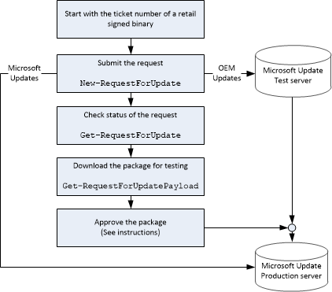

# <a name="submit-an-update"></a>提交更新


更新是通过查找最新的固件和固件更新，之间的区别和更新包创建包含这些不同之处。 这些差异是计算、 创建以及微软更新服务器上托管。

从发布的 Windows 10 开始，Oem 可以不再仅操作系统更新零售设备使用提交[新建 RequestForMicrosoftUpdate cmdlet](new-requestformicrosoftupdate-cmdlet.md)。 将由 Microsoft Windows Update 上提供零售设备仅操作系统更新。

Oem 可以继续提交试用版和 PartnerSelfHost 预览环境仅操作系统更新。

## <a name="span-idsubmitanoemupdatespanspan-idsubmitanoemupdatespanspan-idsubmitanoemupdatespansubmit-an-oem-update"></a><span id="Submit_an_OEM_update"></span><span id="submit_an_oem_update"></span><span id="SUBMIT_AN_OEM_UPDATE"></span>提交的 OEM 更新


1.  从上次更新此程序包中获取源固件提交票证 ID。

2.  获取目标固件提交票证 ID︰ 更新的二进制文件在包中，并[提交签名的二进制文件是零售](https://msdn.microsoft.com/library/windows/hardware/dn789223)以接收新的票证 id。

3.  这两个在旧的和新票证 Id，提交更新请求使用[New RequestForUpdate cmdlet](new-requestforupdate-cmdlet.md):

    ``` syntax
    New-RequestForUpdate 
       -FirmwareSubmissionTicketId TKT-SIGN-PROD-ABCD56 
       -RequestForUpdateType RetailServicing 
       -SourceFirmwareSubmissionTicketId TKT-SIGN-PROD-XYZ123 
       -OemDeviceName P4301
       -MOId 000-22
    ```

    此命令的输出可以请求更新 (RFU) 标识。

4.  RFU ID 用于检查使用[Get RequestForUpdate cmdlet](get-requestforupdate-cmdlet.md)的状态︰

    ``` syntax
    Get-RequestForUpdate
       -RequestForUpdateTicketId TKT-RFU-PROD-ABCD56-1
    ```

    如果确定一切正常，我们将批准该请求，并将其发送到 Microsoft 预览测试服务器。

5.  您和您的移动运营商合作伙伴可以通过网络来测试更新。

6.  您和您的移动运营商合作，[批准的更新](approve-an-update.md)。

7.  我们会发布在 Microsoft 更新生产服务器上，该设备可以在其中[扫描、 下载并安装更新](scan--download--and-install-updates.md)的更新。

下图显示了此过程︰



**请注意** 您不能更改 OS 更新之间的 OEMInput.xml 文件中的可选功能。 如果更改某个功能，则此更新将被拒绝发布系统。

 

## <a name="span-idsubmitmicrosoftupdatesspanspan-idsubmitmicrosoftupdatesspanspan-idsubmitmicrosoftupdatesspansubmit-microsoft-updates"></a><span id="Submit_Microsoft_updates"></span><span id="submit_microsoft_updates"></span><span id="SUBMIT_MICROSOFT_UPDATES"></span>将 Microsoft 更新提交


1.  使用[New RequestForMicrosoftUpdate cmdlet](new-requestformicrosoftupdate-cmdlet.md)，使用旧的和新的版本号，更新 （RetailServicing 或试用版），以及 OEM 设备名称和移动操作员 ID 的类型︰

    与票证 Id 的现有固件和最新的固件，提交使用[New RequestForUpdate cmdlet](new-requestforupdate-cmdlet.md)的更新请求。

    ``` syntax
    New-RequestForMicrosoftUpdate
       -SourceOSVersion 8.10.12349.825
       -TargetOSVersion 8.10.12359.845
       -RequestForUpdateType Trial
       -OemDeviceName P4301
       -MOId 000-22
    ```

2.  更新发布到 Microsoft 的生产更新服务器，该设备可以在其中[扫描、 下载并安装更新](scan--download--and-install-updates.md)。

 

 

