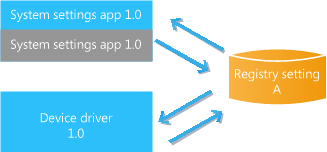
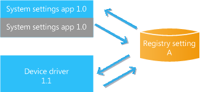
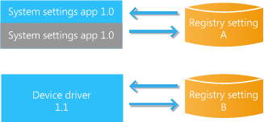
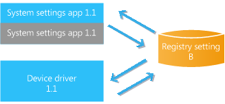

# 系统设置应用程序和更新

预加载的系统设置应用程序允许 Oem 可以公开他们添加到设备以使其区别于其他设备的硬件组件的自定义设置。

设置应用程序的更新被分别传递从操作系统更新，并且必须由用户启动。 因此，必须设计设置应用程序来管理向后兼容性等问题。 此外，用户可以启动备份和还原序列或重置该设备，或者其中可能更改设置应用程序的当前版本。 必须开发一种战略来测试并解决了所有可能的方案。

**重要**  
由于复杂的同步设置应用程序和设备驱动程序、 注册表设置更改为这些应用程序应避免。 请仔细检查以免注册表更改，以及准备更新时必须解决的重要方案的战略本主题中的指南。

示例方案侧重于设置存储在注册表中;如果应用程序使用其他如独立存储的存储机制，类似的分析是必需的。

 

以下各节概述了一些管理系统设置应用程序在更新，备份过程中的重要注意事项和恢复操作，并将重置︰

-   [管理设置应用程序的更新](#managing)

-   [设置应用程序 OTA 更新](#ota)

-   [更新方案](#update)

-   [使用注册表更改的更新方案](#registry)

-   [备份和还原方案](#backup)

-   [重置方案](#reset)

-   [概述了预的设置的应用程序方案](#summary)

## 管理设置应用程序的更新

设置应用程序使用的存储区传递机制的更新。 若要确保设置应用程序是最新的版本号码可以保留在设备上，并且可以调用的外部 web 服务进行检查以查看是否已安装最新版本。 如果需要更新，则可以提示用户启动设置应用程序的更新。 其他同等有效的方法是可行的。

设置应用程序，以允许客户支持，以确定哪一个版本是在使用中可显示的版本号。 或者，当用户运行应用商店应用程序时，未完成的更新显示;这些更新包括设置应用程序的可用更新。 存储更新总是升级到最新版本的应用程序从任何以前的版本。

## 设置应用程序 OTA 更新

若要允许的预加载应用程序中，如果重置设备安装最新版本，可以预加载应用程序准备无线 (OTA) 软件包更新。 此 OTA 更新不会更新设备; 上的当前有效版本它只是更新如果重置设备，则使用存储的版本。 这意味着可以在设备上设置的应用程序的两个不同的版本

在下面的插图中，与用户进行交互的活动版本会在上面的框中为蓝色，描述，以灰色显示存储在该设备的版本。 例如，如果设备附带更新尚未设置应用程序的预加载的版本 1.0 的 OTA，和从存储区的用户下载设置应用程序的版本 1.1，阐释了，如下所示的存储和活动版本。

## 更新方案

Oem 准备更新，它们必须确定可能的使用方案和测试那些创建所需的更新和应用程序的用户体验。 设置应用程序更新方案汇总如下。 所有方案着手 1.0 版本的设置应用程序和版本 1.0 的设备驱动程序都使用注册表设置 a。下图总结了这些方案的开始状态。

### 驱动程序更新

1.  该设备附带设置应用程序 1.0 和关联驱动程序代码 1.0。

2.  无线更新不包含更新的 1.1 应用程序，因此 1.0 设置应用程序存储并处于活动状态的设备上。

3.  无线更新时，更新的驱动程序代码为 1.1。

如果在更新中提供的 1.1 设备驱动程序代码中没有重大注册表更改，用户可以继续成功运行设置应用程序的 1.0 版本。

下图总结了该方案的最终状态。

## 使用注册表更改的更新方案

由于复杂的同步设置应用程序和设备驱动程序、 注册表设置的更改应避免。 若要避免需要更新现有的注册表数据，您的代码无法更新读取现有的注册表数据并将其迁移到一个新的子项，以便保留任何现有的用户设置。 或者，如添加版本编号检查时设置应用程序启动 （以确定使用哪个注册表值） 的方法可能比较适当。

如果更新正准备为使用此设备可能会更改注册表值 — — 例如，通过更改菜单中的设置的用户 — — 必须使用置备 XML (provxml)。 有关详细信息，请参阅[使用配置文件来更新注册表设置，可能会发生变化](using-provisioning-files-to-update-registry-settings-that-may-change.md)。

如果正在准备更新解决的更改的注册表设置，Oem 必须标识可能的使用方案和测试那些创建所需的更新和应用程序的用户体验。 一种战略应开发，以满足任何需要协调对设置应用程序、 操作系统和设备驱动程序的版本更新。

使用 OEM 设备驱动程序和设置应用程序的注册表设置更改发生时，下面的更新方案显示意想不到的情况。 最初设置应用程序和设备驱动程序使用相同的注册表设置，如下所示。

### 与注册表更改的驱动程序更新

1.  该设备配有设置 1.0 和关联的应用程序驱动程序代码 1.0，它读取注册表设置 a。

2.  无线更新时，更新驱动程序代码为 1.1，现在使用新注册表设置 b。

3.  1.0 设置应用程序在设备上，使用较旧的注册表设置 a。

当用户所做更改使用 1.0 设置应用程序，但 1.1 版驱动程序代码使用注册表设置 B 时，设置应用程序不会如愿。 例如，用户可能不实际更改的任何设置应用程序中进行更改。

下图总结了该方案的最终状态。

用户可以确定他们需要下载设置应用程序的较新版本。 如果用户下载此更新的版本 1.1，设置应用程序将正常工作。

## 备份和还原方案

预加载应用程序则不会还原从云;相反，预加载应用程序将重新安装在设备上使用的存储的版本。 如果应用程序已设置的存储的版本更新 OTA，恢复电话时将安装更新的版本。 如果用户重置设备和还原，并且尚未更新存储的版本，用户还需要检查有更新的预的设置应用程序的存储区中。

这种现象是不同于未预先加载到设备的存储应用程序。 当备份设备时，安装的应用程序的列表存储为备份的一部分。 还原后设备，被安装最新版本的应用程序，使用手机备份时创建的应用程序列表。 有关此功能的详细信息，请参阅[备份您的资料](http://go.microsoft.com/fwlink/p/?LinkId=331631)。

发送更新，用户启动设置应用程序后，应用程序可以检查 web 服务器并查看设置应用程序的更新的版本可用。 下载此更新，可以提示用户。 如果用户在设备上运行的存储应用程序，设置应用程序挂起更新显示存在。 后一段时间，用户可以下载设置应用程序 1.1 版，并成功地使用它。

### 备份和还原后更新

1.  该设备附带于 1.0 的设置应用程序和设备驱动程序代码 1.0。

2.  无线更新时，更新的驱动程序代码为 1.1。

3.  用户下载和使用较新的 1.1 设置应用程序。

4.  用户备份使用备份功能的设备。

5.  用户使用还原功能恢复较早版本的操作系统。 在还原期间，重新安装预加载应用程序，并设置应用程序的 1.0 版本处于活动状态的设备上。

如前所述，如果没有更新和设置应用程序间的依赖项，用户可以成功运行设置应用程序的较早版本 1.0 直到他们下载更新的版本。

下图总结了该方案的最终状态。

### 备份和还原注册表的更改更新后

1.  该设备配有设置 1.0 和关联的应用程序驱动程序代码 1.0，它读取注册表设置 a。

2.  用户备份使用备份功能的设备。

3.  无线更新时，更新驱动程序代码为 1.1，现在使用新注册表设置 b。

4.  在用户下载新的设置应用程序中，并成功使用的新注册表设置 b。

5.  用户使用还原功能恢复较早版本的操作系统。 在还原期间，将重新安装预加载应用程序并设置应用程序的 1.0 版本处于活动状态的设备上

当用户使用 1.0 设置应用程序的更改，系统设置将无法按预期工作。

下图总结了该方案的最终状态。

用户可以确定他们需要设置应用程序的较新版本的更新。 如果用户下载版本 1.1 的设置应用程序，应用程序将读取的新注册表设置 B，并且将正常工作。

## 重置方案

其他方案存在 — — 例如，当设备重置客户使用**设置** &gt; **系统** &gt; **有关** &gt; **重置您的电话**。 用户可以重置该设备，例如，其服务时，或者当传输设备的所有权。 设置应用程序时将重置该设备，将返回到设备; 上应用程序包文件中存储的版本这可能是设备提供的版本。 在重置后还有活动设备上设备接收任何操作系统更新。 这意味着原始设置应用程序可能需要采用与较新版本的操作系统和任何关联的设备驱动程序的较新版本运行。 这些依赖关系和相互作用应看作是对应用程序设置的更新和设备驱动程序正在做好准备。 操作系统重置行为有关的详细信息，请参阅[重置设备](../../manufacture/mobile/resetting-a-phone-during-manufacturing.md)。

### 在更新后重置

1.  该设备附带设置应用程序 1.0 和关联的设备驱动程序代码 1.0。

2.  无线更新时，更新的驱动程序代码为 1.1。

3.  在用户下载新的 1.1 设置应用程序。

4.  无线更新不包含更新的 1.1 应用程序，因此 1.0 设置应用程序在设备上。

5.  用户可将设备重置。

6.  在重置后保持更新的设备驱动程序代码和 1.1 版本的设备驱动程序代码处于活动状态的设备上。

7.  设置应用程序不更新的一部分，因为它不自动更新在基本映像中重置期间。

如在前面的方案中，如果没有依赖项之间更新和设置应用程序中，用户可以运行设置应用程序的较早版本 1.0 直到他们下载更新。

下图总结了该方案的最终状态。

### 更新注册表的更改之后重置

1.  该设备配有设置 1.0 和关联的应用程序驱动程序代码 1.0，它读取注册表设置 a。

2.  无线更新时，更新驱动程序代码为 1.1，现在使用新注册表设置 b。

3.  在用户下载新的设置应用程序中，并成功使用的新注册表设置 b。

4.  用户可将设备重置。

5.  在重置后保持更新的设备驱动程序代码和 1.1 版本的设备驱动程序代码处于活动状态的设备上

6.  设置应用程序不更新的一部分，因为它不会自动更新在基本映像中重置期间，和 1.0 版是在设备上。

与前一种情况下，当用户使用 1.0 设置应用程序，更改系统设置不会如愿。

下图总结了该方案的最终状态。

用户可以确定他们需要下载设置应用程序的较新版本。 如果用户下载此更新的版本 1.1，设置应用程序将正常工作。

### 在用注册表更改的更新和预加载应用程序更新后重置

在最终方案中，重置设备使用**设置**客户&gt;**系统** &gt; **有关** &gt; **重置您的电话**。

1.  该设备配有设置 1.0 和关联的应用程序驱动程序代码 1.0，它读取注册表设置 a。

2.  无线更新时，更新驱动程序代码为 1.1，现在使用新注册表设置 b。

3.  空中的更新还包括 1.1 设置应用程序预加载程序包的更新。 此更新提供了重置设备和安装的初始预加载应用程序时才会使用新应用程序软件包。 此时在方案中，用户具有不重置该设备，以便设置应用程序的版本 1.0 中使用。

4.  在用户下载新的设置应用程序中，并成功使用的新注册表设置 b。

5.  用户重置设备

6.  在重置后保持更新的设备驱动程序代码和 1.1 版本的设备驱动程序代码处于活动状态的设备上。 此外，由于预加载的设置应用程序 1.1 版更新已送达 OTA，它将被安装时重置设备。

在这种情况下，将使用注册表设置 B 1.1 设置应用程序和设备驱动程序 1.1 和该应用程序才能正常工作。

下图总结了该方案的最终状态。

## 概述了预的设置的应用程序方案

下表总结了预加载应用程序方案。

<table>
<colgroup>
<col width="25%" />
<col width="25%" />
<col width="25%" />
<col width="25%" />
</colgroup>
<thead>
<tr class="header">
<th align="left">OTA 更新</th>
<th align="left">用户启动存储更新</th>
<th align="left">备份和恢复</th>
<th align="left">Reset</th>
</tr>
</thead>
<tbody>
<tr class="odd">
<td align="left">
更新预的设置的应用程序无法创建 oem;当前已安装的应用程序不更新，只存储的一个。
</td>
<td align="left">
活动的应用程序进行更新;存储的应用程序保持不变。
</td>
<td align="left">
重新安装在手机上存储的应用程序。 如果尚未更新存储的版本，用户将需要从存储库中下载更新的版本。
</td>
<td align="left">
重新安装存储的设备上的应用程序。 如果尚未更新存储的版本，用户将需要从存储库中下载更新的版本。
</td>
</tr>
</tbody>
</table>

 

这些示例方案演示，并且在不会捕获所有可能的客户使用方案或更新版本的可能的组合。 Oem 必须确定可能的使用方案和测试那些准备更新时。

应制定一个战略来协调设置应用程序和设备驱动程序的版本时应用更新，以避免不良的用户体验。

## 相关的主题

[使用配置文件来更新可能会更改注册表设置](using-provisioning-files-to-update-registry-settings-that-may-change.md)

 

 

