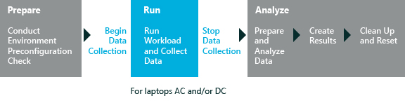

# 评估服务

评估是.xml 和促使一组特定的状态在计算机、 测量和记录活动，并保留记录的结果的二进制文件的组合。 结果提供指标，有时也用于解决评估发现的问题的建议。 评估服务可帮助您评估硬件或软件已添加到计算机。

评估和评估 Windows 控制台可作为 Windows 评估和部署工具包 (Windows ADK) 中可用的 Windows 评估 Toolkit 的一部分。 安装 Windows 评估 Toolkit 之后，您可以使用 Windows 评估控制台创建和运行一个作业，包括一个或多个评估。 您也可以打包作业来运行它们的计算机中没有安装 Windows 评估 Toolkit。

当您安装 Windows 评估服务和 Windows 评估服务的客户端 (Windows ASC) 评估也是可用的。

此关系图显示了一种评估服务的常规工作流程︰

## 在这一节

<table>
<colgroup>
<col width="50%" />
<col width="50%" />
</colgroup>
<tbody>
<tr class="odd">
<td>
[连接的备用能源效率](connected-standby-energy-efficiency.md)
</td>
<td>
在连接待机状态时，此评估测量的软件和设备系统的电池寿命的影响。 评估还能测量转换传入和传出连接待机状态所花费的时间。
</td>
</tr>
<tr class="even">
<td>
[驱动程序验证](driver-verification.md)
</td>
<td>
此评估验证脱机 Windows 映像或运行的 Windows 操作系统包含正确的驱动程序集。
</td>
</tr>
<tr class="odd">
<td>
[边缘安全软件影响](edge-security-software-impact.md)
</td>
<td>
此评估衡量 Microsoft 边缘通常受到反恶意软件的各个的方面。 评估测量启动的影响，并浏览 Microsoft 边缘的时间。
</td>
</tr>
<tr class="even">
<td>
[文件处理](file-handling.md)
</td>
<td>
此评估模拟文件操作，如复制、 移动、 压缩、 解压缩，并将删除的文件。 它还能测量持续时间和吞吐量，从而帮助您评估计算机的性能。
</td>
</tr>
<tr class="odd">
<td>
[Internet Explorer 启动性能](internet-explorer-startup-performance.md)
</td>
<td>
此评估测量的时间来完全呈现在 Internet Explorer 中的空白页。 此测量包括 IExplore.exe 进程和框架创建和选项卡创建间隔的加载时间。 它还能测量的影响的所有扩展外, 接程序和安装在系统的工具栏。 它不能测量的任何网络或浏览性能。
</td>
</tr>
<tr class="even">
<td>
[Internet Explorer 安全软件影响](internet-explorer-security-software-impact.md)
</td>
<td>
此评估测量方面的 Internet Explorer 通常受到反恶意软件和其他浏览器加载项。
</td>
</tr>
<tr class="odd">
<td>
[本地视频播放](local-video-playback.md)
</td>
<td>
此评估全屏显示本地视频播放期间测量的计算机电池的使用率。
</td>
</tr>
<tr class="even">
<td>
[媒体转换代码性能](media-transcoding-performance.md)
</td>
<td>
此评估衡量的编码转换的持续时间和相对速度更改为其他文件格式或比特率的视频文件。
</td>
</tr>
<tr class="odd">
<td>
[内存占用量](memory-footprint.md)
</td>
<td>
这一评估在系统启动的一系列过程创建内存使用的快照。 然后可以帮助您识别方法可以提高性能和效率，通过优化内存使用情况。 此外可以使用此评估进行比较对照原始设备制造商 (OEM) 图像的基准操作系统映像。
</td>
</tr>
<tr class="even">
<td>
[微筛选器诊断程序](minifilter-diagnostics.md)
</td>
<td>
描述可用于几种评估微筛选器诊断设置。 可以使用微筛选器诊断设置测量计算机微筛选器操作中花费的时间和识别效率不高，微筛选器驱动程序，使用太多的内存，或者无法正常工作。
</td>
</tr>
<tr class="odd">
<td>
[开/关切换性能](onoff-transition-performance.md)
</td>
<td>
介绍了系统要求、 评估设置、 结果和启动性能 （快速启动、 休眠的性能和待机性能评估相关联的问题。 这些评估测量中各种计算机状态的转换。
</td>
</tr>
<tr class="even">
<td>
[全新安装体验](out-of-box-experience.md)
</td>
<td>
此评估衡量关键方面首次启动体验 (OOBE) 通常图像自定义项和应用于 Windows 零售映像软件加载项受影响的持续的时间。 评估措施第一次登录，以及如智能安装和配置应用程序安装的特定方面的持续的时间。
</td>
</tr>
<tr class="odd">
<td>
[流式媒体性能](streaming-media-performance.md)
</td>
<td>
此评估流媒体在 Internet Explorer 中的使用范围从低分辨率到高分辨率的视频内容。 然后计算根据检测到的故障数的视频播放质量。
</td>
</tr>
<tr class="even">
<td>
[Windows Media Player 性能和质量](windows-media-player-performance-and-quality.md)
</td>
<td>
此评估计算的性能和质量的 Windows Media® 播放器播放，并采用一套多媒体的电池寿命评估。
</td>
</tr>
<tr class="odd">
<td>
[Windows 应用商店应用程序性能](windows-store-app-performance.md)
</td>
<td>
此评估服务可以帮助您优化您的应用程序更好的客户体验。
</td>
</tr>
<tr class="even">
<td>
[深入分析常见问题](common-in-depth-analysis-issues.md)
</td>
<td>
介绍了常见的深入分析问题，您可以在 Windows 评估控制台查看和进一步分析在 Windows® 性能分析器 (WPA)。
</td>
</tr>
<tr class="odd">
<td>
[故障诊断评估](troubleshooting-assessments-wac.md)
</td>
<td>
介绍了常见的问题，导致评估出现故障。
</td>
</tr>
</tbody>
</table>

 

 

 

