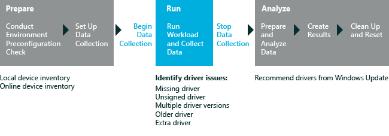

# 驱动程序验证

驱动程序验证评估验证脱机 Windows 映像或运行的 Windows 操作系统包含正确的驱动程序集。 结果包括一些建议以帮助您解决任何评估发现的问题。 这些问题可能包括丢失、 重复、 旧的或不必要的驱动程序。 结果和问题有关的详细信息，请参阅[驱动程序验证评估的结果](results-for-the-driver-verification-assessment.md)。

驱动程序验证评估可用于︰

-   不使用设备管理器中找到设备和驱动程序问题。

-   查找丢失的设备驱动程序中任何一种 Windows 映像或运行的操作系统。

-   将映像部署到一台计算机之前，请查找驱动程序问题。

-   查找与任何硬件设备没有关联的软件驱动程序。

下图说明了评估过程。

本主题︰

-   [系统要求](#beforebegin)

-   [设置](#settings)

## 系统要求

Windows 8.1 中的第一次运行帮助提示可以对评估结果产生负面影响。 若要禁用这些，从提升的命令提示符下，运行下面的命令并重新启动计算机︰`reg.exe add "HKLM\Software\Policies\Microsoft\Windows\EdgeUI" /v DisableHelpSticker /t REG_DWORD /d "1" /f`

您可以在以下操作系统上运行此评估︰

-   Windows 8

-   Windows 10

支持的体系结构包括基于 x86 和基于 x64 的基于 ARM 的系统。

有两种方法以在 Windows RT 运行此评估︰

-   打包在控制台窗口中评估的评估作业并运行在 Windows 直角 有关此选项的其他信息，请参阅[打包作业和运行它在另一台计算机上](package-a-job-and-run-it-on-another-computer.md)。

-   使用 Windows 评估服务在 Windows 的直角上运行评估 有关详细信息，请参阅[Windows 评估服务](windows-assessment-services-technical-reference.md)。

## Settings

默认情况下，此评估使用推荐的设置。 Microsoft 将定义这些设置，以便跨多个计算机配置或一段时间，在同一台计算机上，您可以比较结果。 当您查看结果时，请运行的信息包括指示评估是否使用推荐的设置的元数据。

如果您想要收集数据的不同评估捕获内容，默认情况下，还可以自定义这些设置。 例如，可以确定特定的数据，可帮助您执行计算机的某个特定方面进行详细的分析。

下表描述评估建议的设置，设置值，并对每个设置的替代值。

<table>
<colgroup>
<col width="50%" />
<col width="50%" />
</colgroup>
<thead>
<tr class="header">
<th>设置</th>
<th>说明</th>
</tr>
</thead>
<tbody>
<tr class="odd">
<td>
使用建议的设置
</td>
<td>
指定评估是否使用推荐的设置。 默认情况下，选中此复选框。 若要更改此评估服务的设置，必须首先清除此复选框。
</td>
</tr>
<tr class="even">
<td>
设备输入的路径
</td>
<td>
指定包含计算机上所有设备的库存的 Device.xml 文件的路径。 默认情况下未提供路径，从评估正在其运行的计算机中收集设备信息。 如果提供 Device.xml 文件的路径，将使用该文件中的设备信息。
</td>
</tr>
<tr class="odd">
<td>
无提示控制台
</td>
<td>
指定是否以无提示方式 （没有用户界面的控制台） 运行该作业。 这是默认行为。
</td>
</tr>
<tr class="even">
<td>
写 Devices.xml
</td>
<td>
指定是否应生成 Devices.xml 文件，其中包含计算机上所有设备的清单。 默认情况下清除此复选框，则不会生成该文件。 如果选中此复选框，Devices.xml 文件保存到本地计算机评估结果文件夹中，以便以后使用。
</td>
</tr>
<tr class="odd">
<td>
写 Driver.xml
</td>
<td>
指定是否生成的 Drivers.xml 文件中列出的计算机上找到的驱动程序，或不。 默认情况下清除此复选框，则并不生成的文件。 如果选中此复选框时，Drivers.xml 文件保存到本地计算机以供以后使用的评估结果文件夹中。
</td>
</tr>
<tr class="even">
<td>
已装载的映像的路径
</td>
<td>
如果您想要运行评估针对脱机 Windows 映像，请指定到安装的 Windows 映像的完整路径。 默认情况下，此框为空，评估计算上运行的操作系统的驱动程序。
</td>
</tr>
</tbody>
</table>

 

## 相关的主题

[驱动程序验证评估结果](results-for-the-driver-verification-assessment.md)

[Windows 评估 Toolkit](windows-assessment-toolkit-technical-reference.md)

[评估服务](assessments.md)

 

 

