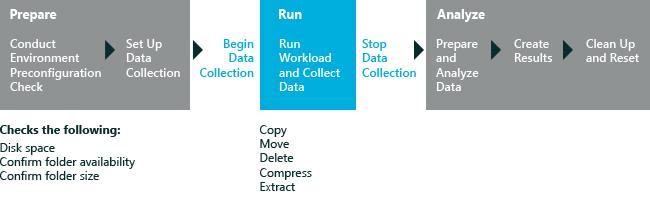

# 文件处理

文件处理评估提供了自动化的方式行使公共文件操作和捕获的指标。 此评估测量同时复制、 移动、 压缩、 解压缩，并删除文件和文件夹在您的计算机上的持续时间和吞吐量。 结果可帮助您了解计算机在这些操作期间执行的程度。 有关结果的详细信息，请参阅[文件处理评估的结果](results-for-the-file-handling-assessment.md)。

**警告**  
文件处理评估仅支持英语 （美国） 版本的 Windows 上。 在非英语 （美国） 版本的 Windows 上运行此评估可能会提示您使用错误和评估可能停止运行。

 

下图说明了评估过程。

本主题︰

-   [系统要求](#sysrqmnts)

-   [工作负载](#bkmk-fileworkloads)

-   [设置](#assesssettings)

## 系统要求

Windows 8.1 中的第一次运行帮助提示可以对评估结果产生负面影响。 若要禁用这些，从提升的命令提示符下，运行下面的命令并重新启动计算机︰`reg.exe add "HKLM\Software\Policies\Microsoft\Windows\EdgeUI" /v DisableHelpSticker /t REG_DWORD /d "1" /f`

仅在桌面处于全屏模式时，请运行此评估。 如果您有另一个 Windows 应用商店应用程序打开的并行与桌面，则不要运行此评估。

当运行 Windows 8.1 此评估，确保评估预期的电池寿命时，**收集分析跟踪**设置处于未选中状态。 当选中时，此选项会产生不正确的估计。

仅当您需要调查其他与能源有关的问题的其他信息，请启用分析跟踪集合。

您可以在以下操作系统上运行此评估︰

-   Windows 8

-   Windows 10

支持的体系结构包括基于 x86 和基于 x64 的基于 ARM 的系统。 评估不支持在虚拟机上使用。

用下面的方法之一，您可以在 Windows RT 运行此评估︰

-   打包在控制台窗口中评估的评估作业并运行在 Windows 直角 有关详细信息，请参阅[打包作业和运行它在另一台计算机上](package-a-job-and-run-it-on-another-computer.md)。

-   使用 Windows 评估服务在 Windows 的直角上运行评估 有关详细信息，请参阅[Windows 评估服务](windows-assessment-services-technical-reference.md)。

## 工作负载

工作负荷是一组预定义的、 可重复的方式模拟用户活动的自动化任务。 此评估测量持续时间和吞吐量，为下面的工作负载，并捕获结果文件中的指标。

-   **编程工作负荷。** 这些工作负荷使用 API 来执行文件的功能。 这些工作负荷测量仅基础文件功能。 文件操作包括**copypg**、 **movepg**和**deletepg**。

-   **编写脚本的工作负载。** 这些工作负荷模拟文件资源管理器中运行 Windows 8 的计算机上的用户活动。 文件操作包括**copyuxxs**、 **deleteuxs**、 **moveuxs**和**zipuxs**。 如果您运行 Windows 7 的计算机上运行评估，不能使用脚本的工作负载。

选择工作负荷有关的详细信息，请参阅[设置](#assesssettings)。

**请注意**  
您还可以用作文件处理评估能源效率作业中的工作负荷。 能源效率作业有关的详细信息，请参阅[创建和运行一个能源效率作业](create-and-run-an-energy-efficiency-job.md)。

 

## 设置

默认情况下，此评估使用推荐的设置。 Microsoft 将定义这些设置，以便跨多个计算机配置或一段时间，在同一台计算机上，您可以比较结果。 当您查看结果时，请运行的信息包括指示评估是否使用推荐的设置的元数据。

如果您想要收集数据的不同评估捕获内容，默认情况下，还可以自定义这些设置。 但是，如果您更改默认的源或目标文件夹，或提供自己的文件，比较可能不再相关。

**请注意**  
运行评估之后，在回收站中的所有文件可能会被永久都删除。 因此，运行评估之前，检查回收站中的任何文件，它们会因为可用或可还原后得出的评估结论。

 

下表描述评估建议的设置，值和每个设置的替代值。

<table>
<colgroup>
<col width="50%" />
<col width="50%" />
</colgroup>
<thead>
<tr class="header">
<th>设置</th>
<th>说明</th>
</tr>
</thead>
<tbody>
<tr class="odd">
<td>
使用建议的设置
</td>
<td>
指定评估是否使用推荐的设置。 默认情况下，选中此复选框。 若要更改此评估服务的设置，必须首先清除此复选框。
</td>
</tr>
<tr class="even">
<td>
迭代
</td>
<td>
指定评估运行的次数。 默认情况下，值为 1。 若要运行多次的评估以及平均结果，请增加此值。
</td>
</tr>
<tr class="odd">
<td>
源
</td>
<td>
指定评估复制工作负荷文件或文件夹的位置。 若要指定非默认位置，请在框中的源文件夹输入的路径。 评估可用于多台计算机、 外部设备和网络位置的源文件夹。

工作负载可以将配置为在单独的源文件夹中执行文件的函数，也可以指定源和目标文件夹。
</td>
</tr>
<tr class="even">
<td>
目标
</td>
<td>
指定评估复制工作负荷文件或文件夹的位置。 必须向目标文件夹具有写访问权限。 要指定非默认位置，请输入框中的目标文件夹的路径。 提供其他目标文件夹时，如果目标文件夹必须为空，开始评估之前。

工作负载可以将配置为在单独的源文件夹中执行文件的函数，也可以指定源和目标文件夹。 支持外部设备和网络位置。
</td>
</tr>
<tr class="odd">
<td>
启用重启
</td>
<td>
指定将每个文件操作前重新启动计算机。 默认情况下未启用

用于计时的每个操作之前确保清洁系统。 这是特别有用的测试防病毒软件的行为。
</td>
</tr>
<tr class="even">
<td>
执行延迟
</td>
<td>
指定执行文件操作之前在重启后的等待秒数时间。 仅当使用"启用重新启动"参数时可用。 默认值为 300 秒。

此参数允许您控制的机器来运行特定文件的操作为该迭代前停留的时间量。
</td>
</tr>
<tr class="odd">
<td>
工作负荷
</td>
<td>
指定要运行的工作负载。 提供了编程和脚本的工作负载。 默认情况下，运行仅编程工作量。

有关每个工作负载执行的文件功能的详细信息，请参阅[工作负载](#bkmk-fileworkloads)。
</td>
</tr>
<tr class="even">
<td>
导入数据的位置
</td>
<td>
指定您想要在评估过程中使用的文件的位置。 指定导入位置后，评估将文件中<strong>导入数据的位置</strong>复制到源文件夹。 在评估过程中，源内容被复制到目标文件夹。 出于此原因，评估启动时必须是空的源和目标文件夹。
</td>
</tr>
<tr class="odd">
<td>
启用诊断模式的微筛选器
</td>
<td>
指定是否要使用微筛选器诊断选项。 默认情况下，此复选框被清除。 当微筛选器诊断模式已启用时，它会测量数据，帮助您评估对文件处理微筛选器的影响。 有关此设置的详细信息，请参阅[微筛选器诊断程序](minifilter-diagnostics.md)。

<strong>请注意</strong>  

仅在 Windows 8 中支持微筛选器诊断选项。

 

</td>
</tr>
</tbody>
</table>

 

## 相关的主题

[文件处理评估的结果](results-for-the-file-handling-assessment.md)

[Windows 评估 Toolkit 技术参考](windows-assessment-toolkit-technical-reference.md)

[评估服务](assessments.md)

[连接备用能源效率](connected-standby-energy-efficiency.md)

[微筛选器诊断程序](minifilter-diagnostics.md)

 

 

