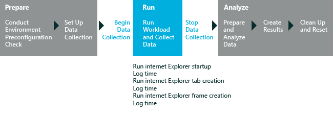

# Internet Explorer 启动性能

Internet Explorer 启动性能评估可帮助识别可能会影响启动 Internet Explorer 的时间的组件。 评估测量完全呈现新的 Internet Explorer 窗口在桌面上，具有一个选项卡和简单内容的时间。 此测量包括 IExplore.exe 进程和框架创建和选项卡创建间隔的加载时间。 评估还能测量扩展的加载和初始化启动过程的性能。 它不能测量网络或浏览性能。 有关结果和这一评估所产生的问题的详细信息，请参阅[Internet Explorer 启动性能评估服务的结果](results-for-the-internet-explorer-startup-performance-assessment.md)。

评估执行此工作流︰

1.  创建自定义的本地页通知您评估正在运行，并且指示您不与计算机的交互

2.  准备跟踪和度量集合

3.  启动 Internet Explorer，开始收集度量标准

**请注意**  
评估启动 Internet Explorer 4 倍。 第一次是培训迭代下, 一步 3 是定时迭代。 训练迭代可以确保定时迭代加载系统缓存和不冷启动。 产生的结果是聚合来自定时迭代的结果。 您可以更改在评估设置定时迭代次数。

 

下图说明了评估过程。

本主题︰

-   [系统要求](#sysrqrmts)

-   [设置](#assesssettings)

## 系统要求

Windows 8.1 中的第一次运行帮助提示可以对评估结果产生负面影响。 若要禁用这些，从提升的命令提示符下，运行下面的命令并重新启动计算机︰`reg.exe add "HKLM\Software\Policies\Microsoft\Windows\EdgeUI" /v DisableHelpSticker /t REG_DWORD /d "1" /f`

仅在桌面处于全屏模式时，请运行此评估。 如果您有另一个 Windows 应用商店应用程序打开的并行与桌面，则不要运行此评估。

您可以在以下操作系统上运行此评估︰

-   Windows 8

-   Windows 10

支持的体系结构包括基于 x86 和基于 x64 的基于 ARM 的系统。

有两种方法以在 Windows RT 运行此评估︰

-   打包在控制台窗口中评估的评估作业并运行在 Windows 直角 有关详细信息，请参阅[打包作业和运行它在另一台计算机上](package-a-job-and-run-it-on-another-computer.md)。

-   使用 Windows 评估服务在 Windows 的直角上运行评估 有关详细信息，请参阅[Windows 评估服务](windows-assessment-services-technical-reference.md)。

## 设置

默认情况下，此评估使用推荐的设置。 Microsoft 将定义这些设置，以便跨多个计算机配置或一段时间，在同一台计算机上，您可以比较结果。 当您查看结果时，请运行的信息包括指示评估是否使用推荐的设置的元数据。

如果您想要收集数据的不同评估捕获内容，默认情况下，还可以自定义这些设置。 例如，可以确定特定的数据，可帮助您执行计算机的某个特定方面进行详细的分析。

下表描述评估建议的设置，值和每个设置的替代值。

<table>
<colgroup>
<col width="50%" />
<col width="50%" />
</colgroup>
<thead>
<tr class="header">
<th>设置</th>
<th>说明</th>
</tr>
</thead>
<tbody>
<tr class="odd">
<td>
使用建议的设置
</td>
<td>
指定评估是否使用推荐的设置。 默认情况下，选中此复选框。 若要更改此评估服务的设置，必须首先清除此复选框。
</td>
</tr>
<tr class="even">
<td>
迭代
</td>
<td>
指定评估启动 Internet Explorer 的次数。 默认情况下，值为 4。 第一次总是训练迭代，并下一个 3 是定时迭代。 训练迭代可以确保定时迭代加载系统缓存和不冷启动。 产生的结果是聚合来自定时迭代的结果。
</td>
</tr>
<tr class="odd">
<td>
使用备用 WPR 配置文件
</td>
<td>
指定要使用的 Windows® 性能记录器 (WPR) 配置文件的替代方法。 评估使用 WPR 工具来创建跟踪。 您可以使用默认配置文件提供，或指定一个不同的配置文件的路径。

若要指定其他配置文件，选择<strong>使用备用 WPR 配置文件</strong>复选框，，然后在<strong>备用配置文件路径</strong>框中键入路径。 您可以使用 Windows 性能分析器 (WPA) 工具查看或分析跟踪文件。
</td>
</tr>
<tr class="even">
<td>
备用配置文件 (.wprp) 路径
</td>
<td>
指定可选的 Windows 性能记录器 (WPR) 配置文件的路径。 只有在选中<strong>使用备用 WPR 配置文件</strong>复选框，则启用此设置。
</td>
</tr>
<tr class="odd">
<td>
启用诊断模式的微筛选器
</td>
<td>
指定是否要使用微筛选器诊断选项。 默认情况下，此复选框被清除。 当微筛选器诊断模式已启用时，它会测量数据，帮助您评估对 Internet Explorer 启动微筛选器的影响。 有关此设置的详细信息，请参阅[微筛选器诊断程序](minifilter-diagnostics.md)。
</td>
</tr>
</tbody>
</table>

 

## 相关的主题

[Internet Explorer 启动性能评估的结果](results-for-the-internet-explorer-startup-performance-assessment.md)

[评估服务](assessments.md)

 

 

