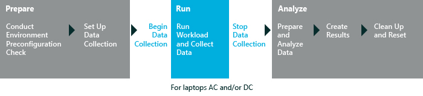

# 媒体转换代码性能

媒体转码性能评估测量改为其他文件格式或比特率视频文件的过程。 此评估将运行一系列常见的输入和输出文件的格式和分辨率编码转换操作。 有关的评估结果和可能发现问题的详细信息，请参阅[媒体转码性能评估的结果](results-for-the-media-transcoding-performance-assessment.md)

下图说明了评估过程。

本主题︰

-   [系统要求](#bkmk-sysreq)

-   [设置](#assesssettings)

## 系统要求

Windows 8.1 中的第一次运行帮助提示可以对评估结果产生负面影响。 若要禁用这些，从提升的命令提示符下，运行下面的命令并重新启动计算机︰`reg.exe add "HKLM\Software\Policies\Microsoft\Windows\EdgeUI" /v DisableHelpSticker /t REG_DWORD /d "1" /f`

仅在桌面处于全屏模式时，请运行此评估。 如果您有另一个 Windows 应用商店应用程序打开的并行与桌面，则不要运行此评估。

您可以在以下操作系统上运行此评估︰

-   Windows 8

-   Windows 10

支持的体系结构包括基于 x86 和基于 x64 的基于 ARM 的系统。

有两种方法以在 Windows RT 运行此评估︰

-   打包在 Windows 评估控制台中，该评估作业并运行在 Windows 直角 有关详细信息，请参阅[打包作业和运行它在另一台计算机上](package-a-job-and-run-it-on-another-computer.md)。

-   使用 Windows 评估服务在 Windows 的直角上运行评估 有关详细信息，请参阅[Windows 评估服务](windows-assessment-services-technical-reference.md)。

## 设置

默认情况下，此评估使用推荐的设置。 Microsoft 将定义这些设置，以便跨多个计算机配置或一段时间，在同一台计算机上，您可以比较结果。 当您查看结果时，请运行的信息包括指示评估是否使用推荐的设置的元数据。

下表描述评估建议的设置，值和每个设置的替代值。

<table>
<colgroup>
<col width="50%" />
<col width="50%" />
</colgroup>
<thead>
<tr class="header">
<th>设置</th>
<th>说明</th>
</tr>
</thead>
<tbody>
<tr class="odd">
<td>
内容的路径
</td>
<td>
指定的编码转换的媒体文件的源目录。 默认情况下，该文件夹是<code>..\content based assessments\Content\Streaming Media Assessment</code>。 您可以使用不同的媒体文件或指定一个不同的本地或网络文件夹。
</td>
</tr>
<tr class="even">
<td>
测试传递类型
</td>
<td>
指定评估电源选项。 从下拉列表中选择下列选项之一。 默认情况下，便携式计算机的电源选项是<strong>在交流和直流测试</strong>。

<ul>
<li>
<strong>在交流和直流测试</strong>
</li>
<li>
<strong>仅使用交流电测试</strong>
</li>
<li>
<strong>仅适用于测试在 DC 上</strong>
</li>
</ul></td>
</tr>
</tbody>
</table>

 

## 相关的主题

[媒体转码性能评估的结果](results-for-the-media-transcoding-performance-assessment.md)

[Windows 评估 Toolkit](windows-assessment-toolkit-technical-reference.md)

[评估服务](assessments.md)

 

 

