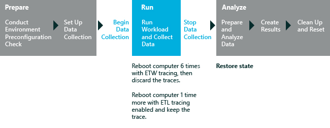

# 内存占用量

内存占用量评估可用于定量比较基线操作系统映像与另一个操作系统映像。 然后，您可以确定影响物理系统的内存需求量的特定组件。 这些组件可以包括驱动程序、 外接程序的应用程序、 预加载的软件包和防病毒程序。

通过使用内存占用量评估，可以将不同的硬件配置及相关的软件对系统内存的效果进行比较。 比较两个系统映像中的后通过并行检查内容，您可以决定要更改驱动程序，或以其他方式您的系统的内存需求量。

**请注意**  
这一评估在评估启动系统和外观的 Windows 10 中的桌面或开始屏幕窗口 10 企业中的紧随其后的一系列过程创建内存使用的快照。 它不在普通的计算机操作过程中计算内存的使用。 此评估将产生有关结果的详细信息，请参阅[内存占用量评估的结果](results-for-the-memory-footprint-assessment.md)。

 

下图显示的评估过程。 如图所示，评估将需要多个系统重新引导后生成所有的评估结果。

本主题︰

-   [开始之前](#beforebegin)

-   [设置](#assesssettings)

## 开始之前

此评估包括作为定期评估过程的一部分重新启动系统。 若要将计算机配置为运行评估作业，自动而手动重新启动或系统提示，请参阅[自动重新启动前运行评估](automate-reboots-before-you-run-an-assessment.md)。

### 系统要求

您可以在以下操作系统上运行此评估︰

-   Windows 8

-   Windows 10

支持的体系结构包括基于 x86 和基于 x64 的基于 ARM 的系统。

有两种方法以在 Windows RT 运行此评估︰

-   打包在控制台窗口中评估的评估作业并运行在 Windows 直角 有关此选项的详细信息，请参阅。 [打包作业和运行它在另一台计算机上](package-a-job-and-run-it-on-another-computer.md)。

-   使用 Windows 评估服务在 Windows 的直角上运行评估 有关详细信息，请参阅[Windows 评估服务](windows-assessment-services-technical-reference.md)。

## 设置

Microsoft 定义建议的设置，以便跨多个计算机配置或一段时间，在同一台计算机上，您可以比较结果。 当您查看结果时，请运行的信息包括指示评估是否使用推荐的设置的元数据。

如果您想要收集不同于默认的数据的数据，还可以自定义评估时，这些设置。 例如，可以确定特定数据可帮助您执行计算机的某个特定方面进行详细的分析。

下表描述评估建议的设置，设置值，并对每个设置的替代值。

<table>
<colgroup>
<col width="50%" />
<col width="50%" />
</colgroup>
<thead>
<tr class="header">
<th>设置</th>
<th>说明</th>
</tr>
</thead>
<tbody>
<tr class="odd">
<td>
使用建议的设置
</td>
<td>
指定评估是否使用推荐的设置。 默认情况下，选中此复选框。 若要更改此评估服务的设置，必须首先清除此复选框。
</td>
</tr>
<tr class="even">
<td>
配置
</td>
<td>
指定选项，您可以选择要配置的内存测试评估执行的类型。 这些选项如下所示︰

<ul>
<li>
<strong>完整的运行。</strong> 此选项提供了更精确的结果，但需要更长时间才能完成。 此选项使用六个预备计算机重新引导时跟第七个测量引导以确保内存使用情况的最精确的测量。
</li>
<li>
<strong>快速运行。</strong> 此选项不包括系统完全运行的准备步骤。 因此，缩短了作业运行所需的时间。 它提供的信息是没有那么全面，但仍十分有用。
</li>
</ul></td>
</tr>
<tr class="odd">
<td>
符号路径
</td>
<td>
对于 Windows 显示 Microsoft 公共符号服务器的路径。 评估使用的符号，以确保其结果显示驱动程序分配而不是内核分配驱动程序内存。 不使用符号时，评估分析可能会错误地识别内存分配源。 这可以掩饰问题和隐藏的驱动程序的问题。 关于符号服务器的详细信息，请参阅[如何︰ 使用符号服务器](http://go.microsoft.com/fwlink/?LinkId=242234)。

<strong>请注意</strong>  

如果您无法连接到符号服务器，您可以执行以下步骤，以确保评估准确性的一个︰

<ul>
<li>
将符号下载并将其复制到您想要评估的计算机。 此选项要求您提供到本地符号路径。
</li>
<li>
在一台计算机上运行评估，然后加载 （因为它连接到 Internet 或已包含下载的符号），则有权访问符号的另一台计算机上的跟踪。 然后，通过分析纯模式中运行分析。
</li>
</ul>

 

有关缺少符号和评估准确性的详细信息，请参阅[In-Depth 分析的常见问题](common-in-depth-analysis-issues.md)。
</td>
</tr>
</tbody>
</table>

 

## 相关的主题

[内存占用量评估的结果](results-for-the-memory-footprint-assessment.md)

[Windows 评估 Toolkit](index.md)

[评估服务](assessments.md)

[评估 Windows 控制台的分步指南](windows-assessment-console-step-by-step-guide.md)

 

 

