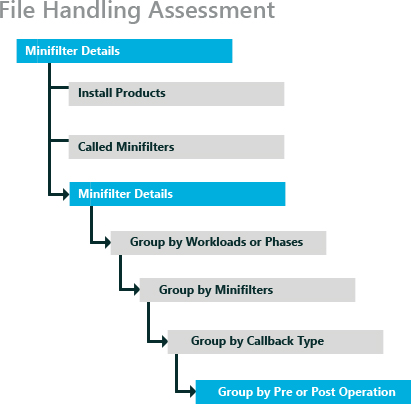
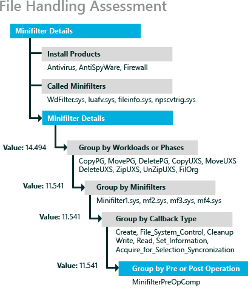

# 微筛选器诊断程序

本主题有助于您理解微筛选器之一运行诊断评估，所产生的结果或通过启用在评估微筛选器诊断模式产生的结果。 它还提供有关如何使用结果来识别并解决常见的问题，对最终用户的体验和感觉到的计算机的性能产生负面影响的指导。

微筛选器驱动程序是截获的文件系统筛选器请求所针对的文件系统或另一个文件系统筛选器。 通过截取请求，到达其预定的目标之前，筛选器驱动程序可以扩展或替换原始目标的请求所提供的功能。 文件系统筛选器驱动程序的示例包括防病毒筛选器、 备份代理和加密/解密产品。 筛选器驱动程序是由旧的驱动程序称为筛选器驱动程序成为可能。

了微筛选器公开的前置和后置处理文件 I/O 的回调。 与通过这些回调微筛选器，筛选器驱动程序进行通信。 微筛选器用于处理标准 I/O;当应用程序使用内存映射文件时不使用它们。

本主题︰

-   [有关微筛选器诊断模式](#bkmk-minifilterabout)

-   [指标](#bkmk-minifiltermetrics)

## 有关微筛选器诊断模式

微筛选器旨在方便截取文件 I/O 不是它应使用其他性能分析软件。 没有微筛选器，开发人员必须编写传统的驱动程序，它可以是具有挑战性而且容易出错。

由于微筛选器在大多数文件 I/O 上运行代码，它们的性能会严重影响应用程序和最终用户体验。 实现不佳微筛选器可导致反应的慢的计算机。 微筛选器诊断模式旨在帮助确定此类驱动程序通过运行三个 I/O 密集型任务，这些任务包括︰

-   标准的文件系统操作，如移动、 复制和删除文件。

-   加载应用程序并监视其所有依赖项加载所需的 I/O。

-   启动计算机并监视 I/O 以帮助查找微筛选器可能会对启动和关闭性能的负面影响。

有三个评估，包括评估设置为**启用微筛选器诊断模式**运行评估时。 默认情况下，微筛选器诊断模式禁用这些评估服务︰

-   文件处理

-   Internet Explorer 启动性能

-   启动性能 （快速启动）

这些三种评估都还提供了微筛选器诊断程序默认情况下启用。 它们与其他可作为评估列出︰

-   文件处理微筛选器诊断程序︰

-   Internet Explorer 微筛选器诊断程序︰

-   微筛选器诊断︰ 启动性能 （快速启动）

（使用微筛选器诊断中启用），运行所有三种评估提供了微筛选器对系统的影响的全面视图。 每个评估运行特定方案和收集数据的系统上安装的微筛选器的行为。 然后可以使用 Windows 评估控制台，Windows 评估服务的客户端 (Windows ASC) 或 Windows 性能分析器 (WPA) 分析这些数据。 评估工具组的数据以不同的方式比 WPA，但是所有这些工具，您可以向下钻取看到微筛选器的效果。

**微筛选器诊断︰ 文件处理评估**

微筛选器诊断程序︰ 处理评估的文件执行文件系统操作，如移动、 复制和删除文件系统上的文件。 此评估测量墙上时钟时间和吞吐量为每种类型的 I/O。 有关此评估的详细信息，请参阅[文件处理](file-handling.md)。

微筛选器诊断程序︰ 处理评估的文件收集数据，如复制、 移动或删除的文件在文件系统中，除了吞吐量，（如果适用） 所需的墙上时钟时间。 当您向下钻取以查看所有主要微筛选器回调例程时，可以找到的次数，每个被调用，完成的调用所花费的时间和平均和最大时间。

**Internet Explorer 微筛选器诊断程序︰**

微筛选器诊断程序︰ Internet Explorer 评估具有简单内容，在新的 Internet Explorer 窗口中打开一个选项卡。 Internet Explorer 是大尺寸的应用程序有多依赖 Dll 的一个媒介。 评估作为代理服务器启动的任何应用程序，然后监视已安装微筛选器的行为如何更好地。 此评估的详细信息，请参阅[Internet Explorer 启动性能](internet-explorer-startup-performance.md)。

微筛选器诊断程序︰ Internet Explorer 评估提供了框架，创建一个选项卡，并启动该应用程序所需的时间等数据。 当您向下钻取以查看所有主要微型筛选器回调例程时，可以找到的次数，每个被调用，完成的调用所花费的时间和平均和最大时间。

**微筛选器诊断︰ 启动性能 （快速启动）**

微筛选器诊断程序︰ 启动性能 （快速启动） 评估引导系统，并在此关键期间监视 I/O 活动。 结果数据的组织的启动阶段。 有 17 阶段引导过程。 给定的微型筛选可能会引导影响在多个阶段。 有关此评估的详细信息，请参阅[开/关切换性能](onoff-transition-performance.md)。

当您向下钻取以查看所有主要微型筛选器回调例程时，可以找到每个被调用的次数、 完成的调用所花费的时间和平均和最大时间。

有关特定于每个评估结果的详细信息，请参阅︰

-   [文件处理评估的结果](results-for-the-file-handling-assessment.md)

-   [Internet Explorer 启动性能评估的结果](results-for-the-internet-explorer-startup-performance-assessment.md)

-   [打开/关闭评估结果](results-for-the-onoff-assessments.md)

有两种类型的生成的评估问题。 有预配置问题，您可以控制通过解决错误和评估开始之前显示警告。 如果不解决好这些评估启动前，生成并添加到评估结果的问题。 跃点计数值与该指标的目标进行比较时，会生成其他类型的问题。 通常开始分析这些问题。 有些问题需要重新配置计算机和运行的评估，和其他的测量值为评估过程，揭示可能出现的问题。

通过运行这些三种评估可以看到启动和常用的计算机具有微筛选器的影响。 结果可能会突出显示问题特定于评估方案，但结果还可以用来确认微筛选器的问题，并将结果进行比较。 例如，您可以比较各种防病毒 (AV) 软件包只因为已安装防病毒软件不同的两个相同的系统上运行评估对系统的影响。 此外可以比较两个不同的计算机具有相同安装的防病毒软件。 或者，可以使用一台计算机并使用一个防病毒程序，运行评估，然后将其卸载并安装不同的 AV 程序中，然后再次运行的三种评估之前。 两种方法，可以打开的并排比较，所有结果并开始您的分析。

## 指标

本节介绍了指标，常见导致差这些度量标准，结果和共同解决问题的关键微筛选器。 这一节还试图来标识每个这些指标影响最大的观众。

在此部分中︰

-   [公制微筛选器的层次结构](#bkmk-minifiltermetrichierarchy)

-   [最长延迟](#bkmk-minifiltermetriclongest)

-   [微筛选器的延迟](#bkmk-minifiltermetricdelay)

-   [平均通话长度](#bkmk-minifiltermetricavgcall)

-   [微筛选器回调](#bkmk-minifiltermetriccallback)

### 公制微筛选器的层次结构

微筛选器诊断模式产生持续时间指标。 例如，当诊断微筛选器启用了文件处理评估，则复制工作负荷的持续时间显示，除了子指标按微筛选器分组或按回调类型分组。 下面的关系图显示微筛选器标准的基本层次结构︰

在逻辑分组下深嵌套微筛选器规格值。 这种结果的层次结构使您能够查看评估工作负荷或阶段，生成您感兴趣的结果的详细信息。 一旦展开工作负荷的结果时，可以看到微筛选器，并提供了每个工作负载级别聚合结果的列表。 从列表中选择特定的微筛选器，可以查看对该微筛选器进行的调用列表。 选择一个有趣的调用，并可以查看预或后期操作所生成的结果，您感兴趣。 下面是一个示例︰

**请注意**  
在文件处理性能评估中，主体的第一层称为*工作量*级别。 在启动性能评估或 Internet Explorer 启动性能评估，详细信息的第一层称为*阶段*级别。

 

在这种情况下，CopyPG 工作负载有 14.494 的值。 在展开该结果时，您发现那是贡献值为 CopyPG 工作负载值为 11.541 的 minifilter1.sys 驱动程序。 在展开的 minifilter1.sys 结果时，您看到清理回调类型是 11.541 的值的源。 在展开清理回调类型时，您发现它是在 11.541 值测量的 MiniFilterPreOpComp 操作。

使用此方法，精确的操作、 回调类型、 微筛选器，可以建立或工作负荷/阶段产生了任何特定的结果。 此外，每个**分组依据**下拉按钮显示不可见，默认情况下的其他指标。 选择任何这些附加的类别以查看更多指标的分析。

### 最长延迟

最长延迟指标是评估正在运行时跟踪中找到的最长延迟。 此统计数据是可用于创建、 控件、 清理、 信息、 读、 写和获取锁操作等所有主要的 I/O 操作。 此度量值大可以指示感觉停止运行时执行文件操作、 Internet Explorer 启动和引导。

**最适用于︰**微筛选器 Isv 它们实现微筛选器的方式都有对此指标的最大直接影响。 最终用户和 Oem 有此规格，基于他们安装了微筛选器产品的间接影响。

**典型的影响因素**

而评估正在运行，但它也会导致不正确的微筛选器设计，在系统后台活动一般被由于在此指标的值大。 对于某些工作负载 （例如，复制），文件的大小也会影响该指标。

**分析和补救措施**

使用微筛选器的结果来确定单个软件组件中的回归，时，由运行的相同组件的两个版本对照评估的结果进行比较，或比较两个相似的产品，从不同的应用程序编写器结果密切相关。

第一步是找到最长延迟。 为此，展开微筛选器的详细信息、 用鼠标右键单击列中最长的延迟和选择按降序排序。

若要确保结果数据的真实性︰

-   关闭所有应用程序在后台运行。

-   一旦确定了主要组件，请考虑通过停止其它可选的服务和运行再次进行比较评估隔离影响。

-   确保系统未在任何内存压力下运行此评估时。

-   运行评估多次确认的度量值不是暂时性的文件系统事件 （如缓存刷新） 的结果。

-   解决任何警告或导致评估，以便它们不再显示的问题。

-   微筛选器通常是与一个服务相关联的。

如果这些步骤不能解决此问题，请考虑用不同的产品，提供类似的功能替换微筛选器产品或测试微筛选器的不同版本。

应用程序开发人员想要找到问题的根源，可以通过更深层次的分析，在 WPA 打开跟踪。 WPA 的微筛选器延迟分析视图是很好的起点，以进行深入的分析。 有几个 ETL 文件如果您运行所有三种评估服务，FileOrg.etl，IELaunch\_热\_1，IELaunch\_热\_2，IELaunch\_热\_3，IELaunch\_冷\_1 和多个名为 FastStartup 的启动评估 ETL 文件\_分析-\*。 这些.etl 文件可供任何人理解 WPA。

### 微筛选器的延迟

微筛选器的延迟是由微筛选器花时间累计时间度量。 此度量显示微筛选器使用多少时间和多少时间供运行评估期间的其他活动。 此统计数据中有较大的值可以指示执行文件操作时，用户可能会遇到响应较差。

**最适用于︰**微筛选器 Isv 它们实现微筛选器的方式都有对此指标的最大直接影响。 最终用户和 Oem 有此规格，基于他们安装了微筛选器产品的间接影响。

**典型的影响因素**

较大的值，在此指标通常是由不太有效的微筛选器设计引起的。 对于某些工作负载 （如复制）、 大小、 数目和类型的文件也会影响该指标。 例如，媒体文件和一个文本文件之间的区别。

**分析和补救措施**

若要确保结果数据的保真度

-   关闭所有应用程序在后台运行。

-   一旦确定了主要组件，请考虑通过停止其它可选的服务和运行再次进行比较评估隔离影响。

-   确保系统未在任何内存压力下运行此评估时。

-   运行评估多次确认的度量值不是暂时性的文件系统事件 （如缓存刷新） 的结果。

-   解决任何警告或导致评估，以便它们不再显示的问题。

-   寻找在顶部的延迟模式。

如果这些步骤不能解决此问题，请考虑用不同的产品，提供类似的功能替换微筛选器产品或测试微筛选器的不同版本。

应用程序开发人员尝试发现问题的根本原因可以通过在 WPA 打开中的跟踪执行的更深层次的分析。 迷你筛选器延迟分析视图是很好的起点，进行更深入的分析。 有几个 ETL 文件如果您运行所有三种评估服务，FileOrg.etl，IELaunch\_热\_1，IELaunch\_热\_2，IELaunch\_热\_3，IELaunch\_冷\_1 和 ETL 文件启动评估名为 FastStartup 的主机\_分析-\*这些 etl 文件可以由任何人理解 WPA。

### 平均通话长度

此统计数据是按每次回调所用的平均时间。 执行文件操作时，此度量中较大的值可以指示感觉延迟。 其中最长延迟规格，可以指出特定问题或原因，平均值是良好微筛选器的总体行为的措施。 但是，仅使用平均值可能会使您忽视极端如大量相同的调用或一个非常大的延迟。

**最适用于︰**微筛选器 Isv 它们实现微筛选器的方式都有对此指标的最大直接影响。 最终用户和 Oem 有此规格，基于他们安装了微筛选器产品的间接影响。

**典型的影响因素**

此规格中的较大数值可能致不正确微筛选器设计。 对于某些工作负荷 （副本），正在对其进行操作的文件的大小也会影响该指标。

**分析和补救措施**

使用微筛选器标准来标识单个软件组件中的回归，时，创建和比较的结果，从同一元件的两个版本创建的然后寻找回归或比较两个相似的产品，从不同的应用程序编写器的结果密切相关。

平均通话长度提供客观的上下文信息应用于微筛选器延迟度量中返回的结果的角度来看。 当比较结果，如果提高了微筛选器延迟度量和平均值不会增加时，然后微筛选器延迟指标增幅不通常指示存在问题。 如果微筛选器延时和平均调用时间趋势方向相同，微筛选器延迟指标增幅通常表明性能的变化。

若要查找此类问题的根本原因，寻找中顶部的延迟模式。

如果这些步骤不能解决此问题，请考虑用不同的产品，提供类似的功能替换微筛选器产品或测试微筛选器的不同版本。

### 微筛选器回调

此统计数据是微筛选器调用的操作系统或其他应用程序和系统运行的服务的次数。 您可以向下钻取以查看此数目的各种类型的回调。

**最适用于︰**最终用户和 Oem 必须根据此标准基于微筛选器产品的安装它们和它们能够卸载服务和应用程序会影响该指标衡量的间接影响。

不有任何补救措施如该指标不是仅依赖于系统安装的应用程序。

## 相关的主题

[Windows 评估 Toolkit](windows-assessment-toolkit-technical-reference.md)

[评估服务](assessments.md)

[开/关切换性能](onoff-transition-performance.md)

 

 

