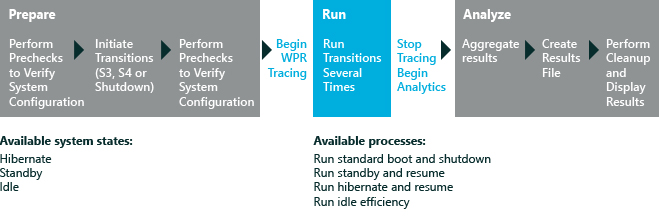

# 开/关切换性能

开/关切换性能评估等测量从各种计算机状态的转变︰

-   电源上的过渡，包括启动，如从待机状态 (S3)，恢复并从休眠 (S4)。

-   关闭电源的过渡，包括关机，进入待机状态 (S3)，然后输入休眠 (S4)。

-   启动时间间隔，则按下电源按钮，时间和计算机的到达桌面，并处理所有启动任务的时间之间的时间间隔。

-   关闭时间间隔，是和关闭计算机时启动关机进程时，之间的间隔。

提供了四种开/关切换性能评估服务。 本主题介绍的启动性能 （快速启动）、 休眠的性能和待机性能进行评估。

此图说明了评估过程︰

本主题︰

-   [关于开/关切换性能评估](#bkmk-aboutonoff)

-   [开始之前](#beforeyoubegin)

-   [设置](#settings)

-   [结果](#results)

-   [问题](#bkmk-issues)

有关如何分析引导 （快速启动） 评估结果的详细信息，请参阅[打开/关闭评估服务的结果](results-for-the-onoff-assessments.md)。

## 关于开/关切换性能评估

每个开/关切换性能评估计算其中一个转换︰

<table>
<colgroup>
<col width="50%" />
<col width="50%" />
</colgroup>
<thead>
<tr class="header">
<th>过渡</th>
<th>说明</th>
</tr>
</thead>
<tbody>
<tr class="odd">
<td>
引导 （快速启动）
</td>
<td>
启动性能 （快速启动） 评估测量的新的快速启动转换的性能。 一个引导的 Windows 8introduces 处理在大多数情况下，计算机的启动，使速度更快。 关机过程已经经过更新，包括将数据写入到磁盘中，以一种类似于如何休眠状态的工作原理。 您可以通过关闭计算机启动此过程。 按电源按钮时，将打开计算机，Windows 将使用快速启动过程中启动。

<strong>请注意</strong>  

在<strong>电源选项</strong>中关闭快速启动，关闭和重新启动发生作为完全重新启动。

 

</td>
</tr>
<tr class="even">
<td>
待机
</td>
<td>
待机性能评估可帮助标识上的系统状态之间的转换，才能充分发挥和挂起的组件。 暂停是休眠状态，计算机进入低功耗状态 (S3)，并占用非常少的电量。 等待将进入挂起状态的行为。 从待机状态睡眠后以待机状态恢复的过渡是当计算机启动唤醒和计算机时可用容量和响应时间之间的时间间隔。 在这种情况后，在用户按下电源按钮或 USB 设备按钮 （如果计算机配置为唤醒在 USB），这是一段时间后出现桌面。
</td>
</tr>
<tr class="odd">
<td>
休眠状态
</td>
<td>
休眠状态的性能评估可帮助您识别组件对系统状态的休眠和恢复之间的转换的影响最大。 休眠是系统和用户数据写入到磁盘后的睡眠状态。 然后，系统进入最深睡眠状态 (S4) 切割电源。 从过渡休眠状态唤醒从休眠恢复是当用户启动唤醒从休眠 （按电源按钮或 USB 设备按钮如果计算机被配置为唤醒在 USB） 和计算机时可用的并且能够作出响应 （一段时间后出现桌面） 时间之间的时间间隔。

<strong>请注意</strong>  

后 (Hiberfil.sys) 是一个文件，操作系统先创建在计算机进入休眠模式。 当计算机打开时，Windows 将使用此文件来返回到系统及其预休眠状态。

 

</td>
</tr>
</tbody>
</table>

 

### 快速启动的启动性能的影响

默认关机和重新启动情况在 Windows 8 中改变了。 现在，关机过程包括将数据写入到磁盘中的休眠状态的工作原理类似于一种。 关闭并重新启动 Windows 8 的关机和重新启动以前的 Windows 版本中的主要区别是正常注销所有用户会话并将剩余的信息写入后。 在早期的 Windows 版本中那样登录保持不变。 在 Windows 8 中新的启动过程是通常要快得多，，如下所示︰

.jpg)传统 Windows 启动过程中加载操作系统的内核，设备驱动程序和其他系统组件文件到内存并加载登录屏幕和桌面。 快速启动提供避免使用一些传统上要求在启动时的工作性能收益。 这个新的关机/启动转换的优点是立即明显。

仍有一些地方的设备驱动程序、 服务、 应用程序和其他功能可能会影响这种情况下的几个方面。 启动性能 （快速启动） 评估使您可以测量方案中的每个阶段的时间，提供了深入了解什么运行在每一子阶段、 标识潜在问题，并提供生态系统伙伴，以提高其产品的补救指南。

**请注意**  
传统的 Windows 启动仍然有时需要计算机正在运行 Windows 8 上。 您可以通过按 Ctrl + Alt + Delete，选择电源图标，然后选择**重新启动**来启动它。 当计算机重新启动时，它会使用传统的启动过程。

 

## 开始之前

Windows 8.1 中的第一次运行帮助提示可以对评估结果产生负面影响。 若要禁用这些，从提升的命令提示符下，运行下面的命令并重新启动计算机︰`reg.exe add "HKLM\Software\Policies\Microsoft\Windows\EdgeUI" /v DisableHelpSticker /t REG_DWORD /d "1" /f`

从这些评估中获得的最准确和可重复的结果、 设置和准备系统通过执行下列操作︰

**请注意**  
开/关切换性能评估运行之前，他们确认有指定受支持的休眠状态。 如果 precheck 确认，不启用所需的休眠状态，将不会运行评估。

 

-   因为这些评估执行数次重新启动时，我们建议，您将系统设置为自动执行登录过程。 若要执行此操作，请参阅[--自动执行重新启动前运行评估](automate-reboots-before-you-run-an-assessment.md)。

    **警告**  
    评估正在运行时，不要与计算机交互。 这可能会对结果产生负面影响。 自动登录过程可以帮助防止不需要的交互。

     

-   请确保所有设备驱动程序都安装正确。 如果您的计算机已丢失或不正确的驱动程序，结果可能有显著变化。 [驱动程序验证](driver-verification.md)评估可用于标识您要评估的计算机上的驱动程序问题。

-   验证已安装了正确的视频卡和驱动程序。 如果只有 Microsoft® 基本安装的显示适配器，则不能运行待机性能评估。

-   确定您的系统 BIOS 是否已被配置为从网络进行引导，必须插入到光盘驱动器，BitLocker 启用，CD/DVD 或有多重引导方案。 这些配置可能导致延迟启动路径中，并可能对结果产生负面影响。

-   如果您的系统具有多重引导配置，将在启动时出现的菜单中选择一个操作系统。 此菜单的存在会影响作业结果。

### 系统要求

在这些操作系统上，您可以运行评估服务︰

-   Windows 8

-   Windows 10

支持的体系结构包括基于 x86 和基于 x64 的系统。

## Settings

默认情况下，这些评估使用推荐的设置。 Microsoft 将定义这些设置，以便跨多个计算机配置或一段时间，在同一台计算机上，您可以比较结果。 当您查看结果时，请运行的信息包括指示评估是否使用推荐的设置的元数据。

如果您想要收集不同于默认的数据的数据，还可以自定义评估时，这些设置。 例如，可以确定特定数据可帮助您执行计算机的某个特定方面进行详细的分析。

下表描述可用于这些评估，以及推荐的值和每个设置可选值的评估设置。

<table>
<colgroup>
<col width="50%" />
<col width="50%" />
</colgroup>
<thead>
<tr class="header">
<th>设置</th>
<th>说明</th>
</tr>
</thead>
<tbody>
<tr class="odd">
<td>
使用建议的设置
</td>
<td>
指定评估是否运行通过使用默认值。 默认情况下，选中此复选框。 若要更改此评估服务的设置，必须首先清除此复选框。
</td>
</tr>
<tr class="even">
<td>
迭代次数
</td>
<td>
指定评估执行要关闭和启动进程的时间重新启动的次数。 默认情况下，值为 3。
</td>
</tr>
<tr class="odd">
<td>
执行首次重新启动
</td>
<td>
指定是否要重新引导系统之前评估运行。 启动性能 （快速启动） 评估在性能休眠和待机性能的评估，而不使用此设置。
</td>
</tr>
<tr class="even">
<td>
使用备用 WPR 配置文件
</td>
<td>
默认情况下，此复选框被清除。 如果您想要使用不是默认的 Windows 性能记录器 (WPR) 配置文件，请选择它。 如果选中此复选框，则必须输入另一个 WPR 配置文件的路径。
</td>
</tr>
<tr class="odd">
<td>
备用的跟踪配置文件 (.wprp) 路径
</td>
<td>
提供备用 WPR 配置文件的路径。 若要指定其他路径，选择<strong>使用备用 WPR 配置文件</strong>复选框，，然后在<strong>备用的跟踪配置文件路径</strong>框中键入路径。
</td>
</tr>
<tr class="even">
<td>
启用诊断模式的微筛选器
</td>
<td>
指定是否要使用微筛选器诊断选项。 默认情况下，此复选框被清除。 当微筛选器诊断模式已启用时，它会测量数据，帮助您评估微筛选器上启动性能的影响。 有关此设置的详细信息，请参阅[微筛选器诊断程序](minifilter-diagnostics.md)。 此设置为仅在启动性能 （快速启动） 评估中可用。
</td>
</tr>
<tr class="odd">
<td>
收集跟踪文件时出现 I/O
</td>
<td>
默认情况下，此复选框被清除。 如果您想要收集存储 IO 除了默认 CPU 跟踪的跟踪，请选择它。 此设置为仅在启动性能 （快速启动） 评估中可用。
</td>
</tr>
</tbody>
</table>

 

**请注意**  
微筛选器结果显示只有在选中**启用微筛选器诊断模式**复选框之前运行评估。

 

## 结果

结果显示度量数据的引导，待机模式，和休眠计算机的性能。 有些指标有附加信息，您可以查看通过扩展它们。

开/关切换评估执行一系列的开/关切换效果评估正在运行时。 由评估执行的转换的单个系列被称为迭代。 有三种不同类型的迭代︰ 计时、 分析和 I/O 分析。

-   **定时迭代。** 这些迭代作为捕获的所有关闭和引导指标的度量标准值的基础。 开/关切换评估每个默认情况下执行三个计时迭代并收集三个计时 ETL 跟踪。 显示的度量值是所有定时迭代之间的平均值。 若要查看单个的迭代中，在结果视图中的值用鼠标右键单击结果列标题，然后选择**显示迭代**。

-   **分析迭代。** 此迭代收集信息，同时评估正在运行，并且用作基础生成的评估问题。 其他跟踪系统开销，因为在此迭代中的操作可以比长在常规使用的大小写。 在会审和分析评估结果时，请记住这种差异 （因的定时迭代和因分析迭代问题的指标）。

-   **I/O 分析迭代。** 此迭代收集非常详细的 I/O 子系统和注册表访问信息跟踪。 默认情况下，不会收集这种跟踪类型、 要启用它之前运行评估中选择**收集 I/O 跟踪文件**评估设置。 评估执行，默认情况下，捕获每个迭代的关闭和启动过程的实际时间持续时间 3 重启。

此表提供了捕获的开/关切换性能评估指标的简短说明︰

<table>
<colgroup>
<col width="33%" />
<col width="33%" />
<col width="33%" />
</colgroup>
<thead>
<tr class="header">
<th>公制</th>
<th>说明</th>
<th>评估</th>
</tr>
</thead>
<tbody>
<tr class="odd">
<td>
Bios 初始化持续时间
</td>
<td>
时间，以秒为单位，以初始化 BIOS，包括预启动执行环境 (PXE)。
</td>
<td>
启动性能，待机性能，休眠状态的性能
</td>
</tr>
<tr class="even">
<td>
资源管理器初始化持续时间
</td>
<td>
要初始化 Internet Explorer 的时间。 包括详细信息以毫秒为单位，和总的磁盘使用情况，以千字节为单位显示总 CPU 使用。 此外显示了对 Internet Explorer 初始化的所有进程的详细信息。
</td>
<td>
启动性能
</td>
</tr>
<tr class="odd">
<td>
将刷新存储卷持续时间
</td>
<td>
时间，以秒为单位，将刷新所有脏数据和持久性存储区。
</td>
<td>
启动性能，待机性能，休眠状态的性能
</td>
</tr>
<tr class="even">
<td>
后初始化持续时间
</td>
<td>
时间，以秒为单位，以初始化后。
</td>
<td>
启动性能，休眠状态的性能
</td>
</tr>
<tr class="odd">
<td>
读后持续时间
</td>
<td>
以毫秒为单位，操作系统读取后所花费的时间。
</td>
<td>
启动性能，休眠状态的性能
</td>
</tr>
<tr class="even">
<td>
后写持续时间
</td>
<td>
总时间，以毫秒为单位，操作系统发生后编写的。
</td>
<td>
启动性能，休眠状态的性能
</td>
</tr>
<tr class="odd">
<td>
主路径引导持续时间
</td>
<td>
启动性能评估时，这是时间，以秒为单位，在初始化 Windows 之前继续从结尾处 BIOS 初始化。 这不包括开机自检打开/关闭持续时间度量时间。

待机和休眠状态性能评估服务，这是时间，以秒为单位，不包括开机自检打开/关闭持续时间度量时间继续 Windows 之前继续从结尾处 BIOS 初始化。
</td>
<td>
启动性能，待机性能，休眠状态的性能
</td>
</tr>
<tr class="even">
<td>
主路径恢复持续时间
</td>
<td>
时间，以秒为单位，要继续从末尾 BIOS 初始化 Windows 桌面。
</td>
<td>
启动性能，待机性能，休眠状态的性能
</td>
</tr>
<tr class="odd">
<td>
开机自检打开/关闭持续时间
</td>
<td>
以毫秒为单位，Windows 桌面出现后，完成所有启动任务所花费的时间。
</td>
<td>
启动性能，休眠状态的性能
</td>
</tr>
<tr class="even">
<td>
查询设备持续时间
</td>
<td>
时间，以秒为单位，以查询全部暂挂电源转换设备。
</td>
<td>
启动性能，待机性能，休眠状态的性能
</td>
</tr>
<tr class="odd">
<td>
恢复设备持续时间
</td>
<td>
时间，以秒为单位，在系统发生的恢复设备过程中恢复的设备。
</td>
<td>
启动性能，待机性能，休眠状态的性能
</td>
</tr>
<tr class="even">
<td>
Superfetch 准备内存持续时间
</td>
<td>
时间，以秒为单位，系统内存优化的简历体验做准备。
</td>
<td>
启动性能，待机性能，休眠状态的性能
</td>
</tr>
<tr class="odd">
<td>
挂起的设备持续时间
</td>
<td>
时间，以秒为单位，暂停所有设备。
</td>
<td>
启动性能，待机性能，休眠状态的性能
</td>
</tr>
<tr class="even">
<td>
挂起的进程持续时间
</td>
<td>
以毫秒为单位，评估期间挂起进程的操作系统所花费的时间。 如果可用，请展开该休眠阶段进程的详细信息，请参阅。 此信息包括有关子阶段持续时间、 CPU 使用和磁盘使用情况的详细信息。
</td>
<td>
启动性能，待机性能，休眠状态的性能
</td>
</tr>
<tr class="odd">
<td>
挂起服务持续时间
</td>
<td>
以毫秒为单位，评估期间挂起服务操作系统所花费的时间。 如果可用，请展开以查看有关每一子阶段所花费的时间的详细信息。
</td>
<td>
启动性能，待机性能，休眠状态的性能
</td>
</tr>
<tr class="even">
<td>
系统会话关闭进程持续时间
</td>
<td>
时间，以秒为单位，以关闭系统会话中的进程。
</td>
<td>
启动性能
</td>
</tr>
<tr class="odd">
<td>
[不包括 BIOS] 总启动持续时间
</td>
<td>
总时间，以秒为单位，以引导系统，其中包括开机自检开/关。
</td>
<td>
启动性能
</td>
</tr>
<tr class="even">
<td>
[不包括 BIOS] 总恢复时间
</td>
<td>
总时间，以秒为单位，若要恢复系统，包括 Post 开/关。
</td>
<td>
启动性能，休眠状态的性能
</td>
</tr>
<tr class="odd">
<td>
用户会话关闭进程持续时间
</td>
<td>
时间，以秒为单位，以关闭在用户会话中的进程。
</td>
<td>
启动性能
</td>
</tr>
<tr class="even">
<td>
WinLogon 恢复持续时间
</td>
<td>
以秒为单位，操作系统恢复恢复 Winlogon 进程所花费的时间。
</td>
<td>
启动性能，休眠状态的性能
</td>
</tr>
<tr class="odd">
<td>
Winlogon 暂停持续时间
</td>
<td>
组策略的时间，以秒为单位，若要注销的用户，包括处理的注销通知并通知 Winlogon 的订阅服务器，如下所示。
</td>
<td>
启动性能，休眠状态的性能
</td>
</tr>
</tbody>
</table>

 

如果启用**启用微筛选器诊断模式**设置，评估结果将包括微筛选器规格。 有关微筛选器的指标和结果的详细信息，请参阅[微筛选器诊断程序](minifilter-diagnostics.md)。

有关如何分析引导 （快速启动） 评估结果的详细信息，请参阅[打开/关闭评估服务的结果](results-for-the-onoff-assessments.md)。

## 问题

开/关切换性能评估执行高级的问题分析，并提供对 Windows® 性能分析器 (WPA) 确定评估问题进行故障排除的链接。 WPA 打开时，可能还会有其他详细信息的磁盘活动或 CPU 活动可用，根据问题的类型。 深入分析的问题和建议有关的详细信息，请参阅[In-Depth 分析的常见问题](common-in-depth-analysis-issues.md)。

## 相关的主题

[打开/关闭评估结果](results-for-the-onoff-assessments.md)

[Windows 评估 Toolkit](windows-assessment-toolkit-technical-reference.md)

[评估服务](assessments.md)

 

 

