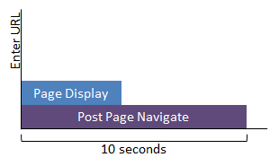

# Internet Explorer 安全软件影响评估的结果

Internet Explorer 安全软件影响评估测量方面的 Internet Explorer 通常受到反恶意软件和其他浏览器加载项。 评估措施在显示时间、 CPU 时间和资源利用率的 Internet Explorer 安全软件的影响。

本主题有助于您理解 Internet Explorer 安全软件影响评估所产生的结果。 它还提供有关如何使用结果来识别并解决常见的浏览器性能带来负面影响的问题的指导。

本主题︰

-   [目标文件](#bkmk-goals)

-   [指标](#bkmk-metrics)

-   [问题](#bkmk-issues)

有关系统要求和评估设置的详细信息，请参阅[Internet Explorer 安全软件影响](internet-explorer-security-software-impact.md)。

## 目标文件

您可以创建自定义的目标来衡量结果视图中的您改进。 目标文件是会审的工具，可帮助您了解 PC 的性能如何，比较 Pc 业务中。

例如，基本的便携式计算机目标可能不同于为高端桌面计算机设置的目标或者市场预期可能会更改所需的灵活性，可以定义不同类型的目标和时间的推移和技术的关键要求提高的方式中。

度量值是与该指标的目标相比，状态都用颜色编码在结果视图中，如下所示︰

-   浅紫色意味着系统具有出色的用户体验，有没有感觉到的问题。

-   紫色的中等意味着用户体验是容许，可以优化系统。 检查以查看可对系统进行何种改进的建议和分析。 这可能是软件更改，更改配置或硬件更改。

-   深紫色意味着系统有很差的用户体验，并且有重大改进的空间。 检查以查看可对系统进行改进的建议和分析。 这可能是软件更改，更改配置或硬件更改。 您可能需要考虑进行权衡，以便提供 Windows 遇到的高质量。

-   没有颜色的含义有没有定义为度量的目标。

**请注意**  
在 Windows 评估 Toolkit 针对 Windows 8，某些评估包括默认目标文件。 查看使用此版本的工具，结果在第一次使用该默认目标文件。 但是，您还可以定义自定义目标针对 Windows 8 相同的方式，可以为 Windows 8.1 和 Windows 10。

 

您可以设置文件位置的目标并将目标文件添加到该位置之前可用于用户界面应用的自定义目标。 选择目标文件后，它将继续是目标文件，用于打开的任何结果。

可每次只能有一个目标文件。 所有的评估的目标是单个目标文件中设置的。 评估工具将搜索顺序如下目标︰

1.  自定义的目标文件

2.  在结果文件中定义的目标

3.  评估清单中定义的目标

您可以在 %PROGRAMFILES%使用提供了该示例的目标文件\\窗口工具包\\10\\评估和部署工具包\\Windows 评估 Toolkit\\SDK\\样本\\目标来创建目标文件。

**请注意**  
不能包装作业的目标文件，但可以将其存储在供其他用户使用共享。

 

## 指标

以下指标没有 Internet Explorer 安全软件的影响评估报告。

### 页面显示时

测量在 Internet Explorer 显示初始网页内容后评估导航到该网页所需的毫秒的时间。  那里可能是 Internet Explorer 所执行的其他活动，最初显示该页面之后但在页面完成加载之前。 页显示时间是开机自检页导航的一个子集。

### 开机自检页导航

资源使用状况进行测量 10 秒钟后评估导航到该网页。 开机自检页导航中含有页显示时间。 导航，例如输入 URL 或单击链接，发生时，将启动这两个指标。

<table>
<colgroup>
<col width="50%" />
<col width="50%" />
</colgroup>
<thead>
<tr class="header">
<th>公制</th>
<th>说明</th>
</tr>
</thead>
<tbody>
<tr class="odd">
<td>
总 CPU 利用率
</td>
<td>
以毫秒为单位的网页负荷影响 CPU 时间。
</td>
</tr>
<tr class="even">
<td>
总磁盘使用情况
</td>
<td>
大小以千字节的磁盘空间用来加载该网页。
</td>
</tr>
<tr class="odd">
<td>
总的网络持续时间
</td>
<td>
时间加载页面所需的网络活动的持续时间 （毫秒）。
</td>
</tr>
<tr class="even">
<td>
JavaScript 的总持续时间
</td>
<td>
时间的 JavaScript 引擎活动加载页面所需的持续时间 （毫秒）。
</td>
</tr>
<tr class="odd">
<td>
总文档撰写持续时间
</td>
<td>
以毫秒为单位来撰写包括应用 CSS 的网页的时间。
</td>
</tr>
<tr class="even">
<td>
总文档呈现持续时间
</td>
<td>
以毫秒为单位来呈现网页，它被加载后的时间。
</td>
</tr>
<tr class="odd">
<td>
进程
</td>
<td>
加载网页所需的进程数。
</td>
</tr>
</tbody>
</table>

 

### 反恶意软件产品计数

反恶意软件的电脑上安装的软件产品的数量。

## 问题

此评估执行高级的问题分析，并提供到 Windows 性能分析器 (WPA) 标识问题进行故障排除的链接。 在大多数情况下，您可以单击 WPA 分析链接来解决出现的问题。 当 WPA 打开磁盘活动有关的更多详细信息或 CPU 活动可根据问题的类型。 深入分析的问题和建议有关的详细信息，请参阅[In-Depth 分析的常见问题](common-in-depth-analysis-issues.md)。

 

 

