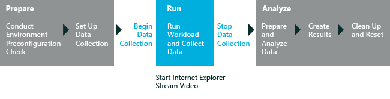

# 流式媒体性能

流式媒体性能评估可帮助您评估特定的计算机配置的性能，传输介质使用 Internet Explorer 时。 评估结果可以用于了解、 比较和改进流式媒体体验。

流式媒体性能评估使用流式已部署的服务器应用程序在本地计算机或远程服务器上。 评估启动 Internet Explorer 并播放媒体内容从开始到结束或在指定的时间。 然后，关闭 Internet Explorer 将生成结果。 下图说明了评估过程。

评估的重点是使用 Internet Explorer 视频播放。 评估模仿正在观看影片，并报告检测到任何故障的用户。 评估播放来自多个工作负载范围从低分辨率到高分辨率的视频内容。 当一台计算机上运行它时，该过程使用内容路径文件夹中可用的 HTML 5.0 页。 这些文件包含嵌入的媒体，如 360p.html、 480p.html、 720p.html 和 1080p.html 文件。 一分钟播放每个视频的工作负荷。

一个小故障是用户体验中的任何检测视觉或听觉缺陷。 评估为视频失灵提供测试结果。 它对整个视频内容运行一秒间隔报告失灵。 视频故障分为小、 中和大。 评估还将报告故障的位置。 观众很可能会注意到当三个或更多连续的帧被删除。 此外，虽然不太可能会中断比的视频流音频流，连续中断的视频帧的一系列影响查看器体验，因为视频轨道与短暂不同步音轨。 有关结果和这一评估所产生的问题的详细信息，请参阅[为流媒体性能评估的结果](results-for-the-streaming-media-performance-assessment.md)。

**警告**  
请注意，配置流式媒体评估时流播放视频 （默认设置），有的同一个设备可以是音频或视频的失灵，是不可操作的。 理想的方案，以测试流媒体是此处所述远程服务器设置︰[流媒体评估︰ 设置远程服务器](set-up-a-remote-server-for-the-streaming-media-performance-assessment.md)。

 

本主题︰

-   [开始之前](#beforebegin)

-   [工作负载](#bkmk-streamingworkloads)

-   [设置](#settings)

## 开始之前

Windows 8.1 中的第一次运行帮助提示可以对评估结果产生负面影响。 若要禁用这些，从提升的命令提示符下，运行下面的命令并重新启动计算机︰`reg.exe add "HKLM\Software\Policies\Microsoft\Windows\EdgeUI" /v DisableHelpSticker /t REG_DWORD /d "1" /f`

当运行 Windows 8.1 此评估，确保评估预期的电池寿命时，**收集分析跟踪**设置处于未选中状态。 当选中时，此选项会产生不正确的估计。

仅当您需要调查其他与能源有关的问题的其他信息，请启用分析跟踪集合。

准备运行评估，请按照下列步骤操作︰

1.  退出所有打开的应用程序。

    **重要**  
    评估工作启动后，请勿触摸鼠标或键盘。 作为评估作业同时运行其他应用程序或作业可能会影响您的结果。 此外，流媒体性能评估不包括查找或暂停功能的任何尺度。 不要寻求或暂停视频，在评估过程中。

     

2.  完成下表中所示设置评估作业，一台计算机上或通过网络连接的两台计算机上的适当步骤。

    <table>
    <colgroup>
    <col width="50%" />
    <col width="50%" />
    </colgroup>
    <thead>
    <tr class="header">
    <th>作业类型</th>
    <th>说明</th>
    </tr>
    </thead>
    <tbody>
    <tr class="odd">
    <td>
在一台计算机上运行作业
</td>
    <td>
若要在一台计算机中运行作业，安装 Windows 评估和部署工具包 (Windows ADK) 技术参考，打开 Windows 评估控制台。 然后，按照简介以运行流媒体性能评估中提供的说明进行操作。

    
在 Internet Explorer 10 或更高版本自动运行作业。 作业在 Internet Explorer 媒体管道在全屏模式下运行。 我们不建议用户交互。

    

    <strong>请注意</strong>  
    
默认情况下，1080p，30 fps 视频可供作业。 评估在整个计算机屏幕上播放。 额外的工作负载包括 360 p 30 fps 时、 在每秒 30 帧的 480 p 和 720p 每秒 30 帧处。

    

    

     
    

    
当一台计算机上运行该作业时，作业结果包括视频或音频故障发生的次数。
</td>
    </tr>
    <tr class="even">
    <td>
在两台计算机上运行该作业
</td>
    <td>
在两个联网的计算机上运行该作业，在两台计算机上安装 Windows ADK 技术参考、 打开 Windows 评估控制台、 选择流媒体性能评估，然后如下所示[设置](#settings)中配置的设置。

    
本地计算机流式 HTTP 流式处理第二个或远程计算机已安装的服务器应用程序中的内容。
</td>
    </tr>
    </tbody>
    </table>

     

评估服务开始前，流媒体性能评估系统运行一些预先检查。 如果这些预检查失败时，评估将生成错误和警告。 尽管错误阻止运行评估，但警告不会阻止运行评估。 您可以进行调整，建议在警告消息中，并继续运行该作业。 不能覆盖的警告和错误报告结果中。 有关结果和这一评估所产生的问题的详细信息，请参阅[为流媒体性能评估的结果](results-for-the-streaming-media-performance-assessment.md#bkmk-precheck)。

### 系统要求

您可以仅在 Windows 8 和 Internet Explorer 10 运行的计算机上运行此评估。

支持的体系结构包括基于 x86 的、 基于 x64 的系统和基于 ARM 的系统。

有两种方法以在 Windows RT 运行此评估︰

-   打包在 Windows 评估控制台 (WAC) 的评估作业并运行 Windows 直角上 有关详细信息，请参阅[打包作业和运行它在另一台计算机上](package-a-job-and-run-it-on-another-computer.md)。

-   使用 Windows 评估服务在 Windows 的直角上运行评估 有关详细信息，请参阅[Windows 评估服务](windows-assessment-services-technical-reference.md)。

## 工作负载

工作负荷是一组预定义的、 可重复的方式模拟用户活动的自动化任务。 工作负载运行相互独立。 评估播放来自多个工作负载范围从低分辨率到高分辨率的视频内容。

您可以选择这些工作负荷评估过程中运行的任意组合。

-   360 的 p (30 FPS) 工作负载

-   480 p (30 FPS) 工作负载

-   720p (30 FPS) 工作负载

-   1080p (30 FPS) 工作负载

在视频分辨率的"p"表示连续扫描，用计算机显示器和数字电视。 视频分辨率的"i"表示交错扫描，标准电视格式中使用。 在此评估中未使用隔行扫描视频内容。

**请注意**  
您还可以用作流式媒体评估能源效率作业中的工作负荷。 关于能源效率作业的详细信息，请参阅[连接备用能源效率](connected-standby-energy-efficiency.md)以及[创建和运行一个能源效率作业](create-and-run-an-energy-efficiency-job.md)。

 

## Settings

默认情况下，此评估使用推荐的设置。 这些设置定义 microsoft 以确保在不同的计算机配置或一段时间，在同一台计算机上，可以比较结果。 当您查看结果时，请运行的信息包括表示，以便您可以轻松地标识使用除不建议的设置的结果使用推荐的设置的元数据。

如果您想要收集其他数据要比所捕获，默认情况下，还可以自定义这些设置。 例如，可以确定特定的数据，将帮助您执行计算机的某个特定方面的更详细的分析。

下表描述评估建议的设置，设置值，并对每个设置的替代值。

<table>
<colgroup>
<col width="50%" />
<col width="50%" />
</colgroup>
<thead>
<tr class="header">
<th>设置</th>
<th>说明</th>
</tr>
</thead>
<tbody>
<tr class="odd">
<td>
使用建议的设置
</td>
<td>
指定评估是否使用推荐的设置。 默认情况下，选中此复选框。 若要更改此评估服务的设置，必须首先清除此复选框。
</td>
</tr>
<tr class="even">
<td>
迭代
</td>
<td>
指定评估运行的次数。 默认情况下，值为 3。 您看视频播放 5 次 3 迭代过程。 第一种是 15 秒的时间来初始化 Internet Explorer，3 视频回放的计算度量值是一种用于评估结果。
</td>
</tr>
<tr class="odd">
<td>
内容的路径
</td>
<td>
指定工作负荷数据集媒体和评估使用的 HTML 文件所在的源目录的路径。 默认情况下，内容拾取从<code>../Content/Streaming Media</code>。 您可以指定您自己的值。
</td>
</tr>
<tr class="even">
<td>
服务器名称
</td>
<td>
在本地网络上指定的服务器的名称。 即使在框中显示为空，定义了默认的服务器的路径。 如果未指定设置，评估将在本地计算机上启动流式服务器。
</td>
</tr>
<tr class="odd">
<td>
端口
</td>
<td>
指定的服务器接受请求的端口。 默认情况下，依据该服务器接受请求的端口定义为 80。 您还可以指定自定义值。
</td>
</tr>
<tr class="even">
<td>
流式处理时间
</td>
<td>
指定的最长时间，以秒为单位，评估等待完成播放的视频的工作负荷。 默认情况下，此设置的值为 65。 您还可以指定自定义值。
</td>
</tr>
<tr class="odd">
<td>
ETW 跟踪文件的名称
</td>
<td>
指定收集评估生成的跟踪 Windows 事件 (ETW) 事件跟踪文件的名称。 即使在框中显示为空，定义用于收集事件跟踪文件。 您还可以指定自定义值。
</td>
</tr>
<tr class="even">
<td>
禁用 ETW 跟踪
</td>
<td>
禁用 ETW 跟踪。 默认情况下，此复选框被清除。 如果选中此复选框，则禁用 ETW 跟踪和评估作业并不能生成 ETW 跟踪文件。
</td>
</tr>
</tbody>
</table>

 

## 相关的主题

[流式媒体性能评估的结果](results-for-the-streaming-media-performance-assessment.md)

[Windows 评估 Toolkit 技术参考](windows-assessment-toolkit-technical-reference.md)

[评估服务](assessments.md)

[连接备用能源效率](connected-standby-energy-efficiency.md)

 

 

