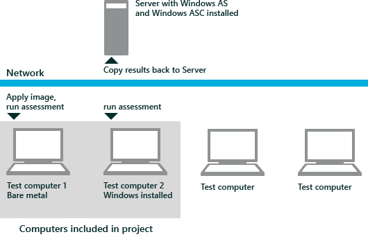

# Windows 评估服务逐步式指南

Windows 评估服务是用于自动化质量测量，如性能、 可靠性和功能，在实验室环境中多台计算机上的测试框架。 Windows 评估服务的客户端 (Windows ASC) 是用于管理设置和资产，如测试、 哪些图像应应用到这些计算机，以及用于测试计算机的评估哪些实验室计算机的图形用户界面。 Windows ASC 还可监视正在运行的作业的进度并查看所产生的结果。 评估计算机或图像质量、 Windows 评估服务测试框架执行以下任务︰

-   自动化测试计算机使用 Windows 部署服务 (WDS) 和自定义的 Windows 预安装环境 (Windows PE) 映像的映像部署

-   通过使用 Windows 远程管理 (WinRM) 自动化运行评估

-   通过使用 WinRM 将结果复制到 Windows 评估服务服务器自动从计算机测试结果的集合。

下图概述了 Windows 评估服务拓扑︰

本指南提供了安装 Windows 评估 Toolkit 以及配置 Windows 评估服务和 Windows ASC、 评估多台计算机，然后查看结果的分步指导。

本主题︰

-   [系统必备组件](#bkmk-wastr-prereqs)

-   [步骤 1︰ 安装和配置](#bkmk-wastr-step1)

-   [步骤 2︰ 创建项目](#bkmk-wastr-step3)

-   [步骤 3︰ 创建作业](#bkmk-wastr-step4)

-   [步骤 4︰ 运行作业](#bkmk-wastr-step5)

-   [步骤 5︰ 查看分析结果](#bkmk-wastr-step6)

-   [结论](#bkmk-wastr-conclude)

## Prequisites

若要成功完成本指南中概述的步骤，请验证您具有以下︰

-   用以下 Windows Server 2012:

    -   建议︰ 1 个千兆网卡

    -   建议︰ 跟踪文件、 结果和图像的可调整大小的存储空间

        **请注意**  
        在这种情况下，您可以使用 Windows Server 2008 R2。 但是，Windows Server 2008 R2 不支持动态驱动程序资源调配 (DDP)，步骤 1 和步骤 2，它用来添加 NIC 驱动程序，并将其他驱动程序导入到驱动程序存储区中所述。 您可以变通解决此问题使用部署映像服务和管理 (DISM) 添加到脱机 Windows 映像的驱动程序。 有关详细信息，请参阅[部署映像服务和管理 (DISM) 技术参考](http://go.microsoft.com/fwlink/?LinkId=214571)。

         

-   具有以下的一个或多个测试计算机︰

    -   支持 USB 启动

    -   网络 (PXE) 启动支持

    -   网卡驱动程序

    **请注意**  
    测试计算机可以是裸机 （没有安装操作系统） 或计算机正在运行 Windows 8。

     

-   一个 Windows 8 的图像 （如果您使用的裸露的金属计算机）

-   512 MB USB 闪存驱动器

-   所有计算机都必须位于同一子网

-   DHCP 服务器以分配 IP 地址，以测试计算机

有关系统要求的详细信息，请参阅[安装 Windows 评估服务](installing-windows-assessment-services-wastechref.md)。

## 步骤 1︰ 安装和配置

您必须在服务器计算机上，它还会在服务器上安装 Windows ASC 安装 Windows 评估服务。 您还可以在客户端计算机上安装 Windows ASC 是独立版本。 有关如何安装 Windows 评估服务和 Windows ASC 的详细信息，请参阅[安装 Windows 评估服务](installing-windows-assessment-services-wastechref.md)。

安装和配置包括以下步骤︰

-   正在初始化 Windows 评估服务

-   配置访问符号

-   将网卡驱动程序添加到 Windows Deplyment 服务使用 Windows PE 映像。 仅当测试计算机需要现成的网卡驱动程序，以便在库存或在部署 Windows 映像后具有网络连接时，此步骤是必需的。

-   测试计算机库存正在准备 Windows PE USB 驱动器。 要清点裸露金属的计算机，您必须创建可引导的 USB 驱动器启动计算机并将其添加到库存。

-   将测试计算机、 图像和无人参与的答案文件添加到库存。

-   将现成的驱动程序添加到 Windows 部署服务驱动程序存储区，以使它们可供在映像部署过程中的驱动程序注入。

有关如何执行此操作的详细信息，请参阅[Windows 评估服务安装和配置](windows-assessment-services-setup-and-configuration-wastechref.md)。

## 步骤 2︰ 创建项目

一个项目是要评估的资产的集合。 它标识多台计算机以及所有的计算机的子网的多个图像和图像添加到您的库存。 项目资产的兴趣，并对每个计算机上安装的符合管理视图提供映像和答案文件。 项目不包含评估。

在此步骤中，从库存中选择一台测试计算机上创建项目。 如果您选择的计算机是裸露金属的计算机，或要刷新测试计算机上的映像，也可以选择想要应用到每台计算机的图像。 一定要选择与测试计算机的体系结构匹配的图像。

**创建项目**

1.  在入门页面上，单击**新建项目**。

2.  在**项目名称**文本框中，键入**项目 1**。

3.  在**说明**文本框中，键入说明。 例如，**这是一个测试运行，以了解如何在我的实验室环境中使用评估服务。**

4.  在**关键字**文本框中，键入关键字，如**项目 1**，，然后单击**下一步**。

5.  在**选择要包括在此项目中的计算机**窗口中，单击**添加**，选择要包含在此项目中的计算机。 单击**确定**，然后单击**下一步**。

6.  在**图像库存**窗口中，单击**添加**，选择要向项目中添加图像。 单击**确定**，然后单击**完成**。

    **请注意**  
    如果计算机已有正在运行的操作系统，您不需要将图像添加到项目中。

     

Windows ASC 主页页面将打开。

## 步骤 3︰ 创建作业

在此步骤中，创建一个作业、 调整设置，并将作业存储在您的项目。 作业将评估与关联资产 （计算机和 Windows 映像）。 一个作业可以包含多台计算机、 相应的图像和无人参与的答案文件，以及多个评估。 您可以选择任意数量的评估服务，以在测试计算机上运行，但是，本指南演示在多个测试计算机上执行单一的评估。

**向作业添加评估**

1.  在主页上，单击**创建新的作业**。

2.  在新建作业窗口中，在**作业名**文本框中键入**检查驱动程序**。

3.  下面的作业类型有︰

    1.  **创建自定义作业**。 如果您选择此选项，您将添加自定义作业打开时设计 Windows ASC 在常规使用的评估。

    2.  **创建作业模板**。 如果您选择此选项，将打开一个模板窗口和添加预配置的作业或有预配置的设置的评估。

    3.  **创建一个能源效率作业**。 如果您选择此选项，您将添加用于运行工作负载测试在笔记本电脑上的电池寿命和能源效率的评估。

    单击**创建自定义作业**。

4.  在 Windows ASC 的新选项卡，默认情况下，作业设置会突出显示。 在右侧详细信息窗格中可以更改名称，添加描述，并添加关键字可帮助您识别作业，结果。

    调整下列作业设置︰

    1.  输入关键字可帮助您识别搜索中的作业。

    2.  从下拉列表中，选择一个**故障行为**，然后选择**停止**来停止作业，如果发生故障，因为我们只在此作业运行一个评估。

    3.  在**配置分析首选项**，选择何时对结果进行分析。

        默认情况下，**服务器上的完整分析**处于选中状态。 此选项允许您释放用于其他用途的目标计算机、 服务器以节省时间运行分析，充分利用资源和使用已经在服务器上加载符号。

5.  在**评估**中，单击**添加评估**。

6.  在右侧详细信息窗格中，单击加号 (**+**)**驱动程序验证**添加到作业评估旁边。

**添加不需要部署的测试计算机**

1.  在 Windows ASC，在**作业设置****概述**，然后单击并清除**应用图像**复选框。

2.  在**作业设置****资源**，请单击，然后单击**添加**以选择您希望运行该作业的计算机。

3.  在**选择评估资产**窗口中，选择计算机已安装支持的操作系统，然后单击完成。

**添加计算机和需要部署的映像**

1.  在 Windows ASC，在**作业设置****概述**，请单击，然后选择**应用图像**复选框。

2.  如果您想要插入匹配插在映像部署期间将存储资源调配的动态驱动程序的驱动程序的驱动程序，请选择**动态驱动程序设置**。

3.  在**作业设置****资源**，请单击，然后单击**添加**以选择您希望运行该作业的计算机。

4.  在**选择评估资产**窗口中，选择要评估的计算机。 **下一步**，请单击，然后单击**完成**。

5.  在 Windows 下**评估资产**ASC 的右侧显示的计算机。 选择一台计算机**更改图像**选择想要应用到该计算机的图像和，然后单击**确定**。

    **警告**  
    计算机和图像的体系结构必须匹配，不同之处在于，您可以选择基于 x86 映像部署到基于 x64 的计算机。

     

## 步骤 4︰ 运行作业

您可以运行作业上所有的资产，您添加到项目中，这些资产的一个子集上运行作业或在项目中可用的不同资产上运行不同的作业。 在此步骤中，您设置运行时设置、 运行作业和查看作业的进度。

**运行作业**

1.  在 Windows ASC，请单击**运行**以启动该作业实例。

2.  在**运行作业**对话框中，输入**作业实例标记**和**测试**信息，然后单击**确定**。

    **请注意**  
    作业实例标记标识迭代、 安装类型或比较的焦点。 例如，OEM Win7、 清理 Win7，OEM Win8、 清理 Win8。 您可以多次运行作业。 因此，您可以在作业的多个实例。 测试阶段表示里程碑、 逻辑的一组计算机或其它优异点，例如，阶段 A，B 阶段，阶段 C，d 阶段。这些关键字可帮助您确定相应的结果，当搜索结果列表中，但它们不是必填的字段。

    在该作业完成后，结果会被复制回服务器在\\ \\%was 服务器 %\\放松\\结果\\%项目 %\\%testpass%\\%jobname%\\%计算机名 %\\%jobinstancetag%\_%时间戳 %\\。

     

3.  当打开结果选项卡时，查看每台计算机上工作的进程。

4.  在 Windows ASC，在监视器实例窗口中，单击**查看详细信息**。

5.  单击计算机的名称，以查看有关该计算机上运行的作业过程的其他详细信息。

    **请注意**  
    如果要将图像应用到测试计算机，则可能需要几分钟时间来完成任务。

     

## 步骤 5︰ 查看分析结果

默认情况下，当您在 Windows ASC 中打开多个结果获得结果的摘要视图。 摘要视图将显示为列的每个作业实例。 下面概述表，每个作业实例中的评估指标显示为图表。 此摘要包含有关计算机、 运行的作业和测量到的总体指标。 它跨多个作业实例，提供了直观的比较，相同规格的并且可以选择显示哪些指标。 结果该视图可以帮助您确定您需要改进质量的实验室环境中的单个计算机。

在此步骤中，您可以查看已完成的作业的结果。

**查看分析结果**

1.  单击后退箭头返回到作业实例视图。

2.  验证该作业已完成，选择作业，然后单击**查看结果**。

    **请注意**  
    直到一个作业实例已完成并突出显示时，**查看结果**按钮将不可用。

     

3.  在**结果概述**页上，查看错误和警告的报告在每台计算机的总数**概述︰ 整体问题**表。

4.  所有可见的指标有概述表下的条形图。 在一个评估指标行，如**驱动程序验证︰ 设备缺少驱动程序**单击**排序**来排列按升序或降序顺序的关系图。

5.  在图表来突出显示本概述中的对应列中选择第一条。

6.  若要查看所选计算机的详细的作业结果的右下角，单击**查看详细信息**。

7.  展开具有最高值时，度量并选择个别问题可在右侧显示在详细信息窗格中的详细信息。

8.  在问题窗格中，展开以查看哪些建议的补救措施的问题之一。 例如，删除额外的驱动程序被建议如果您有多个驱动程序的设备。 如果列出额外的驱动程序，请浏览到该计算机，**可以删除额外的驱动程序**，下面所指定的文件位置，并删除额外的驱动程序。 当您再次运行作业时，您应该注意到，没有额外的驱动程序。

## 结论

本逐步式指南中，您安装和配置 Windows 评估服务，创建的清单将测试计算机和图像、 设置动态驱动程序设置，创建了一个项目、 运行一个作业使用驱动程序验证评估和审查评估结果。 这是一个基本的方案。 更高级的方案包括︰

-   在测试计算机上运行多个评估。

-   在一台计算机上运行同一组的评估，但使用不同的图像。

-   查看评估作业的不同图像的比较报告。

-   捕获和部署的其他格式的图像。

## 下一步行动

创建另一个作业，再尝试其他评估，添加更多的计算机，或使用不同的图像。 如果您运行最后一个作业使用 Windows 评估服务将 Windows 部署到计算机时，可以通过评估已经安装的 Windows 8 的计算机来节省时间。

## 相关的主题

[Windows 评估服务](windows-assessment-services-technical-reference.md)

[Windows 评估服务常见方案](windows-assessment-services-how-to-topics--wastechref.md)

[分析结果在另一个设备](analyze-results-on-another-device.md)

 

 

