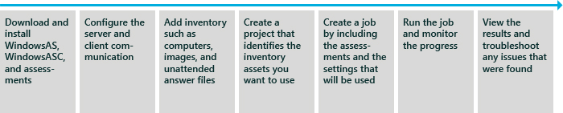

# Windows 评估服务

Windows 评估服务是用于自动化测量性能、 可靠性和功能在实验室环境中的多台计算机上的运行评估的测试框架。 它可以帮助您消除碎片、 易出错、 昂贵、 部署前测试流程，并使您可以只使用一个工具替换多个步骤和不一致的工具。

Windows 评估服务将附带 Windows ADK。

Windows 评估服务的客户端 (Windows ASC) 是与 Windows 评估服务进行交互的图形用户界面。 这使您可以管理设置和资产，如测试、 哪些图像应应用到这些计算机，以及应在测试计算机上运行哪些评估哪些实验室计算机。 可以使用 Windows ASC 来监视正在运行的作业，进度，并可以查看和比较所产生的结果。 其他好处包括︰ 能够将结果导入中央数据库，生成统一的报告。

下图显示了第一次使用 Windows 评估服务和客户端用户界面的工作流︰

Windows 评估服务技术参考提供了高级的操作信息、 故障排除和相关资源的技术细节。 若要了解如何将 Windows ASC 的端到端方案，请参阅[Windows 评估服务的分步指南](windows-assessment-services-step-by-step-guide-was.md)。

## 在这一节

<table>
<colgroup>
<col width="50%" />
<col width="50%" />
</colgroup>
<tbody>
<tr class="odd">
<td>
[安装 Windows 评估服务](installing-windows-assessment-services-wastechref.md)
</td>
<td>
了解有关系统要求以及服务器和客户端计算机的安装过程。
</td>
</tr>
<tr class="even">
<td>
[Windows 评估服务安装和配置](windows-assessment-services-setup-and-configuration-wastechref.md)
</td>
<td>
配置 Windows 评估服务服务器，准备 Windows PE 中，并添加库存，如计算机、 映像和驱动程序。
</td>
</tr>
<tr class="odd">
<td>
[Windows 评估服务概述](windows-assessment-services-overview--wastechref.md)
</td>
<td>
了解 Windows 评估服务优势、 常见方案、 限制和依赖项。
</td>
</tr>
<tr class="even">
<td>
[Windows 评估服务逐步式指南](windows-assessment-services-how-to-topics--wastechref.md)
</td>
<td>
了解如何安装 Windows 评估 Toolkit、 配置 Windows 评估服务和 Windows ASC、 评估多台计算机，并查看结果。
</td>
</tr>
<tr class="odd">
<td>
[Windows 评估服务常见方案](windows-assessment-services-how-to-topics--wastechref.md)
</td>
<td>
自动化部署，运行评估和收集结果。 此部分包含几个高级的帮助主题。
</td>
</tr>
<tr class="even">
<td>
[ResultsUtil 命令行选项](resultsutil-command-line-options.md)
</td>
<td>
使用 ResultsUtil 命令行选项将结果导入到 SQL 数据库。
</td>
</tr>
<tr class="odd">
<td>
[疑难解答 Windows 评估服务](troubleshooting-windows-assessment-services--wastechref.md)
</td>
<td>
了解有关的一般问题和解决方案。
</td>
</tr>
</tbody>
</table>

 

 

 

