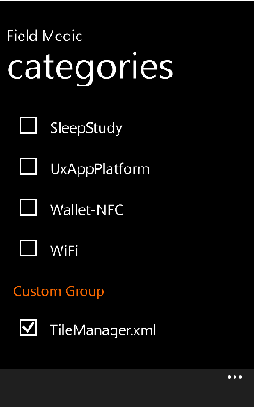

# <a name="custom-logging-with-field-medic"></a>与字段 Medic 自定义日志记录


您可以配置字段 Medic 从并非记录器的默认组的一部分的自定义记录器生成报告。 若要指定自定义记录器，创建配置文件的 XML 文件并将其复制到电话\\文档\\FieldMedic\\CustomProfiles。

在开发设备上，T 外壳可以用于将 XML 文件放到 OEM 共享文件夹。 可以创建一个简单的包那里放置文件。 有关自定义配置文件的 XML 文件必须包含的 XML 结构的详细信息，请参阅[创作录制配置文件](http://msdn.microsoft.com/library/windows/hardware/hh448223.aspx)。

## <a name="create-a-custom-profile-xml-file"></a>创建自定义配置文件的 XML 文件


下面介绍了如何创建一个自定义配置文件的 XML 文件的示例。 假设您想要创建一个包括以下两个 ETW 提供程序的自定义类别。

| ETW 提供程序名称                          | ETW 提供程序 GUID                    |
|--------------------------------------------|--------------------------------------|
| Microsoft 的 WindowsPhone-TileHelper          | B3448AD3-4BE8-4F7C-892B-EA1D69B14ADB |
| Microsoft 的 WindowsPhone-AccessoryManagerSvc | 68EC658D-C373-4166-996F-D8A757108B27 |

 

此自定义配置文件 XML 文件描述事件收集器具有 ID EventCollector\_TileManager。 事件收集器包含两个提供程序，后者在中指定&lt;EventProvider&gt;和&lt;EventProviderId&gt;元素。

``` syntax
<?xml version="1.0" encoding="utf-8" standalone='yes'?>

<WindowsPerformanceRecorder Version="1.0" Author="You" Team="Your team" Comments="Your comments" Company="Your company" Copyright="Your company" Tag="WPDiet">
  <Profiles>
    <!-- Event Collectors -->
    <EventCollector Id="EventCollector_TileManager" Name="WPDiet TileHelper Category Event Collector" Private="false" ProcessPrivate="false" Secure="false" Realtime="false">
      <BufferSize Value="128"/>
      <Buffers Value="40"/>
      <MaximumFileSize Value="5" FileMode="Circular"/>
      <FileMax Value="3"/>
    </EventCollector>

    <!-- Event Providers -->
    <EventProvider Id="EventProvider_Microsoft-WindowsPhone-TileHelper" Name="B3448AD3-4BE8-4F7C-892B-EA1D69B14ADB" Level="5"/>
    <EventProvider Id="EventProvider_Microsoft-WindowsPhone-AccessoryManagerSvc" Name="68EC658D-C373-4166-996F-D8A757108B27" Level="5"/>

    <!-- Profiles -->
    <Profile Id="TileHelperCategory.Verbose.File" LoggingMode="File" Name="TileManagerCategory" DetailLevel="Verbose" Description="WPDiet TileHelper category profile">
      <Collectors>
        <EventCollectorId Value="EventCollector_TileManager">
          <EventProviders>
            <EventProviderId Value="EventProvider_Microsoft-WindowsPhone-TileHelper"/>
            <EventProviderId Value="EventProvider_Microsoft-WindowsPhone-AccessoryManagerSvc"/>
          </EventProviders>
        </EventCollectorId>
      </Collectors>
    </Profile>
  </Profiles>
</WindowsPerformanceRecorder>
```

**请注意** 在前面的 XML 中列出的 ETW 提供程序是用户模式组件。 如果您的自定义配置文件 XML 文件列表内核模式提供程序，添加 NonPagedMemory ="true" &lt;EventProvider&gt;元素。

 

有关自定义配置文件的 XML 文件的结构的详细信息，请参阅[创作录制配置文件](http://msdn.microsoft.com/library/windows/hardware/hh448223.aspx)。

## <a name="add-your-custom-profile-to-field-medic"></a>将您的自定义配置文件添加到字段 Medic


1.  如上文所述，创建自定义配置文件的 XML 文件。
2.  将您的自定义配置文件 XML 文件复制到电话\\文档\\FieldMedic\\CustomProfiles。
3.  打开 FieldMedic 应用程序，然后点击**高级。**
4.  点击下**选择要使用哪个 ETW 提供程序**框。 向下滚动到**自定义组**。
5.  在**自定义组**，字段 Medic 显示在电话中的自定义配置文件 XML 文件的名称\\文档\\FieldMedic\\CustomProfiles。 选择自定义配置文件。
6.  [使用字段 Medic 要生成的报告](use-field-medic-to-generate-a-report.md)中所述，请生成一个报告。 产生的 ETL 文件具有"自定义-"的前缀，并放在设备或 SD 卡的根目录。

自定义配置文件可以是一起选、 分开，或混合与常规配置文件取决于您的记录要求。

**请注意**  
Windows 10 移动有 64 总并行配置文件中，其中可变数目始终采取标准的 OS 日志记录限制。 此保留的金额取决于图像的类型。 例如，在零售电话上保留的金额将远远小于在测试设备上。 因此，我们建议在一个自定义配置文件 XML 文件如有可能，在一起捆绑多个 ETW 提供程序或避免选择太多 ETW 提供程序并行。 如果错误仍然出现运行报告时，请尝试并取消选择某些配置文件。

需要考虑的另一个考虑因素是每个正在运行的配置文件所需的其余操作系统的系统内存量。 因此有太多的并行的日志记录会话可能会影响性能，尤其是在低内存设备上。 此内存量可配置 XML 文件中进行配置。 每个 XML 文件，标准附带的配置文件使用 8MB。 在调查内存过低的问题，我们建议运行该特定调查所需的配置文件。

 

 

 


