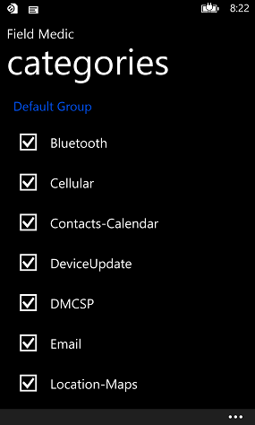
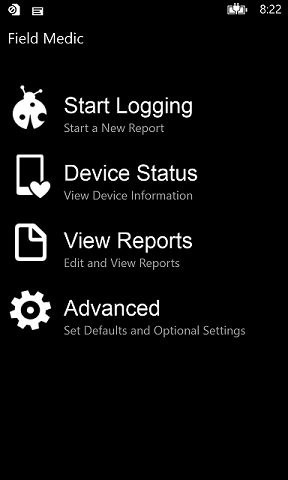
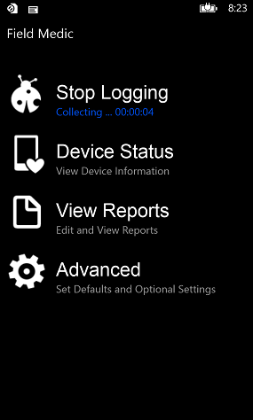
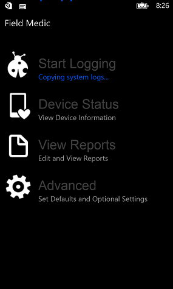
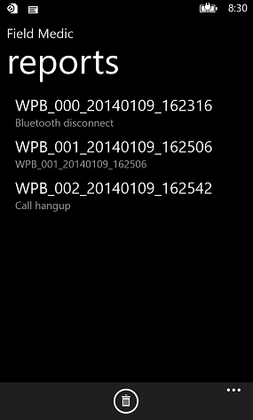
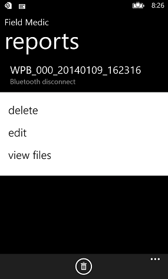
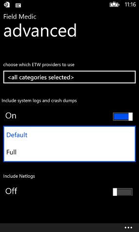

# <a name="use-field-medic-to-generate-a-report"></a>使用字段 Medic 生成报告


本主题说明如何创建报表 （称为"录制"报告）。 有关字段 Medic 信息，请参阅[域 Medic](field-medic.md)。

## <a name="recording-a-field-medic-report"></a>记录字段 Medic 报表


若要记录设备信息字段 Medic 报表中，使用以下步骤。

1.  运行域 Medic 应用程序。

2.  点击**高级**。 选择要在报表中包括的类别。

    

3.  请按**后退**按钮返回到主字段 Medic 屏幕。

4.  点击**开始日志记录**。

    

5.  启动日志记录后，字段 Medic 显示已的捕获时间下的**停止记录**选项。 关闭字段 Medic 按**后退**或**开始**按钮。 重现此问题，您想要收集的信息有关。

    **请注意**  
    所选类别的 ETW 日志记录将保持启用状态，即使设备重新启动，直到停止日志记录。

     

    

6.  重现此问题后，运行域 Medic 并点击**停止日志记录**。

    **请注意**  
    可能需要花费 5 秒钟或更长时间的字段 Medic 停止 ETW 会话，并创建报告文件。

     

    

7.  您可以查看、 编辑和删除捕获报告列表中的点击主屏幕上**查看报告**。

    

8.  默认情况下，命名格式的报表报告屏幕所示"WPB\_\#\#\#\_日期\_时间。"

    您可以按下并保持与该报表关联的文件的**删除**、**编辑**或**视图**列表中的报表。

9.  

可以使用 Xperf Tracerpt 和 ETWDump 这样的工具来检查 ETL 文件。

## <a name="a-href-idview-log-files-in-a-field-medic-report-aview-log-files-in-a-field-medic-report"></a><a href="" id="view-log-files-in-a-field-medic-report-"></a>在字段 Medic 报表中查看日志文件


1.  要提取字段 Medic 报表，请将设备连接到计算机的 USB 电缆。 从您的设备 （该设备的根目录或 SD 卡的根目录） 字段 Medic 报表复制到 PC 上。 此目录中的每个文件夹表示不同的报表，并包含几个 ETW 日志文件。
2.  在您的计算机，Windows 驱动程序工具包中找到 ETWDump。

    例如︰ C\\程序文件 (x86)\\窗口工具包\\10\\ToolFunnel\\EtwDump\\2.0\\EtwDump.exe

3.  Windows 驱动程序工具包中找到 ETW 清单文件。

    例如︰ C\\程序文件 (x86)\\窗口工具包\\10\\清单

    Mainifest (.mc) 文件包含 ETWDump 用来解码 (.etl) 日志文件的格式设置信息。

4.  打开一个命令提示符窗口，并确保 ETWDump.exe 的路径位于 Path 环境变量。

    下面是使用 EtwDump 进行解码 FieldMedic-联系人-Calendar.etl 日志文件的示例。

    ``` syntax
    etwdump FieldMedic-Contacts-Calendar.etl -import "C:\Program Files (x86)\Windows Kits\10\Manifests" -o FmCC.csv –of CSV
    ```

ETWDump 是解码 ETW 日志文件可以使用几个工具之一。 下面是一些其他工具可用来解码 ETW 日志文件︰

[Xperf](https://msdn.microsoft.com/library/windows/hardware/hh162920.aspx)

XPerf 包含在 Windows 适配和部署工具包 (ADK)。

[Tracerpt](https://technet.microsoft.com/library/cc732700.aspx)

Tracerpt 包括在 Windows 中。

## <a name="specify-advanced-options"></a>指定高级的选项


打开字段 Medic 应用程序，然后点击**高级**。 如上所示，您可以选择要在报表中包括的 ETW 提供程序类别。 您还可以指定是否在报表中包括这些项目︰

-   系统日志和故障转储 （默认或完全）
-   Netlogs
-   QXDM 日志

**请注意** 若要获取故障转储，必须在主操作系统设置屏幕反馈自愿参加。 自愿参加后，故障转储信息是定期发送给 Microsoft，当充电设备并连接到 Wi-fi 网络。 会话字段 Medic 报表时，崩溃报告不会发送给 Microsoft，但包括在域 Medic 报告。 任何故障转储当前未上载到 Microsoft 之前记录字段 Medic 报告也包括中下一字段 Medic 报表，将不会上载到 Microsoft 以后。

 



您还可以指定报表存储在 SD 卡上是否有可用的设备上。 这是非常有用的设备，没有多的空间来存储报告。

点击**选择用于存储报告的位置**，然后再选择**SDCard**


## <a name="a-href-idspecify-custom-loggers-aspecify-custom-loggers"></a><a href="" id="specify-custom-loggers-"></a>指定自定义记录器


字段 Medic 可以包含来自您指定的自定义记录器报告。 有关详细信息，请参阅[自定义字段 Medic 与日志记录](custom-logging-with-field-medic.md)。

## <a name="related-topics"></a>相关的主题


[字段 Medic](field-medic.md)

 

 


