# <a name="performance-windows-10-engineering-guide"></a>性能--Windows 10 工程指南

微软公司

2015 年 8 月，

### <a name="abstract"></a>摘要

性能 Windows 工程指南 (WEG) 让合作伙伴能够为客户提供高性能和节能的 Pc 的路线图。 本文介绍了测量、 分析和改进性能的关键领域，包括电池寿命和浏览体验，以及流媒体的机会。 OEM、 ODM 和 IHV 合作伙伴还可以开发和选择 Windows 应用商店应用程序相关的文档有效地运行在您的系统和链接此 WEG 在查找指南。

版本︰ 1.1

### <a name="copyright-information"></a>版权信息

本文档提供"为的是"。 信息和 URL 和其他 Internet 网站引用，本文档示例中表示的视图可能会更改恕不另行通知。

本文档中提及的一些示例仅用于说明提供，均属虚构。 没有真实的关联连接或妄加推断。

本文档不提供您与任何知识产权在任何 Microsoft 产品的合法权利。 可以复制和使用本文档的内部参考目的。 您可以修改此文档，出于内部参考目的。 本文档是机密和产权给 Microsoft。 它会泄漏并可仅按照保密协议。

© 2016 Microsoft。 保留所有权利。

### <a name="trademark-information"></a>商标信息

Microsoft 和 Windows 是 Microsoft 组公司的商标。 有关 Microsoft 商标的完整列表，请参阅[Microsoft 商标列表](http://go.microsoft.com/fwlink/?LinkID=287088)(http://www.microsoft.com/en-us/legal/intellectualproperty/Trademarks/EN-US.aspx) 在线。 所有其他商标分别是其各自所有者的财产。


# <a name="introduction"></a>简介

为我们下一代技术，客户会继续需要高性能和节能的 Pc。 客户要求今天的个人电脑提供了丰富的现代 web 体验、 超长电池供电时间和不同的一套功能强大的软件。 更多的客户希望提供他们与他们的移动电话，并有间断的和始终连接体验只能启用备用连接 PC 中的新设备。

性能 Windows 工程指南 (WEG) 如何提供更完美的 Windows 体验高性能 PC 上提供了指导。 本文介绍了测量、 分析和改进性能的关键领域，包括 web 浏览和流媒体的电池寿命的机会。 OEM、 ODM 和 IHV 合作伙伴还可以制定和选择有效地在您的系统运行的 Windows 应用商店应用程序在此 WEG 在查找指南。

本文档提供了一些工具和指导，使全用于 Windows 功能的硬件、 机械、 固件、 软件和制造工程师并不满足业务和市场营销的访问群体。 主题包括了如何为同时开发和部署驱动程序、 应用程序、 固件和硬件时以下制造最佳实践和性能优化。 本指南适用于传统的基于 x86 的 Pc，以及提供连接待机状态的设备。 它适用于消费者和商业市场。

**重要**&nbsp;&nbsp;&nbsp;性能 WEG 不是 Windows 硬件兼容性要求和 OEM 策略文档 (OPD) 进行通信。 WHCR 和 OPD 性能 WEG 中需要的任何信息优先的考虑。 您必须遵守 WHCR 和 OPD。

## <a name="document-updates"></a>文档更新

| 更新日期 | 说明 |
|--------------|------------------------------------------|
| 2015 年 4 月   | 1.0 版第一版 Windows 10 |
| 2015 年 4 月   | 1.1 版添加到链接 url 的文本 |


# <a name="delivering-a-great-experience-with-low-memory"></a>提供更完美的体验，在内存不足

可用的内存量将对整体的用户体验，从总体响应能力的系统，Windows 应用商店风格的应用程序和电池寿命之间切换时响应速度产生显著的影响。 这些是所有评估整体体验在内存不足时要考虑的非常重要因素。
（内存不足是 32 位 Windows 上的 RAM 的 1 GB 和 2 GB 的 RAM 在 64 位 Windows 上）。

## <a name="considerations"></a>注意事项

有 OEM、 IHV 和 ISV 需要面向低内存设备时应考虑的几种方法。

### <a name="drivers-and-apps"></a>驱动程序和应用程序

#### <a name="overall-baseline-memory-footprint"></a>总比较基准内存占用

典型的基准 32 位零售 Windows 映像会消耗大约 400 MB （如度量内存占用量评估用 ADK） 使用中的内存后启动的。
允许 10%预留空间或 1 GB 上为 100 MB，这样，内存为 2-3 应用程序可在物理内存中，启用应用程序之间快速切换。 大基操作系统内存占用量，较少的内存可供用户和应用程序。

影响基准操作系统内存占用量的主要因素是驱动程序和预装的软件，包括反恶意软件应用程序、 桌面应用设备的应用程序，以及软件更新，仅举几例。

-   **驱动程序的占地面积︰**这包括驱动程序代码和相关联的分配。 非分页内存 （或内容，需要在物理内存中并不能调出） 是非常重要，因为它构成方面的整个生存期内系统内存利用率的固定的成本，因为大多数驱动程序一直存在于内存中。 当前硬件认证要求涵盖非分页分配-MDL/连续内存分配非页面缓冲驱动程序代码，在每个驱动程序的基础上的非页面缓冲池。

    [Device.DevFund.Memory.DriverFootprint](http://msdn.microsoft.com/en-us/library/windows/hardware/jj124553.aspx)


-   **硬件内存预留︰**这包括内存"刻外，"这是极其重要的低内存设备上下文中的可用到 Windows 操作系统可见内存量减少了。 当前硬件认证要求提供不同的内存配置预算︰

    [System.Fundamentals.Firmware.HardwareMemoryReservation](http://msdn.microsoft.com/en-us/library/windows/hardware/jj128256.aspx)


-   **预装的软件和反恶意软件应用程序︰**其中包括服务/附加的进程在启动过程中启动和会话的生存期内保持活动状态。 引入了在启动过程的预装软件的一套需要仔细考虑和预算。

从操作系统的角度看，几个进行了改进以减少以使更多的内存可用于用户和其应用程序的 Windows 上运行时的内存需求量。 （有关详细信息，请参见[在 Windows 8 中的减少运行时内存](https://blogs.msdn.microsoft.com/b8/2011/10/07/reducing-runtime-memory-in-windows-8/)，在 MSDN 上的博客文章）。请务必确保，Oem 和 Ihv、 Isv 和 Microsoft 合作伙伴改进每个这些领域中的占地面积和仔细的考虑，以提供卓越的客户体验与配置设备。

### <a name="storage"></a>Storage

#### <a name="disk-performance"></a>磁盘性能︰ 

在低内存配置中，Windows 将依赖分页和交换的内存中的内容，因此基础磁盘的性能中提供平滑和快速响应的用户的体验至关重要。 硬件认证要求连接备用设备上存储的关键性能指标提供指导。 （有关详细信息，请参阅[Device.Storage 要求](https://msdn.microsoft.com/en-us/library/windows/hardware/jj134356.aspx)在 MSDN 上。

Windows 有机制来减少暂停 Windows 应用商店应用程序的内存使用情况并通过高效连续磁盘 IO 恢复它们。 （有关详细信息，请参见[从 Metro 样式的应用程序的 Reclaiming 内存](https://blogs.msdn.microsoft.com/b8/2012/04/17/reclaiming-memory-from-metro-style-apps/)，在 MSDN 上的博客文章）。例如，请考虑 120 MB 应用程序需要从简历-提供了连续的磁盘上的磁盘读取读取性能的 60 MB/s 需要 2 秒为该应用程序的磁盘，可提供 120 MB/s 将花费仅 1 秒，以使其内容到内存而从磁盘重新读取。 eMMC 和 SSD 存储提供了连续阅读的率约 120-150 MB/s，而典型的旋转磁盘具有大约 50 MB/s 的速度。 在 Windows 中的运行时策略进行权衡基于存储的性能和速度较慢的磁盘 （如硬盘和 HHDD） 这将导致可能较慢的应用程序的多任务切换/体验并提高了应用程序终止。

#### <a name="disk-endurance"></a>磁盘耐用性

耐受或生存期的非旋转像 SSDs 和 eMMC 磁盘存储的数据写入到设备以及其他几个因素 （工作负荷、 对齐方式写入，等等） 的总量成正比。
在 1 GB 设备上，将有更大的卷写入给定内存约束，这是一个重要的考虑因素，选择部件时存储。

耐用性而变化极大地取决于制造商 （块大小选择类型的闪存，等等。）;目前，没有标准化的方法来测量耐受。 建议合作伙伴评估磁盘之前进行设备选择决策的耐用性。

## <a name="recommended-goals"></a>建议的目标

注意︰ 下表提供有关运行 32 位 Windows 系统目标。 存储性能指南是适用于启动存储介质和测试具有较小的 2%或 1 GB 的可用磁盘空间。

<table>
<thead>
<tr class="header">
<th>Category</th>
<th>公制</th>
<th>目标</th>
</tr>
</thead>
<tbody>
<tr class="odd">
<th rowspan="9">比较基准内存占用量</th>
<td colspan="2"><strong>系统级别</strong></td>
<!--Empty cell in colspan-->
</tr>
<tr class="even">
<!--Empty cell in rowspan-->
<td>
<p>&nbsp;&nbsp;&nbsp;驱动程序非分页的代码</p>
</td>
<td>&lt;20 MB</td>
</tr>
<tr class="odd">
<!--Empty cell in rowspan-->
<td>
<p>&nbsp;&nbsp;&nbsp;驱动程序非分页分配</p>
</td>
<td>&lt;30 MB</td>
</tr>
<tr class="even">
<!--Empty cell in rowspan-->
<td>
<p>&nbsp;&nbsp;&nbsp;硬件内存预留</p>
</td>
<td>&lt;130 MB</td>
</tr>
<tr class="odd">
<!--Empty cell in rowspan-->
<td>
<p>&nbsp;&nbsp;&nbsp;汇总活动专用页的启动应用程序，服务任务</p>
</td>
<td>&lt;40 MB</td>
</tr>
<tr class="even">
<!--Empty cell in rowspan-->
<td colspan="2"><strong>每个驱动程序 （非页面缓冲分配）</strong></td>
<!--Empty cell in colspan-->
</tr>
<tr class="odd">
<!--Empty cell in rowspan-->
<td>&nbsp;&nbsp;&nbsp;驱动程序锁定/连续内存分配</td>
<td>12 MB 所有驱动程序类型。</td>
</tr>
<tr class="even">
<!--Empty cell in rowspan-->
<td>&nbsp;&nbsp;&nbsp;非页面缓冲分配</td>
<td>
<p>&lt;= GPU 驱动程序 6 MB</p>
<p>&lt;= 其他驱动程序 4 MB</p>
</td>
</tr>
<tr class="odd">
<!--Empty cell in rowspan-->
<td>&nbsp;&nbsp;&nbsp;非页面缓冲驱动程序代码</td>
<td>&lt;= GPU 驱动程序 10 MB &lt;= 1.66 MB 用于其它驱动程序</td>
</tr>
<tr class="even">
<th>启动应用程序的内存需求量</th>
<td><strong>启动应用程序、 服务和任务 （包括反恶意软件）</strong></td>
<td>&lt;40 MB</td>
</tr>
<tr class="odd">
<th rowspan="13">磁盘性能</th>
<td colspan="2"><strong>随机性能</strong></td>
<!--Empty cell in colspan-->
</tr>
<tr class="even">
<!--Empty cell in rowspan-->
<td>
<p>&nbsp;&nbsp;&nbsp;4 KB 写入 IOPs，测量 1 GB 区域上</p>
</td>
<td>&gt;= 200 IOPs</td>
</tr>
<tr class="odd">
<!--Empty cell in rowspan-->
<td>
<p>&nbsp;&nbsp;&nbsp;4 KB 写入 IOPs，测量 10 GB 区域上</p>
</td>
<td>&gt;= 50 IOPs</td>
</tr>
<tr class="even">
<!--Empty cell in rowspan-->
<td>
<p>&nbsp;&nbsp;&nbsp;64 KB 写入 IOPs，测量 1 GB 区域上</p>
</td>
<td>&gt;= 25 IOPs</td>
</tr>
<tr class="odd">
<!--Empty cell in rowspan-->
<td>
<p>&nbsp;&nbsp;&nbsp;4 KB 读 IOPs，测量 10 GB 区域上</p>
</td>
<td>&gt;= 2000年的 IOPs</td>
</tr>
<tr class="even">
<!--Empty cell in rowspan-->
<td>
<p>&nbsp;&nbsp;&nbsp;4 KB 2:1 读/写混合 IOPs，测量 1 GB 区域上</p>
</td>
<td>&gt;= 500 IOPs</td>
</tr>
<tr class="odd">
<!--Empty cell in rowspan-->
<td>
<p>&nbsp;&nbsp;&nbsp;4 KB 2:1 读/写混合 IOPs，测量 10 GB 区域上</p>
</td>
<td>&gt;= 140 IOPs</td>
</tr>
<tr class="even">
<!--Empty cell in rowspan-->
<td colspan="2"><strong>连续的性能</strong></td>
<!--Empty cell in colspan-->
</tr>
<tr class="odd">
<!--Empty cell in rowspan-->
<td>
<p>&nbsp;&nbsp;&nbsp;写入速度 (64 KB I/o)，通过一个 10 GB 的区域为单位</p>
</td>
<td>&gt;= 40 MB/s</td>
</tr>
<tr class="even">
<!--Empty cell in rowspan-->
<td>
<p>&nbsp;&nbsp;&nbsp;写入速度 (1 MB I/o)，通过一个 10 GB 的区域为单位</p>
</td>
<td>&gt;= 40 MB/s</td>
</tr>
<tr class="odd">
<!--Empty cell in rowspan-->
<td>
<p>&nbsp;&nbsp;&nbsp;读取速度 (64 KB I/o)，通过一个 10 GB 的区域为单位</p>
</td>
<td>&gt;= 60 MB/s † (120 MB/s)</td>
</tr>
<tr class="even">
<!--Empty cell in rowspan-->
<td colspan="2"><strong>设备 I/O 延迟</strong></td>
<!--Empty cell in colspan-->
</tr>
<tr class="odd">
<!--Empty cell in rowspan-->
<td>
<p>&nbsp;&nbsp;&nbsp;最长延迟时间</p>
</td>
<td>&lt;500 毫秒</td>
</tr>
<tr class="even">
<th>磁盘耐用性</th>
<td><strong>生命周期</strong></td>
<td>&gt;= 2-3 年</td>
</tr>
</tbody>
</table>

## <a name="measuring-memory-using-the-windows-assessment-and-deployment-kit-adk"></a>测量内存使用 Windows 评估和部署工具包 (ADK)

在 ADK 内存占用量评估提供了基线与零售 OS 映像的不同配置的内存占用量的定量计算。

### <a name="related-resources"></a>相关的资源

-   有关运行内存占用量评估和收集数据的指南︰ [http://msdn.microsoft.com/en-us/library/windows/hardware/hh825365.aspx](http://msdn.microsoft.com/en-us/library/windows/hardware/hh825365.aspx)

-   了解结果︰ [http://msdn.microsoft.com/en-us/library/windows/hardware/jj130826.aspx#BKMK_Goals](http://msdn.microsoft.com/en-us/library/windows/hardware/jj130826.aspx#BKMK_Goals)

## <a name="guidance"></a>指南

<!-- No content provided here in the original Word file. -->

### <a name="for-oem"></a>对于 OEM

Oem 必须通过所选的硬件/驱动程序和预装的软件直接影响系统的内存需求量明显的影响。

-   在部署之前，了解并量化的影响的驱动程序和软件安装在干净的图像的上方并确保它们在以上建议的目标是︰

<!-- -->

-   驱动程序占用的空间︰ 这可以通过减少的驱动程序，或选择的硬件/驱动程序具有较低的内存要求

-   预装的防病毒软件 /: 减少默认运行-always 启动进程 （引入预装软件） 以及启用特定应用程序或功能，如果需要使用者提供指导的数量

<!-- -->

-   请考虑使用不同的驱动程序或软件供应商，可以为您提供对系统内存的低影响的等效功能

<!-- -->

-   有关他们的软件以查看是否他们可以减少对内存的影响的最新版本，请参考您的驱动程序和软件供应商

    -   特定的驱动程序或软件上自己有高于推荐的内存使用率，以及跟踪/日志评估工具包中的伙伴提供反馈

### <a name="for-ihvisv"></a>对于 IHV/ISV

可以提供有效的驱动程序启用 Oem 构建为使用者提供更完美的体验的 1 GB 系统内存的 Ihv。

-   确保硬件部件符合认证要求的上方 （尤其是驱动程序的分页占用空间）、 存储硬件和始终运行应用程序的应用程序的内存使用情况的性能

-   能高效的功能，以及何时需要使用播放付款模型的内存使用

    -   避免配置驱动程序可以支持仅将所需的 1 GB 系统的功能 （例如，创建特定于平台的驱动程序包的检测硬件并加载到该特定代码）

    -   运行成本降到最低-分配时需要所需的最小内存和释放一旦完成 （例如，用于支持 RAID 存储缓冲区不是必需除非用户显式配置）

-   利用工具理解和改进的内存需求量。

    -   下面的讨论介绍了减少占地空间以及可用的 tools\ 的方法
        驱动程序和应用程序的内存需求量的减少︰ <http://channel9.msdn.com/events/BUILD/BUILD2011/HW-141T>

### <a name="for-antimalware-app-isv"></a>反恶意软件应用程序 ISV

反恶意软件应用程序可能会显著影响基准操作系统内存占用量和用户体验时未优化的性能。

-   确保尽可能地减少的数量和运行-always 服务/过程的足迹。 例如︰

<!-- -->

-   理想情况下只有一个处理/服务进行实时扫描

-   只在需要时以响应用户输入或通知应退出操作完成之后，应创建用于更新防病毒定义，显示用户界面的用户等其他进程

<!-- -->

-   能高效地运行-always 进程的内存使用情况

    -   维护一种数据结构来表示签名只加载特定的部分，即需即装

    -   除非显式请求的用户 （例如，在启动后立即打开的弹出式），不应启动用户界面

<!-- -->

-   Windows 提供一组核心 Windows Api 和相关的文档，以优化性能

    -   优化签名加载和维护使用压缩通过<http://msdn.microsoft.com/en-us/library/ee915356(v=PROT.13).aspx>

    -   保持缓存以前扫描的文件尽量减少工作

    -   用于最小化影响 CPU/磁盘和内存的低优先级

        -   SetPriorityClass\
            <http://msdn.microsoft.com/en-us/library/ms686219 (v=vs.85).aspx>

        -   SetThreadPriority\
            <http://msdn.microsoft.com/en-us/library/ms686277 (v=vs.85).aspx>

-   专注于空闲内存占用量，以确保在空闲的内存占用量是&lt;15 MB 也一样在完整的系统扫描和实时扫描来减少内存占用量尽可能多地在这些方案过程。

## <a name="validation"></a>验证

为了评估和验证过程和驱动程序的内存使用情况，用 ADK 的内存占用量评估。 一旦执行了评估，评估 Windows 控制台工具 (WAC) 中打开该报表并提取使用以下指南的相关指标。

### <a name="system-level"></a>系统级别 

在评估报告中，可以找到整个系统的内存规格。 下面的屏幕截图会突出显示**使用中的总内存**， **Driver Non-Paged 代码**和**分配**指标。

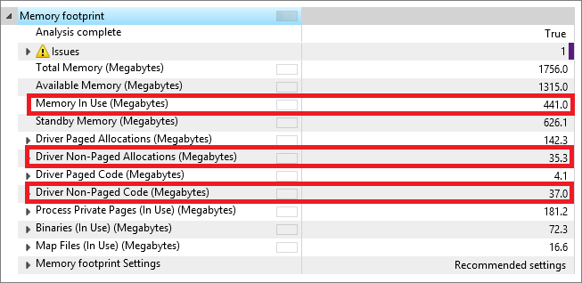

### <a name="per-driver"></a>每个驱动程序

#### <a name="non-paged-code"></a>未分页的代码

若要获得单独的驱动程序的特定的非分页的代码贡献，展开的**Driver Non-Paged 代码**度量。

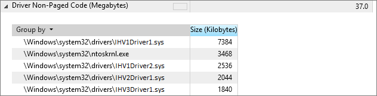

#### <a name="non-paged-allocations"></a>非页面缓冲分配

若要获得特定的非页面缓冲分配的单独的驱动程序，请展开**Driver Non-Paged 分配**指标，选择**组的- &gt; （无）**。

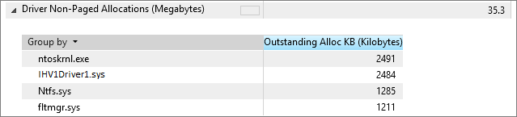

### <a name="span-idtoc375143139-classanchorspan-idtoc375143455-classanchorspan-idtoc375165809-classanchorspan-idtoc426441280-classanchorspanspanspanspanper-process"></a><span id="_Toc375143139" class="anchor"><span id="_Toc375143455" class="anchor"><span id="_Toc375165809" class="anchor"><span id="_Toc426441280" class="anchor"></span></span></span></span>每个进程

若要获取系统上的单个进程 （应用程序、 服务或任务） 的活动专用网页数量，展开**进程私有页**指标，和选择**活动**的子指标。

在下面的屏幕快照，Windows Defender （MsMpEng.exe 进程） 占用 14.9 MB 内存通过其私人工作集。

为了验证启动应用程序和服务以及任务的 40 MB 目标的实现，确定与预加载软件此列表中的每个进程和计算总和。

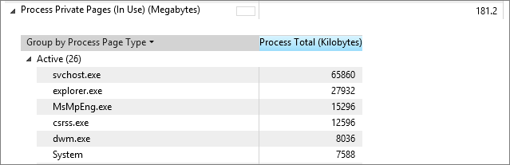

# <a name="delivering-a-great-startup-and-shutdown-experience"></a>提供很好的启动和关闭体验

本节概述了为合作伙伴提供最好的开/关为客户体验的快速启动的经验和我们的建议。

个人电脑被打开和关闭许多次一天。 一台电脑可能关闭、 睡眠、 或根据使用模式和设备的电池寿命功能休眠。 启动是用户与他们的设备和设备的终身重复性体验首次体验。 客户遥测告诉我们用户启动和关闭他们的 PC 至少每天一次。 备用连接功能可降低的频率与其必须引导的设备，但仍可能需要软件/固件更新时，电池电量不足，引导和主要的配置更改为该设备。

与 Windows 一起启动 8.x，开/关切换的速度则比以前的 Windows 版本快很多。 以前使用的用户交互模型是具有键中断启动按指示备用根路径。 更快的启动时间，启动中断是不实际的对引导体验产生负面影响。
从历史上看，很重要的决策点，如启动到其他操作系统，因为向后将是漫长而缓慢的过程尽可能早停止启动过程。
它也是时间的非常简单的慢的启动时间来创建在其中被检测到并激活这些按键段内。 这不再是这种情况在 Windows 8.x 和 Windows 10。

默认启动性能大大提高利用休眠技术。 开/关体验的性能所做的改进，请参阅本文档的[休眠 (S4) 暂停和恢复](#z1)部分。 本节中的注意事项针对快速开/关转换，这些转换，与相关的选项和 Oem/Odm 需提供经验的组件概述用户模型。

## <a name="considerations"></a>注意事项

启动延迟的主要来源是预加载 OEM 软件。 快速启动后关闭表示大约 50%的总体启动时间和启动时启动的第一和第三方进程产生直接影响。

-   服务可能会继续继续

-   启动应用程序︰ 送纸器运行快捷方式、 OEM 状态指示器，等等

-   防病毒活动

以上各项消耗系统资源 （CPU 和磁盘） 导致脉动对一个，另一个，或两者。 这样可使设备无响应，延迟应用程序启动时间，或使其滞后或缓慢。

开启/关闭性能进行优化时，应考虑这些事情︰

-   确定哪些非的收件箱 1 ^ st ^-或第三方进程已加载且在您的系统上运行。

-   确定什么通过注册表运行键开机启动。

    -   大多数情况下此处找到 IHV – 与硬件相关的过程。

-   避免在启动路径中包含托管的代码的进程。

-   使用技术来延迟开始启动进程。

-   考虑将传统的桌面应用程序转换为 Windows 应用商店应用程序，因为它们不会产生任何影响导致开机。

    -   使用 Ihv 可以利用 Windows 应用商店设备应用程序。

-   了解内存消耗关闭过渡时间的效果。

    -   优化内存消耗以减少后的大小。

    -   使用新的后诊断模式。

    -   我们不建议您启用在便携式计算机上的混合睡眠，和 ultraportables，因为这会生成待机状态后挂起 (S3)。

-   将迁移更新进程可以使用 AM 减少加载进程的数目。

-   了解磁盘吞吐量是非常关键的开启/关闭性能。

    -   一般情况下后, 读/写时间到起始屏幕时间意味着引导的 50%。

    -   大多数系统都绑定磁盘上引导。

    -   更快的硬盘/SSD 可以减轻重大软件预先加载被加载并初始化在引导的效果。

    -   您应该平衡 CPU、 磁盘性能和内存容量。

-   了解混合驱动器是有益于关闭性能。

    -   使用新的混合驱动器提示功能。

### <a name="fast-startup"></a>快速启动

与 Windows 一起启动 8.x，默认关闭并重新启动方案已更新，并命名为快速启动。 快速启动以关机过程开始，并包括写入数据存储到磁盘以类似的方式一种休眠状态的工作原理。 关键区别是注销所有用户会话 (会话 1)，而其余的信息写入到后。 从这种状态，而不是经过完整的启动过程中初始化 Windows、 驱动程序、 设备和服务，引导计算机时 Windows 将加载后从读取以前初始化的状态。 这将加快进入锁或启动屏幕的过程。

使用休眠技术扩展以创建新默认启动和关闭的经验，比完整的启动快得多。

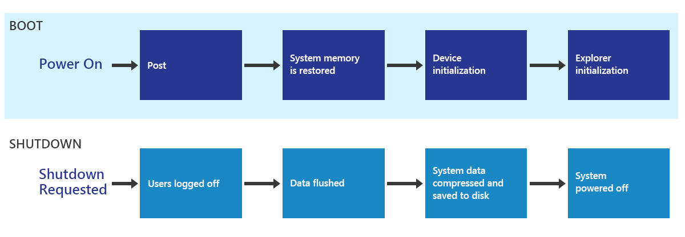

更快的启动和关闭序列使用休眠基础结构将电脑放在休眠。 与完全关闭和启动，不同用户会话将关闭，然后执行休眠。 因此，休眠文件是要小得多，使休眠和恢复过程要快得多。 此序列还利用并行优化。

与系统服务，系统集成商创建驱动程序或应用程序的开发人员也应该特别小心的驱动程序质量问题，如内存泄漏。 驱动程序质量始终是重要的而内核重新启动之间的最时间可能会大大超过在以前版本的 Windows 用户启动关机，内核驱动程序，因为和服务将保留和恢复，不会重新启动。

### <a name="full-boot"></a>完整的启动

下面的列表包含启用最佳启动体验的注意事项。

-   平衡 CPU 性能、 磁盘性能和内存容量。

-   优化读取路由性能 （uefi）。

-   确保的叶节点设备的驱动程序按照快速恢复的指导原则。

-   确保驱动程序以防止其他设备及其 S0 设置电源 Irp 尽可能快地完成其 S0 设置电源 Irp。

-   验证驱动程序和服务针对内存泄漏。

-   注册服务来接收电源管理事件通知仅在绝对必要时。

-   驱动程序不应该等到完成 S\_IRP 直到 D\_完成 IRP，因为这将防止其他设备接收其 S\_Irp，这将导致序列化延迟并提高总体暂停时间。

### <a name="shutdown-api-behavior"></a>关闭 API 行为

若要确保同时支持新应用程序可能的最佳体验与应用程序的最佳兼容性，已创建请求的快速启动关机的新标志。 下表描述的新标志和关闭 Api 的行为。 这些 Api 和标志的详细信息可在 MSDN 上。

| API                          | 关机问题 |
|------------------------------|------------------------------------------------------------------------------------|
| **InitiateSystemShutdownEx** | 总是执行完全关机 |
| **InitiateSystemShutdown**   | 总是执行完全关机 |
| **InitiateShutdown**         | 快速启动的关机使用执行关闭\_混合标志 |
| **ExitWindowsEx**            | EWX 使用快速启动执行关闭\_混合\_关机标志 |

### <a name="distinguishing-when-a-hibernate-or-a-shutdown-for-fast-startup-will-occur"></a>区分休眠或关闭快速启动将发生时

设备驱动程序将收到通知过渡到关闭电源状态 S5 目标而不是休眠状态 S4，即实际的电源状态。 这样，关机后设置不同的唤醒行为快速启动的驱动程序。 在系统中找到目标和有效状态\_电源\_状态\_上下文结构。

对于大多数设备，总线驱动程序层控制 S4 和 S5 唤醒行为之间的区别。 如果实现总线驱动程序，需要将它们区分开来，请与您的 Microsoft 代表联系的其他信息。 下面是一些帮助提供快速启动体验的最佳做法︰

-   平衡 CPU 性能、 磁盘性能和内存容量

-   优化读取路由性能 （uefi）

-   确保的叶节点设备的驱动程序必须快速恢复指南

-   确保驱动程序以防止其他设备及其 S0 设置电源 Irp 尽可能快地完成其 S0 设置电源 Irp

-   避免启动开机，除了反恶意软件的应用程序和设备的应用程序。

-   永远不会启动使用 RunOnce 启动的应用程序

-   避免在启动路径中的托管的代码应用程序

-   延迟启动的非关键的应用程序通过使用任务计划程序

-   验证驱动程序和服务针对内存泄漏

-   注册以接收电源管理事件通知仅在绝对必要时的服务

-   驱动程序不应该等到完成 S\_IRP 直到 D\_完成 IRP，因为这将防止其他设备接收其 S\_Irp，这将导致序列化延迟并提高总体挂起时间

### <a name="hibernate-s4-suspend-and-resume"></a>休眠状态 (S4) 暂停和恢复

在休眠过渡，内存中的所有内容都写入主系统驱动器上的文件。 此过程保留窗口、 应用程序和设备的状态。 当合并的内存占有量消耗所有物理内存时，休眠文件必须足够大，以确保有足够的空间来保存所有物理内存的内容。
由于数据写入非易失性存储器，DRAM 不需要维护自我刷新，可以关闭服务器电源。 这将导致很低的电量消耗，类似于 PC 处于关闭状态。

#### <a name="user-scenarios-for-hibernate"></a>休眠的用户方案 

这些是重大要求的情况下休眠如今运行 Windows 的个人电脑中的技术︰

-   **Doze 休眠︰**系统是左空闲和自动转入休眠状态的转换。

-   **电池电量严重短缺︰**Windows 会自动进入休眠状态以防止数据丢失，当电池电量不足时的 PC。

-   **热条件︰**系统可能会达到一个预定义的温度要求关闭自动系统电源保护电路。

-   **用户启动︰**用户选择保存当前的用户状态非常最小的功率休眠功能绘制。

虽然此列表可能会随着需要发展和个人电脑的功能演变，预计很多 Pc 将继续使用休眠状态，尤其是当连接待机状态不是可能的。

#### <a name="hibernate-phase"></a>休眠阶段

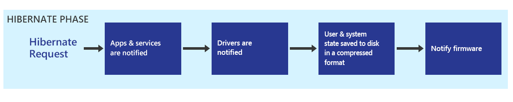

在此阶段中，Windows 指配一个休眠阶段发生的情况，然后将该用户的上下文和系统状态保存通知中的各种组件。 压缩数据并将其写入磁盘。 系统使用系统上的所有处理器内核压缩内存中的所有数据并将数据写入磁盘时将都使用一个处理器。 一旦所有的数据写入磁盘时，Windows 通知固件就可以关机。

固件通知是通过写入休眠类型注册的 S4 对象中 ACPI 4、 4.5 节、 表 4-13 和部分 7.3.4 定义中提供的值。 这指示固件下, 一步电源上时，一份简历将尝试而不是完整的启动。

#### <a name="resume-phase"></a>恢复阶段

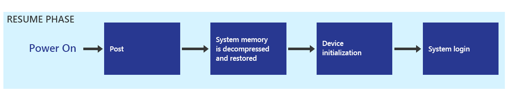

休眠状态恢复固件完全引导到类似的帖子开头。 Windows 启动管理器检测到从休眠恢复时所需的检测有效的休眠文件和指示系统恢复，恢复的内存和体系结构的所有寄存器的内容。 在休眠恢复时，内存中的内容是从磁盘读取，解压缩，并还原，将系统放在它的休眠时的准确状态。 内存内容恢复、 重新启动设备和计算机将返回到运行状态后，您可以随时登录。

请注意，尽管会通知设备驱动程序和服务，它们不会重新启动。 他们只是要还原休眠阶段发生时所处的状态。

还原操作的系统内存分为 2 个阶段。 第一阶段是为了还原最小内核，然后用于完成内存恢复为系统的其余部分的一部分。 第一阶段已可在单处理器环境核心。 但一旦还原系统内存的最小部分，可以使用所有处理器内核进行并行化的解压缩和恢复数据恢复，从而大大加快了该过程的其余部分。

该进程是进一步通过校正规模提高加密/解密算法，基于处理器的能力。

并行化优化的系统可以保证，它将有可能需要对其可用最少的环境中的所有数据的系统上不可用。 因此，如果还没有声明组件添加到崩溃转储堆栈，使用休眠恢复操作期间，该最小环境的一部分，它不能使用。 如果您正在创建这样的组件，如崩溃转储过滤器驱动程序或设备使用一个单独的崩溃转储的路径，请与 Microsoft 联系，以便我们可以引导您完成此过程。

### <a name="firmware-post"></a>固件开机自检

更快发布时间缩短从电源到可用状态的总时间。
因为 Windows 快速启动速度大大加快，开机自检的时间可能会变得更大比例的总启动时间。 开机自检时要求的附加信息记录在 Windows 硬件认证要求。 我们的分析显示开机自检时要求可以完全枚举和启用了一整套硬件组件运行前 – 的平台上实现系统环境。

Windows 8，因为所有的 Pc 需要运送其基于统一可扩展固件接口 (UEFI) 规范 2.3.1 或更高版本的固件。 由于许多系统都基于旧的、 传统的固件设计，有机会优化固件设计，以更好地适应更快的发布时间。

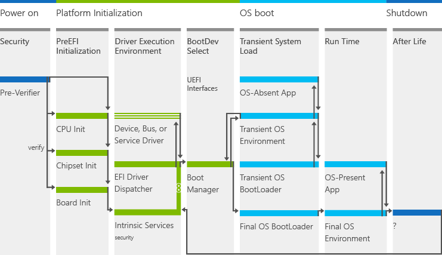

通过几个固件和平台的初始化阶段流动 （uefi） 体系结构。 根据这些定义明确的阶段，有几种可能减少开机自检时的设计考虑。

#### <a name="security-sec"></a>安全性 （秒）

在秒阶段，一个平台执行提取、 解压和 SPI NOR 闪存存储平台微代码的验证。 此时的电，平台是初始化内存和其总线。 以下是这一阶段的考虑。

-   特定于该 SKU 或一般到多个平台，则是微代码？ 微代码的大小将影响解压缩，转移到 RAM 和验证。

    请考虑重构微码是越小越好。

-   SPI NOR 闪存的总线速度会增加吗？ 许多平台支持多个时钟速度的 SPI NOR 闪存部分。 他们通常运行在较低的时钟频率 (例如，16 MHz)，并可以增加。

    考虑提高总线速度以减少 RAM NOR 闪存微码传输中的延迟。

-   平台是否具有足够的 NOR 闪存？ 为了节省成本，许多平台的设计与裸机最低 NOR 部件，导致更高压缩的微码和解压缩更大成本。

-   考虑的更大的 NOR 闪存部件来存储代码具有较少的压缩。

平衡压缩、 设计和微码的传输可能会提高性能的 POST 次数。 在秒结束时，验证微代码复制到 RAM 的 NOR 闪存 UEFI 内核和环境的其余部分。

#### <a name="pre-efi-initialization-pei"></a>Pre EFI 初始化 (PEI)

一旦内核内存，该平台初始化内核并开始验证的代码、 系统表和其它元素的完整性。
考虑设计适合您的平台 （uefi） 内核和不了一般非优化的内核。 优化可包括︰

-   在内核编译标记生成，以优化内存缓冲区。

-   链接到不需要的平台初始化的模块。

咨询的创意如何优化 UEFI 内核固件设计。

#### <a name="driver-execution-environment-dxe"></a>驱动程序执行环境 (DXE)

此时的初始化，核心 UEFI 驱动程序和第三方 DXE 驱动程序加载。 使用所提供的固件设计工具，所有者可以确定这是 DXE 驱动程序的最小的性能，并评估是否可以对该代码进行优化。

DXE 驱动程序加载的数量停留在这一阶段中的另一个考虑因素。 该平台应加载只保证引导并不依赖于可选的硬件所需的驱动程序。 最终的设计取决于目标引导选择。

#### <a name="boot-device-selection-bds"></a>引导设备选择 (BDS)

引导设备选择是到 Windows 平台初始化在移交前的最后一步。 在此步骤中，固件确定哪些引导设备都存在并移交执行哪一个。
精心设计和优化的引导变量会影响到 Windows 引导加载程序的过渡。

#### <a name="usb-enumeration"></a>USB 枚举

USB 枚举是往往要花很长时间的张贴内容的一部分。 与在 Windows 8 中引入新的更改，USB 枚举将不再需要默认情况下。 您可以为附加 POST 时间优化与硅和固件供应商。

但是，我们建议 USB 可枚举，如果引导顺序设置为引导到其他路径，如︰

-   如果有其他选项启动顺序，如当 Windows 转启动选项插入 USB 类引导项顶部的引导顺序中更高。

-   设置引导下一个变量，从而导致不同的引导设备使用。

-   在前面紧邻的启动上发生的故障。

### <a name="apps"></a>应用程序

开/关切换和能源效率，将会影响启动路径中的桌面应用程序。 任务管理器将标记有很大影响的桌面应用程序，而且通知用户有关一直使用现有的桌面应用程序。 有关详细信息，请参阅[启动应用程序](http://go.microsoft.com/fwlink/?LinkId=309749)(https://msdn.microsoft.com/library/hh848065.aspx)。 而不是自动启动的桌面应用程序，我们强烈建议您使用自动维护，它们只在需要时运行。

## <a name="recommended-goals"></a>建议的目标

**重要**&nbsp;&nbsp;&nbsp;定义的所有目标都排除 BIOS 初始化时间。

为了提供开/关经验很好，推荐 PC 达到这些目标︰

| **方案**             | **Tablet (CS)** | **转换** | **笔记本** | **多功能一体** |
|--------------------------|-----------------|-----------------|--------------|----------------|
| 快速启动 （秒）   | &lt;25         | &lt;= 15        | &lt;= 15     | &lt;= 15       |
| 后大小 (MB)      | &lt;300        | &lt;= 300       | &lt;= 300    | &lt;= 300      |
| 待机恢复 （秒） | 不适用  | &lt;= 7         | &lt;= 7      | &lt;= 5        |

<br/>
<table>
<tr>
<th>公制</th>
<th>单位</th>
<th>目标</th>
</tr>
<tr>
<td>
<p><strong>通过注册表运行键启动的进程数</strong></p>
<p>定义为在每次启动使用 Run 项启动的进程的总数。 在开机自检-开/关资源利用率 （CPU 和磁盘） 上有直接的影响。</p>
<p>可以通过看一些 ETW 事件 （使用泛型事件表） 的快速启动跟踪中找到︰</p>
<p>提供程序名称︰ Microsoft 的 Windows 的外壳-CoreTask︰ 资源管理器\_ExecutingFromRunKeyOpcode︰ 胜利︰ 开始</p>
<p>字段\#事件 （命令） 的 1 提供了命令行用来启动这些进程。</p>
</td>
<td>
<p>count</p>
</td>
<td>
<p>&lt;10</p>
</td>
</tr>
<tr>
<td>
<p><strong>普通优先级快速启动开机自检打开/关闭期间读取磁盘 IO</strong></p>
<p>此统计数据可以从直接评估结果在 Windows 评估控制台中，在下︰</p>
<p>总启动&gt;Post 开/关&gt;总磁盘使用&gt;普通优先级读取 （字节）</p>
</td>
<td>
<p>MB</p>
</td>
<td>
<p>&lt;30</p>
</td>
</tr>
</table>


## <a name="validation-and-testing"></a>验证和测试

您可以使用 Windows 评估 Toolkit 提高超出最低要求 PC 的性能。 Windows 关闭经验与相关的评估包括︰

-   快速启动评估

-   完整的启动和关机的评估

-   备用的评估

-   休眠状态评估

快速启动和休眠评估最新版本包括*后诊断*模式。 这种模式可以帮助检测驱动程序和应用程序导致大后大小和检测不实现多阶段恢复的存储驱动程序。

有的进入对于系统评估后的内存页的两个主要类别︰ 驱动程序非页面缓冲池页和应用程序/服务专用工作设置页。

新的模式将有助于您了解哪些软件组件需要改进的内存使用情况。

<a name="tools-and-technical-reference"></a>工具和技术参考
-----------------------------

您可以了解开/关的经验，和下载工具来帮助您分析这些资源的性能︰

| 资源标题                     | 内容类型 | 说明                                                                                                                                                                                                                 | 链接 |
|------------------------------------|--------------|-----------------------------------------------------------------------------------------------------------------------------------------------------------------------------------------------------------------------------|----------------------------------------------------------------------------------------------------------------------------------------------------------|
| 启动应用程序                       | 文章      | 重点介绍了一些启动应用程序在 Windows 设备上，有的效果并为开发人员 (ISV/IHV) 提供的指导和 Oem 重新启动应用程序以改进电池寿命和响应的使用模式的思考。 | [MSDN](http://go.microsoft.com/fwlink/?LinkID=309749)(https://msdn.microsoft.com/library/hh848065.aspx) |
| 打开/关闭评估结果 | Document     | 有助于解释结果产生的开/关评估 （启动性能 （快速启动） 启动性能 （完整的启动），待机性能，休眠状态的性能。                                          | [MSDN](http://msdn.microsoft.com/en-us/library/windows/hardware/jj130812.aspx)(https://msdn.microsoft.com/en-us/library/windows/hardware/jj130812.aspx) |


# <a name="delivering-a-great-browsing-experience"></a>提供了很好的浏览体验

本部分着重介绍一些性能问题和提供好的 Internet Explorer web 浏览体验，为您的客户可以执行的操作。

因为在当今的市场上的所有 web 浏览器都支持类似标准，性能迅速成为客户的一项关键优势。 消费者是敏锐地关注所有它们使用，包括浏览器的应用程序的性能。

## <a name="considerations"></a>注意事项

反恶意软件应用程序会影响 Internet Explorer web 浏览性能。 页面加载时间，测量的时间启动浏览器并定位到 web 页上，是用户体验的一个重要组成部分。
请务必您了解并考虑您安装在您的电脑，它如何影响您的客户，和什么感觉它们获取产品的性能。

### <a name="how-antimalware-apps-affect-browsing"></a>反恶意软件应用程序如何影响浏览

反恶意软件会影响浏览速度和流动性在四个主要类别。 反恶意软件如何减慢浏览器的一些示例包括︰

<ol style="list-style-type: decimal">
<li>
<p>网络和磁盘的干扰</p>
<ul>
<li>
<p>出站网络通信延迟</p>
</li>
<li>
<p>磁盘访问干扰</p>
</li>
<li>
<p>降低的网络并行度</p>
</li>
</ul>
</li>
<li>
<p>JavaScript 的干扰</p>
<ul>
<li>
<p>还原为传统 JavaScript 脚本引擎</p>
</li>
<li>
<p>JavaScript 调用重定向</p>
</li>
<li>
<p>在动态的 JavaScript 执行参与</p>
</li>
</ul>
</li>
<li>
<p>视觉的干扰</p>
<ul>
<li>
<p>冗余的版式方面的工作</p>
</li>
<li>
<p>网站的代码与竞争</p>
</li>
</ul>
</li>
<li>
<p>常规的干扰</p>
<ul>
<li>
<p>同步服务器通信</p>
</li>
<li>
<p>更改 Internet Explorer 的假设</p>
</li>
</ul>
</li>
</ol>

### <a name="selecting-antimalware-apps"></a>反恶意软件应用程序中选择

有多个因素，选择时要考虑反恶意软件产品将包括在您的 PC 上。 可以使用 ADK 评估或其他测试工具来量化到您的计算机的整体性能和电池寿命的影响。

请记住，不需要牺牲性能来了高级别的保护。 许多顶级的反恶意软件产品还在评估中我们很好地执行。

**重要**&nbsp;&nbsp;&nbsp;ADK 评估不测量的反恶意软件产品所提供的安全级别。 许多第三方生成报告测量和比较各种反恶意软件软件包的有效性。

## <a name="recommended-goals"></a>建议的目标

为了提供更好的 Internet Explorer 体验，PC 应实现以下目标︰

| **方案**                                                        | **Tablet (CS)** | **转换** | **笔记本** | **AIO**   |
|---------------------------------------------------------------------|-----------------|-----------------|--------------|-----------|
| IE 安全软件影响评估︰ 页面显示时间 （秒） | &lt;= 1.5       | &lt;= 0.5       | &lt;= 0.5    | &lt;= 0.5 |
| IE 启动 (用户 Perceived)(seconds)                                | &lt;= 1.0       | &lt;= 0.5       | &lt;= 0.5    | &lt;= 0.5 |

## <a name="validation-and-testing"></a>验证和测试

您可以使用 Windows 评估 Toolkit 提高超出最低要求 PC 的性能。 Windows Internet Explorer 与相关的评估包括︰

<dl>
<dt>&nbsp;&nbsp;&nbsp;&nbsp;&nbsp;<strong>Internet Explorer 启动性能评估</strong></dt>
<dd>
<p>标识组件可能会影响启动 Internet Explorer 所花费的时间。 评估测量时间完全呈现一个空白页，包括 IExplore.exe 的加载时间过程和框架创建和选项卡上创建的时间间隔。 它还能测量的所有扩展外, 接程序和工具栏安装到系统上的效果。 它不会计算任何网络或浏览性能。</p>
</dd>
<dt>&nbsp;&nbsp;&nbsp;&nbsp;&nbsp;<strong>Internet Explorer 安全软件影响评估</strong></dt>
<dd>
<p>测量 Internet Explorer 通常受反恶意软件应用程序和其他浏览器加载项的各个的方面。 评估措施在显示时间、 CPU 时间和资源利用率的 Internet Explorer 安全软件的影响。</p>
</dd>
</dl>

### <a name="internet-explorer-security-software-impact-assessment"></a>Internet Explorer 安全软件影响评估

IE 安全软件影响评估用于测量浏览更多相关的方案，并且着重对 Internet Explorer 浏览性能的反恶意软件影响。

反恶意软件和浏览器加载项上 Windows 体验有很大的影响。 通过展开数反映它们的影响的评估，我们将帮助您清楚地了解您的用户对其整体影响。

**请注意**&nbsp;&nbsp;&nbsp;建议总是比较干净 Windows 映像 （使用 Windows Defender 运行） 在同一个系统上对其结果，以量化由所选的第三方反恶意软件解决方案引入的影响。

此评估包括页面导航和 JavaScript 的性能，这两者都是核心的浏览体验。 它启动页后，可以行使很多关键性能瓶颈︰

-   大量使用 JavaScript 的

-   大量网络使用率

-   复杂的页面格式

在进行分析时，重点完成页加载持续时间和页面可用指标︰

-   完成页面加载持续时间

-   报告测试网页是在 Internet Explorer 中完全加载之前经过的总时间。 它测量页面加载持续时间直到 Internet Explorer CPU 的使用率是相对较稳定。

-   对可用的页加载

-   估计，加载页面之间间隔和当网页也是可用的时间。 此统计数据根据性能事件。

可以检测到多种类型的影响︰

- **网络和磁盘干扰**通常出现在网络请求度量和总的 CPU 使用率。

- **JavaScript 干扰**能莅临，在 JavaScript 指标或网络请求度量标准。

- 在文档绘制指标显示**视觉干扰**。


# <a name="delivering-a-great-media-experience"></a>提供很好的媒体体验

优秀媒体回放和捕获体验是平稳、 低延迟和高能效。 您可以使用在 ADK 和 HLK 测试 Windows 设备评估媒体回放、 实时通信和网络摄像头捕获方案的性能。

## <a name="considerations"></a>注意事项

杂音干扰的音频、 无故障的视频，和长电池寿命提供了提供了很好的媒体体验的设备。


### <a name="glitch-free-audio"></a>杂音干扰的音频

为了实现杂音干扰的音频，必须没有听见 pop 或音频流中的断点。 实时通信方案，音频必须是免小故障，并且也满足用户体验传统电话上交谈时的同一个低延迟。

一些音频故障引起的音频采样处理过程之前它们呈现给音频驱动程序。 媒体管道检测与事件日志使用事件跟踪 Windows (ETW) 这些难题。 媒体体验分析器 (MXA) 这样的工具可以用于缩小失灵的原因。

### <a name="glitch-free-video"></a>小故障免费视频

有两种类型的视频质量︰

-   *瞬时质量*下降时媒体引擎管道将停止，没有不连续的视频帧的处理中。 视频帧被丢弃或出现较晚，并且这可能明显对人眼。

    瞬时视频失灵的例子中所引入的瓶颈或更高优先级的线程在系统正常工作的硬件和介质管道包括延迟。

    瞬时质量影响︰

    -   快速启动。 如何快速视频加载并开始播放。

    -   音频/视频同步。 是否启动音频和视频流和同时停止并保持同一步调。

    -   在寻求延迟。 多快的速度前进，反向函数响应用户命令。

        播放和捕获管道检测的视频小故障和数据拖放事件可用于测量瞬时的视频质量。 管道采用多媒体类计划程序 (MMCSS) 服务。 此服务内置调度程序，并可确保高时效处理媒体管道中的接收对 CPU 资源的优先的访问。 多媒体应用程序可以尽可能多的 CPU 中尽可能使用而不拒绝到优先级较低的应用程序的 CPU 资源。 了解更多有关 MMCSS 在[MSDN](http://msdn.microsoft.com/en-us/library/windows/desktop/ms684247(v=vs.85).aspx) (https://msdn.microsoft.com/en-us/library/windows/desktop/ms684247 (v=vs.85).aspx)。

-   *空间的质量*是指媒体播放或当编码内容期间被损坏的视频流。 水平或垂直的撕裂或阻止宏可以引入视频回放的解码或视频处理阶段。

### <a name="long-battery-life"></a>超长电池供电时间

Windows 支持硬件卸载和几个其他电源节约功能使您能够在媒体工作负载提供竞争的电池寿命。 这些功能包括︰

-   *减轻负担的音频*-利用音频卸载，在卸载支持的平台上。

-   *多平面叠加 (MPO)*的几种芯片组提供 MPO 的减轻对硬件的视频处理的支持。 此功能减少了大约 50%，在节能和提高小故障复原能力产生内存带宽需求。

-   *[直接翻转 (https:/msdn.microsoft.com/en-us/library/windows/hardware/dn653329(v=vs.85).aspx)](https://msdn.microsoft.com/en-us/library/windows/hardware/dn653329(v=vs.85).aspx)
    & [独立翻转](http://msdn.microsoft.com/en-us/library/windows/hardware/dn457716(v=vs.85).aspx)(https://msdn.microsoft.com/en-us/library/windows/hardware/dn457716 (v=vs.85).aspx)* -
    Bypassess DWM 和翻转面直接到 GPU，全屏视频播放期间删除的内存副本。

-   *低刷新率播放*的媒体引擎的应用程序放到面板支持在全屏显示时的最小倍数的刷新率。 例如，当在一个系统上玩 XBox 视频应用程序中的 24 fps 视频内容具有液晶屏支持 48 hz 刷新率，介质管线将刷新率从 60 至 48 赫兹。

-   *批处理*的全屏幕播放模式，媒体引擎基于应用程序进程和队列上几帧中显示。 

媒体体验分析器时，分析工具，可用于验证是否忙于上面列出的功能。 它使您可以建立与 ETW 日志中捕获的系统活动生成的检测电源系统的电源使用情况之间的联系。

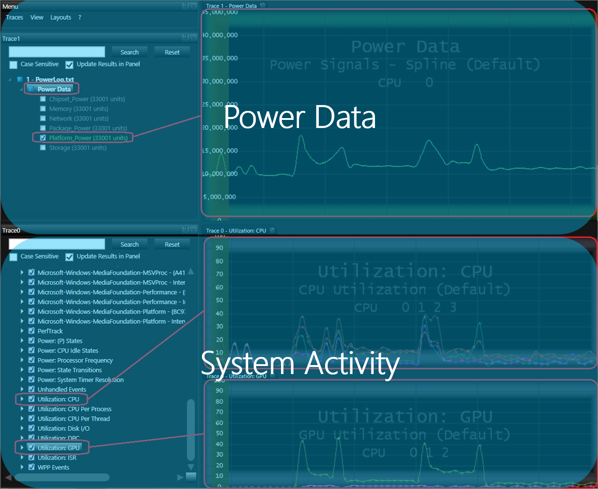

### <a name="impact-of-third-party-drivers-and-apps"></a>第三方驱动程序和应用程序的影响

第三方驱动程序和应用程序通常设计为可快速执行的任务，要完成上述任务;他们可能会以引入介质管线资源约束的优先级运行。 在某些情况下，有第三方驱动程序在派单级别运行的很长一段时间 (10 + ms) 和在其他情况下，实用程序硬代码运行优先级 22 处其线程的优先级。 下面的验证和测试一节中所述，第三方应用程序和驱动程序可以引入介质管道中的延迟，导致音频和视频的难题。

## <a name="recommended-goals"></a>建议的目标

为了提供一个很好的媒体回放体验，Windows 设备应满足以下的目标。 这些性能和质量目标应用于 Windows 应用商店应用程序和桌面应用程序。 它们应用于收件箱和第三方播放应用程序。

|   公制的优先级   |   公制                                                   | 卓越          |
|---------------------|------------------------------------------------------------|----------------------|
| 0                   | 稳定状态播放时音频故障                | 0                    |
| 0                   | 稳定状态播放期间丢弃视频失灵和数据 | 0                    |
| 1                   | 音频和视频故障数据放置在启动或关闭  | 0                    |
| 1                   | 音频/视频同步                                           | &lt;25 毫秒           |
| 1                   | DPC ISR/持续时间                                           | &lt;25 微秒 |
| 2                   | 启动延迟                                            | &lt;1 秒           |
| 2                   | 寻道滞后时间                                               | &lt;500 毫秒          |

要捕获的经验提供了很好的实时通信，Windows 设备应满足性能目标中 Windows 硬件概述和认证 (HCK) 测试列入验证和测试下面的部分。

## <a name="validation-and-testing"></a>验证和测试

可以使用硬件实验室工具包 (HLK) 以确保您的 Windows 设备满足 Windows 要求。

相关的多媒体播放功能的 HLK 测试包括︰

<dl>
<dt>&nbsp;&nbsp;&nbsp;&nbsp;&nbsp;<strong>无故障的高清播放测试</strong></dt>
<dd>
<p>播放 1080p 的视频内容和报告的视频的音频和瞬时故障数。 此测试可以有选择地生成可以分析的详细性能跟踪中的性能分析工具像媒体体验分析器。</p>
</dd>
</dl>

您可以使用 Windows 评估 Toolkit 提高 Windows 设备超出最低要求的性能。 Windows 评估相关的多媒体播放功能包括︰ 

<dl>
<dt>&nbsp;&nbsp;&nbsp;&nbsp;&nbsp;<strong>流式媒体性能</strong></dt>
<dd>
<p>在 Internet Explorer 中的 HTML5 视频播放的流媒体质量来衡量。 详细的 ETW 日志包含必要的诊断测试发现性能问题的原因的信息。 我们建议您设置不同于客户端系统上的流式处理服务器。</p>
<ul>
<li>
<p>流式处理服务器进程的主机到网络上的第二个系统的要求</p>
</li>
<li>
<p>按照 MSDN (https://msdn.microsoft.com/en-us/library/windows/hardware/hh825310.aspx) 来设置服务器上[设置远程服务器的流媒体性能评估](http://msdn.microsoft.com/en-us/library/windows/hardware/hh825310.aspx)中的说明进行操作。</p>
</li>
<li>
<p>更改以反映服务器配置的评估参数。 例如︰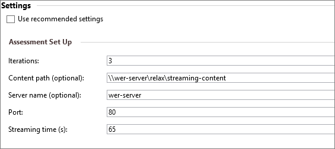</p>
</li>
</ul>
</dd>
<dt><strong>&nbsp;&nbsp;&nbsp;&nbsp;&nbsp;本地媒体回放能源效率工作负荷</strong></dt>
<dd>
<p>在 HTML5 播放 1080p H.264 的内容来衡量的电池寿命。</p>
</dd>
</dl>


### <a name="analyzing-audio-and-video-glitches"></a>分析音频和视频故障

媒体体验分析器是 MS 下载中心提供的可跟踪的可视化工具。 它可用于确定瞬时质量问题的根本原因。 小故障分析的一般方法可以分为四个步骤︰

1.  收集在一个媒体回放的工作负荷过程中使用 Windows 性能记录器 (WPR) ETW 日志。

2.  缩放到音频和视频小故障或数据拖放事件。

3.  搜索的瓶颈或意外在 CPU、 GPU、 磁盘或网络中的延迟。

4.  收集调用堆栈和分析屏幕快照类似的支持信息。

5.  通知并跟进引入延迟或失灵的组件所有者。

音频和视频数据下降或故障可以分为三个类别︰ 下游，中途，和上游。

#### <a name="downstream"></a>下游

从磁盘或网络速度不够快，才能跟上实时解码和呈现无法读取源时发生。 例如，磁盘可能限定由硬页错误而不能结果，从实时或更快的磁盘读取示例。 源一侧挨饿通常会导致数据拖放事件。

#### <a name="midstream"></a>中途

解密受保护的流的延迟，解码比实时、 慢或延迟到 GPU 提供框架。 原因可能是一个瓶颈，在硬件或软件解码器或其他系统活动干扰这些媒体组件。

#### <a name="upstream"></a>上游

在此阶段中，管道已解码和显示帧，但可能会有延迟，桌面窗口管理器 (DWM) 或图形堆栈中。 GPU 是限定或遇到慢内存传输时，会发生上游的瓶颈。 此媒体体验分析器的屏幕快照是如何可视化 ETW 日志中的上游瓶颈的一个示例。

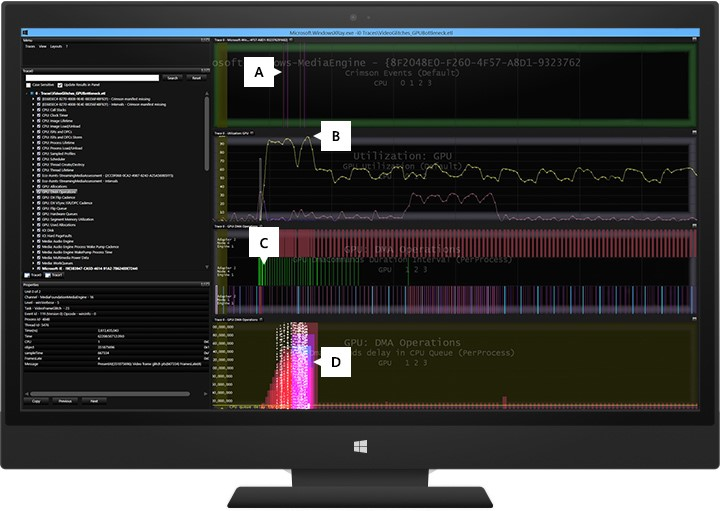

<dl>
<dt>&nbsp;&nbsp;&nbsp;&nbsp;&nbsp;一个面板</dt>
<dd>
<p>垂直线条是由媒体引擎激发的视频小故障事件。</p>
</dd>
<dt>&nbsp;&nbsp;&nbsp;&nbsp;&nbsp;面板 B</dt>
<dd>
<p>此图显示了一个 GPU 的节点运行利用率为 99%。</p>
</dd>
<dt>&nbsp;&nbsp;&nbsp;&nbsp;&nbsp;面板 C</dt>
<dd>
<p>每一行显示 GPU DMA 操作每个节点上。 以绿色标记的事件中间节点是内存传输。</p>
</dd>
<dt>&nbsp;&nbsp;&nbsp;&nbsp;&nbsp;面板 D</dt>
<dd>
<p>此图显示了 GPU 的 CPU 队列处理 DWM 操作时所用的时间量。 这是瓶颈的一种上游存在，GPU 是瓶颈的太忙于处理内存传输，呈现操作，以跟上呈现到屏幕的视频帧的实时要求。</p>
</dd>
</dl>

您可以使用媒体体验分析器，性能分析和可视化工具，以分析在 Windows 设备上的介质速度的问题。 媒体体验分析器包含专用的视图来捕获和播放方案期间诊断性能问题。
您可能会发现使用此工具的音频和视频故障的常见原因包括︰

<dl>
<dt>&nbsp;&nbsp;&nbsp;&nbsp;&nbsp;长时间运行中断服务例程 (ISR) 和延迟的过程调用 (DPC)</dt>
<dd>
<p>*ISR*内核中断调度程序将控制权移交给一个设备驱动程序例程当设备发出中断时出现的情况。 在 Windows I/O 模型中，Isr 运行以高设备中断请求等级 (IRQL)，以便他们执行很少的工作，尽量避免不必要地阻止低等级中断。 ISR 通常排队 DPC，运行在较低的 IRQL，执行中断处理的其余部分。 不应超过 100 微秒，运行 Dpc 和 Isr 不应运行时间超过 25 微秒。</p>
<p>除了其他系统的性能影响，长时间运行 Isr 和 Dpc 可能导致音频故障音频引擎中导致延迟。
ISR 或 DPC 时间超过 1 至 3 ms 会影响介质性能的系统上运行。 如长时间运行的 Isr 和 Dpc，频繁 Isr 和 Dpc （ISR/DPC 风暴） 都有类似的效果，在性能上。
通常在网络、 存储和图形驱动程序中找到此类 ISR 和 DPC 的问题。 评估的持续时间长于 3 毫秒长时间运行的 ISR Dpc，可 1 和 3 的 ms 和错误之间生成一个警告。</p>
</dd>
<dt>&nbsp;&nbsp;&nbsp;&nbsp;&nbsp;在派单级别下运行的内核工作线程</dt>
<dd>
<p>除了 Dpc、 一些内核线程可能同时运行派遣级别 (IRQL = 2)。 这也可能导致音频故障所导致的延迟。 若要检测此类延迟，查找低优先级系统线程的运行不间断长时间而不被抢占。</p>
</dd>
</dl>

下列指南清单应集成到 OEM 的设计和测试阶段的新 Windows 设备。

电源节约指南清单

-   使用硬件卸载和低刷新率显示器

-   优化内容自适应背景光控制 (CABC) 设置

-   优化默认屏幕亮度设置

-   Printf 调试驱动程序从日志中删除

-   运行 Windows ADK 能源效率本地视频播放评估，比较高的能效测试工具或同类测试度量值合理使用者使用情况和环境

-   主要媒体方案期间将大量后台活动减至最少

-   测试在交流和直流关键媒体体验

无故障的指南以进行媒体回放的核对清单

-   流的收费内容具有出电视机的 hdmi 接口

-   使用播放和 Miracast DLNA 电视上播放高级内容

-   验证 Xbox 视频和 Xbox 音乐体验

实时通信和网络摄像机捕捉的小故障免费指导核对清单

-   调整优化音频和视频质量处理的固件

-   验证正面和背面的摄像头使用收件箱和第三方捕获应用程序

-   使用的 HLK 和 Skype/Lync 认证测试可以提供出色的体验

-   参考有关如何解决类似照相机捕获图像模糊或暗的空间质量问题详细指导硬件窗口工程指南文档

## <a name="tools-and-technical-reference"></a>工具和技术参考

<!--No content provided here in the original Word file.-->

### <a name="media-experience-analyzer"></a>媒体体验分析器

媒体体验分析器是建议使用的性能分析工具，用于诊断音频和视频的故障。 此工具是提供专用的视图用于诊断在多媒体领域的不连续性和延迟图形堆栈中的性能分析工具。 它使广泛的性能分析师来诊断时间性能和 HCK 测试或手动测试报告的质量问题。 媒体体验分析器处理音频和视频播放方案执行期间收集的 ETW 跟踪。
该工具形象广泛的内核和用户模式跟踪会话期间激发的事件。 可以很容易地关联检测各种组件中的数据并执行根本原因分析。 此工具不会建议具体的解决方法，对于发现的问题，但它提供了详细的数据和证据，对于开发人员、 合作伙伴或组件所有者。

| 资源标题                                                                 | 内容类型       | 说明                                                                                                                                                                                                                                                                                                                                                                                                                                     | 链接
|--------------------------------------------------------------------------------|--------------------|-------------------------------------------------------------------------------------------------------------------------------------------------------------------------------------------------------------------------------------------------------------------------------------------------------------------------------------------------------------------------------------------------------------------------------------------------|-------------------------------------------------------------------------------------------------------------------------------------------------------------|
| 优化 Windows 设备                                                     | 视频和幻灯片 | 介绍的性能工具和用于在 Windows 设备上优化性能的测试套件。 本概述奠定生成 Windows 设备能够快速启动和浏览器启动，漂亮和快速响应的用户界面，可用小故障的多媒体体验。                                                                                                                                                                   | [第 9 频道](http://channel9.msdn.com/Events/WinHEC/2015/OWD204)(http://channel9.msdn.com/Events/WinHEC/2015/OWD204) |
| WinHEC 媒体实验室                                                               | Doc                | 介绍如何提供低延迟和小故障复原能力体验、 音频和视频播放质量、 小故障免费播放测试硬件实验室工具包 (HLK) 中，如何验证音频下放 WinHEC 媒体实验室。                                                                                                                                                                                                                               | [第 9 频道](http://channel9.msdn.com/Events/WinHEC/2015/OWDHOL301)(http://channel9.msdn.com/Events/WinHEC/2015/OWDHOL301) |
| 电池寿命概述                                                          | 视频和幻灯片 | 概述设计和传送系统的各个方面，提供超长电池供电时间系统上并在待机状态时。 主题包括︰ 电源建模和优化、 上期间屏幕优化电源平面布置和待机状态，待机模式︰ 连接备用 (CS)，和现代待机 (MS)、 能源评估引擎和报告影响软件预加载对电池寿命和电池保护程序体验简介 | [第 9 频道](http://channel9.msdn.com/Events/WinHEC/2015/OWD202)(http://channel9.msdn.com/Events/WinHEC/2015/OWD202) |
| 媒体回放应用程序的音频和视频性能                              | 文章            | 在开发使用音频和视频应用程序时，您应该了解一些重要的性能注意事项。 本文总结了主要设计领域中使用 JavaScript 的 Windows 应用商店应用程序获取高绩效媒体播放。                                                                                                                                                                                               | [MSDN](https://msdn.microsoft.com/en-us/library/windows/apps/xaml/hh848311.aspx)(https://msdn.microsoft.com/en-us/library/windows/apps/xaml/hh848311.aspx) |
| 如何优化视频呈现 （Windows 应用商店应用程序使用 JavaScript 和 HTML） | 文章            | 包含有关 msIsLayoutOptimalForPlayback 属性的信息。                                                                                                                                                                                                                                                                                                                                                                          | [MSDN](http://go.microsoft.com/fwlink/?LinkId=311550)(https://msdn.microsoft.com/library/windows/apps/hh452785.aspx) |
| 硬件卸载音频处理                                            | 文章            | 提供了有关音频卸载 Windows 8 和这种支持方式，公开的音频驱动程序中的信息转移到 Windows 音频堆栈的音频功能。                                                                                                                                                                                                                                                                         | [MSDN](http://go.microsoft.com/fwlink/?LinkId=311551)(https://msdn.microsoft.com/en-us/library/windows/hardware/dn302038 (v=vs.85).aspx) |

# <a name="delivering-a-great-app-experience"></a>提供很好的应用程序体验

<!--No content provided here in the original Word file.-->

## <a name="building-fast-fluid-and-power-efficient-windows-store-apps"></a>建立快速、 液体和节能的 Windows 应用商店应用程序

提供极好的 Windows 体验并不局限于固件和硬件组件。 应用程序的质量是一个关键的组件，提供更完美的 Windows 体验。 本部分列出了我们的建议和注意事项，对应用程序开发。

### <a name="tools-and-technical-reference"></a>工具和技术参考

| 资源标题                                                                         | 内容类型 | 说明                                                                                                                                                                                                                                                                                                                                                                                                                                                                                                                                         | 下载链接
|----------------------------------------------------------------------------------------|--------------|-----------------------------------------------------------------------------------------------------------------------------------------------------------------------------------------------------------------------------------------------------------------------------------------------------------------------------------------------------------------------------------------------------------------------------------------------------------------------------------------------------------------------------------------------------|----------------------------------------------------------------------------------------------------------------------------------------------------------------------------------------------------------------------------------------------------------------------------------------------------|
| 微软出版社出版的 HTML 和 CSS，JS 编程 Windows 8 应用程序                             |  Book        |  如何设计和构建 Windows 应用程序具有良好的性能具有多个指针的免费联机图书                                                                                                                                                                                                                                                                                                                                                                                                                                           |  [MSDN](http://blogs.msdn.com/b/microsoft_press/archive/2012/10/29/free-ebook-programming-windows-8-apps-with-html-css-and-javascript.aspx)(http://blogs.msdn.com/b/microsoft\_press/archive/2012/10/29/free-ebook-programming-windows-8-apps-with-html-css-and-javascript.aspx) |
| Windows 应用商店应用程序使用 HTML5 构建高性能                               |  视频       |  构建在 Windows 应用商店应用程序使用 HTML5 构建高性能的视频                                                                                                                                                                                                                                                                                                                                                                                                                                                                            |  [第 9 频道](http://channel9.msdn.com/Events/Build/BUILD2011/APP-162T)(http://channel9.msdn.com/Events/Build/BUILD2011/APP-162T) |
| 50 性能技巧以使您的 Windows 应用商店应用程序和站点使用 HTML5 更快     |  视频       |  构建在 50 性能技巧，使您的 Windows 应用商店应用程序和网站使用 HTML5 更快的视频                                                                                                                                                                                                                                                                                                                                                                                                                                                  |  [第 9 频道](http://channel9.msdn.com/Events/Build/BUILD2011/PLAT-386T)(http://channel9.msdn.com/Events/Build/BUILD2011/PLAT-386T) |
| 性能最佳做法用于 Windows 应用商店应用程序使用 c + +、 C\#，和 Visual Basic     |  文章     |                                                                                                                                                                                                                                                                                                                                                                                                                                                                                                                                                     |  [MSDN](http://msdn.microsoft.com/en-us/library/windows/apps/Hh750313.aspx)(https://msdn.microsoft.com/en-us/library/windows/apps/Hh750313.aspx) |
| 性能的常规最佳做法                                                 |  文章     |                                                                                                                                                                                                                                                                                                                                                                                                                                                                                                                                                     |  [MSDN](http://msdn.microsoft.com/en-us/library/windows/apps/hh994633.aspx)(https://msdn.microsoft.com/en-us/library/windows/apps/hh994633.aspx) |
| Windows 应用商店应用程序使用 JavaScript 的性能最佳做法                     |  文章     |                                                                                                                                                                                                                                                                                                                                                                                                                                                                                                                                                     |  [MSDN](http://msdn.microsoft.com/en-us/library/windows/apps/hh465194.aspx)(https://msdn.microsoft.com/en-us/library/windows/apps/hh465194.aspx) |
| 分析 Windows 应用商店应用程序的性能                                        |  文章     |                                                                                                                                                                                                                                                                                                                                                                                                                                                                                                                                                     |  [MSDN](http://msdn.microsoft.com/en-us/library/windows/apps/hh696636.aspx)(https://msdn.microsoft.com/en-us/library/windows/apps/hh696636.aspx) |
| 如何提高您 Metro 风格的应用程序的性能                                     |  文章     |                                                                                                                                                                                                                                                                                                                                                                                                                                                                                                                                                     |  [MSDN](http://blogs.msdn.com/b/windowsappdev/archive/2012/04/03/how-to-improve-performance-in-your-metro-style-app.aspx)(http://blogs.msdn.com/b/windowsappdev/archive/2012/04/03/how-to-improve-performance-in-your-metro-style-app.aspx) |
| 处理性能 killers︰ 常见的性能问题的 Metro 样式的应用程序        |  文章     |                                                                                                                                                                                                                                                                                                                                                                                                                                                                                                                                                     |  [MSDN](http://blogs.msdn.com/b/windowsappdev/archive/2012/04/05/tackling-performance-killers-common-performance-problems-with-metro-style-apps.aspx)(http://blogs.msdn.com/b/windowsappdev/archive/2012/04/05/tackling-performance-killers-common-performance-problems-with-metro-style-apps.aspx) |
| 计时和性能的 Api                                                            |  文章     |                                                                                                                                                                                                                                                                                                                                                                                                                                                                                                                                                     |  [MSDN](http://msdn.microsoft.com/en-us/library/windows/apps/hh767418.aspx)(https://msdn.microsoft.com/en-us/library/windows/apps/hh767418.aspx) |
| 分析在 Windows 应用商店应用程序的内存使用情况                                           |  文章     |                                                                                                                                                                                                                                                                                                                                                                                                                                                                                                                                                     |  [MSDN](http://msdn.microsoft.com/en-us/library/windows/apps/jj819177.aspx)(https://msdn.microsoft.com/en-us/library/windows/apps/jj819177.aspx) |
| 分析与 Visual Studio 代码分析 Windows 应用商店应用程序的代码质量      |  文章     |                                                                                                                                                                                                                                                                                                                                                                                                                                                                                                                                                     |  [MSDN](http://msdn.microsoft.com/en-us/library/windows/apps/hh441471.aspx)(https://msdn.microsoft.com/en-us/library/windows/apps/hh441471.aspx) |
| HTML 在 Visual Studio 2012 年更新 2 中的性能工具                                   |  工具        |  此工具为了帮助开发人员解决问题 （为什么我阻止 UI 线程？） 的 UI 响应、 可视化更新中的延迟 （我 UI 线程可以作出响应，但视觉更改花费的时间比预期要长）。 这是通过提供一组全面的"事件"（CPU 使用率的逻辑分类），在一段时间，包括应用程序逻辑以及平台的过程中，出现了代表您的应用程序 （如布局，GC，网络申请，图像解码时间） 发生的行为。|  [Microsoft.com](http://support.microsoft.com/kb/2797912) (https://support.microsoft.com/en-us/kb/2797912/) | 
| HTML5 应用程序的性能分析器                                                    |  工具        |                                                                                                                                                                                                                                                                                                                                                                                                                                                                                                                                                     |  [MSDN](http://msdn.microsoft.com/en-us/library/windows/apps/jj553524.aspx)(https://msdn.microsoft.com/en-us/library/windows/apps/jj553524.aspx) |
| Windows 应用程序认证工具包                                                          |  工具包         |                                                                                                                                                                                                                                                                                                                                                                                                                                                                                                                                                     |  [MSDN](http://msdn.microsoft.com/en-US/windows/apps/jj572486)(https://dev.windows.com/en-us/develop/app-certification-kit) |
| HTML 列表视图优化性能示例                                            |  代码示例 |                                                                                                                                                                                                                                                                                                                                                                                                                                                                                                                                                     |  [MSDN](http://code.msdn.microsoft.com/windowsapps/ListView-performance-39fb71f0)(https://code.msdn.microsoft.com/windowsapps/ListView-performance-39fb71f0) |
| 优化的性能演示文稿-DXGI Swapchain 旋转示例                     |  代码示例 |                                                                                                                                                                                                                                                                                                                                                                                                                                                                                                                                                     |  [MSDN](http://code.msdn.microsoft.com/windowsapps/DXGI-swap-chain-rotation-21d13d71)(https://code.msdn.microsoft.com/windowsapps/DXGI-swap-chain-rotation-21d13d71) |
| 列表视图 XAML 示例包                                                              |  代码示例 |                                                                                                                                                                                                                                                                                                                                                                                                                                                                                                                                                     |  [MSDN](http://code.msdn.microsoft.com/windowsapps/XAML-ListView-sample-pack-0ec6b60f)(http://code.msdn.microsoft.com/windowsapps/XAML-ListView-sample-pack-0ec6b60f) |

## <a name="analyzing-windows-store-apps-performance-with-the-adk"></a>分析 ADK 的 Windows 应用商店应用程序性能

Windows 性能分析器 ADK 8.1 中引入了专门分析 Windows 应用商店应用程序的性能的新功能/图形。

| 资源标题                                                          | 内容类型 | 说明                                                                                                                                                                                                                                                       | 下载链接 |
|-------------------------------------------------------------------------|--------------|-------------------------------------------------------------------------------------------------------------------------------------------------------------------------------------------------------------------------------------------------------------------|------------------------------------------------------------------------------------------------------------------|
| 应用程序的性能︰ 心理模型与平台进行交互     | 视频        | 此会话提供深入了解您的应用程序与平台的交互方式。 这些知识与您可以使用这些工具来解决性能问题                                                                                         | [第 9 频道](http://channel9.msdn.com/Events/Build/2013/3-097)(http://channel9.msdn.com/Events/Build/2013/3-097) |
| 应用程序性能︰ 规划成本小于 Rearchitecting                | 视频        | 此会话将阐释评估以及在开发过程的早期注意的性能与设计的值。 您将学习工具和评估性能的两个使用 XAML 的托管应用程序和应用程序使用 HTML5 技术。               | [第 9 频道](http://channel9.msdn.com/Events/Build/2013/2-098)(http://channel9.msdn.com/Events/Build/2013/2-098) |
| 应用程序的性能︰ 从对 5 个关键方案的 API 的用户体验                     | 视频        | 本次讨论将提供端到端如何提供卓越的性能，在 5 项方案--启动、 恢复、 平移、 重新调整和挂起的方案中心查看。 如果时间允许，我们可能会讨论动画、 常规的响应能力和应用程序安装。 | [第 9 频道](http://channel9.msdn.com/Events/Build/2013/3-099)(http://channel9.msdn.com/Events/Build/2013/3-099) |
| 应用程序的性能︰ Windows 性能 Toolkit                        | 视频        | 该讲座是为 Windows 性能 Toolkit (WPT) 的介绍。 我们将逐步介绍该工具的强大功能。 我们将向您展示如何来分析您的 Windows 应用商店应用程序，以便您可以提高您的客户体验                            | [第 9 频道](http://channel9.msdn.com/Events/Build/2013/3-100)(http://channel9.msdn.com/Events/Build/2013/3-100) |


# <a name="delivering-an-image-with-high-quality-windows-store-apps"></a>提供高质量的 Windows 应用商店应用程序的图像

有关部署 Windows 映像中的 Windows 应用商店应用程序的详细信息，请参阅应用程序和存储的 Windows 工程指南。 一旦部署应用程序，您可以测量激活并恢复图像预加载的每个应用程序的时间。

## <a name="recommended-goals"></a>建议的目标

下表显示了最小目标应用程序激活，根据我们对用户的研究。

| 方案/工作负载                            | Target |
|----------------------------------------------|----------------------------|
| 应用程序激活时间 （从冷启动） | 1 和 3 秒之间 |
| 应用程序恢复时间                              | 500 之间 1 秒 |


## <a name="validation-and-testing"></a>验证和测试

您可以使用 Windows 评估 Toolkit 提高超出最低要求您的应用程序的性能。 Windows 应用程序体验与相关的评估包括︰

-   Windows 应用商店应用程序性能评估

-   若要测量应用程序的恢复时间，使用推荐的设置的默认值。

-   要测量应用程序激活 （从冷启动） 的次数，确保在评估参数中选择"重新启动每个 Windows 应用商店应用程序"选项。

## <a name="tools-and-technical-reference"></a>工具和技术参考

| 资源标题                | 内容类型 | 说明                       | 下载链接 |
|-------------------------------|--------------|-----------------------------------|-------------------------------------------------------------------------------------------------------------------------------------------------------------------------------------- |
| Windows 应用商店应用程序性能 | 文章      | 官方评估文档 | [MSDN](http://msdn.microsoft.com/en-us/library/windows/hardware/dn246955.aspx)(https://msdn.microsoft.com/en-us/library/windows/hardware/dn246955.aspx?f=255 & MSPPError = 2147217396) |


# <a name="delivering-a-great-energy-efficiency-experience-with-modern-standby"></a>提供极好的能源效率体验与现代待机状态

极大地提高系统空闲的 S0 低功耗能数。 我们期待更多的系统，使用一直开，可立即使用的电源模型，而不是传统的 S3/S4 电源模型。
Windows 10 引入了一些更改，以支持这一趋势。

新的电源模型，称为现代待机 (MS) 的 Windows 10 中允许有硬盘驱动器、 和/或不支持的所有要求的 Windows 的 NIC 的系统 8.x 连接待机状态仍利用低功耗空闲模式。 *Windows 8.x 连接待机可以视为 Windows 10 现代待机状态的特殊情况。*

若要了解有关此新电源的详细信息，请参阅[介绍现代待机](https://connect.microsoft.com/site1304/Downloads/DownloadDetails.aspx?DownloadID=55993)(https://connect.microsoft.com/site1304/Downloads/DownloadDetails.aspx?DownloadID=55993) 白皮书。

*内心最深处的空闲平台的实时运行状态*(DRIPS) 时，系统消耗的电源可能，最低量受电源平面布置。 当屏幕被关闭时，备用连接的会话启动和系统经历多个阶段，以进入低功耗状态。 当系统处于低电量状态时，我们说系统处于 DRIPS。 系统没有 DRIPS 执行任务，例如，接收电子邮件时，在更新实时图块新鲜的内容，收到 VoIP 呼叫或任何其他消耗电能的后台任务。 系统处于 DRIPS 之前屏幕已打开后，更多的时间更长的电池寿命是。

**请注意**&nbsp;&nbsp;&nbsp;总现代待机状态会话时间 = DRIPS 时间 + 非 DRIPS 时间

性能 WEG 提供的信息可帮助您︰

-   演示如何在现代待机状态中运行时，系统都有延长的电池寿命。

-   识别并解决影响到现代待机状态的问题。

关于现代待机状态的工作原理的详细信息，请参阅以下资源︰

| 资源标题                                                       | 内容类型 | 说明                                                                                                                                                                                                                                                                        | 下载链接 |
|----------------------------------------------------------------------|--------------|------------------------------------------------------------------------------------------------------------------------------------------------------------------------------------------------------------------------------------------------------------------------------------|--------------------------------------------------------------------------------------------------------------------------------------------------------------------------------------------|
| 简介现代待机状态                                       | 白皮书  | 新的电源模型，称为现代待机 (MS) 的 Windows 10 中允许有硬盘驱动器、 和/或不支持的所有要求的 Windows 的 NIC 的系统 8.x 连接待机状态仍利用低功耗空闲模式。                        | [连接](https://connect.microsoft.com/site1304/Downloads/DownloadDetails.aspx?DownloadID=55993)(https://connect.microsoft.com/site1304/Downloads/DownloadDetails.aspx?DownloadID=55993) |
| WinHEC 2015 电池寿命优化概述介绍                  | 视频        | 电源优化在屏幕上和备用电源层建模和优化                                                                                                                                                                                                 | [Channel9](http://channel9.msdn.com/Events/WinHEC/2015/OWD202)(http://channel9.msdn.com/Events/WinHEC/2015/OWD202) |
| WinHEC 2015 电池寿命︰ 调试电源备用讨论问题 | 视频        | Windows 10 CS/MS 电源转换流程、 系统集成、 影响的系统上的子组件、 存储、 网络和 USB 连接设备的电源管理过程分析电池耗尽的问题和 SleepStudy 和 Windows 性能分析器 (WPA) 工具概述 | [Channel9](http://channel9.msdn.com/Events/WinHEC/2015/OWD200)(http://channel9.msdn.com/Events/WinHEC/2015/OWD200) |
| WinHEC 2015 电池寿命︰ 调试电源与备用实验室的问题  | 实验室的文档 | 该实验演示如何验证连接待机或现代备用系统的能源效率                                                                                                                                                                        | [Channel9](http://channel9.msdn.com/Events/WinHEC/2015/OWDHOL304)(http://channel9.msdn.com/Events/WinHEC/2015/OWDHOL304) |
| 连接待机简介                                    | Document     | 详细介绍了连接备用体验软件影响连接待机状态，并能够对限定的系统连接的备用的硬件要求。                                                                                                                       | [MSDN](http://go.microsoft.com/fwlink/?LinkId=306985)(https://msdn.microsoft.com/en-us/library/windows/hardware/dn481216 (v=vs.85).aspx) |
| 了解连接待机                                      | 视频        | 此会话概述连接待机，其中包括关键用户方案、 系统体系结构和技术要求。                                                                                                                                             | [Channel9](http://go.microsoft.com/fwlink/?LinkId=306986)(http://channel9.msdn.com/events/BUILD/BUILD2011/HW-456T) |
| 桌面的活动审查                                           | 文章      | DAM 功能概述                                                                                                                                                                                                                                                            | [MSDN](http://go.microsoft.com/fwlink/?LinkId=306987)(https://msdn.microsoft.com/en-us/library/hh848040 (v=vs.85).aspx) |


## <a name="considerations"></a>注意事项

若要优化您的平台的电源效率，您需要考虑下列因素︰

- [硬件是如何影响现代待机状态](#how-hardware-affects-modern-standby)
- [如何设计改善现代待机体验 OEM 映像](#how-to-design-an-oem-image-to-improve-the-modern-standby-experience)
- [应用程序如何影响现代待机状态](#how-apps-affect-modern-standby)
- [如何获得真实的测试结果](#how-to-get-realistic-test-results)
- [如何计算功率消耗](#how-to-calculate-power-consumption)

### <a name="how-hardware-affects-modern-standby"></a>硬件是如何影响现代待机状态

硬件组件使用不同速率的活动的模式和现代的备用电源。 您可以评估性能的硬件组件以查看是否他们会降低现代待机状态的经验，并与制造商联系，以提高效率。

### <a name="how-to-design-an-oem-image-to-improve-the-modern-standby-experience"></a>如何设计改善现代待机体验 OEM 映像

完整的 Windows 映像的设计可以提高或降低现代待机体验。 您可以运行在所有阶段的图像设计和开发，要尽早找出性能问题并进行设计决策基于结果的测试。

### <a name="how-apps-affect-modern-standby"></a>应用程序如何影响现代待机状态

Windows 应用商店应用程序连接到多个源，并且直接与硬件设备集成。 在现代的待机状态，如更新实时图块或播放背景音乐，应用程序才能执行某些任务。 这些任务从电池获得更多的电力。

在某些情况下，Windows 应用商店应用程序需要完成之前被暂停现代待机状态的用户启动的操作。 对于这种类型的活动，有特定的 affordances，使应用程序继续运行一段时间。 某些应用程序还可以防止设备进入现代的待机状态。 您可以评估应用程序在 Windows 映像他们降低现代待机状态的经验，并与应用程序开发人员来提高效率。

### <a name="how-to-get-realistic-test-results"></a>如何获得真实的测试结果

您可以自定义测试基于硬件和软件配置的计算机，以获得更准确的结果。 例如，您可以与反恶意软件在计算机上启用运行测试。

### <a name="how-to-calculate-power-consumption"></a>如何计算功率消耗

您可以估计为您的 PC 在不同方案中，包括现代的待机功耗的速率。 然后可以使用测试来验证这些估计，并确定由单个组件引起的性能问题。 若要了解如何计算功率消耗，看到电池注意事项文档。

## <a name="self-hosting-and-user-testing"></a>自托管和用户测试

我们建议您自托管程序来查找 bug 并提高对于现代备用系统的最终质量。 只能通过自我承载和真实的用户测试，可以发现某些 bug。 重点关注的领域应包括以下方案︰

-   CS 进入/退出可靠性和性能
-   热量
-   响应能力/性能
-   连接
-   电池寿命


## <a name="recommended-goals"></a>建议的目标

设备的电池容量和功耗应进行仔细分析以满足您的电池寿命目标。 合理使用者的使用情况和环境，以准确地投影设备的电池使用寿命来衡量。

下表显示了最小的电池寿命，根据我们对用户的研究目标。 此外应将电池寿命目标市场中产品进行比较。

| 方案/工作负载            | Target |
|------------------------------|------------------------------|
| 现代的待机状态               | &gt;= 对电池寿命 9 天 |
| 音频播放 （显示关闭） | &gt;= 125 小时 |

DRIPS %是以确定给定的系统是否在现代待机状态会话期间展示好或坏电池寿命的重要指标。

| DRIPS %   | 评估 |
|-----------|------------|
| 98-100  | 非常好 |
| 95 – 97.9 | 非常好 |
| 90-94.9 | 很好 |
| 80 – 89.9 | 公平 |
| &lt;80   | 差 |


## <a name="validation-and-testing"></a>验证和测试

<!--No content was provided here in the original Word file.-->

### <a name="generating-a-report-on-battery-life-estimates-and-history-by-using-powercfgexe"></a>通过使用 PowerCfg.exe 生成电池寿命估算和历史记录报告

PowerCfg.exe 工具使用 Windows 安装。 您可以使用 PowerCfg.exe 工具识别您的 PC 上的电池寿命不一致。
PowerCfg.exe 使用 Windows 操作系统的电池用量，72 小时内包括电源状态报表详细信息中的系统跟踪。 电池使用情况报告显示用电数据即使 PC 未处于活动状态。

若要生成电池使用率报表打开提升的命令提示符下，运行下面的命令︰ **powercfg.exe /batteryreport /output c:\\报告\\batterylife.html**

电池使用情况报告提供有关安装在 PC、 电源状态和最后 72 小时内的电池消耗，电池使用和更改的历史记录，回到几个月，电池的充电能力的电池和电池寿命估计基于 PC 的实际历史记录信息。

有关 PowerCfg.exe 工具的详细信息，请参阅[PowerCfg 命令行选项](http://go.microsoft.com/fwlink/?LinkId=264942)(https://technet.microsoft.com/en-us/library/hh824902.aspx)。

### <a name="generating-a-report-on-modern-standby-issues-by-using-sleepstudy"></a>通过使用 SleepStudy 生成现代待机问题的报告

SleepStudy 是一个新的 Windows 诊断工具支持现代待机状态。 它监视现代备用电脑行为并提供现代的备用电池寿命可操作诊断。 它是只在启用了 CS 的 Pc 上提供。

SleepStudy 生成摘要导致较差的现代备用电池寿命的热门问题。 若要获取该报表，请在提升的命令提示符运行 powercfg /sleepstudy 命令。 这种新工具会很有用如果您计划让查找和会审的 bug 的自托管程序。

关于 PowerCfg /SleepStudy 工具的详细信息，请参阅[连接备用 SleepStudy](https://msdn.microsoft.com/en-us/library/windows/hardware/dn495346(v=vs.85).aspx) (https://msdn.microsoft.com/en-us/library/windows/hardware/dn495346 (v=vs.85).aspx)。

下面是一个示例。 此屏幕显示计算机信息，包括设备名称、 固件和内部版本号。 该图表显示了在现代待机状态时的消耗速率。

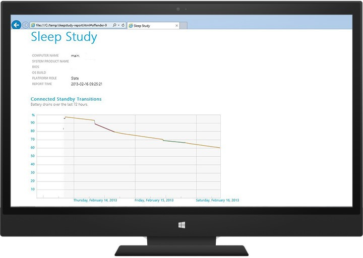

这是每个会话表。 在此示例中，会话 3 具有最高的消耗率。 单击它可打开下一级别的详细信息以发现可能的入侵者。

**能源更改**列表示在特定的 CS 会话过程中耗尽的电池 （mWh) 的能源量。 **更改率**列表示平均功耗 （mW) 在特定的 CS 会话期间。

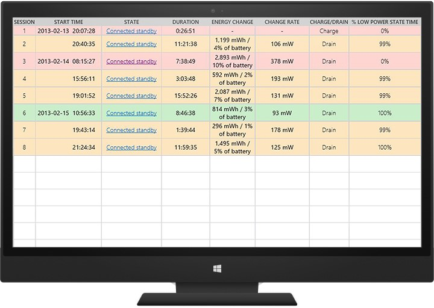

在此示例中，没有 UART 驱动程序处于活动状态在此会话中的全部时间。 这可作为起始点进行更彻底的调查。

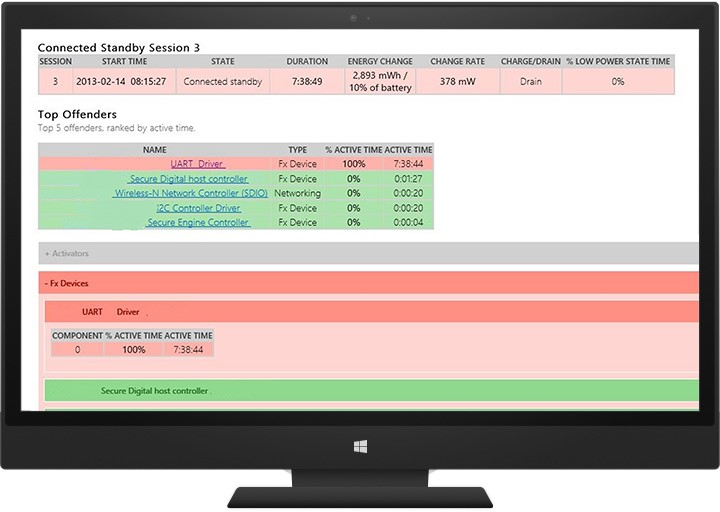

#### <a name="automating-connected-standby-testing-by-using-pwrtestexe"></a>使用 PwrTest.exe 来备用测试自动化连接

可以在 Microsoft Windows 驱动程序工具包 (WDK) 使用 PwrTest.exe 工具，循环切换电源状态，包括连接的待机，记录处理器电源管理和电池信息从系统通过一段时间。

**可以使用 PwrTest.exe 运行连接的备用方案**

1. 安装[WDK](http://go.microsoft.com/fwlink/?LinkId=226411)(https://msdn.microsoft.com/en-US/windows/hardware/gg454513)。

2. 在命令提示符处，导航到计算机的体系结构匹配的 PwrTest.exe 版本。 例如，键入︰ **cd c:\\WDK\\工具\\PowerManagement\\i386**

3. 与**/cs**选项运行 PwrTest.exe。 此外可以指定的周期 (**/c**)，延迟时间，以秒为单位 (**/d**)、 过渡和退出时间以秒为单位 (**/p**)。 例如，键入︰ **pwrtest.exe /cs /c:4 /p:120 /d:150**

**请注意**&nbsp;&nbsp;&nbsp;的连接的备用方案需要虚拟电源按钮驱动程序。
安装此驱动程序通过 Windows 设备测试框架 (WDTF)，位于 WDK 8。

PwrTest.exe 连接备用方案日志文件提供有关电源状态之间的转换信息。

连接备用压力硬件兼容性测试还允许您指定的测试周期，测试周期之间的延迟数等参数。

有关详细信息，请参见[PwrTest](http://go.microsoft.com/fwlink/?LinkId=306989) (https://msdn.microsoft.com/en-us/library/windows/hardware/ff550682 (v=vs.85).aspx)。

# <a name="delivering-a-great-energy-efficiency-experience"></a>提供极好的能源效率的体验

电池寿命和能源效率是现代计算中最活跃的主题。 最近的研究表明，76%的消费者评价为"非常重要"的电池寿命选择 tablet 和移动 PC 时。 由于其角色仍为竞争优势，电池寿命是至关重要的。

请务必在 Windows 基础的硬件平台、 Windows 映像和扩展 （驱动程序、 预加载的软件、 服务等） 采用全方位的做法来优化功耗 （瓦使用）。

## <a name="considerations"></a>注意事项

设计和开发过程的每一步，您的电脑能源效率和电池寿命受到影响。

### <a name="how-to-select-battery-capacity"></a>如何选择电池容量

确定电池的生活目标、 工业设计、 目标成本和计算机，以帮助您选择适当的电池容量的目标市场。 认为这在您规划和开发阶段的早期，以便不采的电池以满足您的目标太小。
有关建模电池寿命运行库的详细信息，请参阅附带上连接 WEGs*电池指南*文档。

### <a name="how-to-design-an-oem-image-to-improve-battery-life"></a>如何设计 OEM 映像以提高电池寿命

完整的 Windows 映像的设计可以提高或降低电池的性能。 例如，您的应用程序、 驱动程序和电源计划选择可以更改 PC 的电源消耗。

您可以运行在所有阶段的图像设计和开发，要尽早找出性能问题并进行设计决策基于结果的测试。

## <a name="recommended-goals"></a>建议的目标

这一节中所述的目标旨在帮助您设计提供了竞争的电池寿命，同时运行 Windows 的完全集成的平台。 所述的目标不是为 Windows 提供的承诺，它们可以在您的硬件满足目标。 根据生态系统合作伙伴、 Windows 开发和平台电源管理有效性的反馈，目标将不断地进行调整。

仔细分析设备的电池容量和电源绘图以满足您的电池寿命目标。 合理使用者的使用情况和环境，以准确地投影设备的电池使用寿命来衡量。

下表显示了我们的用户研究的含义是按照用户期望的最低质量标准。 此外应将电池寿命目标市场中产品进行比较。 可以使用 Windows 电池评估测试 Windows 评估和部署工具包 (ADK)、 可比能耗效率测试工具或同类测试中的可用来测量合理使用者的使用情况和环境来验证电池寿命。

| 方案                                                                      | Tablet (CS)     | 转换     | 笔记本 |
|-------------------------------------------------------------------------------|-----------------|-----------------|--------------|
| 电池寿命视频播放@（小时） 根据外形的 150-200 尼特 | &gt;= 12        | &gt;= 6         | &gt;= 5 |


| 公制                               | Target |
|--------------------------------------|--------|
| 系统计时器分辨率              | 15 毫秒 |
| 对直流和交流的最大处理器状态<br/>（处理器电源管理）<br/>不能应用于连接备用支持系统。 |   100% |

                                         


## <a name="validation-and-testing"></a>验证和测试

可以使用 Windows 评估 Toolkit、 可比能耗效率测试工具或同类测试测量合理使用者的使用情况和环境，以改善您的 PC 超出最低要求。 包括 Windows 评估与活动相关的工作负载电池寿命︰

<dl>
<dt>&nbsp;&nbsp;&nbsp;&nbsp;&nbsp;<strong>空闲的能源效率作业</strong></dt>
<dd>
<p>在系统空闲，降低系统的能源效率过程中指出了软件、 驱动程序和设备的问题。</p>
</dd>
<dt>&nbsp;&nbsp;&nbsp;&nbsp;&nbsp;<strong>电池的使用下作业</strong></dt>
<dd>
<p>在一个典型的系统使用方案过程中测量电池寿命和在系统空闲期间报告能源效率问题。</p>
<p>此作业包含空闲能效工作负荷和本地视频播放高能效工作负荷。</p>
</dd>
</dl>


### <a name="changes-in-energy-efficiency-job-parameters-for-adk-81"></a>ADK 8.1 能源效率作业参数的变化

已对能源效率作业参数 ADK 8.1 中用户界面的一些修改︰

-   如果**循环直到指定的电池电量水平的工作负载**的复选框，评估将运行选定的所有工作负载的只有一个循环。

-   如果您选择**生成的诊断信息**，您将得到**诊断**，其中在工作负荷运行期间将收集的跟踪。

    -   **创建电源配置文件问题**将收集 Powercfg.exe /energy 数据并将其添加到报表。

    -   **收集分析跟踪**可以收集这些 3 分钟的运行，并收集 CPU 采样叠高级空闲分析跟踪。

然后可以将 ADK 8.0 方案翻译成如下︰

-   没有诊断程序断开

    -   选择**循环直到指定的电池电量水平的工作负载**。

        取消选中**生成的诊断信息**。

-   断开与诊断

    -   选择**循环直到指定的电池电量水平的工作负载**。

    -   检查**生成的诊断信息**，以及**创建电源配置文件问题**和**收集分析跟踪**。

-   仅诊断

    -   取消选中**循环直到指定的电池电量水平的工作负载**。

    -   检查**生成的诊断信息**，以及**创建电源配置文件问题**和**收集分析跟踪**。

### <a name="configure-your-pc-for-testing"></a>配置用于测试您的 PC

大量占用处理器的驱动程序、 一个错误的固件设置或配置不当的电源设置可能导致显著增加能耗。 当设计和测试您的系统，试验多个配置这些功能以获得最佳性能和能源效率的平衡。 使用测试结果以改进回设计您的 PC 和 Windows 映像提供了很好的活动负载电池寿命。

<dl>
<dt>&nbsp;&nbsp;&nbsp;&nbsp;&nbsp;<strong>分析硬件组件</strong></dt>
<dd>
<p>硬件制造商寻求每个硬件组件及其功率消耗测试结果。</p>
</dd>
<dt>&nbsp;&nbsp;&nbsp;&nbsp;&nbsp;<strong>分析驱动程序</strong></dt>
<dd>
<p>验证每个新的驱动程序，用于对电池有影响。 随着每个新的驱动程序添加到系统，观察它对功率消耗的影响。 一个差驱动程序可能会严重影响系统性能。</p>
</dd>
<dt>&nbsp;&nbsp;&nbsp;&nbsp;&nbsp;<strong>分析应用程序、 服务和其他软件</strong></dt>
<dd>
<p>验证每个新的应用程序和系统服务对电池有影响。 随着每个新应用程序添加到系统，观察对功率消耗的影响。 那个差的应用程序可能会严重影响系统性能。</p>
</dd>
<dt>&nbsp;&nbsp;&nbsp;&nbsp;&nbsp;<strong>配置电源计划</strong></dt>
<dd>
<p>优化 Windows 电源计划设置为平衡性能需求和电池寿命。 这不是适用于连接启用了备用系统。</p>
</dd>
<dt>&nbsp;&nbsp;&nbsp;&nbsp;&nbsp;<strong>测试计算机的电源</strong></dt>
<dd>
<p>比较功耗使用 Windows 安装驱动程序，安装到 PC 的整体威力。
预安装应用程序和电源策略添加到图像时，一些个人电脑上有显示电池性能下降 40%。</p>
</dd>
</dl>

我们建议使用以下环境设置，当您测试您的 PC 上的电池寿命。 这些设置将帮助您获得真实的用户方案的一致和可靠的数据。

<table>
<thead>
<tr class="header">
<th>组件</th>
<th>设置</th>
<th>注释</th>
</tr>
</thead>
<tbody>
<tr class="odd">
<td><strong>显示设置</strong></td>
<td>亮度 = 150-200 尼特根据窗体因子</td>
<td>亮度测量上白色的桌面背景和亮度计量器放置在屏幕的中心</td>
</tr>
<tr class="even">
<td><strong>电源策略</strong></td>
<td><p>平衡</p>
<p>显示变暗的超时被禁用</p>
<p>关闭超时禁用显示</p>
<p>禁用自适应亮度</p>
<p>禁用的 S3 超时 （不适用于系统能够连接待机状态）</p>
<p>禁用的 S4 超时</p></td>
<td>n/a</td>
</tr>
<tr class="odd">
<td><strong>无线电收发器</strong></td>
<td><p>Wi-Fi<em>和</em>连接</p>
<p>所有其他无线电收发器上，但未连接</p></td>
<td>连接到具有 Internet 访问权限的使用者类无线路由器</td>
</tr>
<tr class="even">
<td><strong>其他网络</strong></td>
<td>断开连接的以太网</td>
<td><p>在开始测试之前断开连接</p>
<p>重新连接电池断开完成后</p></td>
</tr>
</tbody>
</table>


## <a name="tools-and-technical-reference"></a>工具和技术参考

您可以了解更多有关电池寿命和下载工具来帮助您分析这些资源的性能︰

| 资源标题                                               | 内容类型 | 说明                                                                                                                                                                                                                                                                | 下载链接 |
|--------------------------------------------------------------|--------------|----------------------------------------------------------------------------------------------------------------------------------------------------------------------------------------------------------------------------------------------------------------------------|----------------------------------------------------------------------------------------------------------------------------------------------------------|
| Windows 评估和部署工具包<br/><br/>空闲的能源效率和电池运行下作业 | 工具 | Windows ADK 可以帮助您测量您的 PC 上的能源效率。 | 使用连接从最新的 Windows ADK 放 |
| Windows 工程准备工作培训︰ 电池寿命会话 | 参考    | 包括有关用户的研究，使用 ADK 工具，并选择一块电池。  | [连接](http://go.microsoft.com/fwlink/?LinkId=306535)(https://connect.microsoft.com/site1304/Downloads/DownloadDetails.aspx?DownloadID=48261) |
| 提供出色的性能和电池寿命                | 视频        | 描述如何创建在 Windows 8 平台的全套高性能和能源效率的经验。 了解应用程序的设计和开发实践的应用程序，并作为一个整体的功耗性能达到最大。                                  | [Channel9](http://go.microsoft.com/fwlink/?LinkId=306082)(http://channel9.msdn.com/events/BUILD/BUILD2011/HW-459T) |
| 电池寿命和能源效率改进                 | 视频        | 演示如何 Windows ADK 具有更加容易以一致的方式测量电池寿命和识别并修复能源效率问题。 了解如何配置电池寿命评估，并设计了多个方案的评估工作流。  |  [Channel9](http://go.microsoft.com/fwlink/?LinkId=306083)(http://channel9.msdn.com/events/BUILD/BUILD2011/HW-149P) |
| 空闲的能效的结果                           | Document     | 此主题帮助您理解使用的空闲工作负载能效作业所产生的结果。 |  [MSDN](http://msdn.microsoft.com/en-us/library/windows/hardware/jj130809.aspx)(https://msdn.microsoft.com/en-us/library/windows/hardware/jj130809.aspx)  |
| 移动电池寿命解决方案                                | Document     | 轮廓的问题和解决方案推进便携式计算机的电池寿命，运行 Windows 7 操作系统。 提供系统设计、 电源策略准则和预安装配置的建议以及为测试配置建议。 | [MSDN](http://go.microsoft.com/fwlink/?LinkId=306534)(https://msdn.microsoft.com/en-us/library/windows/hardware/dn641606 (v=vs.85).aspx) |
| 使用 PowerCfg 来评估系统的能源效率          | Document     | 评估 Windows 系列的操作系统对系统能效提供有关 PowerCfg 实用程序中的功能的信息。  | [MSDN](http://go.microsoft.com/fwlink/?LinkId=306533)(https://msdn.microsoft.com/en-US/library/windows/hardware/dn550976) |


# <a name="instrumenting-your-code-with-etw"></a>检测与 ETW 代码

Windows 事件跟踪 (ETW) 是 Windows 中内置高速跟踪工具。 使用缓冲和日志记录机制在操作系统内核中实现，ETW 事件引发的用户模式 （应用程序） 和内核模式组件 （驱动程序） 提供的基础结构。
ETW 可以用于系统和应用程序诊断、 故障排除和性能监控。 从历史上看，跟踪被用来诊断硬件和应用程序中的意外的行为。 最近已被不断增长的需求，用于管理和监视系统稳定性和性能以满足业务需求。 因此，在开发和生产环境中的性能分析成为计算机时代的一个重要部分。 失败和错误，与性能相关的问题很难检测和诊断，因为它们往往取决于配置和工作负荷。 跟踪生产环境中的提供有价值的数据检测根本原因相关的性能问题，以及容量规划和评估。

ETW 机制使您能够控制跟踪会话动态，这样就有可能到捕获详细的跟踪，而无需重新启动应用程序或重新启动系统在生产环境中。

本节将向您展示如何使用 ETW 进行精确的性能度量和分析。

-   内核模式驱动程序代码
-   传统的桌面流程和服务
-   Windows 应用商店应用程序 (C\#)

## <a name="overview"></a>概述

以下是一些 ETW 的有益特征︰

<dl>
<dt>&nbsp;&nbsp;&nbsp;&nbsp;&nbsp;<strong>稳定</strong></dt>
<dd>
<p>它提供了高效的缓冲和日志记录机制。
由内核管理跟踪缓冲区。 通过 ETW 跟踪是受到应用程序崩溃和挂起。 当系统出现故障，未保存的事件可以在一个内存转储文件进行访问。</p>
</dd>
<dt>&nbsp;&nbsp;&nbsp;&nbsp;&nbsp;<strong>动态</strong></dt>
<dd>
<p>跟踪会话可启动、 停止、 重新配置，并动态地暂停，而无需重新启动应用程序或重新启动系统。 ETW 提供了多种模式，以满足各种需求。</p>
</dd>
<dt>&nbsp;&nbsp;&nbsp;&nbsp;&nbsp;<strong>Windows 内置的</strong></dt>
<dd>
<p>不同控制器的应用程序，则不需要额外的工具。 Windows 包含几个收件箱控制器以及使用者应用程序。</p>
</dd>
<dt>&nbsp;&nbsp;&nbsp;&nbsp;&nbsp;<strong>轻量</strong></dt>
<dd>
<p>历史跟踪和保存的日志文件的开销是高度优化，因此它们不会影响应用程序或系统的性能。 日志记录机制使用内核模式缓冲区将被写入磁盘单独编写器线程，以便限制跟踪的系统开销。</p>
</dd>
</dl>

只有在 Windows 2000 之前的 Windows 中基本的基于文本的跟踪机制都不可用。 它们是**DbgPrint**（） 和**DebugPrint**（） Api。 他们所需的调试器，并通常没有动态可控。 Windows 跟踪机制不断发展变化，并有四个不同的跟踪机制今天。 ETW 和事件日志 API 集已合并到统一事件日志记录 API 集在 Windows Vista 中。
这样，用户和开发人员用于引发事件的统一的机制。

有三种类型的事件︰

1.  Windows 软件跟踪预处理程序 (WPP) 和经典 ETW

2.  托管对象格式 (MOF): MOF 是 WMI 对象描述和启用和解码事件的方法。

3.  基于清单︰ 在 Windows Vista 中引入了基于 XML 的统一的跟踪定义。 XML 文件包含事件提供程序将写入的元素。 有关详细信息，请参见[编写规范清单](http://go.microsoft.com/fwlink/?LinkId=309789)(https://msdn.microsoft.com/library/dd996930.aspx)。

**请注意**&nbsp;&nbsp;&nbsp;本节中的指导将只关注基于清单的事件检测。

以下是 ETW 一些重要特征︰

-   开发人员可以选择基于的用途 （如 Printf，像 WPP 的实现中，可以很容易地添加用于调试目的的事件） 实现的右集

-   基础结构管理常用的信息，如时间戳、 函数名和源文件行号

-   用户模式应用程序和内核模式组件使用相同的实现

-   在故障转储和实时调试是可访问

-   它可以被重定向到实时查看内核调试程序

-   实时视图

-   日志文件将保存在二进制日志文件 （ETL 文件）

-   它支持多个流程日志记录

-   高吞吐量

-   在另一台计算机上可以查看日志文件

-   它支持循环缓冲连续记录和监视

-   可以分为基于目标受众的渠道之一

## <a name="etw-architecture"></a>ETW 体系结构

ETW 中有四个主要组件︰ 提供程序、 会话、 控制器和使用者。

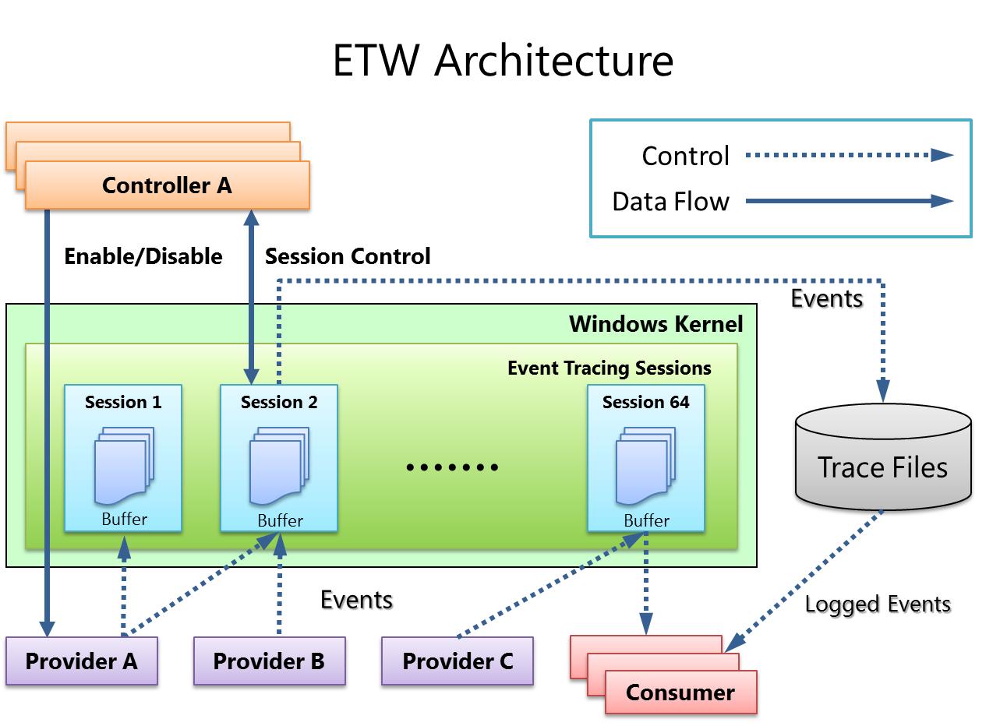

### <a name="provider"></a>Provider

*提供*程序生成的事件检测的组件。 提供程序可以是一个用户模式应用程序、 内核模式驱动程序，或者 Windows 内核本身。 除了固定的事件数据 （头），事件可以携带用户数据。

*事件*是基于事件的数据的表示形式。 数据可用于深入分析。 此外可以使用事件生成的计数器。 *计数器*提供基于样本数据的视图。 它们通常包含少量的数据来显示当前状态，例如字节每秒 I/O 数和每秒的中断。

提供程序必须使用 ETW 注册并发送事件，从其代码通过调用 ETW 日志记录 Api。 提供程序注册一个回调函数用于启用和禁用通知，以便跟踪可以启用和禁用动态。

### <a name="session"></a>会话

ETW 会话基础架构用作中继到使用者从一个或多个提供程序的事件中间代理。 会话是到内核缓冲区中收集事件并将其发送到指定的文件或实时消费进程的内核对象。 多个提供程序都可以映射到单个会话中，它允许用户从多个来源收集的数据。

### <a name="controller"></a>控制器

一个控制器启动，停止，或更新跟踪会话。 会话是跟踪的单位。 提供商映射 （或启用） 到特定的会话。 一个控制器启用和禁用提供商，以便他们可以开始发送到 ETW 事件。 可以使用由 Microsoft 提供的工具调用控制器的功能，或者您可以编写您自己的应用程序。

Logman.exe 是收件箱控制器的应用程序。 在 Windows 性能 Toolkit 的 Windows 性能记录器 (WPR) 是推荐的控制器进程。

### <a name="consumer"></a>使用者

*使用者*是一个应用程序，读取记录的跟踪文件 （ETL），或捕获实时活动跟踪会话中的事件和处理事件。 事件查看器和资源监视器是现成 ETW 使用者应用程序。

在 Windows 性能 Toolkit 的 Windows 性能分析器 (WPA) 是推荐的消费过程。

## <a name="implementing-etw-instrumentation"></a>实施 ETW 检测

<!--There was no content provided here in the original Word file.-->

### <a name="plan-your-instrumentation"></a>规划您的检测

决定您将在代码中登录 ETW 事件。 这应当与重要的用户方案或频繁使用的情况下要测量、 分析和最终提高。 这些是什么无法检测的一些示例︰

-   状态更改
-   重要的操作的开始/结束
-   资源创建/删除
-   其他与性能或可靠性相关的事件
-   调试事件

### <a name="create-a-manifest-file-and-implement-your-provider"></a>创建一个清单文件和实施您的提供商

在用户模式应用程序，包括服务，以及像使用名为的*事件清单*XML 文件的驱动程序的内核模式组件，可以实现基于清单的 ETW 事件。 有关详细信息，请参阅[事件跟踪函数](http://go.microsoft.com/fwlink/?LinkId=309791)(https://msdn.microsoft.com/library/windows/desktop/aa363795.aspx)。

事件清单分为以下部分︰

<dl>
<dt>&nbsp;&nbsp;&nbsp;&nbsp;&nbsp;<strong>提供器定义︰&lt;提供程序&gt;</strong></dt>
<dd>
<p>包含名称和要创建的提供程序的 GUID （最终包含 ETW 框架所需的检测资源） 检测该二进制文件的位置。</p>
</dd>
<dt>&nbsp;&nbsp;&nbsp;&nbsp;&nbsp;<strong>事件的负载︰&lt;模板&gt;</strong></dt>
<dd>
<p>包含将作为有效载荷的事件中包含的数据类型的定义。 可用的类型包括︰</p>
<ul>
<li>
<p>有符号和无符号 8 位、 16 位、 32 位和 64 位的整数</p>
</li>
<li>
<p>ANSI 和 Unicode 字符串</p>
</li>
<li>
<p>浮点数和双精度型</p>
</li>
<li>
<p>布尔值、 二进制文件、 GUID、 指针、 FILETIME、 SYSTEMTIME、 SID，以及 HexInt32</p>
</li>
</ul>
</dd>
<dt>&nbsp;&nbsp;&nbsp;&nbsp;&nbsp;<strong>静态事件数据</strong></dt>
<dd>
<p>用来帮助解释、 排序，并对事件进行分组。</p>
<ul>
<li>
<p>&lt;任务&gt;定义要检测的操作 （或任务） 的名称。</p>
</li>
<li>
<p>&lt;操作码&gt;定义您想要创建的事件，如启动事件中，界定时间，用于记录调试数据的信息性事件操作停止事件的操作的类型等等。</p>
</li>
<li>
<p>事件定义︰&lt;事件&gt;</p>
<p>有效载荷和静态数据，将联系在一起。 您的代码将发出的事件所定义的此部分中列出。</p>
</li>
</ul>
</dd>
</dl>


下面是一个示例的事件清单︰

```
<provider
    guid="{3877cf22-0702-4dfc-965e-7fdc7780cd74}"
    name="MyEventProvider"
    symbol="MY_EVENT_PROVIDER"
    messageFileName="%temp%\MyProviderBinary.exe"
    resourceFileName="%temp%\MyProviderBinary.exe“
    >
  <templates>
    <template tid="T_MyProvider_1">
      <data inType="win:Int32" name="Operation Id" />
      <data inType="win:Int32" name="Memory Allocated (MB)" />
    </template>
  </templates>
  <opcodes>
    <opcode name="DebugInfo" symbol="_DebugInfo" value="10"/>  
  </opcodes>
  <tasks>
    <task name="OpMemAllocation" symbol="OpMemAllocation_Task" value="1“
          eventGUID="{87ebca33-bf25-442c-9256-82ba484586e8}"/>
  </tasks>
  <events>
    <event symbol="DebugInfo" template="T_MyProvider_1" value="200" 
       task="OpMemAllocation" opcode="DebugInfo" />
  </events>
```

若要编写清单文件，您可以使用︰

-   清单生成器 (ECManGen.exe) 的平台 SDK 中可用

-   Visual Studio (Eventman.xsd) 的平台 SDK 中可用

### <a name="compile-the-event-manifest"></a>编译的事件清单

下一步是使用[消息编译器](http://go.microsoft.com/fwlink/?LinkId=309792)(<https://msdn.microsoft.com/library/windows/desktop/aa385638.aspx>) 工具 (mc.exe)，可用平台 SDK 中编译清单。 这样将会生成几个检测、 编译和生成检测的代码所需的文件︰

<dl>
<dt>&nbsp;&nbsp;&nbsp;&nbsp;&nbsp;<strong>ManifestFileName.h</strong></dt>
<dd>包含在代码中使用的事件说明符。</dd>
<dt>&nbsp;&nbsp;&nbsp;&nbsp;&nbsp;<strong>ManifestFileName.rc</strong></dt>
<dd>资源编译器脚本。</dd>
<dt>&nbsp;&nbsp;&nbsp;&nbsp;&nbsp;<strong>MSG00001.bin</strong></dt>
<dd>语言资源。</dd>
<dt>&nbsp;&nbsp;&nbsp;&nbsp;&nbsp;<strong>ManifestFileNameTEMP.bin</strong></dt>
<dd>模板资源 （提供者和元数据）。</dd>
</dl>

若要编译用户模式代码，键入︰

&nbsp;&nbsp;&nbsp;&nbsp;&nbsp;**mc.exe-um**\[ *ManifestFileName*\]

若要编译内核模式代码，键入︰

&nbsp;&nbsp;&nbsp;&nbsp;&nbsp;**mc.exe 公里**\[ *ManifestFileName*\]

编译托管或 JavaScript 的代码中，键入︰

&nbsp;&nbsp;&nbsp;&nbsp;&nbsp;**mc.exe cs**\[ *ManifestFileName*\]<br/>
&nbsp;&nbsp;&nbsp;&nbsp;&nbsp;**mc.exe css**\[ *ManifestFileName*\]<br/>
&nbsp;&nbsp;&nbsp;&nbsp;&nbsp;**mc.exe generateProjections**\[ *ManifestFileName*\]

### <a name="update-your-code"></a>更新您的代码

下一步是将工具添加到您的代码。 运行 Visual Studio，添加消息编译器，编译器生成的头文件并别忘了到程序生成资源文件。

查找要查找哪些宏 （或类方法） 来调用您的代码中的标头中的以下︰

-   EventRegister&lt;*YourProviderName*&gt;

    用来注册您的提供商 （在应用程序启动）。

-   EventUnregister&lt;*YourProviderName*&gt;

    用于注销您的提供商 （在应用程序完成）。

-   EventWrite

一个宏 （或方法） 在该清单中定义的每个事件 (在&lt;事件&gt;节点)。

一旦正确分析您的代码，您可以生成二进制文件。

对于驱动程序，请查看 MSDN 上提供的[EventDrv](http://go.microsoft.com/fwlink/?LinkId=256109) (https://code.msdn.microsoft.com/windowshardware/Eventdrv-42894135) 示例。 注册为事件提供程序使用 EtwRegister 函数 ETW 内核模式驱动程序︰

-   此函数在驱动程序入口例程中代码后面，添加创建并初始化的设备对象。

-   匹配与 EtwUnregister 调用驱动程序的卸载例程中调用 EtwRegister 函数。

### <a name="log-and-visualize-events"></a>记录和显示的事件

一旦正确检测的组件，您可以在测试系统上启动记录事件。 首先需要准备记录该系统通过使用 wevtutil，收件箱工具注册您的提供商。

1.  将您的组件复制到 resourceFileName 属性指定在该清单中的位置︰

    **xcopy /y***MyProviderBinary.exe* **%**

2.  注册提供程序︰

    **wevtutil um***etwmanifest.man*<br/>
    **wetvutil im***etwmanifest.man*

3.  验证提供程序是可见的︰

    **logman 查询提供程序** 

    您的提供程序名称/GUID 应显示在列表中。

请记住该事件元数据存储在已检测的二进制文件，不在清单文件中。 使用 wevtutil 的电脑上安装一个清单将链接放入注册表连接到包含事件的元数据二进制文件的提供程序的 GUID。 该二进制文件的路径与名称取自提供的清单文件。 您可以随后放弃的清单文件。

这意味着，包含事件的元数据二进制文件还必须是可访问和可加载，因为它是在计算机上用来解码。 WPR/xperf 使过程通过注入跟踪中的元数据可移植性。

现在，您的提供程序已正确安装在此系统上，您可以启动跟踪会话到 ETL 文件从您的组件收集事件。 您可以使用 Windows 性能记录器 (WPR) 或 Xperf，命令行工具，都可以在 Windows 性能 Toolkit。

1.  启动跟踪︰

    **xperf****-启动***MySession***-on***MyEventProvider***-f***MySession.etl*

    在该命令行， **-启动**提供事件集合会话的名称，和**-在**告诉 ETW 您想要在此会话中从提供程序收集的事件。 (可以有多个**-在**参数。)

2.  执行您的工作负载。

3.  停止跟踪︰

    **xperf****-停止***MySession*

ETL 文件之后，可以使用 Windows 性能分析器工具打开它并直观地显示您使用泛型事件关系图和表的事件。

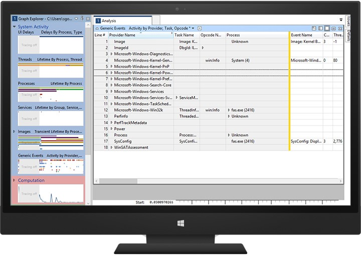

# <a name="performance-tools"></a>性能工具

Microsoft 提供的工具可帮助您提高您的设备的性能。 从其他出版商的测试工具可用于衡量和改进以及设备的性能。

本部分包括 Windows ADK 和其他 Microsoft 性能工具窗口 ADK 和下载链接信息。

## <a name="download-performance-tools"></a>下载性能工具

您可以下载这些工具来评估和提高 PC 的性能。

<table>
<thead>
<tr class="header">
<th><strong>工具</strong></th>
<th><strong>说明</strong></th>
<th><strong>下载链接</strong></th>
</tr>
</thead>
<tbody>
<tr class="odd">
<td>Windows 评估和部署工具包 (ADK)</td>
<td><p>用于评估和部署 Windows 映像的工具。 可以使用在 Windows ADK 工具来改善您的 PC 运行 Windows 之外的 Windows HCK 的最低要求。</p>
<p>包括︰</p>
<ul>
<li><p>Windows 评估 Toolkit</p></li>
<li><p>Windows 评估服务</p></li>
<li><p>Windows 性能 Toolkit (WPT)</p></li>
</ul></td>
<td>使用连接从最新的 ADK 放。</td>
</tr>
<tr class="even">
<td>Windows 硬件实验室工具包 (HLK)</td>
<td>若要测试是否运行 Windows 的计算机满足兼容性要求的工具。 可以使用在 Windows ADK 性能工具以提高超出 Windows HLK 要求 PC 的性能。</td>
<td>使用连接从最新的 HCK 放。</td>
</tr>
<tr class="odd">
<td>PowerCFG.exe</td>
<td><p>收件箱来控制电源使用方案 （还指定的电源规划），使用可用的休眠状态，来控制单个设备的电源状态并分析系统的常见的能源效率和电池寿命问题的工具。</p>
<p>预发行的<a href="http://go.microsoft.com/fwlink/p/?LinkID=264942">MSDN 文档</a>(https://technet.microsoft.com/en-us/library/hh824902.aspx?f=255&amp;MSPPError = 2147217396) 可能尚未包含新功能，如 /sleepstudy。</p></td>
<td>收件箱。</td>
</tr>
<tr class="even">
<td>PwrTest.exe</td>
<td><p>测试工具，它使开发人员、 测试人员和系统集成商，以训练和记录系统中的电源管理信息。 自动休眠和恢复过渡，并记录处理器电源管理和电池信息从系统在一段时间内，您可以使用 PwrTest。</p>
<p>有关详细信息，请参见<a href="http://go.microsoft.com/fwlink/?LinkId=309778">PwrTest</a> (https://msdn.microsoft.com/library/windows/hardware/ff550682.aspx)。</p></td>
<td>WDK （见下文） 中可用。</td>
</tr>
<tr class="odd">
<td>媒体体验分析器</td>
<td>媒体的性能、 质量和功率分析工具使用开发人员和测试人员的优化运行 Windows 的设备上的媒体方案。 此工具可帮助您分析故障在媒体播放、 网络摄像机捕捉和实时通信 HCK 的要求。</td>
<td><a href="http://www.microsoft.com/en-us/download/details.aspx?id=43105">下载中心</a>(http://www.microsoft.com/en-us/download/details.aspx?id=43105)</td>
</tr>
<tr class="even">
<td>Visual Studio 专业 2012</td>
<td>Visual Studio 专业 2012年是专业质量的集成的开发环境，简化了创建、 调试和部署 Windows 以及 Microsoft Office web 软件的任务。</td>
<td><a href="http://go.microsoft.com/fwlink/?LinkId=309780">MSDN</a><br />
(https://msdn.microsoft.com/en-us/windows/hardware/gg454513)</td>
</tr>
<tr class="odd">
<td>Windows 驱动程序工具包 (WDK)</td>
<td>WDK 集成与 Visual Studio 专业 2012，以用于开发、 部署、 测试和调试驱动程序提供完整的环境。</td>
<td>使用连接从最新的 WDK 放。</td>
</tr>
</tbody>
</table>


# <a name="understanding-the-windows-adk-tools"></a>了解 Windows ADK 工具

Windows 评估 Toolkit 和 Windows 性能 Toolkit 使 Windows 评估和部署工具包 (ADK)。 在一起他们评估计算机的整体性能和自动部署到新买的计算机的 Windows 操作系统提供完整的解决方案。

本节重点介绍 Windows 评估 Toolkit。 评估结果用于诊断潜在问题，这样的硬件和应用程序开发时进行调整，并将在电池寿命、 启动性能和关闭时间的影响最小。 为 Oem、 Isv、 Ihv、 爱好者和社区建立一种通用框架中的其他成员，要衡量、 比较，并检查质量的各个方面提供了相同的评估。

可以通过使用 Windows 评估 Toolkit 实现重要的业务目标︰

<dl>
<dt>&nbsp;&nbsp;&nbsp;&nbsp;&nbsp;<strong>度量和比较</strong></dt>
<dd>
<p>数据可用于对其他类似的组件，以方便您的决策过程、 建议和竞争基准比较组件 （应用程序、 驱动程序或两者）。</p>
</dd>
<dt>&nbsp;&nbsp;&nbsp;&nbsp;&nbsp;<strong>提高质量</strong></dt>
<dd>
<p>可以独立工作，也可以涉及合作伙伴以生成组件 （应用程序、 驱动程序或两者） 根据预定义的质量标准。</p>
</dd>
<dt>&nbsp;&nbsp;&nbsp;&nbsp;&nbsp;<strong>跟踪质量</strong></dt>
<dd>
<p>可以创建用于高效地跟踪组件版本的质量流程和检测每次迭代后的回归。</p>
</dd>
</dl>


这些方案通常用于评估 Toolkit:

<table>
<thead>
<tr class="header">
<th>方案</th>
<th>说明</th>
</tr>
</thead>
<tbody>
<tr class="odd">
<td>&quot;黑匣子&quot;</td>
<td>运行预定义的作业并检查任何异常值或标识驱动程序、 内存使用情况或其他领域的问题的结果，评估地址。</td>
</tr>
<tr class="even">
<td>比较结果</td>
<td><ul>
<li><p>运行单个评估任何运行支持的操作系统的计算机上使用推荐的设置。</p></li>
<li><p>使用 Windows 交流打包在另一台计算机上运行该作业。</p></li>
<li><p>将结果保存到共享位置，以便对它们进行比较。</p></li>
<li><p>将任何与任何其他受支持的操作系统来确定差异的运行 Windows 的计算机中的结果进行比较。</p></li>
</ul></td>
</tr>
<tr class="odd">
<td>清理计算机</td>
<td>在干净的计算机，其中包括只有操作系统来建立基线系统结果进行评估。</td>
</tr>
<tr class="even">
<td>添加的硬件或应用程序组件的计算机</td>
<td>干净的计算机系统中添加新的硬件或应用程序，然后重新运行比较干净的计算机结果与结果的评估。</td>
</tr>
<tr class="odd">
<td>创建评估</td>
<td>使用公共 Api 来开发或扩展评估，或与您的工具和基础架构集成评估。</td>
</tr>
</tbody>
</table>

有关详细信息，请参阅[Windows 评估和部署工具包](http://go.microsoft.com/fwlink/?LinkId=206587)(https://msdn.microsoft.com/en-us/library/windows/hardware/hh825420.aspx)。

<table>
<thead>
<tr class="header">
<th>工具</th>
<th>说明</th>
</tr>
</thead>
<tbody>
<tr class="odd">
<td>Windows 评估 Toolkit</td>
<td><p>发现和在一台 PC 上运行评估的工具。 <em>评估</em>是模拟用户活动和检查电脑的状态的任务。 评估产生的系统中，各个方面的指标，为您做出改进提供建议。 Windows 评估 Toolkit 包括︰</p>
<ul>
<li><p>评估 Windows 控制台</p></li>
<li><p>评估服务</p></li>
</ul>
<p>有关详细信息，请参阅<a href="http://go.microsoft.com/fwlink/?LinkId=214554">Windows 评估 Toolkit</a> (https://msdn.microsoft.com/en-us/library/windows/hardware/hh825508.aspx)。</p></td>
</tr>
<tr class="even">
<td>Windows 评估服务</td>
<td><p>用于远程管理设置、 电脑、 图像和评估窗口评估服务的安装位置的实验室环境中的应用程序。 此应用程序可以在任何有权访问的服务器，在运行 Windows 评估服务的 PC 上运行。</p>
<p>有关详细信息，请参阅<a href="http://go.microsoft.com/fwlink/?LinkId=215628">Windows 评估服务</a>(https://msdn.microsoft.com/en-us/library/windows/hardware/hh825573.aspx)。</p></td>
</tr>
<tr class="odd">
<td>Windows 性能 Toolkit (WPT)</td>
<td><p>工具与使用事件跟踪 Windows 程序，记录系统事件和分析性能数据的图形用户界面中的工具。 包括︰</p>
<ul>
<li><p>Windows 性能记录器</p></li>
<li><p>Windows 性能分析器</p></li>
<li><p>Xperf</p></li>
</ul>
<p>有关详细信息，请参阅<a href="http://go.microsoft.com/fwlink/?LinkId=228914">Windows 性能 Toolkit</a> (https://msdn.microsoft.com/en-us/library/hh162945.aspx)。</p></td>
</tr>
<tr class="even">
<td>评估执行引擎 （斧）</td>
<td><p>评估执行引擎 （斧） 允许您管理并执行 Windows 系统评估。 斧提供基础结构需要管理使用 UX 工具或脚本，并进行评估，评估进行测量、 处理原始数据转化为成果、 运行诊断程序，并发布结果。</p>
<p>有关详细信息，请参阅<a href="http://go.microsoft.com/fwlink/?LinkId=309781">评估执行引擎</a>(https://msdn.microsoft.com/library/windows/desktop/hh437709.aspx)。</p></td>
</tr>
</tbody>
</table>


## <a name="understanding-the-windows-performance-toolkit"></a>了解 Windows 性能 Toolkit

| 资源标题                                               | 内容类型  | 说明                                                                                                                                                                                                                                                                                                                 | 链接 |
|--------------------------------------------------------------|---------------|-----------------------------------------------------------------------------------------------------------------------------------------------------------------------------------------------------------------------------------------------------------------------------------------------------------------------------|-----------------------------------------------------------------------------------------------------------------------------------------------------------|
| Windows 性能分析器                                 | 文档 | WPT 文档和视频                                                                                                                                                                                                                                                                                                | [MSDN](https://msdn.microsoft.com/en-us/library/windows/hardware/hh448170.aspx)(https://msdn.microsoft.com/en-us/library/windows/hardware/hh448170.aspx) |
| CPU 分析技术                                      | 白皮书   | 本指南提供了详细的技术可用于研究该影响评估指标的中央处理单元 CPU 相关的问题。                                                                                                                                                                       | [MSDN](http://msdn.microsoft.com/en-us/library/windows/desktop/jj679884.aspx)(https://msdn.microsoft.com/en-us/library/windows/desktop/jj679884.aspx) |
| 使用 Windows 性能 Toolkit 的工程性能 | 视频         | Windows 性能 Toolkit (WPT) 是一个强大的工具，广泛使用在 Microsoft Windows 工程团队改善应用程序和系统性能。 本讲座着重于提供一些提示与技巧，以案例研究格式视频，使用 WPS 跟踪以及 WPT 来优化您自己的应用程序。 | [第 9 频道](http://channel9.msdn.com/events/BUILD/BUILD2011/HW-59T)(http://channel9.msdn.com/events/BUILD/BUILD2011/HW-59T) |


# <a name="setting-up-a-test-environment-for-adk-and-was"></a>为 ADK 和 WAS 设置测试环境

安装 Windows 评估服务 (WAS) 到服务器计算机的服务器非常简单。 但是，配置网络环境可能不是那么简单。 不正确的网络拓扑结构会导致评估作业失败出于各种原因。 务必要了解您的组织要求、 网络策略等。

在开始之前，请熟悉这些两个资源︰

-   [Windows 评估服务逐步式指南](http://go.microsoft.com/fwlink/?LinkId=215630)(https://msdn.microsoft.com/en-us/library/windows/hardware/hh825315.aspx)

-   [安装 Windows 评估服务](http://go.microsoft.com/fwlink/?LinkId=253667)(https://msdn.microsoft.com/library/windows/hardware/hh825515)

## <a name="network-topology-considerations"></a>网络拓扑注意事项

本部分介绍了您必须考虑在您的实验室和一些可选项目，以实现其他功能和自动化实施 WAS 基础架构的事情。 目标是要将本地网络设置为更好地模拟的"安静"的环境，客户会遇到在家里。

这些项目是必需的︰

| 项目               | 类型              | 注意 |
|--------------------|-------------------|-------------------------------------------------------------------------------------------------------------------------------------------------------------------------------------------------------------------------------------------------------------------------------------------|
| 以太网           | 硬件          | 是需要以太网。 可靠性和效率，建议千兆以太网。 |
| 符号            | 互联网访问   | 无符号文件，ADK 的自动分析功能不起作用。 RTM 之后, 通过 Windows Update 更新操作系统二进制文件和它变得不实用收集更新的符号文件。 我们建议您使用公共符号服务器和缓存本地供重复使用的符号文件。<br/><br/>为连接操作系统下沉，使用提供的符号程序包和 WAS 服务器上本地缓存。 ||
| Wi-Fi 接入点 | 硬件          | 建议运行能效评估时连接到 Wi-fi 网络。 |
| DHCP 服务器        | 硬件/软件 | PXE 启动需要使用 DHCP。 **是服务器可以为 DHCP 服务器**。 为 DHCP 服务器，可以使用 Wi-fi 路由器。 如果您不打算通过 PXE 启动使用 WAS 推送的操作系统映像，您无需具有 DHCP。 |
| 文件共享         | 硬件          | 取决于要存储的结果文件的方式。 **可以在 WAS 服务器以及存储结果。** |
| USB 闪存驱动器   | 硬件          | 您能够启动到 Windows PE，例如清点到 WAS，裸露金属机。 |

这些项目不是必需的但通常需要根据您的需要以及公司网络策略︰

| 项目                    | 类型              | 注意 |
|-------------------------|-------------------|------------------------------------------------------------------------------------------------------------------------------------------------------------------------------------------------|
| DNS 服务器              | 硬件/软件 | 通常不需要，请为您的测试网络是单个子网。 如果您需要配置多个子网，则需要具有名称解析，如 DNS 服务器。 |
| IP 控制电源开关 | 硬件          | 您可以购买可远程控制的电源开关。 您可以使用此完全自动化能效评估。 |
| 以太网适配器的 USB | 硬件          | 窗体的一些因素没有以太网。 您也可以使用 Wi-fi。 我们建议 USB 以太网适配器使用收件箱驱动程序支持，所以不需要放松 Windows PE 的自定义。 |

下图演示了一个可能的网络配置。

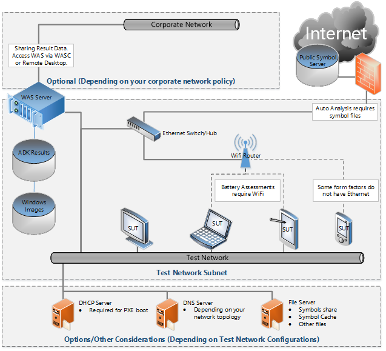

典型的公司都需要这种类型的测试环境是与公司网络隔离开来。 公司的 IT 策略不允许您有您自己的 DHCP 服务器，例如。 但是，您可能想要访问 WAS，以便您可以远程计划作业、 监视进度，并查看结果。 此外，如果因为企业网络可能产生特殊的网络流量在企业网络上有 DUTs，可能会影响性能数据。

服务器通常配备一个多端口的以太网适配器或多个以太网适配器。 您可以考虑使 WAS 服务器的多主服务器。 多主服务器都有一个以太网适配器连接到一个隔离的测试网络，并与您公司网络的另一个。 使用此配置，您组织中的人员可以访问 WAS 不是在测试实验室中，通过 WASC 或远程桌面。

## <a name="optional-sql-database"></a>可选的 SQL 数据库

Windows 评估服务还允许您从一个或多个 Windows 评估服务实验室到中心统一的报告生成 SQL 数据库导入结果。 SQL 数据库是 WAS 基础结构的可选组件。

请记住，此可选的 SQL Server 数据库中存储的结果不包含评估平台表示层和不能在 Windows 评估服务的客户端 (Windows ASC) 中查看。 此组件可以开发自定义的报告解决方案，以满足任何需要不受默认值/WAC 报告图层。

可以使用 ResultsUtil 命令配置 WAS 服务器自动使用数据库或者导入现有结果。 有关详细信息，请参阅[ResultsUtil 命令行选项](http://go.microsoft.com/fwlink/?LinkId=309787)(https://msdn.microsoft.com/library/windows/hardware/hh825313.aspx)。

## <a name="symbol-files-symbol-server-symbol-cache"></a>符号文件、 符号服务器、 符号缓存

默认情况下已设置下面的符号信息。 如果您有其他符号服务器或位置，可以重写这些设置使用 setx 命令。

```
set _NT_SYMBOL_PATH=

\\<WASServer>\Relax\Symbols;srv*http://msdl.microsoft.com/download/symbols

set _NT_SYMCACHE_PATH=\\<WASServer>\Relax\Symcache
```

# <a name="onboarding-and-preparing-a-system-for-adk-testing"></a>服务和准备 ADK 测试系统

**设置设备**

1.  设备下测试 (DUT) 插入到交流电源并将其打开。

2.  输入固件设置页面 （例如，启动时按 f2 键）。

3.  在固件设置页面上，设置下列各项︰

    -   恢复所有默认设置。

    -   确保 DUT 被配置为使用无网吧点点通 UEFI 引导。

4.  将 OEM 映像安装到 DUT。 如果已安装 OEM 映像，请跳过此步骤。

    在工厂车间运行 Sysprep 专用化和其他进程应该是 OEM 部署过程的一部分。

5.  完成首次启动体验。

    使用&lt;*系统模型*&gt;-&lt;*硬件阶段*（EV、 DV 或 PV） &gt; - &lt;*修订版编号*&gt;作为计算机名称 (例如，Frabrikam-ModelXYZ-PV-REV1)。 在任何给定的模型测试时，始终使用相同的计算机名称。

6.  可以为测试而不是 Microsoft 帐户使用本地管理员帐户。

## <a name="policies-for-setting-up-the-device"></a>该设备所设置的策略

-   应通过 USB 适配器使用有线或 OEM 提供的网络适配器。

    -   如果您使用本地测试 WAC 或预打包的作业，不能应用有线的 LAN。

    -   如果您使用 WAS，我们建议您部署的评估到有线 LAN。 如果不能我们建议使用无线。

    -   不启用共享连接到网络时。

-   （uefi） 应启用所有 DUTs 上。

-   所有 DUTs 都应有所有签名认证 Windows 8 驱动程序之前运行评估。

-   除非系统为他们提供应该不插入任何外部设备。

    
## <a name="testing-the-device"></a>测试设备

**若要测试设备**

<ol>
<li>
<p>在激活系统使用相应的产品密钥。</p>
</li>
<li>
<p>某些操作系统组件更改基于某些 WinSAT 标准及其行为。 请确保 WinSAT 数据存储已填入下面的路径︰ <strong>%WINDIR%\performance\winsat\datastore\</strong></p>
<p>您可以在提升的命令行上运行<strong>Winsat prepop</strong>或按照<a href="http://technet.microsoft.com/en-us/library/jj573887.aspx">部署指南</a>(https://technet.microsoft.com/en-us/library/jj573887.aspx)。</p>
</li>
<li>
<p>运行 Windows 更新，并安装所有的驱动程序和 Windows 更新 （即使是可选的）。</p>
</li>
<li>
<p>通过选择<strong>从不检查更新</strong>中的 Windows 更新设置中禁用自动更新。 您可以通过从提升的命令提示符处运行下面的命令来自动完成此步骤︰</p>
<p><strong>reg<strong>添加</strong> &quot;HKEY_LOCAL_MACHINE\SOFTWARE\Microsoft\Windows\CurrentVersion\WindowsUpdate\Auto 更新&quot;/v AUOptions /t REG_DWORD /d 1 /f</strong></p>
</li>
<li>
<p>使用设备管理器验证 DUT 的驱动程序或设备没有问题。</p>
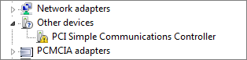
<p>调查并修复所有设备标有&quot;！&quot;.</p>
</li>
<li>
<p>下载最新的病毒特征码文件并执行扫描，使用默认反恶意软件应用程序。</p>
</li>
<li>
<p>强制执行的 IdleTasks 每天一次 （当系统的负载测试） 以确保不干扰 ADK 评估执行任何维护任务。 从提升的命令提示符处运行以下命令︰</p>
<p><strong>rundll32.exe advapi32.dll,ProcessIdleTasks</strong></p>
</li>
<li>
<p>禁用 Windows 应用商店应用所有可用的更新后更新。</p>
<ol type="a">
<li><p>打开存储设置，请转到<strong>应用程序的更新</strong>。</p></li>
<li><p>将<strong>自动下载我的应用程序的更新</strong>设置为<strong>否</strong>。</p></li>
<li><p>您可以通过从提升的命令提示符处运行下面的命令来自动完成此步骤︰</p>
<p><strong>添加 reg &quot;HKLM\Software\Microsoft\Windows\CurrentVersion\WindowsStore\WindowsUpdate&quot; /v 自动下载 /t REG_DWORD /d 2 /f</strong></p>
</li>
</ol>
</li>
<li>
<p>启用自动登录。</p>
<ul>
<li>
<p>某些评估重新启动 PC，并要求用户登录，然后才能继续运行评估。 评估通常测量的启动时间，因为用户登录到计算机所致的延迟会导致不可预知的变化的度量。</p>
</li>
<li>
<p>最佳做法是为启用自动登录的用户帐户运行评估。 您可以在注册表中，在以下注册表项配置自动登录︰ <strong>HKLM\Software\Microsoft\Windows NT\CurrentVersion\WinLogon</strong></p>
<p>应配置以下五个值。</p>
<table>
<thead>
<tr class="header">
<th>值的名称</th>
<th>值类型</th>
<th>Data</th>
</tr>
</thead>
<tbody>
<tr class="odd">
<td>DefaultUserName</td>
<td>REG_SZ</td>
<td>&lt;<em>TestUserName</em>&gt;</td>
</tr>
<tr class="even">
<td>DefaultPassword</td>
<td>REG_SZ</td>
<td>&lt;<em>LOCALPASSWORD</em>&gt;</td>
</tr>
<tr class="odd">
<td>AutoAdminLogon</td>
<td>REG_SZ</td>
<td>1</td>
</tr>
</tbody>
</table>
</li>
</ul>
</li>
<li>
<p>如果系统具有定时服务器访问，请确保已与服务器的时间同步时钟。 如果评估在执行期间更改时钟时间，它可能会导致失败。</p>
</li>
<li>
<p>禁用 Windows 系统还原提供系统还原点的创建，它将倾斜测试结果在测试过程︰</p>
<p><strong>添加 reg &quot;HKLM\Software\Microsoft\Windows NT\CurrentVersion\SystemRestore&quot; /v RPSessionInterval /t REG_DWORD /d 0 /f</strong></p>
<p><strong>注册表删除&quot;HKLM\Software\Microsoft\Windows NT\CurrentVersion\SPP\Clients&quot; /f</strong></p>
</li>
<li>
<p>禁用计划的硬盘碎片整理︰</p>
<p><strong>schtasks /change /tn &quot;Microsoft\Windows\Defrag\ScheduledDefrag&quot; /禁用</strong></p>
</li>
<li>
<p>请确保所有.NET 编译目标都是最新版本︰</p>
<p><strong>C:\Windows\Microsoft.NET\Framework\v4.0.30319\ngen.exe executequeueditems</strong></p>
<p><strong>C:\Windows\Microsoft.NET\Framework64\v4.0.30319\ngen.exe executequeueditems</strong></p>
</li>
<li>
<p>重新启动 DUT。</p>
</li>
</ol>


