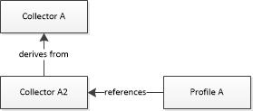
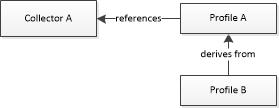
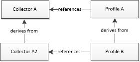

# <a name="1-collector-definitions"></a>1.收集器定义


Windows 性能记录器 (WPR) 目前支持三种收集器︰ 系统收集器、 事件收集器和堆事件回收器。 系统收集器定义一起使用 NT 内核记录器的跟踪 Windows 事件 (ETW) 系统记录器会话指定缓冲区大小和其他属性。 事件和堆收集器定义为 ETW 用户会话指定缓冲区大小和其他属性。

收集器定义顺序受 WPR 架构。 在.wprp 文件中，系统收集器定义必须在前面事件收集器定义。 这些定义必须同时在前面堆收集器定义 （如果存在一个堆收集器定义）。 在 WPR 架构[WPRControlProfiles 架构](wprcontrolprofiles-schema.md)中定义。

## <a name="collector-attributes"></a>收集器属性


收集器具有以下必填字段属性︰

-   **Id**:.wprp 文件中的收集器定义所指的唯一字符串标识符。

-   **名称**︰ 名称的收集器;例如，"WPR 收集器"。 该系统收集器名称必须是"NT 内核记录器"。

收集器定义必须包含下面的缓冲区大小定义︰

-   **BufferSize**︰ 指定一个缓冲区的大小以千字节 (KB)。

-   **缓冲**︰ 指定缓冲区的数目或**PercentageOfTotalMemory**属性设置为"true"，用于缓冲的总内存的百分比。

有关缓冲区的详细信息，请参阅[日志记录模式](logging-mode.md)。

## <a name="collector-definition-examples"></a>收集器定义示例


下面的代码示例显示系统收集器定义和事件收集器定义。

``` syntax
<SystemCollector
  Id="WPRSystemCollector"
  Name="NT Kernel Logger"
  FileName="WPRKernel.etl">
  <BufferSize
    Value="512"/>
  <Buffers
    Value="3"
    PercentageOfTotalMemory="true"/>
</SystemCollector>

<EventCollector
  Id="WPREventCollector"
  Name="WPR Event Collector"
  FileName="somefilename.etl">
  <BufferSize
    Value="128"/> 
  <Buffers
    Value="64"/>
</EventCollector>

<HeapEventCollector
  Id="Base_Heap_Collector"
  Name="Base Heap Collector"
  FileName="heap.etl">
</HeapEventCollector>
```

## <a name="inheritance-examples"></a>继承示例


Windows 性能记录器对象的继承支持通过使用`Base=""`WPR 配置文件 XML 架构中的属性。 这样的添加或要添加重复使用的一般定义时逐渐生成的对象的专用。

意外的复杂性和副作用可能发生在某些特定情况下;本部分描述的示例，并推荐的最佳做法。

### <a name="example-1"></a>示例 1



如果要使用一些修改事件收集器**收集器的**配置文件**配置文件 A** ，它可以定义收集器**收集器 A2**从**收集器的**(基 ="收集器 A")，并随后引用该收集器**收集器 A2**。 这建议，因为只有收集器对象派生自另一个收集器对象，直接引用它。

### <a name="example-2"></a>示例 2



配置文件**的配置文件的**引用的收集器**收集的**。另一个配置文件**配置文件 B**需要对**配置文件的**更改，所以它派生，并在其定义中直接指定其更改。 这建议，因为只有配置文件对象派生自另一个配置文件对象。

### <a name="example-3"></a>示例 3



配置文件**的配置文件的**引用的收集器**收集的**。从**收集器的**派生的收集器**收集器 A2** 。最后，配置文件**配置文件 B**派生从**配置文件的**同时，还引用已被引用**配置文件 B**的父配置文件中的**收集器的**。

在这种情况下它不明确应如何评估**收集器 A2**的定义。 在一个案例中，配置文件派生优先，并在另一个收集器派生优先。 因为排序是未定义的并且可能会导致不同的结果，根据操作的顺序不推荐的做法。

基于这一点，您应该永远不会结合派生在多个类型的对象。

## <a name="related-topics"></a>相关的主题


[编写配置文件记录](authoring-recording-profiles.md)

[2.系统和事件提供程序定义](2-system-and-event-provider-definitions.md)

[记录配置文件 XML 参考](recording-profile-xml-reference.md)

 

 


