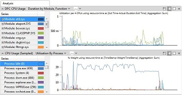

# 分析选项卡

**分析**选项卡是中心区的 Windows 性能分析器 (WPA)。 若要分析一个录制，可以从图形浏览器窗口拖到该选项卡拖动图形缩略图。 每个关系图的左侧是图例标签行或条形图上的图形以及关联的数据表。 模拟运算表以表格形式显示关系图的数据。

下图显示了具有两个图表的**分析**选项卡打开。

## 使用分析选项卡

图表标题栏右侧的三个布局图标。 若要查看关系图和表，请单击最左侧的图标。 若要查看数据表格与图形的缩略图视图，请单击中间图标。 若要查看单独的关系图，请单击最右边的图标。

底部的**分析**选项卡是适用于在选项卡上的所有图形的时间线。 如果放大到一个时间间隔，在一个关系图上，WPA 同步所有关系图、 时间轴和数据表。 您可以放大的时间间隔反复查看细节。 缩放的详细信息，请参阅[上一个时间间隔中放大](zoom-in-on-a-time-interval.md)。

若要在数据表中搜索文本或筛选显示在关系图和表中的数据，请右键单击数据表。 有关详细信息，请参阅[自定义数据表](customize-a-data-table.md)和[搜索或筛选数据](search-or-filter-data.md)。

为了提高**分析**选项卡的大小，可以将周围的窗格拖放到单独的窗口或完全关闭它们。 有关详细信息，请参阅[更改视图的布局](change-the-view-layout.md)。

## 打开一个新的分析选项卡

而不会丢失一个已经打开，您可以打开一个新的**分析**选项卡。 有关详细信息，请参阅[更改视图的布局](change-the-view-layout.md)。

## 使用分析选项卡以查看问题详细信息

**问题详细信息**标题栏的右边界上有布局选项。 若要查看问题详细信息，请单击**最大化**图标。 此外，您可以使用**仅显示表**。 为了提高**分析**选项卡的大小，可以将周围的窗格拖放到单独的窗口或完全关闭它们。 有关详细信息，请参阅[更改视图的布局](change-the-view-layout.md)。

当更改**问题窗口**中的搜索选项时，相同的问题列表会出现在**问题详细信息**窗口中。 您的搜索也将更改以反映的问题显示受影响的时间间隔的选项卡上的所有图形的缩放级别。

若要搜索特定问题，或要作为筛选依据的特定的问题类别，请参阅[问题窗口](issues-window.md)。

每个检测到的问题的内容的详细信息，请参阅[Windows 评估 Toolkit 技术参考](http://go.microsoft.com/fwlink/?LinkId=214554)。

## 相关的主题

[WPA 用户界面](wpa-user-interface.md)

[图形资源管理器](graph-explorer.md)

 

 

