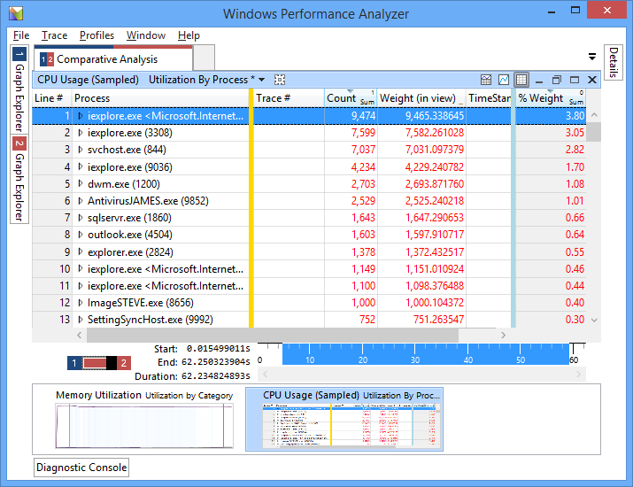
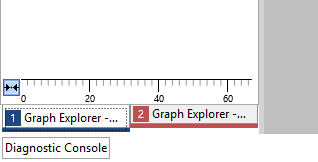
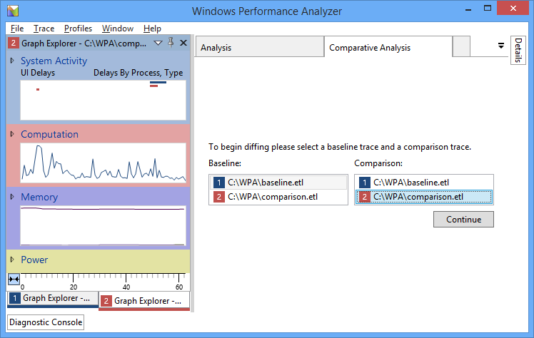
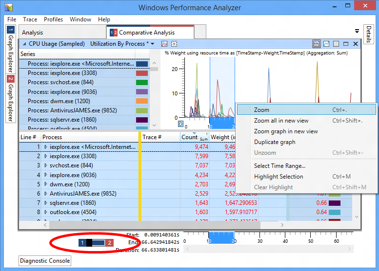

# 比较分析视图

在分析系统的性能，它可定期创建可用于标识源的回归的跟踪。 例如，您可以创建一个基线跟踪立即在安装操作系统之后。 以后，安装其他应用程序、 驱动程序或硬件后您可以创建另一个跟踪并确定所做的更改对系统性能的影响。

以前在 WPA，每个选项卡包含一个跟踪的信息。 若要比较两个跟踪，您需要来回切换选项卡，或者在 WPA 的单独实例中打开每个跟踪。

现在，您可以通过创建*比较分析视图*比较两个跟踪的结果。 此视图使您可以轻松地识别的领域，性能具有已产生负面影响并予以突出显示跟踪记录之间的差异。

在比较分析视图中，WPA 创建一个包含两个跟踪之间的价值差异的比较表。 一个跟踪指定为*基准跟踪*，通常在硬件之前捕获的跟踪或软件更改。 其他跟踪*比较跟踪*，跟踪捕获系统更改后调用。

WPA 创建的表包含值的差异的比较基准与比较的跟踪 （比较值 – 比较基准值）。 如果一个指标比较跟踪中要高，差异显示为一个正数。 如果 count 为基准跟踪中更高，差异显示为负数。 下面是一个示例︰

**图 1:**表中的正数表示这些流程是在比较跟踪更多的活动。 负数表示流程是基线跟踪中更为主动。

**请注意**  
虽然可以有任意数量的单个的 WPA 会话中打开的跟踪，WPA 可以一次比较的结果只有两个跟踪。

 

## 创建比较分析视图

1.  在 WPA，通过选择**文件**，请**打开**，导航到的位置的跟踪，并选择**确定**，打开的第一个跟踪。

2.  打开在步骤 1 中使用的方法的第二个跟踪。

    **请注意**  
    为了帮助区分打开跟踪，WPA 分配一个唯一标识符和颜色每个跟踪。 在左侧的**图形资源管理器**窗格中，您可以通过使用选项卡底部的打开跟踪之间进行切换。

     

    

    **图 2:**每个跟踪都由一个唯一标识符和颜色表示。

3.  通过选择**窗口**，**新的比较分析视图**中创建新的比较分析视图。

4.  在新选项卡中，通过选择它们在选择基准和比较跟踪**基准︰**和**比较︰**列表框，然后在右边选择**继续**。

    

    **图像 3:**选择基准和比较的跟踪。

一旦选择**继续**，WPA 将创建一个新的**比较分析**选项卡在**分析**窗格中。 在左侧的选项卡是显示用于创建比较分析视图的两种跟踪的图像。 图像的左半部分表示比较基准跟踪，而右半部分表示比较跟踪。

**图 4:**比较分析选项卡显示该跟踪 1 用作比较基准跟踪，跟踪 2 用作比较跟踪。

WPA 还可用来创建比较分析视图以比较两个相同的跟踪区域。 为此，请在创建比较分析视图选择基准的同一跟踪和比较跟踪。

## 分析比较分析视图

在查看跟踪记录的任何一个时，从**图形资源管理器**窗格拖动中心中的**分析**窗格中拖动相关图形。 请确保在右上角的窗格中选择**显示关系图和表**按钮中显示的图和表。

关系图区域包含有关信息只有一个跟踪一次。 与单跟踪分析，来缩放到特定的时间范围突出显示的区域中，右键单击，然后选择**缩放**。 此表包括只能从跟踪的当前缩放的时间范围的数据。

若要比较不同的时间从基线和比较跟踪的范围，使用左下角的窗格中切换。 此切换跟踪处于活动状态，以便您可以放大到不同的地区在图中的每个跟踪。 在缩放到一个跟踪中的区域，您可以切换到其他跟踪，和 WPA 突出显示同一放大的区域，以便您可以缩放到这两种跟踪的同一个时间跨度。

**图像 5:**使用切换来切换打开跟踪。

既然我们已放大的区域中每个跟踪，我们不再需要关系图视图。 在右上角的窗格中选择**仅显示表**按钮切换到表格视图。 表包含两个跟踪缩放后的时间跨度从比较的信息。 数值计算与比较跟踪值和基准跟踪值 （比较值 – 比较基准值） 之间的差异。 在上面的**图像 1** ， **CPU 使用率 （式采样）**表显示几个流程是比较跟踪中更为主动。

## 比较分析视图中使用的配置文件

您还可以应用包含两个打开的跟踪到的比较分析视图的配置文件︰

1.  从菜单上，选择 [连接**配置文件**，**应用**。

2.  如果您有自定义的配置文件，选择**浏览...**，选择您的配置文件，然后选择**打开**。

    **请注意**  
    另外，WPA 带有比较分析配置文件，您可以使用来推动您的分析。 若要使用此配置文件，选择**浏览目录...**，并选择**PresetsForComparativeAnalysis.wpaProfile**文件。

     

3.  选择适当的跟踪信息以**配置文件跟踪插槽\#1**和**配置文件跟踪插槽\#2**。

4.  选择要应用配置文件的**应用**。

 

 

