# <a name="cpu-analysis"></a>CPU 分析


本指南提供了详细的技术可用于研究该影响评估指标的中央处理单元 CPU 相关的问题。

评估特定分析指南中的个别指标或问题部分标识公共问题进行调查。 本指南提供的技术和工具，可以用来研究这些问题。

本指南中的方法，使用 Windows 性能分析器 (WPA) 从 Windows 性能 Toolkit (WPT)。 WPT 是 Windows 评估和部署工具包 (Windows ADK) 的一部分，可以从[Windows 内部程序](https://insider.windows.com/)。 有关详细信息，请参阅[Windows 性能 Toolkit 技术参考](windows-performance-toolkit-technical-reference.md)。

本指南分为以下三个部分︰

<table>
<colgroup>
<col width="50%" />
<col width="50%" />
</colgroup>
<tbody>
<tr class="odd">
<td><p>[背景](#cpu-guide-background)</p></td>
<td><p>本节介绍如何在 Windows 10 管理 CPU 资源。</p></td>
</tr>
<tr class="even">
<td><p>[Windows ADK 工具](#cpu-guide-adktools)</p></td>
<td><p>此部分说明了如何查看和解释在 Windows ADK Toolkit CPU 信息。</p></td>
</tr>
<tr class="odd">
<td><p>[技术](#cpu-guide-techniques)</p></td>
<td><p>本部分包含可用于调查并解决常见的问题与 CPU 性能相关的技术的集合。</p></td>
</tr>
</tbody>
</table>

 

## <a name="a-href-idcpu-guide-backgroundabackground"></a><a href="" id="cpu-guide-background"></a>背景


本部分包含了简单的描述和 CPU 性能的基本讨论。 有关此主题的更全面研究，我们建议簿窗口内部，第 5 版。

现代计算机可以包含多个 Cpu 的单独的插槽中安装。 每个 CPU 可以承载多个物理处理器内核，每个能够同时处理一个或两个单独的指令流。 这些单独的指令流处理器由 Windows 操作系统管理作为逻辑处理器。

在本指南中，处理器和 CPU 是指逻辑处理器 — — 也就是说，操作系统可以使用它来执行程序指令的硬件设备。

Windows 10 积极管理处理器硬件中两种主要方法︰*电源管理*，对资产负债的功耗和性能;和*使用情况*，以平衡的程序和驱动程序的处理要求。

### <a name="processor-power-management"></a>处理器电源管理

处理器不总是处于运营状态存在。 准备好执行任何指令时，Windows 会将处理器放入目标空闲状态 （或 C 状态），为确定 Windows 电源管理器。 根据 CPU 的使用模式，随着时间的推移将调整 C 状态的处理器的目标。

空闲状态是从 C0 编号的状态 （活动; 不处于空闲状态） 通过渐进式低功率状态。 这些状态包括 （停止但时钟仍处于启用状态） 的 C1、 C2 （停止和禁用时钟），等。 空闲状态的实现是特定于处理器的。 但是，在所有处理器更高的状态数值反映了较低的功耗，还可以在处理器之前更长的时间等待时间返回到指令处理。 所用时间处于空闲状态明显影响能源使用和电池寿命。

一些处理器可以操作的性能 （P-） 和调节 （T-） 指出，即使他们在积极处理指令。 P-状态定义的时钟频率和电压级别处理器支持。 T-状态不直接更改时钟频率，但是可以降低有效时钟速度跳上几分的时钟计时周期的处理活动。 同时，当前 P 和 T 的状态确定处理器的有效工作频率。 低频率对应于较低的性能和降低功耗。

Windows 电源管理器确定相应 P 和 T 的状态为每个处理器，基于 CPU 的使用模式和系统电源策略。 所用时间处于高性能状态，而不是低性能状态显著影响能源使用和电池寿命。

### <a name="processor-usage-management"></a>处理器使用情况管理

Windows 使用三种主要的抽象来管理处理器使用率。

-   进程

-   主题

-   延迟过程调用 (Dpc) 和中断服务例程 (Isr)

### <a name="processes-and-threads"></a>进程和线程

在*进程*的上下文中运行的 Windows 的所有用户模式程序。 过程包括以下属性和组件︰

-   虚拟地址空间

-   优先级类

-   加载的程序的模块

-   环境和配置信息

-   至少一个线程

尽管进程包含程序模块、 上下文和环境，不要将它们直接计划在处理器上运行。 相反，计划所拥有的进程的线程在一个处理器上运行。

一个线程维护执行的上下文信息。 几乎所有计算被都视作一个线程的一部分。 线程活动从根本上影响了测量和系统性能。

系统中处理器的数量是有限的因为无法在同一时间运行的所有线程。 Windows 实现处理器分时，它允许线程运行一段时间之前切换到另一个线程的处理器。 线程间切换的操作就称为*上下文切换*，它通过一个称为*调度程序*的 Windows 组件。 调度程序使线程调度决策基于*优先级*、*理想处理器和相似性*、*量程*和*状态*。

### <a name="priority"></a>优先级

优先级是如何调度程序选择哪个线程运行的关键因素。 线程优先级是一个从 0 到 31 之间的整数。 如果一个线程可执行，并且具有比当前正在运行的线程更高的优先级，立即抢占低优先级线程和高优先级线程是在上下文切换。

当一个线程正在运行或已准备好运行时，任何较低优先级的线程可以不运行，除非有足够的处理器来运行两个线程，在同一时间，或者更高优先级的线程将被限制在只有一个子集可用的处理器上运行。 线程具有可暂时提升为更高优先级的特定时间基本优先级︰ 例如，当该进程拥有为前台窗口，或 I/O 完成。

### <a name="ideal-processor-and-affinity"></a>理想处理器和关系

线程的*理想处理器和相似性*决定了计划给定的线程在其运行的处理器。 每个线程都由程序或 windows 自动设置理想处理器。 Windows 使用循环复用方法，因此有大约相同数量的每个进程中的线程分配给每个处理器。 在可能的情况下，Windows 将调度一个线程以运行其理想处理器;但是，线程可以偶尔在其它处理器上运行。

线程的处理器关联限制将在其运行线程的处理器。 这是比线程的理想处理器属性更严格的限制。 通过使用**SetThreadAffinityMask**，该程序设置关联。 仿射性可以防止以往在特定处理器上运行线程。

### <a name="quantum"></a>量程

上下文切换是昂贵的操作。 Windows 通常允许运行一段时间，称为*量程*切换到另一个线程之前的每个线程。 量程持续时间旨在保留明显的系统响应速度。 它通过最小化的上下文切换开销最大化吞吐量。 客户端和服务器之间的不同量程持续时间。 量程持续时间是最大化吞吐量降低明显响应服务器上通常长。 在客户端计算机上，Windows 分配短量程整体，但提供给当前的前景窗口相关联的线程的时间片。

### <a name="state"></a>省/市/自治区

每个线程在任何给定时间位于一个特定的执行状态。 Windows 使用以下三种状态相关的性能;它们是︰*运行*、*准备就绪*和*等待*。

当前正在执行的线程都处于*运行*状态。 线程可以执行，但当前未运行处于*就绪*状态。 不能运行，因为它们在等待特定事件的线程处于*等待*状态。

一个状态到另一个状态转换图 1 线程状态转换所示︰

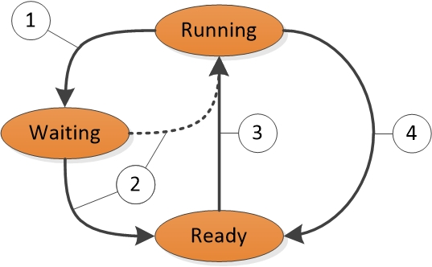

**图 1 线程状态转换**

图 1 线程状态转换解释如下︰

1.  在运行状态中的线程启动转换为正在等待的状态通过诸如**WaitForSingleObject**之类的等待函数调用或**睡眠 (&gt; 0)**。

2.  在正在运行的线程或内核操作让一个线程处于等待状态 （例如， **SetEvent**或计时器过期）。 如果处理器处于空闲状态或就绪的线程的优先级比当前正在运行的线程，就绪的线程可以直接切换到运行状态。 否则，它将处于就绪状态。

3.  计划处于就绪状态的线程调度程序正在运行的线程在等待，当处理产生的**(Sleep(0))**，或其量程结束。

4.  切换出处于运行状态的线程并将其放入就绪状态的调度程序时它抢占较高优先级线程产生**(Sleep(0))**，或当其量程结束。

存在处于等待的线程状态并不一定表示存在性能问题。 大多数线程花费大量时间处于等待状态，这使处理器可以输入空闲状态和节省能源。 仅当用户正在等待的线程来完成某项操作时，线程状态将成为性能的重要因素。

### <a name="dpcs-and-isrs"></a>Dpc 和 Isr

除了处理线程，处理器硬件设备，如网络卡或计时器从响应通知。 如果硬件设备要求处理器注意，它会产生*中断*。 Windows 通过挂起当前正在运行的线程和执行 ISR 与中断响应硬件中断。

在执行 ISR 时，处理器可以阻止处理的任何其他活动，包括其他中断。 出于此原因，必须快速完成 Isr 或会降低系统性能。 若要减少执行时间，Isr 通常安排 Dpc 在响应中断执行必须完成的工作。 每个逻辑处理器，Windows 维护计划 Dpc 队列。 Dpc 将优先于任何优先级的线程。 处理线程处理器返回之前，它执行所有 Dpc 队列中。

期间，Dpc 和 Isr 正在执行一个处理器，没有线程可以运行该处理器上。 此属性可能会导致必须执行工作在某些吞吐量或用精确计时，如播放音频或视频的线程的线程问题。 如果使用 Dpc 和 Isr 执行的处理器时间阻止这些线程接收足够的处理时间，线程可能未获得其所需的吞吐量或按时完成其工作项。

## <a name="a-href-idcpu-guide-adktoolsawindows-adk-tools"></a><a href="" id="cpu-guide-adktools"></a>Windows ADK 工具


Windows ADK*评估结果文件*中写入硬件信息和评估。 WPA 提供各种图形方式显示 CPU 使用率的详细的信息。 本节介绍如何使用 Windows ADK 和 WPA 收集、 查看和分析 CPU 性能数据。

### <a name="a-href-id-------------windows-adk-assessment-results-filesa-windows-adk-assessment-results-files"></a><a href="" id="-------------windows-adk-assessment-results-files"></a>Windows ADK 评估结果文件

因为 Windows 支持仅适用于对称多处理系统，这一节中的所有信息将都适用于所有安装 Cpu 和核心。

CPU 的硬件的详细的信息可在`EcoSysInfo`部分评估结果的文件下`<Processor><Instance id=”0”>`节点。

例如︰

``` syntax
<Processor>
  <Instance id="0">
    <ProcessorName>The name of the first CPU</ProcessorName>
    <TSCFrequency>The maximum frequency of the first CPU</TSCFrequency>
    <NumProcs>The total number of processors</NumProcs>
    <NumCores>The total number of cores</NumCores>
    <NumCPUs>The total number of logical processors</NumCPUs>
    ...and so on...
```

### <a name="wpa-graphs"></a>WPA 关系图

WPA 载入跟踪后，可以在 WPA UI 的**跟踪系统/配置/常规**和**跟踪/系统配置/PnP**部分下找到处理器的硬件信息。

**请注意**  
本指南中的所有过程都发生在 WPA。

 

### <a name="cpu-idle-states-graph"></a>CPU 空闲状态关系图

如果空闲状态信息收集在跟踪中，**电源/CPU 空闲状态**关系图将显示在 WPA UI 中。 此关系图中总是包含在每个处理器的*目标*空闲状态的数据。 如果这种状态支持的处理器，图形也将包含每个处理器*实际*空闲状态的信息。

下表中的每一行描述为目标或实际状态的处理器空闲状态更改。 为关系图中的每一行提供了以下各列︰

<table>
<colgroup>
<col width="50%" />
<col width="50%" />
</colgroup>
<thead>
<tr class="header">
<th>列</th>
<th>详细信息</th>
</tr>
</thead>
<tbody>
<tr class="odd">
<td><p>CPU</p></td>
<td><p>处理器状态变化所影响。</p></td>
</tr>
<tr class="even">
<td><p>进入时间</p></td>
<td><p>处理器，输入空闲状态的时间。</p></td>
</tr>
<tr class="odd">
<td><p>退出时间</p></td>
<td><p>处理器已退出空闲状态的时间。</p></td>
</tr>
<tr class="even">
<td><p>Max:Duration(ms)</p></td>
<td><p>处于空闲状态 （默认聚合︰ 最大值） 花费的时间。</p></td>
</tr>
<tr class="odd">
<td><p>Min:Duration(ms)</p></td>
<td><p>处于空闲状态 （默认聚合︰ 最低） 花费的时间。</p></td>
</tr>
<tr class="even">
<td><p>下一状态</p></td>
<td><p>向其处理器转换后的当前状态状态。</p></td>
</tr>
<tr class="odd">
<td><p>上一状态</p></td>
<td><p>处理器的当前状态之前从其过渡的状态。</p></td>
</tr>
<tr class="even">
<td><p>省/市/自治区</p></td>
<td><p>当前的空闲状态。</p></td>
</tr>
<tr class="odd">
<td><p>状态 （数字）</p></td>
<td><p>作为一个数字 (例如，0 表示 C0) 当前空闲状态。</p></td>
</tr>
<tr class="even">
<td><p>Sum:Duration(ms)</p></td>
<td><p>处于空闲状态 （默认聚合︰ 总和） 花费的时间。</p></td>
</tr>
<tr class="odd">
<td><p>表格</p></td>
<td><p>未使用</p></td>
</tr>
<tr class="even">
<td><p>类型</p></td>
<td><p><strong>目标</strong>（对于处理器的电源管理器的所选的目标状态） 或<strong>实际</strong>（对于处理器的实际空闲状态）。</p></td>
</tr>
</tbody>
</table>

 

默认的 WPA 配置文件为此关系图中提供了两个预设︰**按类型、 CPU 的状态**和**类型，CPU 的状态图**。

### <a name="state-by-type-cpu"></a>按类型、 CPU 状态

每个 CPU 的目标和实际状态绘图以及**按类型、 CPU 的状态**图中的**Y**轴上的状态数目。 按类型图 2 CPU 空闲状态状态，CPU 显示 CPU 的实际状态为其活动和目标的空闲状态之间波动。

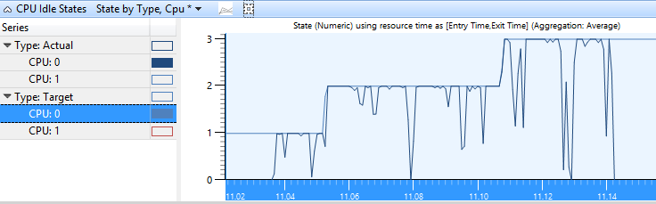

**图 2 CPU 类型，CPU 的空闲状态状态**

### <a name="state-diagram-by-type-cpu"></a>按类型、 CPU 的状态图

在此图中，每个 CPU 的目标和实际状态都显示在时间线的格式。 每个状态在时间轴中都有单独的行。 图 3 CPU 空闲状态状态关系图中的类型，CPU 时间线视图中显示与图 2 CPU 空闲状态状态按类型、 CPU，相同的数据。

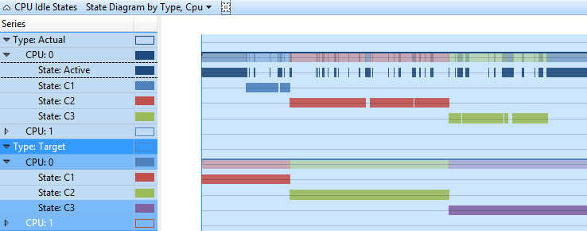

**图 3 CPU 类型，CPU 的空闲状态状态图**

### <a name="cpu-frequency-graph"></a>CPU 频率图

如果 CPU 频率数据收集的系统中支持多个 P-或 T-状态， **CPU 频率**图将 WPA 用户界面中可用。 下表中的每一行表示在特定频率级别的处理器时间。 **频率 （赫兹）**列中包含有限的数目的对应的 P-状态和 T 状态所支持的处理器的频率。 为关系图中的每一行提供了以下各列︰

<table>
<colgroup>
<col width="50%" />
<col width="50%" />
</colgroup>
<thead>
<tr class="header">
<th>列</th>
<th>详细信息</th>
</tr>
</thead>
<tbody>
<tr class="odd">
<td><p>%持续时间</p></td>
<td><p>在当前可见时间段的总的 CPU 时间百分比表示持续时间。</p></td>
</tr>
<tr class="even">
<td><p>计数</p></td>
<td><p>频率变更 (始终为单个行 1) 数。</p></td>
</tr>
<tr class="odd">
<td><p>CPU</p></td>
<td><p>CPU 频率变化所影响。</p></td>
</tr>
<tr class="even">
<td><p>进入时间</p></td>
<td><p>CPU 输入 P-状态的时间。</p></td>
</tr>
<tr class="odd">
<td><p>退出时间</p></td>
<td><p>CPU 退出 P-状态的时间。</p></td>
</tr>
<tr class="even">
<td><p>频率 （赫兹）</p></td>
<td><p>在 P 态时的 cpu 频率。</p></td>
</tr>
<tr class="odd">
<td><p>Max:Duration(ms)</p></td>
<td><p>在 P-状态 （默认聚合︰ 最大值） 花费的时间。</p></td>
</tr>
<tr class="even">
<td><p>Min:Duration(ms)</p></td>
<td><p>在 P-状态 （默认聚合︰ 最低） 花费的时间。</p></td>
</tr>
<tr class="odd">
<td><p>Sum:Duration(ms)</p></td>
<td><p>在 P-状态 （默认聚合︰ 总和） 花费的时间。</p></td>
</tr>
<tr class="even">
<td><p>表格</p></td>
<td><p>未使用</p></td>
</tr>
<tr class="odd">
<td><p>类型</p></td>
<td><p>P-状态的附加信息。</p></td>
</tr>
</tbody>
</table>

 

默认的配置文件定义预设为该图**按 CPU 的频率**。 图 4 CPU 频率由 CPU 显示 CPU 三个 P-状态之间转换︰

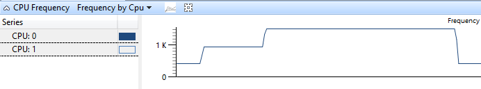

**图 4 CPU 频率由 CPU**

### <a name="cpu-usage-sampled-graph"></a>CPU 使用状况 （样本） 图

**CPU 使用状况 （式采样）**图形中显示的数据表示 CPU 活动的常规采样时间间隔所取的样本。 在大多数的跟踪，这是一毫秒 （1 毫秒）。 表中的每一行表示一个样品。

样本的重量表示该示例中，相对于其他示例的重要性。 重量等于当前示例减去上面示例中的时间戳的时间戳。 称重并不总是完全等于采样间隔由于系统状态和活动的波动。

图 5 CPU 采样表示收集数据的方式︰

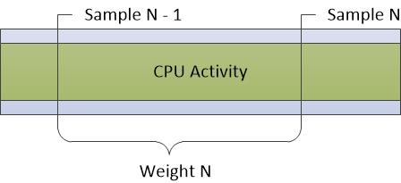

**图 5 CPU 采样**

样本之间发生任何 CPU 活动不会记录此采样方法。 因此， **CPU 采样**图中没有很好地表示如 Dpc 和 Isr 非常短持续时间的活动。

为关系图中的每一行提供了以下各列︰

<table>
<colgroup>
<col width="50%" />
<col width="50%" />
</colgroup>
<thead>
<tr class="header">
<th>列</th>
<th>详细信息</th>
</tr>
</thead>
<tbody>
<tr class="odd">
<td><p>重量 %</p></td>
<td><p>重量在当前可见时间范围内所用的总 CPU 时间的百分比表示。</p></td>
</tr>
<tr class="even">
<td><p>地址</p></td>
<td><p>位于堆栈的底部的函数的内存地址。</p></td>
</tr>
<tr class="odd">
<td><p>所有的计数</p></td>
<td><p>样本所表示的行数。 此数目包括处理器空闲时所取的样本。 对于单个行，该列始终为 1。</p></td>
</tr>
<tr class="even">
<td><p>计数</p></td>
<td><p>表示某一行，但不包括处理器空闲时所取的样本的样本数。 对于单个行，该列始终是 1 （或 0，情况 CPU 处于低功耗状态）。</p></td>
</tr>
<tr class="odd">
<td><p>CPU</p></td>
<td><p>依据本样本所采用的 cpu 从 0 开始的索引。</p></td>
</tr>
<tr class="even">
<td><p>显示名称</p></td>
<td><p>在活动过程中显示名称。</p></td>
</tr>
<tr class="odd">
<td><p>DPC/ISR</p></td>
<td><p>该示例测量正则的 CPU 使用率、 DPC/ISR 或低功耗状态。</p></td>
</tr>
<tr class="even">
<td><p>函数</p></td>
<td><p>该函数位于堆栈的底部。</p></td>
</tr>
<tr class="odd">
<td><p>模块</p></td>
<td><p>该模块包含该函数位于堆栈的底部。</p></td>
</tr>
<tr class="even">
<td><p>优先级</p></td>
<td><p>正在运行的线程的优先级。</p></td>
</tr>
<tr class="odd">
<td><p>混色</p></td>
<td><p>拥有正在运行的代码的进程的图像名称。</p></td>
</tr>
<tr class="even">
<td><p>进程的名称</p></td>
<td><p>拥有正在运行的代码的进程完整名称 （包括进程 ID）。</p></td>
</tr>
<tr class="odd">
<td><p>Stack</p></td>
<td><p>正在运行的线程堆栈。</p></td>
</tr>
<tr class="even">
<td><p>线程 ID</p></td>
<td><p>正在运行的线程的 ID。</p></td>
</tr>
<tr class="odd">
<td><p>线程的启动函数</p></td>
<td><p>正在运行的线程的启动函数。</p></td>
</tr>
<tr class="even">
<td><p>线程启动模块</p></td>
<td><p>包含线程的启动函数的模块。</p></td>
</tr>
<tr class="odd">
<td><p>时间戳</p></td>
<td><p>样本采集时间。</p></td>
</tr>
<tr class="even">
<td><p>Weight</p></td>
<td><p>通过示例 （即自上次采样以来的时间） 来表示的时间 （以毫秒为单位）。</p></td>
</tr>
</tbody>
</table>

 

默认的配置文件为此关系图中提供了下列预设︰

-   Cpu 的利用率

-   按优先级的利用率

-   由进程的利用率

-   按进程和线程的利用率

### <a name="utilization-by-cpu"></a>Cpu 的利用率

**CPU 使用率使用量减少 CPU**图形显示处理器之间如何分配工作。 图 6 CPU 使用率使用量减少 CPU 显示两个 Cpu 为此通讯组︰

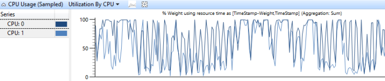

**CPU 使用率图 6 CPU 利用率**

### <a name="utilization-by-priority"></a>按优先级的利用率

**CPU 使用率**按线程优先级别分组显示高优先级线程的影响较低优先级的线程的线程。 图 7 CPU 使用率 （式采样） 利用率按优先级显示此关系图中︰

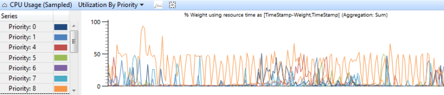

**图 7 （取样） 的 CPU 利用率利用率按优先级**

### <a name="utilization-by-process"></a>由进程的利用率

分为进程的**CPU 使用率**显示出相对使用率的进程。 图 8 进程的 CPU 使用式 （采样） 利用率显示此预设。 在此示例图中显示一个进程会消耗更多的 CPU 时间比其他进程。

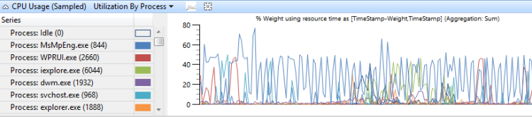

**图 8 进程的 CPU 使用状况 （取样） 利用率**

### <a name="utilization-by-process-and-thread"></a>按进程和线程的利用率

**CPU 使用率**，它是按进程分组，然后按线程分组显示每个进程中的进程和线程的相对使用率。 图 9 的进程和线程的 CPU 使用率 （式采样） 利用率显示此预设。 在此图中选择一个进程的线程。

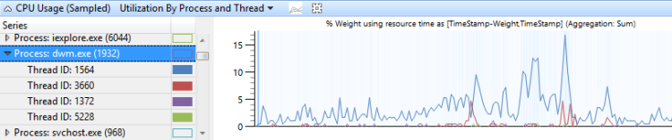

**图 9 的进程和线程的 CPU 使用率 （取样） 利用率**

### <a name="cpu-usage-precise-graph"></a>CPU 使用状况 （精确） 图

**CPU 使用状况 （精密）**图记录上下文切换事件的信息。 每行表示一组数据与单个上下文切换;也就是说，当一个线程开始运行。 数据收集的以下事件序列︰

1.  新线程切换出。

2.  新线程是由准备好按 readying 线程运行。

3.  新线程切换，从而出旧线程切换。

4.  新线程切换出再次。

在图 10 CPU 使用率精确图中，时间流动从左到右。 图表标签对应于**CPU 使用率 （精密）**图中的列名称。 顶部的图表，显示**时间戳**列的标签和标签**间隔持续时间**列显示在关系图中的底部。


**图 10 的 CPU 使用率精确图**

在时间轴中图 10 CPU 使用率精确图中的分页符将时间线划分为可以在不同的 Cpu 同时发生的地区。 只要不修改编号的事件的顺序，这些期限可以重叠。 例如，Readying 线程可以在处理器 2 上运行一个新线程切换出次，然后再在处理器 1 上）。

在时间线上的以下四个目标都要记录信息︰

-   *新的线程*，它是在被切换的线程。 它是在图形中此行的主要焦点。

-   *NewPrev 线程*，它指的是新线程在切换在前一次。

-   *将线程准备就绪*，为准备新的线程来处理线程。

-   *原来的线程*，即当在转换成新的线程切换出的线程。

下表中的数据关联到每个目标线程︰

<table>
<colgroup>
<col width="50%" />
<col width="50%" />
</colgroup>
<thead>
<tr class="header">
<th>列</th>
<th>详细信息</th>
</tr>
</thead>
<tbody>
<tr class="odd">
<td><p>CPU 使用情况</p></td>
<td><p>新线程切换后的 CPU 使用率。 此值表示在当前可见时间段的总 CPU 时间的百分比。</p></td>
</tr>
<tr class="even">
<td><p>计数</p></td>
<td><p>该行所表示的上下文切换次数。 这始终是用于单个行 1。</p></td>
</tr>
<tr class="odd">
<td><p>计数︰ 等待</p></td>
<td><p>等待时间表示的行的数目。 这始终是一个线程切换到空闲状态，则除个别行 1在这种情况下，它设置为 0。</p></td>
</tr>
<tr class="even">
<td><p>CPU</p></td>
<td><p>CPU 上下文切换发生。</p></td>
</tr>
<tr class="odd">
<td><p>CPU 使用状况 （毫秒）</p></td>
<td><p>新线程上下文切换后的 CPU 使用率。 这等于 NewInSwitchTime，但显示以毫秒为单位。</p></td>
</tr>
<tr class="even">
<td><p>IdealCpu</p></td>
<td><p>新线程计划程序选择理想 CPU。</p></td>
</tr>
<tr class="odd">
<td><p>LastSwitchOutTime (s)</p></td>
<td><p>新线程被切换出在前一次。</p></td>
</tr>
<tr class="even">
<td><p>NewInPri</p></td>
<td><p>在切换新线程的优先级。</p></td>
</tr>
<tr class="odd">
<td><p>NewInSwitchTime(s)</p></td>
<td><p>减去 SwitchInTime(s) NextSwitchOutTime(s)</p></td>
</tr>
<tr class="even">
<td><p>NewOutPri</p></td>
<td><p>在切换出新线程的优先级。</p></td>
</tr>
<tr class="odd">
<td><p>NewPrevOutPri</p></td>
<td><p>当它以前被切换出新线程的优先级。</p></td>
</tr>
<tr class="even">
<td><p>NewPrevState</p></td>
<td><p>之后它以前被切换出新线程的状态。</p></td>
</tr>
<tr class="odd">
<td><p>NewPrevWaitMode</p></td>
<td><p>当它以前被切换出新线程等待模式。</p></td>
</tr>
<tr class="even">
<td><p>NewPrevWaitReason</p></td>
<td><p>新线程被切换出原因。</p></td>
</tr>
<tr class="odd">
<td><p>NewPriDecr</p></td>
<td><p>影响该线程优先级提升。</p></td>
</tr>
<tr class="even">
<td><p>NewProcess</p></td>
<td><p>新线程的过程。</p></td>
</tr>
<tr class="odd">
<td><p>NewProcess 名称</p></td>
<td><p>新线程，包括 PID 的进程的名称。</p></td>
</tr>
<tr class="even">
<td><p>NewQnt</p></td>
<td><p>未使用。</p></td>
</tr>
<tr class="odd">
<td><p>NewState</p></td>
<td><p>新线程切换进后的状态。</p></td>
</tr>
<tr class="even">
<td><p>NewThreadId</p></td>
<td><p>新线程的线程 ID。</p></td>
</tr>
<tr class="odd">
<td><p>NewThreadStack</p></td>
<td><p>当切换进新线程的堆栈。</p></td>
</tr>
<tr class="even">
<td><p>NewThreadStartFunction</p></td>
<td><p>新线程的启动函数。</p></td>
</tr>
<tr class="odd">
<td><p>NewThreadStartModule</p></td>
<td><p>新线程的启动模块。</p></td>
</tr>
<tr class="even">
<td><p>NewWaitMode</p></td>
<td><p>新线程将等待模式。</p></td>
</tr>
<tr class="odd">
<td><p>NewWaitReason</p></td>
<td><p>新线程被切换出原因。</p></td>
</tr>
<tr class="even">
<td><p>NextSwitchOutTime(s)</p></td>
<td><p>下一步出交换新线程的时间。</p></td>
</tr>
<tr class="odd">
<td><p>OldInSwitchTime(s)</p></td>
<td><p>之前它被切换出原来的线程已在切换的时间。</p></td>
</tr>
<tr class="even">
<td><p>OldOutPri</p></td>
<td><p>当它被切换出旧线程的优先级。</p></td>
</tr>
<tr class="odd">
<td><p>OldProcess</p></td>
<td><p>拥有旧线程的进程。</p></td>
</tr>
<tr class="even">
<td><p>OldProcess 名称</p></td>
<td><p>拥有旧线程，包括 PID 进程的名称。</p></td>
</tr>
<tr class="odd">
<td><p>OldQnt</p></td>
<td><p>未使用。</p></td>
</tr>
<tr class="even">
<td><p>OldState</p></td>
<td><p>在它后面的旧线程的状态切换出。</p></td>
</tr>
<tr class="odd">
<td><p>OldThreadId</p></td>
<td><p>旧的线程的线程 ID。</p></td>
</tr>
<tr class="even">
<td><p>OldThreadStartFunction</p></td>
<td><p>旧的线程的启动函数。</p></td>
</tr>
<tr class="odd">
<td><p>OldThreadStartModule</p></td>
<td><p>旧的线程的启动模块。</p></td>
</tr>
<tr class="even">
<td><p>OldWaitMode</p></td>
<td><p>原来的线程将等待模式。</p></td>
</tr>
<tr class="odd">
<td><p>OldWaitReason</p></td>
<td><p>原来的线程被切换出原因。</p></td>
</tr>
<tr class="even">
<td><p>PrevCState</p></td>
<td><p>处理器上 CState。 如果这不是 0 （活动），处理器已处于空闲状态之前新线程的上下文切换。</p></td>
</tr>
<tr class="odd">
<td><p>Ready(s)</p></td>
<td><p>SwitchInTime(s) minusReadyTime (s)</p></td>
</tr>
<tr class="even">
<td><p>将 ThreadId 准备就绪</p></td>
<td><p>Readying 线程的线程 ID。</p></td>
</tr>
<tr class="odd">
<td><p>将 ThreadStartFunction 准备就绪</p></td>
<td><p>Readying 线程的启动函数。</p></td>
</tr>
<tr class="even">
<td><p>将 ThreadStartModule 准备就绪</p></td>
<td><p>Readying 线程的启动模块。</p></td>
</tr>
<tr class="odd">
<td><p>ReadyingProcess</p></td>
<td><p>拥有 readying 线程的进程。</p></td>
</tr>
<tr class="even">
<td><p>ReadyingProcess 名称</p></td>
<td><p>拥有 readying 线程，包括 PID 进程的名称。</p></td>
</tr>
<tr class="odd">
<td><p>ReadyThreadStack</p></td>
<td><p>Readying 的线程的堆栈。</p></td>
</tr>
<tr class="even">
<td><p>ReadyTime (s)</p></td>
<td><p>当新的线程已就绪的时间。</p></td>
</tr>
<tr class="odd">
<td><p>SwitchInTime(s)</p></td>
<td><p>新线程在被切换时的时间。</p></td>
</tr>
<tr class="even">
<td><p>TimeSinceLast (s)</p></td>
<td><p>SwitchInTime(s)-LastSwitchOutTime (s)</p></td>
</tr>
<tr class="odd">
<td><p>等待 (s)</p></td>
<td><p>ReadyTime (s)-LastSwitchOutTime (s)</p></td>
</tr>
</tbody>
</table>

 

默认配置文件使用此关系图中的下列预设︰

-   通过 CPU 的时间线

-   由进程，线程的时间线

-   上下文开关开始在优先级的使用情况

-   Cpu 的利用率

-   由进程，线程的利用率

### <a name="timeline-by-cpu"></a>通过 CPU 的时间线

每个 CPU 时间轴上的**CPU 使用率**显示如何在处理器之间分配工作。 图 11 按 CPU CPU 使用率 （精确） 线八个处理器的系统上显示时间线︰

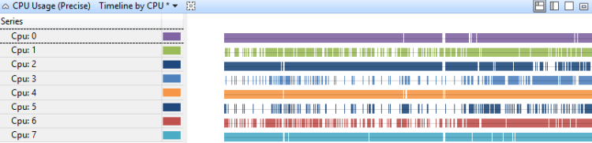

**图 11 按 CPU CPU 使用率 （精确） 线**

### <a name="timeline-by-process-thread"></a>由进程，线程的时间线

在每个进程，每个线程的时间线上， **CPU 使用率**显示哪些进程在特定时间运行的线程。 图 12 （精密） 的使用时间轴中由进程，线程显示此时间线跨多个进程︰

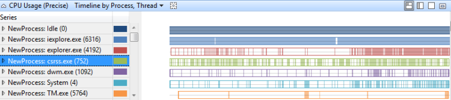

**图 12 使用率 （精确） 时间线的过程中，线程**

### <a name="usage-by-priority-at-context-switch-begin"></a>上下文开关开始在优先级的使用情况

此关系图中标识每个优先级级别高优先级线程活动的突发情况。 图 13 CPU 使用率 （精密） 使用按优先级上下文开关开始处显示的优先级的分布︰

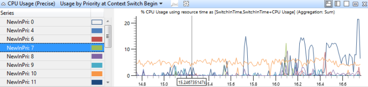

**图 13 CPU 使用率 （精确） 使用的上下文切换开始处的优先级**

### <a name="utilization-by-cpu"></a>Cpu 的利用率

在此图中，CPU 的使用率是分组并制成图表，以显示工作分布处理器的 cpu。 图 14 CPU 使用率 （精密） CPU 利用率显示此关系图中有八个处理器的系统。

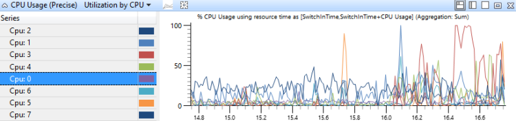

**图 14 CPU 使用率 （精确） 的 CPU 利用率**

### <a name="utilization-by-process-thread"></a>由进程，线程的利用率

在此图中，由进程再由线程第一次分组 CPU 使用率。 显示出相对使用率的进程和线程的过程中，每个进程图 15 CPU 使用率 （精密） 利用率中线程显示此通讯组跨多个进程︰

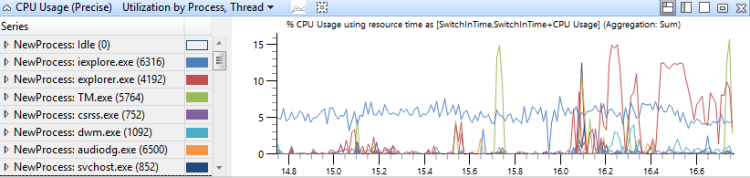

**图 15 的过程中，CPU 的使用率 （精确） 利用率线程**

### <a name="dpcisr-graph"></a>DPC/ISR 图

DPC/ISR 图形是在 WPA 的 DPC/ISR 信息的主要来源。 关系图中的每一行表示一个片段，这是一段时间，在此期间 DPC 或 ISR 运行不会中断。 收集数据的开始和结束的片段。 当 DPC/ISR 完成收集其他数据。 图 16 DPC/ISR 图显示了该方法的原理︰

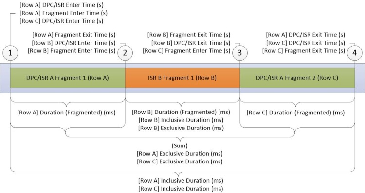

**图 16 DPC/ISR 图**

图 16 DPC/ISR 图描述以下活动期间收集的数据︰

1.  **DPC/ISR A**开始运行。

2.  已中断级别高于**DPC/ISR A**设备中断导致**ISR B**中断**DPC/ISR A**，从而结束**DPC/ISR A**的第一个片段。

3.  **ISR B**完成，从而结束**ISR B**的片段。 **DPC/ISR-A**将继续执行第二个片段中。

4.  **DPC/ISR A**完成，从而结束第二个**DPC/ISR**a 段。

在数据表中显示的每个片段的行。 **DPC/ISR A**的片断与非片段列共享相同的信息。

DPC/ISR 图形列描述片段级信息或 DPC/ISR 级别的列。 片段级列和 DPC/ISR 列中的相同数据中的每个片段不同数据。

<table>
<colgroup>
<col width="50%" />
<col width="50%" />
</colgroup>
<thead>
<tr class="header">
<th>列</th>
<th>详细信息</th>
</tr>
</thead>
<tbody>
<tr class="odd">
<td><p>（碎片） %持续时间</p></td>
<td><p>持续时间 （碎片），它是在当前可见时间段表示的总的 CPU 时间百分比。</p></td>
</tr>
<tr class="even">
<td><p>独占 %的持续时间</p></td>
<td><p>在当前可见时间段的总 CPU 时间的百分比形式表示的独占持续时间。</p></td>
</tr>
<tr class="odd">
<td><p>%的非独占时间</p></td>
<td><p>在当前可见时间段的总 CPU 时间的百分比形式表示的非独占持续时间。</p></td>
</tr>
<tr class="even">
<td><p>地址</p></td>
<td><p>DPC 或 ISR 函数的内存地址。</p></td>
</tr>
<tr class="odd">
<td><p>计数 (Dpc/Isr)</p></td>
<td><p>Dpc/Isr 表示的行的计数。 这始终是 1 的行表示的 DPC/ISR; 最后一个片段否则，此计数为 0。</p></td>
</tr>
<tr class="even">
<td><p>计数 （片段）</p></td>
<td><p>该行所表示的碎片的数量。 这始终是用于单个行 1。</p></td>
</tr>
<tr class="odd">
<td><p>CPU</p></td>
<td><p>逻辑处理器运行 DPC 或 ISR 的索引。</p></td>
</tr>
<tr class="even">
<td><p>DPC 类型</p></td>
<td><p>DPC，DPC，类型为的常规或计时器。 此值为空的 ISR.</p></td>
</tr>
<tr class="odd">
<td><p>DPC/ISR 输入时间 (s)</p></td>
<td><p>在跟踪启动 DPC/ISR 时时间。</p></td>
</tr>
<tr class="even">
<td><p>DPC/ISR 退出时间 (s)</p></td>
<td><p>到当 DPC/ISR 完成跟踪的起始时间。</p></td>
</tr>
<tr class="odd">
<td><p>（碎片） 持续时间 （毫秒）</p></td>
<td><p>以毫秒为单位进行分段退出时间 (s) 减去片段输入时间 (s)。</p></td>
</tr>
<tr class="even">
<td><p>独占的持续时间 （毫秒）</p></td>
<td><p>以毫秒为单位的分散工期的总和。 对于此 DPC/ISR.的所有片段</p></td>
</tr>
<tr class="odd">
<td><p>片段</p></td>
<td><p>如果 DPC/ISR 此行有多个片段，此值为<strong>True</strong>;否则，它是<strong>假</strong>的。</p></td>
</tr>
<tr class="even">
<td><p>片段</p></td>
<td><p>如果未为此 DPC/ISR 只有片段，此值为<strong>True</strong>;否则，它是<strong>假</strong>的。</p></td>
</tr>
<tr class="odd">
<td><p>片段输入时间 (s)</p></td>
<td><p>该片段开始运行的时间。</p></td>
</tr>
<tr class="even">
<td><p>设置退出时间片段 (s)</p></td>
<td><p>该片段停止运行的时间。</p></td>
</tr>
<tr class="odd">
<td><p>函数</p></td>
<td><p>已运行 DPC 或 ISR 函数。</p></td>
</tr>
<tr class="even">
<td><p>包括持续时间 （毫秒）</p></td>
<td><p>DPC/ISR 退出时间 (s) 减去 DPC/ISR 输入时间 (s) 以毫秒为单位。</p></td>
</tr>
<tr class="odd">
<td><p>MessageIndex</p></td>
<td><p>消息告知中断中断索引。</p></td>
</tr>
<tr class="even">
<td><p>模块</p></td>
<td><p>包含将 DPC 或 ISR 函数的模块。</p></td>
</tr>
<tr class="odd">
<td><p>返回值</p></td>
<td><p>DPC/ISR 返回值</p></td>
</tr>
<tr class="even">
<td><p>类型</p></td>
<td><p>类型的事件;这是-DPC 或中断 (ISR)。</p></td>
</tr>
<tr class="odd">
<td><p>向量</p></td>
<td><p>在设备上的中断向量的值。</p></td>
</tr>
</tbody>
</table>

 

默认配置文件使用此关系图中的下列预设︰

-   \[DPC，ISR，DPC/ISR\] cpu 持续时间

-   \[DPC，ISR，DPC/ISR\]的模块持续时间正常

-   \[DPC，ISR，DPC/ISR\]的功能模块，通过时间轴

### <a name="a-href-id-dpc-isr-dpc-isr--duration-by-cpuadpcisrdpcisr-duration-by-cpu"></a><a href="" id="-dpc-isr-dpc-isr--duration-by-cpu"></a>\[DPC，ISR，DPC/ISR\] cpu 持续时间

DPC/ISR 事件聚合 cpu 依据它们运行和持续时间进行排序。 此图显示跨 Cpu 分配的 DPC 活动。 图 17 的 CPU 的 DPC/ISR 持续时间显示此关系图中有八个处理器的系统。

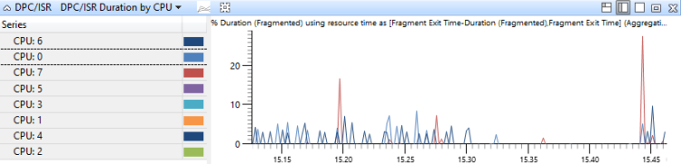

**图 17 的 CPU 的 DPC/ISR 持续时间**

### <a name="a-href-id-dpc-isr-dpc-isr--duration-by-module--functionadpcisrdpcisr-duration-by-module-function"></a><a href="" id="-dpc-isr-dpc-isr--duration-by-module--function"></a>\[DPC，ISR，DPC/ISR\]的模块持续时间正常

DPC/ISR 事件都聚集在此关系图中的模块和函数的 DPC/ISR 例程中，并且按时间排序。 这显示哪些 DPC/ISR 例程占用大多数时间图 18 DPC/ISR 持续时间由模块、 函数显示一段时间，会导致两个模块中的 DPC/ISR 活动︰

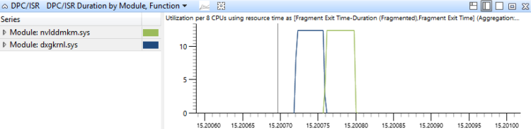

**图 18 DPC/ISR 工期，模块，函数**

### <a name="a-href-id-dpc-isr-dpc-isr--timeline-by-module--functionadpcisrdpcisr-timeline-by-module-function"></a><a href="" id="-dpc-isr-dpc-isr--timeline-by-module--function"></a>\[DPC，ISR，DPC/ISR\]的功能模块，通过时间轴

DPC/ISR 事件的模块和函数的 DPC/ISR 例程聚集在此关系图中。 他们为时间线绘图。 此图提供了 Dpc/Isr 对其运行的时间段的详细的视图。 此图还可以显示方式单一的 DPC Isr 可以分段。 图 19 DPC/ISR 时间轴中的模块，函数显示三个模块中的活动的日程表︰

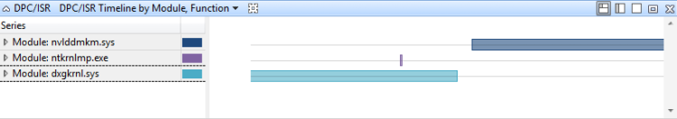

**图 19 DPC/ISR 时间线，模块，函数**

### <a name="stack-trees"></a>堆栈树

堆栈树显示在**CPU 使用率 （式采样）**、 **CPU 使用率 （精密）**和**DPC/ISR**表在 WPA，并在评估报告中报告的问题。 堆栈树描绘了一段时间内都与多个事件的调用堆栈。 在树中每个节点表示共享事件的子集的堆栈段。 从单个叠构造和图 20 堆栈中从这三个事件所示的树︰

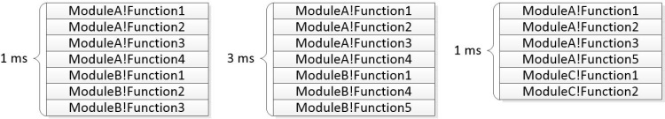

**从这三个事件图 20 堆栈**

图 21 常见段标识的显示常用的序列如何标识此关系图︰

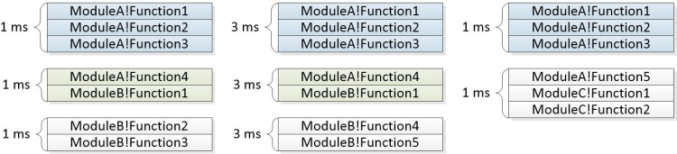

**图 21 标识常用管线段**

树生成堆栈图 22 显示如何组合的常用管线段形成的一个树节点︰

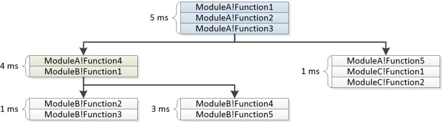

**从堆栈中生成的图 22 树**

WPA UI 中的**堆栈**列包含为每个非叶节点的展开。 在评估报告的问题，以及聚合重量显示的树。 如果其重量不符合指定的阈值可以从关系图中删除一些分支。 下面的示例堆栈显示上面表示的事件作为评估报告的问题的一部分的显示方式。

``` syntax
5ms   ModuleA!Function1
5ms   ModuleA!Function2
5ms   ModuleA!Function3
      |
4ms   |-ModuleA!Function4
4ms   |   ModuleB!Function1
      |   |
1ms   |   |-ModuleB-Function2
1ms   |   |    ModuleB-Function3
      |   |
3ms   |   |-ModuleB!Function3
3ms   |        ModuleB!Function4
      |
1ms   |-ModuleA!Function5
1ms        ModuleC!Function1
1ms        ModuleC!Function2
```

`<itself>`在堆栈中的节点表示函数本身位于堆栈的底部的时间。 `<itself>`节点不包括由父函数调用的函数中所用的时间。 持续时间称为*独占*时间花费在函数中。

例如， **Function1**调用**Function2**。 **Function2**花费大量占用 CPU 的循环中 2 毫秒并为 4ms 调用另一个函数的运行。 这只能通过下面的堆栈︰

``` syntax
6ms   ModuleA!Function1
      |
2ms   |-<itself>
4ms   |-ModuleA!Function2
4ms        ModuleB!Function3
4ms        ModuleB-Function4
```

## <a name="a-href-idcpu-guide-techniquesatechniques"></a><a href="" id="cpu-guide-techniques"></a>技术


本部分介绍性能分析的标准方法。 它提供了可用于调查常见与 CPU 相关的性能问题的技术。

性能分析是需要四个步骤︰

1.  定义了各种情形和问题。

2.  确定所涉及的组件和相关的时间范围。

3.  创建一个模型中应该发生。

4.  使用模型来确定问题和调查根本原因。

### <a name="define-the-scenario-and-the-problem"></a>定义了各种情形和问题

性能分析的第一步是明确定义了各种情形和问题。 很多性能问题影响的评估指标衡量的方案。 例如︰

方案 1︰ 物理资源是未被充分利用。 例如，服务器不能充分利用网络连接，因为它不能足够快地加密数据包。

方案 2︰ 物理资源的利用情况更不是它应该是。 例如，系统使用电池电源的空闲期间使用大量的 CPU 资源。

方案 3︰ 活动不能进行所需的速度完成。 例如，帧丢弃视频播放期间由于帧的解码速度不够快。

方案 4︰ 延迟活动了。 例如，用户启动 Internet Explorer，但花费的时间比预期的要打开一个选项卡。

方案 3 和 4 为它们与 CPU 资源有关介绍本指南中。 方案 1 和 2 超出范围，并没有涉及。 分析这些问题，可以开头明确观察值，如"速度太慢是"，并提出其他问题，以确定方案和具体的问题。

### <a name="a-href-ididentify-the-components-and-the-time-period-aidentify-the-components-and-the-time-period"></a><a href="" id="identify-the-components-and-the-time-period-"></a>识别组件的时间段

在确定了各种情形和问题后，您可以标识所涉及的组件和感兴趣的时间段。 这些组件包括硬件资源、 进程和线程。

通常可以通过识别分析指南 》 中的相关的活动找到感兴趣的时间范围。 活动的启动事件和停止事件，您可以选择和放大，WPA 之间的时间间隔。 如果未定义活动，可以找到时间范围内，通过寻找与该方案相关联的特定泛型事件或寻找可能标记的开始和结束的方案的资源利用率的变化。 例如，如果 CPU 空闲两秒钟，然后充分利用四秒钟，再次为两秒钟然后处于空闲状态，充分利用四秒可能会跟踪感兴趣的区域，捕获视频播放。

### <a name="create-a-model"></a>创建模型

若要了解问题的根本原因，必须有什么应该发生的行为的模型。 该模型从开始问题或任何关联的目标度量;例如，"完成此操作应具有小于 5 秒中。"

更完整的模型包含有关组件应执行方式的信息。 例如，组件之间预期的通信？ 哪些资源利用率是典型？ 需要多长时间的操作通常？

模型信息通常可以评估分析指南 》 中找到。 如果该资源不可用，则可以生成从类似的硬件和软件不会出现性能问题，创建模型的跟踪。

### <a name="use-the-model-to-identify-problems-and-then-investigate-root-causes"></a>使用该模型来识别问题，并再调查根本原因

一个模型后，您可以比较跟踪到的模型来识别问题。 例如，特定活动称为**挂起的设备**的模型可能建议在子活动的每个实例调用时，整个活动应完成在三秒钟内，**挂起&lt;设备名称&gt;**应采取不超过 100 毫秒。 如果两个实例的子活动**挂起&lt;设备名称&gt;**每个都采用 800ms年，您应调查那些实例。

每个模型偏差可以进行分析，找到根本原因。 您应检查涉及线程的状态，寻找常见根本原因。 下面将介绍一些主要与 CPU 相关的根本原因，才能完成所需的速度，或会延迟，活动︰

将 CPU 的使用率︰ 适当的线程接收到完整的 CPU 资源，但没有足够快的速度执行所需的程序。 原因可能是由程序工作不正常或缓慢的硬件。

线程的干扰︰ 一个线程未获得足够运行时间因为改为运行其他线程。 在这种情况下，该线程将被视为缺少或被抢占。

DPC/ISR 干扰︰ 线程未获得足够运行时间因为忙于处理 Dpc 或 Isr Cpu。

在许多情况下，这些根本原因之一不显著影响线程和线程花费大部分时间处于等待状态。 在这种情况下，您必须确定和调查线程正在等待的事件。 这种递归类型的调查称为*等待分析*，它通过识别关键路径的起始。

### <a name="advanced-technique-wait-analysis-and-the-critical-path"></a>高级技术︰ 等待分析和关键路径

活动是一种操作，一些连续和一些并行，从开始事件流到结束事件的网络。 在跟踪中任何的开始/结束事件对可被视为活动。 通过操作该网络的最长路径被称为关键路径。 虽然它还可以更改关键路径缩短关键路径上的任何操作的持续时间直接减少的总体活动的持续时间。

图 23 的活动操作显示三个线程的活动。 线程 1 发送活动启动事件，然后等待线程 2 和线程 3 来完成他们的任务。 线程 2 跟线程-3 第一次，完成它的任务。 当两个线程完成其任务时，线程 1 已就绪并完成活动事件。

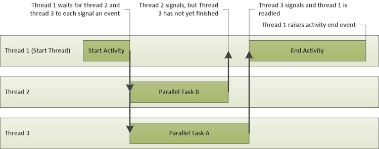

**图 23 的活动操作**

在这种情况下，关键路径包括线程-3 和线程 1 的部分。 这些跟踪图 24 关键路径中。 由于线程 2 不在关键路径上，完成其任务所花费的时间不会影响整体的活动时间。

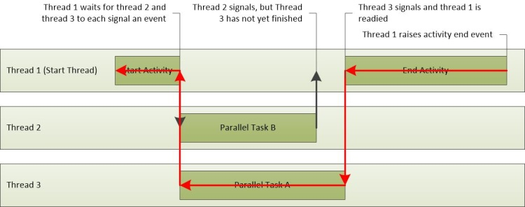

**图 24 关键路径**

关键路径是低级别的文本活动为什么花一样的时间一样多的问题答案。 关键字段的关键路径后，他们可以对其进行分析以找出导致的总体延迟问题。

### <a name="general-approach-to-finding-the-critical-path"></a>常规方法来寻找关键路径

查找关键路径的第一步是审查方案模型，了解的目的和活动的实施。

了解活动可帮助识别特定的操作、 进程和线程，可能在关键路径上。 例如，在**快速启动恢复资源管理器初始化**活动中的延迟可能致**RunOnce**应用程序和资源管理器初始化过程中，这两种需要大量的 I/O。

检查方案模型之后，检查评估是否报告任何受影响的活动的问题。 很多时候，包括在评估报告延迟问题中关键路径的近似。 关键路径显示为等待和准备就绪的操作序列。 它可以从开始到结束一系列事件，与关键路径列表的中间位置的主延迟段为读取。 在列表中的最后一项是 readied 完成这些活动的线程的操作。

如果您必须手动查找关键路径，我们建议您确定进程和线程的活动完成的即时从向后完成的活动和工作。 您可以标识进程并启动活动和进程的线程和线程完成的活动，通过 WPA 中的**活动**图。

**活动**图显示通过评估结果 XML 文件加载跟踪时。 要确定该进程和与特定活动相关联的线程，扩展到感兴趣的活动的图形，然后将视图切换到**图形 + 表**。 设置**表**的关系图模式。 **启动进程**、**启动线程 Id**、**结束进程**和**结束线程 Id**的列显示为表中的每个活动。

您知道的开始和结束进程、 线程，以及活动的实施后，可以向后跟踪关键路径。 通过分析已完成的活动，以确定该线程如何花费大部分时间的线程的开始︰ 正在运行、 已准备好，或等待。

巨大的运行时间指示可能有直接的、 CPU 使用率做出贡献的关键路径的持续时间。 处于就绪模式所花费的时间指示其他线程参与关键路径的持续时间，防止关键路径上的线程执行。 花费时间等待 I/O 点，计时器，或其他线程和进程在等待当前线程的关键路径上。

每个 readied 的当前线程的线程是在关键路径中，可能是其他链接，并且还可以进行分析之前对关键路径的持续时间进行说明。

**过程︰ 在 WPA 中查找的关键路径**

下面的过程假定您已在您要为其查找关键路径的活动图中的活动。

1.  您可以确定通过悬停在**活动**图中的活动来完成这些活动的过程。

2.  添加**CPU 使用率 （精密）**图。 缩放到受影响的活动中，并应用**进程，线程的利用率**预设。

3.  用鼠标右键单击列标题，并使**ReadyThreadStack**和**(ms) 的 CPU 使用率**列可见。 删除**准备就绪 （美国）\[最大\]**和**（我们） 将等待\[最大\]**列。

4.  展开目标进程和排序**(ms) 的 CPU 使用率**，分别**准备就绪 （美国）\[合计\]**，和**等待 （美国）\[总和\]**。

5.  搜索过程具有高的运行，已准备好，或者在等待状态中所用的时间量中的**NewThreadIds** 。

    花费大量时间在运行或就绪状态的线程可能代表直接在关键路径上的 CPU 使用率。 请注意其线程在等待状态中花费大量时间的 IDs.Threads 可能正在等待 I/O，计时器，或另一个线程中的关键路径上。

6.  若要了解线程的等待，展开要显示**ReadyThreadStack**的**NewThreadId**组。

7.  展开**\[根\]**。

8.  以**KiDispatchInterrupt**开头的堆栈不相关的另一个线程。 若要确定哪些线程正在等待这些堆栈中，展开**KiDispatchInterrupt**和查看子堆栈上的函数。 **IopfCompleteRequest**表示就绪的线程正在等待的 I/O。 **KiTimerExpiration**表示就绪的线程的等待计时器。

9.  展开堆栈，直到您看到**ReadyingProcess**和**ReadyingThread**不将其以**KiDispatchInterrupt**开头。 如果该进程已经展开，展开对应的**NewThreadId**到**ReadyingThread**。 重复此步骤，直到您发现正在运行、 准备就绪，等待的另一个原因，或在另一个进程正在等待的线程。 如果线程正在等待另一个进程，请使用该过程重复此过程。

**示例**

此示例显示了快速启动恢复资源管理器初始化活动中的延迟。 搜索结果中的**问题**窗格中显示此活动报告已延迟类型的七个问题。 这些问题的每一个可查看作为关键路径的一段。 标识以下关键领域︰

-   TestBootStrapper.exe (编号为 3024) 进程的线程 3872 正在抢占 2.1 秒。

-   TestBootStrapper.exe (编号为 3024) 进程的线程 3872 使用的 CPU 时间 1 秒。

-   TestBootStrapper.exe (编号为 3024) 进程的线程 3872 刷新注册表配置单元 544 毫秒。

-   TestBootStrapper.exe (编号为 3024) 进程的线程 3872 休眠 513 毫秒。

-   Explorer.exe 的 4052 和 4036 线程读取磁盘，从而导致 461 毫秒的延迟。

-   TestBootStrapper.exe (编号为 3024) 进程的线程 3872 starves 187 毫秒。

-   线程 3872 TestBootStrapper.exe 将 3.5 M 写入磁盘，从而导致 178 毫秒的延迟的过程。

问题显示 5.2 秒延迟了此活动。 这些延迟构成整体的活动有很大一部分 6.3 秒的持续时间。 TestBootStrapper.exe 应用程序主要负责延迟，主要是因为它抢占其他处理任务。

**研究中关键路径的问题**

1.  缩放到受影响地区并添加**ReadyThreadStack**和**CPU 使用状况 (ms)**列。

2.  在这种情况下，Explorer.exe 是完成该活动的过程。 展开 explorer.exe 进程和排序**(ms) 的 CPU 使用率**，分别**准备就绪 （美国）\[合计\]**，和**等待 （美国）\[总和\]**下, 图中所示︰

    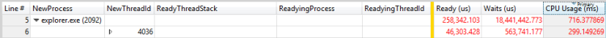

    **图 25 活动按 CPU 使用情况 （毫秒）**

    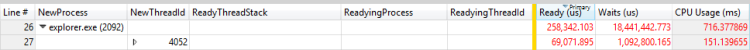

    **图 26 活动就绪 （美国）**

    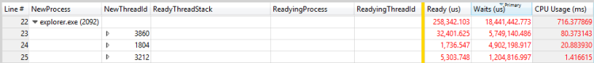

    **图 27 活动等待 （美国）**

3.  按**CPU 使用状况 (ms)**列排序显示顶部子行的 299 毫秒。 按排序**准备就绪 （美国）\[和\]**列显示顶部子行的 46ms年。 按排序**等待 （美国）\[合计\]**列显示顶部子行的 5749 毫秒和 4902 毫秒为单位的第二行。 由于这些行延迟影响显著，应进一步进行调查。

4.  展开以显示在下图中所示的 readying 线程的堆栈︰

    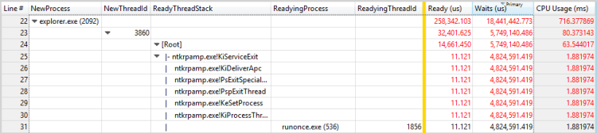

    **图 28 将准备就绪进程，并使线程的线程**

    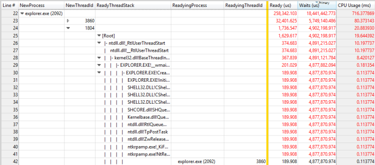

    **图 29 将准备就绪进程，并使另一个线程的线程**

    在此示例中，第一个线程花费大量时间等待 RunOnce.exe 进程退出。 您应该调查 RunOnce.exe 进程为何花费这么多时间才能完成。 第二个线程正在等待第一个线程，并可能是同一个等待链中无意义的链接。

5.  对 RunOnce.exe 中重复此过程的步骤。 主要贡献列为**等待 （美国）**，并且有四种可能的参与者。

6.  展开每个参与者可以看到前三个参与者，是第四个参与者每个等待。 这种情形使得前三个参与者到等待链无意义。 第四个参与者正在等待另一个进程，TestBootStrapper.exe。

    这种情况下是 RunOnce.exe 中的线程显示在图 30 将准备就绪进程，并将准备就绪线程︰

    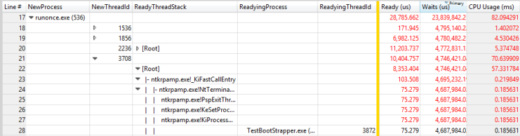

    **图 30 将准备就绪进程，并使线程在 RunOnce.exe 中的线程**

7.  对 TestBootStrapper.exe 中重复此过程的步骤。 结果将显示在下面的三个数字︰

    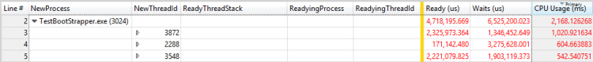

    **图 31 线程按 CPU 使用情况 （毫秒）**

    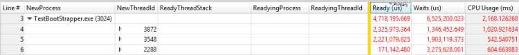

    **图 32 个线程通过就绪 （美国）**

    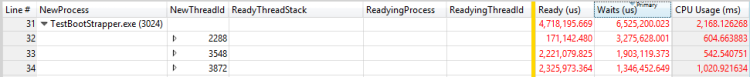

    **等待 （美国） 按图 33 线程**

    线程 3872 花费约运行准备就绪，2 秒和 1.3 秒等待 1 秒钟。 此线程也是 readying 3872 线程的线程，因为正在运行并且准备时间可能导致延迟。 评估报告的时间匹配延迟了以下问题︰

    -   TestBootStrapper.exe (编号为 3024) 进程的线程 3872 正在抢占 2.1 秒。

    -   TestBootStrapper.exe (编号为 3024) 进程的线程 3872 starves 187 毫秒。

    -   TestBootStrapper.exe (编号为 3024) 进程的线程 3872 使用的 CPU 时间 1 秒。

8.  若要查找其他特约问题，查看哪些线程正在等待 3872 事件。 中图 34 contributors （参与者） 所示为等待时间展开**ReadyThreadStack**查看等待、 1.3 秒贡献︰

    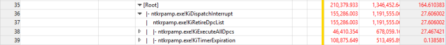

    **图 34 contributors （参与者) 等待时间**

    **KiRetireDpcList**是通常与 O 相关， **KiTimerExpiration**是一个计时器。 您可以查看**ReadyThreadStack**中移除，然后查看**NewThreadStack**的 I/o 和计时器已启动。 此视图显示三个相关的功能，如图 35 I/o 和计时器上 NewThreadStack 中所示︰

    

    **图 35 I/o 和 NewThreadStack 上的计时器**

    此视图会泄露的以下详细信息︰

    -   TestBootStrapper.exe (编号为 3024) 进程的线程 3872 刷新注册表配置单元 544 毫秒。

    -   TestBootStrapper.exe (编号为 3024) 进程的线程 3872 休眠 513 毫秒。

    -   线程 3872 TestBootStrapper.exe 将 3.5 M 写入磁盘，从而导致 178 毫秒的延迟的过程。

9.  当启动调查的关键路径时，您分析 Explorer.exe 最高位等待原因，并忽略出现后，等待原因的关键任何的路径部分。 要捕获本节原来以前忽略的关键路径，必须在时间轴中查看。 添加**CPU 使用率 （精密）**和应用**的过程中，线程的时间线**预设。

10. 筛选器包含仅进程标识为关键路径的一部分。 图 36 关键路径时间轴中显示得到的关系图︰

    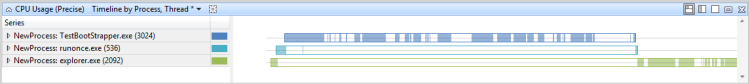

    **图 36 关键路径的时间线**

    图 36 关键路径的时间线显示停止等待 RunOnce.exe 后，Explorer.exe，执行更多的工作。 缩放到时间段后以前分析等待链并执行其他分析。 在这种情况下，分析就会发现大量的内部 Explorer.exe 和通过关键路径没有清除跟踪的线程。 在这种情况下，进一步分析不可能会产生可行的见解。

### <a name="direct-cpu-usage"></a>直接的 CPU 使用情况

活动通常被推迟，因为关键路径上的线程使用大量 CPU 时间。 通过使用线程状态模型，您可以看到此问题表征花费一异常长的时间处于运行状态的关键路径上的某个线程。 在某些硬件上，这大量的 CPU 使用率会导致延迟。

### <a name="problem-identification"></a>问题识别

很多评估使用试探法来确定直接 CPU 使用率相关问题。 重大关键路径上的 CPU 使用率报告为以下形式的问题︰

CPU 通过使用流程*P*延迟影响的活动*A* *x*秒

其中*P*是正在运行*的*进程的活动，并且*x*是以秒为单位的时间。

如果这些问题会导致延迟的活动的报告，原因可能是直接的、 CPU 使用率。

**调查直接的 CPU 使用情况**

1.  通过查找单个带来 100%的 Cpu CPU 使用率**（式采样） 的 CPU 使用率**图表中，可以手动识别问题。

2.  缩放到关系图中的感兴趣的区域并选择**利用率由进程和线程**的预设。

    默认情况下，表中显示具有最高的总 CPU 使用量的顶部行。 这些线程还在**CPU 使用率 （式采样）**关系图顶部显示。

    **请注意**  
    在具有多个处理器的系统，使用 100%的单处理器的线程看起来正在消耗 100/（逻辑处理器的数目）。 在这种系统，只有虚拟空闲线程 （PID 0，TID 0） 可以显示更大的处理器使用率超过 100/（逻辑处理器的数目）。 进程和线程占用了大部分 CPU 对应关键路径中的所有线程，如果直接 CPU 使用率可能是一个因素。

     

**Assessment-Reported 直接 CPU 使用率问题的示例**

CPU 使用 TestUM.exe 流程 (4024) 延迟通过受影响的活动，快速启动关机过程 TestIM.exe，2.1 秒。 图 37 线程 3208 显示了此示例︰

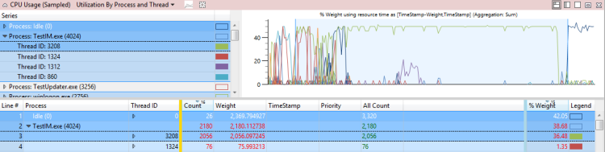

**图 37 线程 3208**

### <a name="investigation"></a>调查

您发现 CPU 使用率直接分配给关键路径上的延迟之后，必须标识特定模块和函数，导致延迟。

**技巧︰ 检查评估报告直接 CPU 使用率问题**

您可以展开评估报告直接 CPU 使用率问题以显示关键路径，会受到最直接的 CPU 使用率。 如果您展开与 CPU 使用率相关联的节点，将显示与 CPU 使用率和关联的模块关联的堆栈。 此视图如图 38 展开 CPU 使用率段所示︰

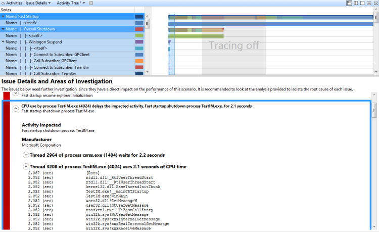

**图 38 展开 CPU 使用率段**

**方法︰ 手动浏览大量直接的、 CPU 使用率问题**

如果评估没有报告问题，或者如果您需要附加的验证，可以使用**CPU 使用率 （式采样）**关系图手动收集有关的模块和 CPU 使用率问题中涉及到的功能。 若要执行此操作，必须放大到感兴趣的区域，并查看按 CPU 使用情况排序的堆栈。

**手动浏览大量直接的、 CPU 使用率问题**

1.  在跟踪菜单中，单击加载符号。

2.  放大时间线以显示关键路径影响 CPU 问题的部分。

3.  应用预设**的进程和线程的利用率**。

4.  将**堆栈**列添加到显示内容中，，然后将该列拖动到右侧的**线程 ID** （栏的左侧）。

5.  展开的进程和线程显示堆栈树。

    在堆栈中的行被按降序排列 %**重量的 CPU 使用率**。 这将最感兴趣的堆栈放在最前面。 展开堆栈，请注意**%权重**列，以确保您的焦点保持在具有最高使用率的行上。

6.  若要提取堆栈的副本，请选择所有的行，单击鼠标右键，然后单击**复制选择**。

### <a name="resolution"></a>解决方法

您可以应用在配置和组件级别来解决 CPU 使用率过高的赔偿。

直接的 CPU 使用率有较低端处理器的计算机上有较高的影响。 在这些情况下，可以向计算机添加更多的处理能力。 或者，您可能能够从关键路径或从系统中删除的问题模块。 如果您可以更改的组件，请考虑重新设计工作，得到以下结果之一︰

-   从关键路径中删除大量占用 CPU 的代码

-   使用多个 CPU 高效算法

-   推迟或缓存工作

### <a name="thread-interference"></a>线程的干扰

关键路径上没有，这可能是不相关的活动线程的 CPU 使用率可能会导致延迟，可将关键路径上的线程。 线程状态模型演示此问题表征的关键路径上花过多不寻常的时间处于就绪状态的线程。

### <a name="problem-identification"></a>问题识别

很多评估使用试探法来确定与干扰相关的问题。 这些报告中的以下两种形式之一︰

-   被缺少处理*P* 。 不足使到受影响活动*A* *x*毫秒的延迟。

-   *P*的进程被抢占。 抢占使到受影响活动*A* *x*毫秒的延迟。

其中*P*是流程，*一个*是活动，和*x*是以毫秒为单位的时间。

第一种形式反映了从同一级别的优先级为关键路径上的线程的线程干扰。 第二种形式反映了从线程的优先级别高于关键路径上的线程干扰。

如果延迟的活动报告了这些类型的问题，则线程干扰可能是原因。 **CPU 使用状况 （精密）**关系图可用于手动识别问题。

**标识线程干扰问题**

1.  缩放到时间间隔，应用**cpu 利用率**预设。 跨所有 Cpu 100%利用率表明存在干扰问题。

2.  **准备就绪 （美国）**的第一列由应用**进程，线程的利用率**预设和排序。 （这是包括**Sum**聚合的列）。

3.  展开的活动的影响的进程和线程就绪时间查看关键路径上。 此值是可以解决干扰问题的任何线程减少延迟的最长时间。 相对于正在调查的延迟明显是一个数值的值指示存在线程干扰问题。

图 39 CPU 利用率已接近 100%，图 40 线程干扰问题表示这种情况下︰

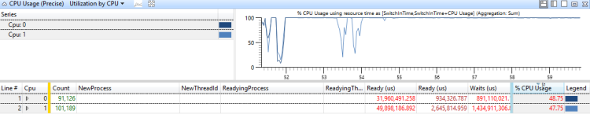

**图 39 CPU 利用率已接近 100%**

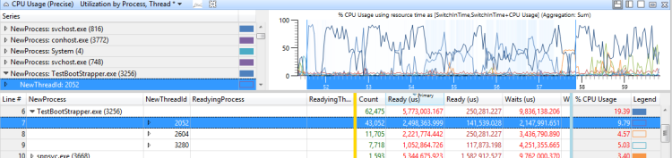

**图 40 线程干扰问题**

### <a name="investigation"></a>调查

在确定问题后，您必须确定受影响的线程为什么花如此多的时间处于就绪状态。

**技巧︰ 确定线程为什么花时间在准备状态**

**CPU 使用状况 （精密）**关系图可用于确定线程为什么花时间处于就绪状态。 您必须先确定线程是否仅限于某些处理器。 虽然不能直接获得此信息，可以在高 CPU 利用率的期间检查线程的 CPU 使用记录。 这是线程往往处理器之间频繁切换时的期间。

**确定线程的处理器限制**

1.  缩放到受影响的地区。

2.  添加**CPU 使用率 （精密）**关系图和应用**的过程中，线程的利用率**预设。

3.  使用**高级**对话框中添加**NewThreadId**右侧的**唯一计数**聚合模式的**Cpu**列。

4.  在图形上以显示您感兴趣的线程进行筛选。

    在**Cpu**列中的值反映了线程在当前的时间间隔在其运行的处理器的数目。 在 CPU 利用率 100%期间，这个数字接近于允许此线程在其运行的处理器的数目。 如果值小于可用处理器的数目，则该线程是可能限制到特定 Cpu。

    图 41 限制线程提供此关系图中的示例︰

    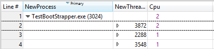

    **图 41 限制线程**

您知道线程的处理器限制后，可以确定什么抢占或缺少该线程。 若要执行此操作，必须标识该线程处于就绪状态所用的间隔，然后检查哪些其他线程或进程已运行的时间间隔内。

**确定什么抢占或缺少该线程**

1.  构造该图显示线程处于就绪状态时，应用**进程，线程的利用率**预设。

2.  打开**视图编辑器**，单击**高级**，然后选择**图表配置**选项卡。

3.  设置为**ReadyTime (s)**的**开始时间**和**持续时间**设置为**就绪 （美国）**，，如图 42 就绪时间列中所示。 单击**确定**。

    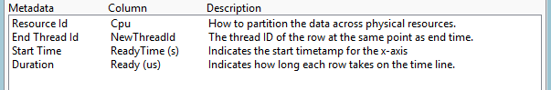

    **图 42 就绪时间列**

4.  在**视图编辑器**中，替换的**CPU 使用率 （%）**列**准备就绪 （美国）\[合计\]**列。

5.  选择相关线程的阻塞，以产生类似于图 43 就绪时图的图表︰

    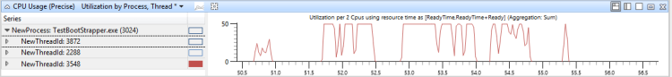

    **图 43 就绪时间关系图**

6.  在这种情况下，线程处于就绪状态花费大量的时间。 要确定其典型的优先级，请添加到**NewInPri**列**平均**聚合。

    在这种情况下，线程的平均优先级为完全 8。 这个数字表明它可能是后台线程永远不会接收优先级提升。

7.  已知的平均的优先级后，查看 CPU 活动允许线程在其运行的 Cpu。

    在这种情况下，线程已确定具有 CPU 1 的关联只。

8.  添加另一个**CPU 使用率 （精密）**关系图和应用**cpu 利用率**预设。 选择相关的 Cpu。

9.  打开**高级**视图并添加为您找到早期筛选出该线程的优先级的筛选器。 这种情况下显示在图 44 线程筛选器中︰

    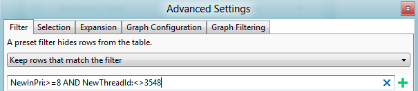

    **图 44 线程筛选器**

    在图 45 CPU 使用率、 准备好时间和其他线程活动中，最上面的图表显示了 3548 线程的 CPU 使用情况。 中间的图形显示时，该线程已准备就绪，并且底部的图形显示在其允许线程已运行 （在此例中，Cpu1） 的 Cpu 活动。

    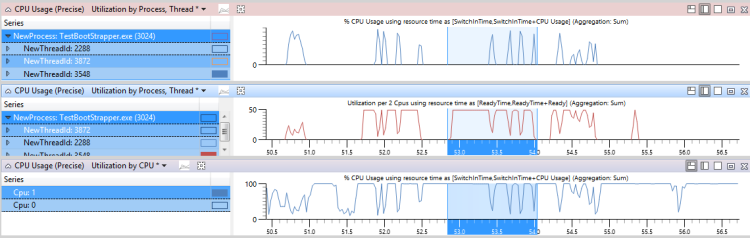

    **CPU 使用率图 45、 准备时间和其他线程活动**

10. 放大区域位置的线程已准备就绪，但未运行，大部分在该时间间隔的时间。

11. 在**CPU 使用率**图中，将**NewInPri**添加到左边栏的检查的结果。

    线程或拥有达到目标的优先级进程的线程优先级线程所缺少的时间显示。 线程或进程的优先级高于目标线程优先级线程被抢占的时间显示。 您可以计算线程被抢先通过添加的所有线程抢先式和操作时间的总时间。

    图 46 按优先级时目标线程的使用情况是 730ms 情况下线程被抢占，并缺少的线程时间除了已准备好节目。 (此图扩至 1192ms 间隔。)

    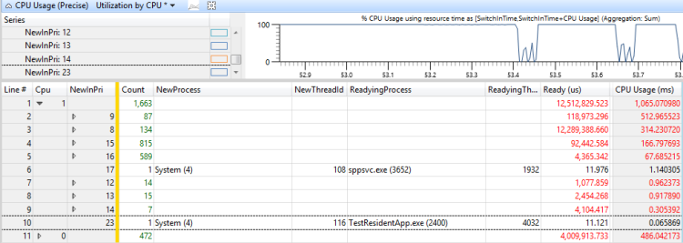

    **图 46 按优先级时目标线程的使用情况已就绪**

12. 若要确定哪个线程负责的抢占和此线程挨饿， **NewInPri**列的右侧添加**NewProcess**列中，审查处正在运行的进程的优先级。 在这种情况下，抢占和不足主要导致通过同一进程中的另一个线程和 TestResidentApp.exe。 您可以认为这些进程收到高于其基本优先级的定期优先级提升。

### <a name="resolution"></a>解决方法

您可以通过更改配置或组件来解决抢占或不足的问题。 考虑采取以下补救措施︰

-   从系统中删除有问题的进程。

-   调整有问题的进程的基本优先级。.

-   更改有问题的进程运行时;例如，延迟发生在计算机重新启动后其开始时间。

-   如果可以更改问题的组件，请重新设计使其更少的 CPU 密集型或以较低的优先级运行。

### <a name="dpcisr-interference"></a>DPC/ISR 干扰

当过多的处理器时间由运行 Dpc 和 Isr 时，那里可能没有足够可用的 CPU 时间留运行线程。 这种情况可能会导致类似的延迟线程干扰所致。 当线程必须完成常规的高频速度操作时，如在播放视频或动画，Dpc 和 Isr 的干扰会导致操作问题。

### <a name="problem-identification"></a>问题识别

很多评估使用试探法来确定 DPC/ISR 相关的问题。 DPC/ISR 活动被标识为可疑，当它报告为以下形式的问题︰

DPC *D*超出阈值的过程*P* *m*毫秒*x*次。此 DPC 的*n*个实例运行总量为*t*毫秒。

其中*D*是 DPC， *m*是设置阈值的毫秒数， *x*的 DPC 超出阈值， *P*的次数是当前进程、 *n*是运行 DPC 的实例数和*t*是以毫秒为单位通过阈值运行 DPC 的总时间。

例如，评估报告了以下问题︰

**DPC sdbus.sys ！SdbusWorkerDpc 媒体引擎生存期内 153 次超过 3.0 毫秒为单位的目标。此 DPC 的 153 实例运行总量为 864 毫秒**

如果此问题报告有关的活动，表现出问题事件或延迟，DPC/ISR 活动可能是原因。

**手动识别 DPC/ISR 干扰**

1.  若要手动标识 DPC/ISR 干扰，在 WPA 打开跟踪和标识感兴趣的问题事件。 这些是评估特定泛型事件如**Microsoft 的 Windows-Dwm 的核心︰ 计划\_小故障**或**Microsoft-Windows-MediaEngine:DroppedFrame**。

2.  事件的图表，旁边添加**cpu 的 DPC/ISR 持续时间**图。 如果**DPC/ISR 持续时间的 CPU**峰值问题事件向上图行，DPC/Isr 可能会引起此问题的一个因素。

3.  对于其他数据，放大发生 100 毫秒之前几个问题事件显示的时间段。 如果重要的 DPC/ISR 活动显示 100 ms 地区中的一个或多个处理器上的问题事件发生之前，可以得出结论的问题事件由 DPC/IRS 活动。

4.  若要确定是否 DPC/ISR 干扰引起的延迟，放大到一个区域，其中显示正在运行的线程。 记下 CPU 或在其运行该线程的 Cpu。

5.  在 DPC/ISR 图中，应用**cpu 的 DPC/ISR 持续时间**预设和查看 DPC/ISR 活动，在该时间范围相关的 Cpu 上。

图 47 问题事件和 DPC/ISR 活动显示线程 864 的 iexplore.exe 是与受影响的活动。 线程 864 处于运行状态在 CPU2 为 10.65%时间范围内的视图中。 但是，DPC/ISR 图形显示 CPU2 忙于执行 DPC/Isr 的这段时间的 10%。

**请注意**  
大多数的 DPC Isr 没有高影响与此示例中所示。

 

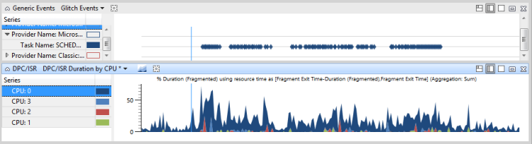

**图 47 问题事件和 DPC/ISR 活动**

在图 48 DPC/ISR 无关问题的事件，显示了 DPC/Isr 不相关的性能问题︰

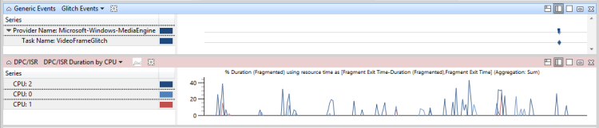

**图 48 DPC/ISR 与问题事件无关**

在图 49 延迟 DPC/ISR 干扰所致，显示了 DPC/Isr 会造成性能问题︰

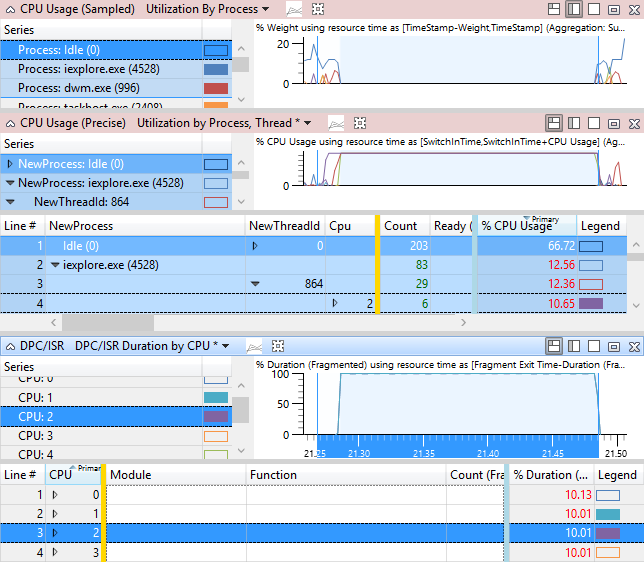

**图 49 由 DPC/ISR 干扰引起的延迟**

### <a name="investigation"></a>调查

在确定 Dpc/Isr 与问题或延迟之后，您必须确定涉及特定的 Dpc Isr 和频繁出现的原因或运行的时间长度过长。

**技巧︰ 检查评估报告 DPC/ISR 问题**

在评估报告 DPC/ISR 问题，您可以展开显示抢占 DPC 或 ISR.的主要进程的问题 展开堆栈查看进程中大多数的 DPC 活动与受影响的活动，如中所示，展开堆栈来了解 DPC 正在做什么。 图 50 展开 DPC 堆栈显示展开的堆栈︰

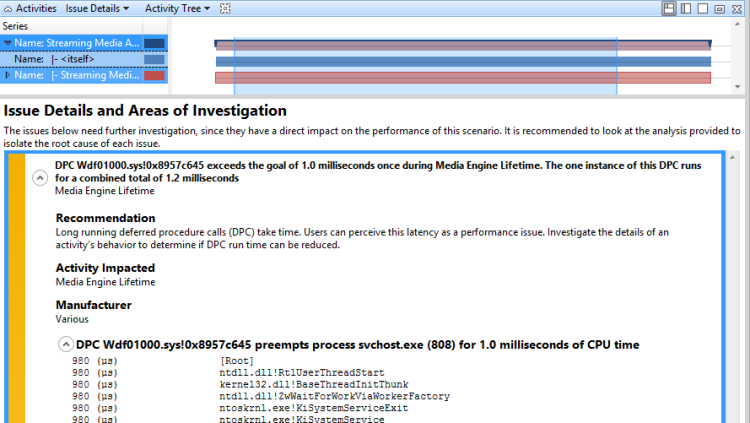

**图 50 展开 DPC 堆栈**

**方法︰ 查找最高持续时间 Dpc/Isr 和查看堆栈**

如果评估不报告 DPC/ISR 是一个问题，可以使用**DPC/ISR**和**CPU 的使用式 （采样）**关系图以获得最相关的 Dpc 的堆栈信息。 我们建议您查找感兴趣的 DPC/ISR、 注意其模块和函数，然后在**CPU 使用率 （式采样）**图中获取完整的堆栈信息查找这些示例。

**查找最高持续时间 Dpc/Isr 和查看堆栈**

1.  缩放到感兴趣的时间间隔。

2.  在 DPC/ISR 图中，选择预设置的**模块，函数的 DPC/ISR 持续时间**。

    如果已加载符号，DPC/ISR 事件的总持续时间排序，并再细分的模块和函数。 在列表中的前行包含 DPC/ISR 事件可能导致事件的问题。 记下的模块和函数名称。

3.  在**CPU 使用率 （式采样）**图中，选择**由进程利用率**预设。 默认情况下，此预设隐藏 DPC/ISR 活动。

4.  打开**视图编辑器**，然后单击**高级**。

5.  在**筛选器**选项卡上将**隐藏筛选器匹配的行**设置改**保持与筛选器相匹配的行**。 这将启用 DPC/ISR 活动显示。

6.  删除**过程**列并添加**堆栈**列以查看 Dpc/Isr 按堆栈。

7.  清除当前行选择。

8.  用鼠标右键单击**堆栈**列中的单元格，然后单击**在此列中查找**。

9.  在此过程的步骤 2 中输入模块和函数，您记下。

10. 检查**添加到当前所选内容**，然后单击**查找全部**选择函数的所有实例。

11. 选择所有行后，右键单击，然后单击**查看蝴蝶/被调用方**。

此视图显示此特定的函数，按总持续时间的活动。 该视图是类似于评估报告问题的详细视图中的堆栈显示。 **权重**列近似于在堆栈中，以毫秒为单位花费的每个函数的非独占时间。

此视图显示了图 51 方的 DPC 排序按大致持续时间︰

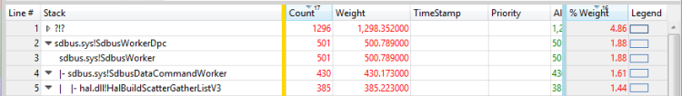

**图 51 被调用方的 DPC 按近似的持续时间**

**方法︰ 查看长时间运行 Dpc/Isr**

Dpc/Isr 的总持续时间很重要，但更有可能导致延迟长时间运行单个的 Dpc Isr。 在 DPC/ISR 图中，按降序排序，**包括持续时间 （毫秒）**列显示了单个的 DPC Isr 最长持续时间。 有一些评估配置文件预设的**长的 Dpc Isr**可以筛选此视图以显示仅 Dpc/Isr 包括持续时间大于 1 毫秒。

**请注意**  
如果此预设值不可用，您可以打开**视图编辑器**，**高级**部分，添加筛选器。

 

### <a name="resolution"></a>解决方法

DPC/ISR 活动通常反映了必须更正硬件或组件级别的硬件或软件问题。 在配置级别，可以更换硬件或相关的驱动程序升级到修改后的版本。 在组件级别硬件和驱动程序应遵循的最佳做法的 Dpc/Isr 从 MSDN，并应使用线程的 Dpc 在可能的情况。 线程的 Dpc 不派遣级别运行的 Windows 的客户端版本上执行的操作。 Dpc/Isr 有关最佳做法的详细信息，请参见在 ISR 和 DPC 行为以及对线程 Dpc 介绍的准则。

## <a name="related-topics"></a>相关的主题


[线程的 Dpc 简介](http://go.microsoft.com/fwlink/?LinkId=254752)

[Isr 和 Dpc、 静默 Killers](http://go.microsoft.com/fwlink/?LinkId=254751)

[加载符号](loading-symbols.md)

[电源管理和 ACPI-体系结构和驱动程序支持](http://go.microsoft.com/fwlink/?LinkId=263460)

[在 Windows Vista 和 Windows Server 2008 中的 PPM](http://go.microsoft.com/fwlink/?LinkId=254745)

[排定优先顺序](http://go.microsoft.com/fwlink/?LinkId=254748)

[时间安排、 线程上下文和 IRQL](http://go.microsoft.com/fwlink/?LinkId=254750)

[Windows 内核，第六版](https://www.microsoft.com/learning/book.aspx?ID=12069)

[Windows 性能分析器](windows-performance-analyzer.md)

[Windows 性能 Toolkit 技术参考](windows-performance-toolkit-technical-reference.md)

 

 


