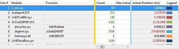

# 模拟运算表

在许多情况下，图表是查看系统活动，以分析其性能的最佳方法。 但是，在某些情况下，表格视图是更可取的。 将图形拖到**分析**选项卡上时，它将显示本身。 可以查看相同的数据以表格形式收缩到缩略图的图形，请单击图表标题栏上的最右端布局图标。 如果您想要查看数据表格和全尺寸的关系图，请单击图表标题栏最左侧的布局图标。

下面的插图显示了 WPA 数据表格。

如果您首次打开数据表时不到金色的竖线，向右滚动。

图例列在表的右侧对应于**图例**控件关联图的左侧。 **图例**控件中选择一个或多个项时，如果选择了表的相应行，反之亦然。

动态同步的数据表格和相关联的图形。 如果数据表格进行了更改，图表将反映这些更改。 如果您展开或折叠关系图**图例**控件中的节点，它还展开或折叠在数据表格中，反之亦然。 如果放大到一个时间间隔的关系图上下, 表显示有关所选的时间间隔的数据。

对数据表的更改的信息，请参阅[自定义数据表](customize-a-data-table.md)，并[应用、 创建或删除预设组合的显示列](apply-create-or-delete-a-preset-combination-of-columns-to-display.md)。

搜索和筛选数据的信息，请参阅[搜索或筛选数据](search-or-filter-data.md)。

## 数据表格布局

最左侧的列始终是行数列中，并且最右边的列始终是图例列，对应于相应的图表的**图例**控制。 这两个外部列之间有以下方面，从左到右︰

-   关键领域

-   数据区域

-   图形元素区域

### 关键领域

这是表的在左侧中，行号列金牌竖线之间的区域。

将数据区域中的任何列拖动到左侧的垂直的黄金条使其键。

### 数据区域

这是在表中，竖线金色和蓝色竖线之间的中心区域。

在数据区域中显示的列的数据既不进行分组也没有制成图表。 这些列中的单元格进行聚合 （如果已指定聚合的列），可以在右边的一组。 在这些列中的单元格显示无法展开表的各个行的数据。

### 图形元素区域

这是在表中，蓝色竖线和图例列之间的右侧区域。 如果与此区域中拖动一列，该列中的数据生成线形或条形图上。

如果图形是甘特条形图，将移动到绘图元素区域中的每一列必须包含时间戳值。 在一个水平条形图在甘特图中的一个标记代表一个时间戳值。

## 相关的主题

[WPA 功能](wpa-features.md)

 

 

