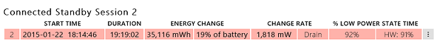
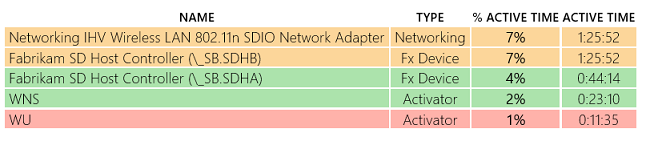
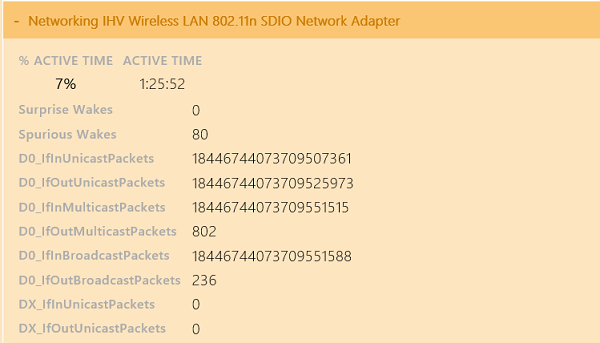

# 练习 1-识别虚假的唤醒的问题

设备应避免意外唤醒 SoC 通过中断 （例如，中断风暴，坏 debouncing，等等）。 唤醒 SoC 导致退出**DRIPS**系统、 提高了平均功率平面布置并会减少电池寿命。 这就是虚假的唤醒。

分析过程相关的虚假唤醒是相当简单的。

1.  下载预生成**sleepstudy 报表\_1.html**报告[这里](http://download.microsoft.com/download/2/6/6/2662D67D-58CC-4823-8812-AD215DD9778F/sleepstudy-report_1.mdl)。

2.  打开**sleepstudy 报表\_1.html**与您最喜爱的浏览器。

3.  单击**会话 2**。 系统在 19 小时期间消耗的能源的 1.818 瓦和**%DRIPS%**是 92%。

    

4.  查看**顶部违犯**表。 该网络的无线设备被列为活动的 7%，在该会话中的时间。

    

5.  网络设备在该行上获取有关该罪犯的详细信息，请单击。

    

该报告清楚地标识虚假的唤醒。 在此示例中的 80 个。 用来确定为什么无线适配器唤醒 SoC 意外 IHV 万一跟进讨论。 潜在的问题可能是故障的设备固件实现。

 

 

