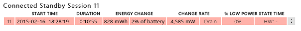
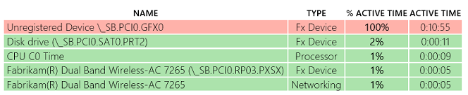
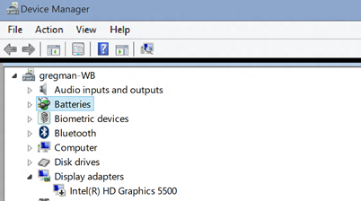

# 练习 2-识别缺少驱动程序的问题

需要驱动程序、 设备、 窗口和固件的紧密集成，以确保正确的电源管理和**DRIPS**派驻的比率太高。

如果设备丢失了驱动程序，或者没有正确的驱动程序，它可能会影响相关的设备的电源管理和结果 D 状态。

1.  下载预生成**sleepstudy 报表\_2.html**报告[这里](http://download.microsoft.com/download/3/2/E/32E8B553-47F6-4E2A-9109-C6D678FE0EE8/sleepstudy-report_2.mdl)。

    这里。

2.  打开**sleepstudy 报表\_2.html**与您最喜爱的浏览器。

3.  单击**会话 11**。 系统过程 11 分钟消耗的能源的 4.585 瓦而**%DRIPS%** 0。

    

4.  查看**顶部违犯**表。 **未注册的设备**被列为活动在该会话中的时间的 100%。

    

未注册的设备是图形适配器 (GFX) 所指定的设备名称**\_SB。PCI0。GFX0**。

首要入侵者列表中出现一个**未注册的设备**时，它意味着 ACPI 固件已定义它，但 Windows 没有将其电源管理设备的列表上。

这可能意味着以下两种情况之一︰

-   缺少一个设备驱动程序。

-   在系统中不存在的设备定义了 ACPI 固件约束。

在此示例中，系统没有正确的驱动程序安装的**显示适配器**，如下所示在**设备管理器**中。

 

 

