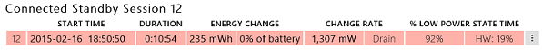
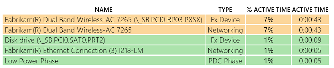

# 练习 3-识别缺少约束的问题

SoC 电源状态是所有设备的状态的总和。

Windows 用来保存设备是关键，以达到低功率及其状态的列表 – 他们称为约束。 Windows 将等待啮合弹性和输入**DRIPS**之前必须满足的所有约束。 由 OEM 和 ACPI 固件通过 SoC 供应商指定约束条件。

如果 OEM 更改 SoC 供应商参考设计并约束必须准确地反映这些更改，则必须修改 ACPI 固件。

缺少约束，或有太多的约束，可以导致各种在待机期间增加电量的问题。

1.  下载预生成**sleepstudy 报表\_2.html**报告[这里](http://download.microsoft.com/download/3/2/E/32E8B553-47F6-4E2A-9109-C6D678FE0EE8/sleepstudy-report_2.mdl)。

2.  打开**sleepstudy 报表\_2.html**与您最喜爱的浏览器。

3.  单击**会话 12**。

    -   系统会 1.307 瓦的能量消耗 11 分钟内

    -   **%DRIPS%**为 92%。

    -   硬件**DRIPS %**为 19%。

    

4.  看一看**顶部违犯**表

    -   无线网络设备列出为活动会话期间的时间只有 7%。

    -   19%的硬件**DRIPS**率不能考虑这个问题。

    

大 （例如，92%） **DRIPS %**的软件和硬件**DRIPS %** （例如，19%） 之间的差异是通常缺少约束的 ACPI 固件中的征兆。

简单地讲，Windows 假定系统准备好进入**DRIPS**，但是某些硬件组件仍处于活动状态，并防止输入空闲的 S0 低功耗 SoC 包。

下一步是尝试来隔离并识别哪些硬件组件仍处于 D0 和消耗能量，通过使用电源检测的平台或您硅合作伙伴的调试工具。

**请注意**  
由软件和硬件**DRIPS**差异缺少约束问题是不同的无线设备 7%活动时间问题首要入侵者表中所示。 此问题应分别进行调查。

 

 

 

