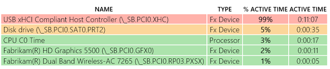
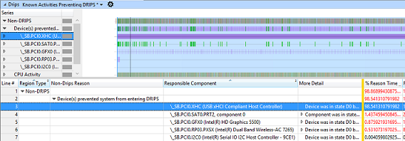
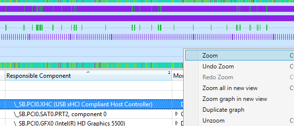
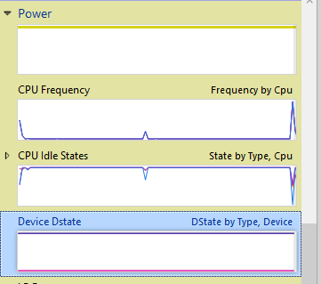
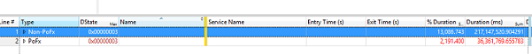
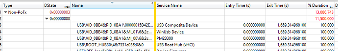

# 练习 4-识别 USB 设备的问题

USB 主机控制器可以关闭电源仅毕竟与它们连接的设备的输入的低功耗状态。 这意味着 USB 设备都必须支持选择性挂起功能现代备用设备，确保 SoC 在屏幕关闭时，可以输入**DRIPS** 。

## 第 1 部分︰ 使用 SleepStudy 报表来确定问题

1.  下载预生成**sleepstudy 报表\_2.html**报告[这里](http://download.microsoft.com/download/3/2/E/32E8B553-47F6-4E2A-9109-C6D678FE0EE8/sleepstudy-report_2.mdl)。

2.  打开**sleepstudy 报表\_2.html**与您最喜爱的浏览器。

    -   请注意，系统能够消耗尽可能少 120 mW 待机期间 （例如见待机状态会话 6）。

    

3.  单击**会话 10**。 系统过程 11 分钟消耗的能源的 2.83 瓦而**%DRIPS%** 0。

    

4.  查看**顶部违犯**表。

    1.  USB 主控制器 (**\_SB。PCI0。XHC**) 处于活动状态的会话持续时间的 99%。

    2.  XHC 是 USB 3.0 主控制器。

当 USB 总线控制器在现代待机时间的分钟处于活动状态时，它通常意味着一个 USB 设备连接到总线不进入选择性挂起，可能是因为它不支持选择性挂起。 下一步是确定哪些 USB 设备在 D0 保持通过 ETL 跟踪查看。

了解更多有关选择性挂起，请参阅 MSDN 上的[USB 选择性挂起](https://msdn.microsoft.com/library/windows/hardware/ff540144)的主题。

## 第 2 部分︰ 用于 ETL 跟踪识别问题

为了进一步对 USB 调查，ETL 跟踪捕获同一位置生成**SleepStudy**的系统上。

研究 USB 问题，您将使用**DState**关系图和表。

1.  下载预生成的**USBProblem.etl**跟踪[此处](http://download.microsoft.com/download/5/1/C/51CB1607-D3A8-455B-828A-244A56B06791/USBProblem.etl)。

2.  使用**WPA**打开**USBProblem.etl** 。

3.  拖放**DRIPS**图**分析**选项卡中。

4.  查看**非 Drips 原因**，并为防止系统进入**DRIPS**设备查找 xHCI 的 USB 主控制器。

    -   您可以看到该设备是活动的跟踪 （**原因时间百分比**列所示） 的 98%。

        

5.  放大活动 xHCI 的 USB 主控制器的地区。

    1.  在表中选择的设备。

    2.  浅蓝色间隔在图中，右击并选择缩放。

    3.  **时间百分比原因**现在应该是 100%。

    

6.  查找**图形资源管理器中**的**电源**类别下的**设备 Dstate**图。

    

7.  拖放**设备 Dstate**图**分析**选项卡中。

    -   随着时间的推移，**设备 DState**图形显示设备有效 D 状态。 数据可用于确定系统在现代待机时是否将特定设备进入相应的 D 状态。

        -   **PoFx 类型**︰ 用于管理 Windows 电源管理框架的设备。

        -   **非 PoFx 类型**︰ 用于 USB 连接设备。

8.  将**类型**列旁边的**DState**列。 您的视区应如下所示︰

    

9.  展开**非 PoFX**类别。

10. 展开具有 0x0 值 （D0 状态或活动） 的**Dstate**行。

11. 按**名称**列进行排序，并查找 USB 设备。

    

D-状态表中的数据显示，在备用系统时，复合 USB 设备仍然处于 D0 100%的状态时。 复合设备的硬件 id 是 USB\\VID\_0BB4 & PID\_0BA1\\00000015B42EE80F0000000000000000。 这是被阻止的 XHCI 控制器断电设备。

如果该设备由驱动程序由 Microsoft 授权，请向 Microsoft 报告问题。 如果没有，则必须向硬件供应商负责的驱动程序，找到一个解决方案，并确保设备进入选择性挂起报告此信息。

 

 

