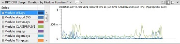
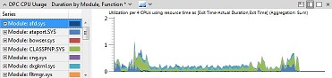
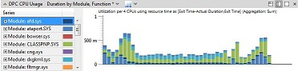
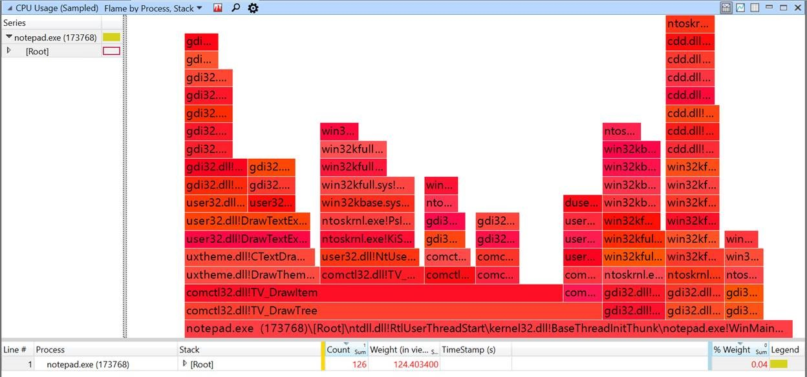
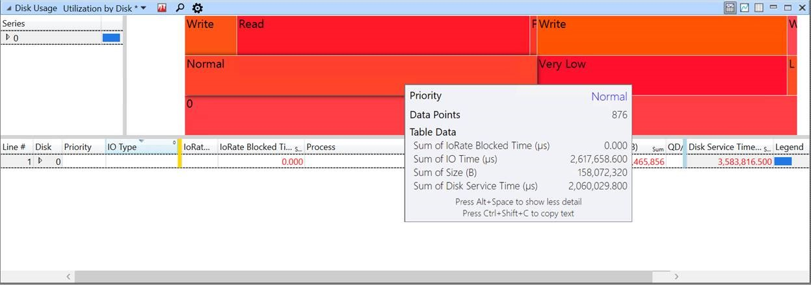
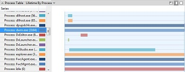
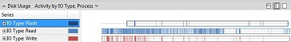
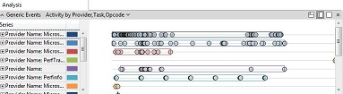

# 关系图

Windows 性能分析器 (WPA) 提供了以下类型的关系图︰

-   [线图](#line_stacked_bar)
-   [堆积折线图](#line_stacked_bar)
-   [堆积条形图](#line_stacked_bar)
-   [火焰图](#flame_graphs)
-   [生存期关系图](#lifetime_graphs)
-   [活动类型的关系图](#activity_type_graphs)
-   连续的资源跟踪信息
-   [一般事件关系图](#generic_events_graphs)

## 线，堆积线和堆积条形图

当您行、 堆积线或堆积条形图从**图形资源管理器**窗口拖到**分析**选项卡时，它显示为折线图，如下图所示

要更改关系图的外观，请单击图表标题栏上的最右边的下拉箭头，然后选择**堆积线**或**堆积条形图**。

下面的插图显示为堆积折线图的同一个图形。

下图显示为堆积条形图的同一个图形。

您可以指定 4 到 100 间隔的堆积条形图。

## 火焰图

*火焰图*是关系图的模式下，您可以快速比较表中的数据值。 每个*火焰组*的宽度取决于其在视图中的权重值。 例如，使用 CPU 堆栈每个帧的重量显示其宽度。 已筛选出一组特定的数据时，此模式是最佳。

要切换到火焰图，请确保表配置与金色栏左侧的列和单个数值列右侧的蓝色条块使用 SUM 聚合，然后**火焰**从菜单中选择图形顶部的图形。 或者，使用内置**的过程中，堆栈着火**预设**式 （采样） 的 CPU 使用率**图表中。

 

下图是一种 CPU 采样并筛选到 Notepad.exe 的堆栈。 在图中， **comctl32.dll ！TV_DrawTree**是当前的筛选视图中的大框架。 从这里，您可以检查堆栈来查找在其中执行最大工时量。

如果文本可读的最小高度，显示火焰组的名称。 若要显示带有数据的工具提示，请将鼠标指针悬停的火焰图形中的一项。 若要选择表中的对应数据，单击以展开它在表中，或要过滤表中，右击，然后单击数据视图中的**筛选器对火焰**的火焰组。 

火焰图可以用任何顺序分组列左侧的金条的配置。 下面的插图显示磁盘使用情况和磁盘服务时间的分组。 **普通**的工具提示显示的名称和值的鼠标指针下方的火焰组。

## 生存期关系图

生命周期图表显示各个类别，例如进程，为定义的类别的生存期的水平条。

下图显示的流程生命周期图。

## 活动类型的关系图

活动类型图用水平条形图来显示类型的活动。 在每一栏上，活动的时间是灰色的。 例如，如果您放大到足够的详细信息这种类型的关系图，您可以看到，每个磁盘读取或写入的时间也会用了。

下面的插图显示了输入和输出类型。

## 一般事件关系图

一般事件关系图显示录制中深的所有事件。

下图是一个一般事件图的一个示例。

## 相关的主题

[WPA 功能](wpa-features.md)

 

 

