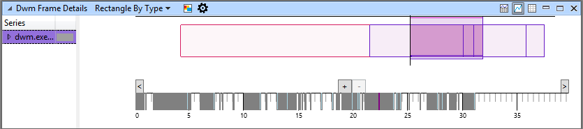
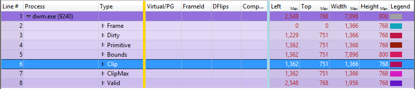

# 如何使用矩形查看器

在 Windows 性能分析器 (WPA)，您使用矩形查看器查看发生了什么变化在屏幕上在时间中的特定点的跟踪过程。

矩形查看器还提供了以下好处︰

-   看一看一个点在时间 （或框架），而不是绘制的值随着时间的推移
-   筛选出某些行，因此将不会被制成图表。 因此，如果您只想看到未经筛选的帧 （"脏框架"），可以筛选到的并不仅仅是看到。
-   查看所选内容移动到关系图 ("scrubs 通过时间")

**请注意** 默认情况下，此功能是在 DWM 帧详细信息和预设的一对 HTML 帧详细信息图形。 在时间线上的时间 （在此例中的帧） 显示点。

 

**使用矩形查看器**

1.  单击**&gt;**（靠近原点，0，0，关系图） 图的左下角在向前推进时，或按下浏览时间。

    

2.  通过左键单击放大或缩小，您想要查看然后左键单击选定的矩形区域 （以蓝色突出显示），单击**缩放**之前捕获的帧保存从左到右。

    选择使用矩形查看器区域时，您可以将鼠标悬停以查看指定依赖于表的信息的工具提示。 例如，在 DWM 帧详细信息图中，工具提示显示的持续时间和开始时间和结束时间 （以秒为单位） 跟踪所选区域。

## 黄金矩形查看器指示器栏

在以下示例中，您可以看到的黄金条 （加上图形配置中定义框架启动/停止） 右侧的矩形尺寸。

如果您筛选出特定的行，WPA 不绘制它们。 因此，如果您想要只能看到未经筛选的帧 （"脏框架"），您可以筛选到未筛选的帧。 此功能适用于您的选项卡，允许您看到您的选择将传播到整个图表，但也看到随时间推移移动时间选择在其他关系图。

## 相关的主题

[放大时间间隔](zoom-in-on-a-time-interval.md)

 

 

