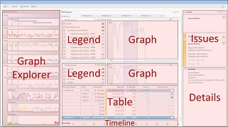

# WPA 用户界面简介

Windows 性能分析器 (WPA) 用户界面 (UI) 由围绕中心区的停靠窗口的集合组成。 该中心的工作区包含**分析**选项卡。 所有窗口可以断开坞站连接或移动并停靠在不同的位置。 要打开已关闭的窗口，请选择**窗口**菜单上的窗口。

下面的插图显示的 WPA UI。 不显示诊断控制台窗口。

## 图形资源管理器窗口

当您打开录制在 WPA，缩略图将应用于该记录图表显示在图形浏览器窗口，所有的分组下多个节点。 若要展开某个节点，请单击节点名称旁边的小三角形。

若要查看完整的关系图，将图形拖到**分析**选项卡。 您可以将多个图形拖到**分析**选项卡。

有关详细信息，请参阅[图形资源管理器](graph-explorer.md)。

## 分析选项卡

当您将图形从图形浏览器窗口拖到**分析**选项卡时，关系图将出现与**图例**控件左边。 该**图例**控件说明行或条形图中的含义。 如果您想要查看以表格形式的相同数据，请单击图表标题栏上的最右端布局图标。 这将打开关联的数据表，并减少到缩略图的图形。 如果您想要查看完整大小的图形和数据的表，单击最左侧的布局图标。

可以使用关系图标题栏上的右侧下拉箭头从线图更改为堆积线图或堆积条形图。

可用于左边的下拉箭头的图形标题栏上选择不同参数的图形，如果可以使用多个参数。 例如，可以查看 CPU 使用率由过程、 CPU、 或进程和线程。

在**分析**选项卡上的所有图形都共享一个时间轴。 若要查看具有不同时间线的图形，请通过选择**窗口**菜单上的**新分析视图**打开另一个**分析**选项卡。

有关详细信息，请参阅[分析选项卡](analysis-tab.md)。

## 分析助手窗口

选择特定的图形或数据的表时，在分析助手显示有关该特定关系图和表的信息。 以此作为指导您分析过程。

有关详细信息，请参阅[分析助手](analysis-assistant.md)。

## 问题窗口

如果您在评估平台中创建的录制，问题窗口列出了评估发现的问题。 此窗口停靠在右上角。 如果您未在评估平台中创建记录，该窗口已最小化，因为没有数据。

当您单击此窗口中的问题时，针对该问题的详细信息将显示在详细信息窗口。 在任何关系图已打开下面的**分析**选项卡上显示所有发现的问题。

有关详细信息，请参阅[问题窗口](issues-window.md)。

## 详细信息窗口

如果您在评估平台中创建的录制，详细信息窗口下方问题窗口右下角的工作区。 详细信息窗口提供有关所选问题的详细信息，以及推荐的解决方案。

有关详细信息，请参阅[详细信息窗口](details-window.md)。

## 诊断控制台窗口

诊断控制台窗口停靠在该工作区的底部。 此窗口提供的录音和相关符号加载和解码的详细信息中的异常的列表。

有关详细信息，请参阅[诊断控制台窗口](diagnostic-console.md)。

## 经典菜单和富菜单

默认情况下，WPA 使用经典菜单打开录制时。 大多数应用程序，如经典菜单顶部显示菜单 （文件、 跟踪等）。 如果您喜欢更简洁、 直观，且现代的用户界面，您可以使用格式菜单。 格式菜单中︰

-   从经典菜单齐心协力旧菜单
-   功能的快捷方式菜单经常使用，如打开、 应用配置文件，加载符号等。
-   为给所有的菜单选项的入口点使用一个菜单 （文件）

经典菜单和格式文本菜单以及如何切换和-往返其间之间的差异的详细信息，请参阅[经典与丰富的菜单](classic-versus-rich-menu.md)。

## 相关的主题

[WPA 快速入门指南](wpa-quick-start-guide.md)

 

 

