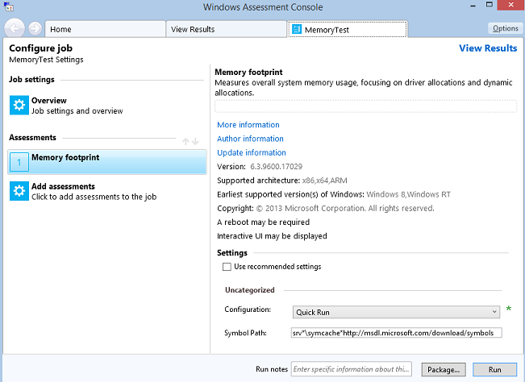
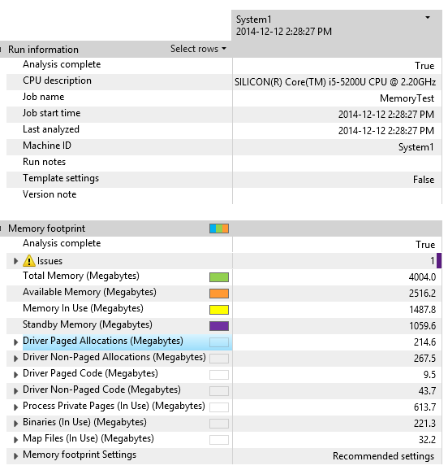
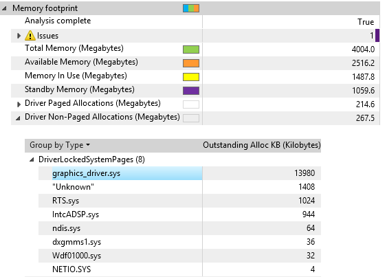
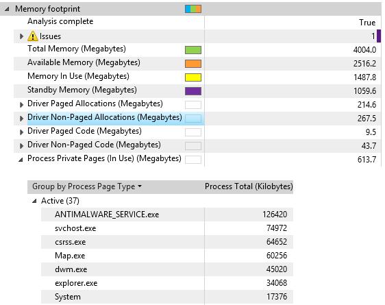
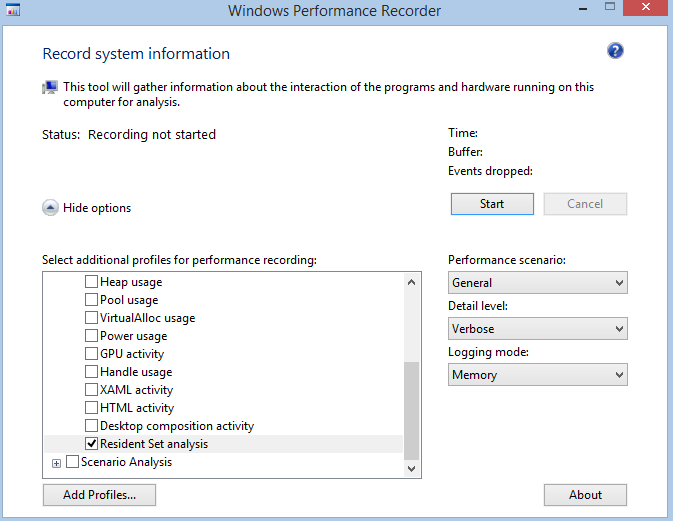
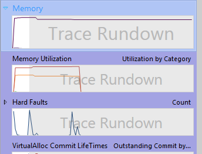
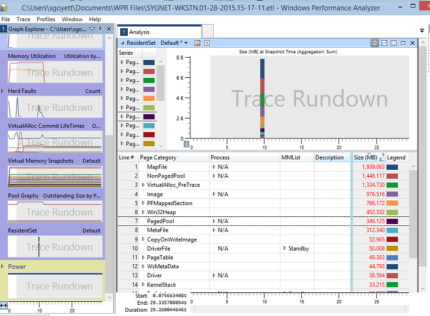
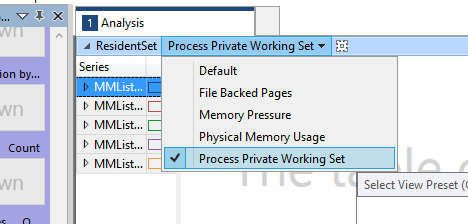
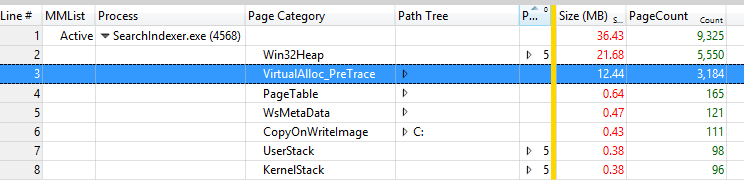

# 练习 1-标识具有较大的工作的进程集

用于分析数据的方法可以采取多种方法，并在其下启动调查的情况有所不同。 本练习中讨论，并提供一些示例的方法体系以及由各种列排列方式的不同视图。

因为居民设置的一组当前驻留在物理内存 (RAM) 的页面引用的数据。 驻留集是**Windows 性能记录器 (WPR)**或评估 Toolkit 内存评估与跟踪捕获的末尾的当前内存状态的快照。 不能收集单个跟踪中的多个快照。

驻留集提供有关系统内存组合全面、 即时快照。 给居民设置分析调查通常出于以下原因︰

-   若要了解物理内存使用率，尤其是在物理内存使用率情况比预期的高。

-   要了解进程工作集，尤其私人来源过程私人工作集时比预期更大。

-   由于分页活动的系统响应能力问题。

## 步骤 1︰ 收集数据使用评估 Toolkit

**Windows 评估 Toolkit**包含测试来测量在启动之后的内存需求量。 可以使用**的内存需求量**的评估结果收集基线预加载的图像软件。 很多进程和服务始终是在使用和占用的内存。 此评估服务可以帮助您查看驱动程序和应用程序 （即始终运行的） 对启动过程的影响。

1.  从**「 开始 」**菜单打开**Windows 评估控制台 (WAC)** 。

2.  打开**选项**菜单，然后选择**新作业...**

    1.  输入作业名称为**MemoryTest** 。

    2.  选择**创建自定义作业。**

3.  单击**添加评估。**

    -   通过单击"+"符号添加**内存占用量**评估

4.  单击新添加的**内存占用量**评估，输入测试配置。

5.  取消选中**使用推荐的设置**，选择配置**快速运行**。

    -   **快速运行**将允许测试在较短的数据准确性降低的时间内完成。

    

6.  与**快速运行**选择，您有两个选项︰

    1.  **包**要创建的文件夹具有测试的所有资源并将其复制到另一台测试系统的作业。 （请单击**包...** 按钮的右下角，请选择此选项。

    2.  **运行**作业直接在系统上。 （在右下角，请选择此选项中的**运行**按钮单击）。

        -   这将重新启动系统以收集跟踪。

        -   此测试可以完成一些 15 至 20 分钟。

    我们想**运行**选项。

## 步骤 2︰ 可视化 WAC 使用的内存占用量评估结果

完成评估后，您可以打开包含在系统上的内存使用情况的摘要的结果 XML 文件。

### 步骤 2.1︰ 打开内存报告

1.  在**WAC**，打开**选项**菜单，并选择**打开结果...**

    -   您还可以按键盘上的**CTRL + R** 。

2.  单击**浏览...** 按钮。

3.  导航到存储评估的文件夹创建在步骤 1 中。

4.  打开在步骤 1 中创建的评估。

    该报告包含了不同类别，以帮助您了解总的内存占用驱动程序和进程的贡献。

    该报告应如下所示。

    

5.  花些时间来熟悉报表看**驱动程序**和**进程专用网页**类别。

在前面的示例中，1487 MB 的内存使用 4 GB 的物理 RAM 不足。

-   使用中的内存 = 进程工作集 + 非分页内存 + 修改过的页面

-   可用的内存 = 备用内存 + 可用内存

在前面的示例中，内存使用的最大使用者是 267 mb 的非页面缓冲和 613 MB 的驱动程序分配的进程私有页 （私人工作集）。

有关指标的详细信息，请参阅 MSDN 上的[内存占用量评估的结果](https://go.microsoft.com/fwlink/?linkid=619204)的主题。

### 步骤 2.2︰ 检查驱动程序非分页分配

该指标是相似的页面缓冲分配，只不过这些分配使用不会分页的物理内存。 这反映了物理内存都很固定，不可分页的内存或使用其他进程和服务。 获取太多的非分页内存减少备份的内存的内存可用。

1.  通过单击左侧的箭头展开**Driver Non-Paged 分配**类别。

2.  展开**DriverLockedSystemPages**类别。

    -   这是内存分页内存中加载并由驱动程序然后锁定，直到它不再有用。

3.  确定的最大内存使用的驱动程序。

    

通过更换具有较低的内存要求的硬件或软件驱动程序，可能会影响该指标。

驱动程序供应商的驱动程序的设计的方式有最大程度上此指标的影响。 寻找**WAC**中给出的结果的较大的内存分配。 此外，驱动程序供应商可以提供性能跟踪 （评估结果与相同的目录中存储和使用**WPA**可以进行分析） 来查找要到减少内存使用的候选区域的大量内存分配此评估服务。

### 步骤 2.3︰ 审查进程私人工作集

总内存占用空间的最大用户是始终可能会在用户不知情的情况下后台运行的应用程序。 要查看进程使用的内存量，可以在报表中使用**进程专用网页**类别。

1.  通过单击左侧的箭头展开**过程专用网页**类别。

2.  展开**活动**的类别。 此列表显示二进制文件和它们的活动内存的用法。

    您的视图应如下所示︰

    

3.  确定使用最多内存的过程。

您可以通过减少"始终运行"应用程序，这些应用程序**运行**的注册表项或**启动**文件夹中的数量影响该指标。 分析添加应用程序的影响。

驱动程序和软件供应商通过其代码的设计的方式有最大程度上此指标的影响。 寻找**WAC**中给出的结果的较大的内存分配。 此外，软件供应商可以提供性能跟踪 （存储评估结果与同一目录中） 来查找区域的大量内存分配，准备到减少内存使用的此评估服务。 仔细分析的分配，即使是小的可以帮助开发人员查找分配添加到。

## 第 3 步︰ 收集居民设置数据使用 WPR

在步骤 1 和 2 中，您学习了如何收集内存跟踪使用**评估 Toolkit 内存占用量**评估。 此评估可只捕获跟踪引导方案。 您可以捕获跟踪信息以任何方案 （启动应用程序、 web 浏览、 等等） 使用**Windows 性能记录器 (WPR)**

请按照以下步骤收集与驻留集的数据跟踪。

1.  从**「 开始 」**菜单打开**Windows 性能记录器**。

2.  选择**"第一级别会审"**和**"驻留集分析"**录制的配置文件，但保留其它选项的默认值。

3.  单击**开始**，然后等待几秒钟。

    

4.  单击**保存**，保存到磁盘的**ETL**跟踪。

现在有系统内存组合的快照。

## 步骤 4︰ 将解释使用 WPA 的驻留集的数据

请按照此过程操作︰

1.  从**开始**菜单启动**Windows 性能分析器**。

2.  打开刚收集**（文件**菜单，**打开...** **ETL**跟踪。

3.  扩展**内存**在**图形浏览器**中设置。

    

4.  拖放到分析选项卡的**居民设置**关系图。

您的视图应如下所示︰

查看数据的显示方式。 以下是一些最有帮助的列执行前级分析的定义︰

<table>
<colgroup>
<col width="50%" />
<col width="50%" />
</colgroup>
<thead>
<tr class="header">
<th>列</th>
<th>定义</th>
</tr>
</thead>
<tbody>
<tr class="odd">
<td><strong>MMList</strong></td>
<td>
内存管理列表中包含的页面。

<ul>
<li>
<strong>活动</strong>– 私人工作集的进程或内核工作集内的当前页。
</li>
<li>
<strong>备用</strong>– 未修改的备用列表页。 它们是可用内存的一部分。
</li>
<li>
<strong>修改</strong>– 处理专用或文件备份自从上次修改的页被持久保存到永久存储区。
</li>
<li>
<strong>ModifiedNoWrite</strong> -页面已被修改，但不会保留到永久存储区。
</li>
<li>
<strong>过渡</strong>– 在列表之间的转换的页面。
</li>
</ul></td>
</tr>
<tr class="even">
<td><strong>混色</strong></td>
<td>
进程的网页的所有者的名称。 此信息是仅可用于进程专用页面。 即使它们不共享，所有可共享的页面都是与"未知"(-1) 进程相关联。
</td>
</tr>
<tr class="odd">
<td><strong>说明</strong></td>
<td>
表示的值取决于页面分类。 例如︰

<ul>
<li>
对于图像、 驱动程序、 文件等，它显示的完整文件路径和名称。
</li>
<li>
<strong>池</strong>内存，它显示驱动程序池标记名称。
</li>
</ul></td>
</tr>
<tr class="even">
<td><strong>网页类别</strong></td>
<td>
下列定义页面中所包含的数据类型。 下面是一些可能的类别︰

<ul>
<li>
<strong>CopyOnWriteImage</strong> – 进程专用页面创建的可执行映像导入地址表的应用修补程序或重定基址的可执行文件。
</li>
<li>
<strong>驱动程序</strong>– 代码页的驱动程序。
</li>
<li>
<strong>DriverFile</strong> – 代码页读取驱动程序可执行文件和数据作为映射。
</li>
<li>
<strong>DriverLockedSystemPage</strong> – 被锁定，或者固定在内存中，并且通常由驱动程序或内核的内核模式页面。
</li>
<li>
<strong>图像</strong>–.dll 和.exe 文件中的页面加载作为可执行文件映像。
</li>
<li>
<strong>映射文件</strong>– 作为数据的数据文件或图像的页面加载。
</li>
<li>
<strong>NonPagedPool</strong> – 包含数据的非分页系统池的页面。
</li>
<li>
<strong>PagedPool</strong> – 包含可分页系统池中的数据页。
</li>
<li>
<strong>PFMappedSection</strong> -页面的内存映射节作后盾的页面文件。
</li>
<li>
<strong>SystemPage</strong> – 包含系统页表项的页面用来映射系统页面，例如 I/O 空间中，内核堆栈和内存描述符列表。
</li>
<li>
<strong>UserStack</strong> – 包含每个线程的用户模式数据的页面。
</li>
<li>
<strong>VirtualAlloc</strong> -VirtualAlloc Api 所分配的页。
</li>
<li>
<strong>Win32Heap</strong> – 堆页数。
</li>
</ul></td>
</tr>
<tr class="odd">
<td><strong>大小 (MB)</strong></td>
<td>
每个类别中聚合网页的总大小。
</td>
</tr>
</tbody>
</table>

 

## 第 6 步︰ 识别影响的内存需求量的进程工作集

驻留集的数据可以显示在许多不同的方法，基于在摘要表中的列排列方式。 摘要表中的几个预定义的列排列方式，可以用作起始点进行调查。

1.  选择**进程私人工作集**的预设。

    

2.  展开**活动的 MMList**组。

    1.  重点**活动**类别，因为它是什么会影响内存的使用情况。

    2.  内存压力下，能释放**备用**页。

    3.  可能是**已修改**页面写入磁盘，释放。

3.  通过单击**大小 (MB)**的列标题的大小进行排序。

4.  最大使用确定的过程。 作为进程名称，您可能会看到**不适用**和**"未知 (-1)"** 。

    -   **N/A**包含不到驱动程序池内存的任何进程关联的页。

    -   **"未知 (-1)"**包含可共享的页。

5.  展开的进程来看一看**网页类别**。

    1.  您现在可以看到进程工作集，如下图中的组成。

    2.  VirtualAlloc 或 Win32Heap，我们将在练习 2 中分析，应该是顶级类别。

    3.  在下面的示例中， **SearchIndexer.exe**通过**VirtualAlloc** API 调用中使用 21.7 MB 的活动通过**堆**分配的内存和 12.4 MB。

    

专注于第三方进程并确定它们是否需要启动启动作为预加载的软件的一部分。 作为开发人员，您应该分析您的进程正在以了解可以在其中进行优化的动态分配。

 

 

