# <a name="exercise-2---track-user-mode-process-allocations"></a>练习 2-跟踪用户模式进程分配


**堆**分配进行直接通过**堆**Api （**HeapAlloc**、 **HeapRealloc**和 C/c + + 分配如**新**、**分配**、**重新分配**、 **calloc**），以及提供服务使用的堆的三种类型︰

1.  **主线 NT 堆**– 服务分配请求大小小于 64 KB。

2.  **低碎片整理堆**– 细分服务分配请求大小固定的块的构成元素。

3.  **VirtualAlloc** – 服务分配请求的大小超过 64 KB。

**VirtualAlloc**用于直接通过**VirtualAlloc** API 进行的大型动态内存分配。 典型的用法是通常用于位图或缓冲区中。 可以使用**VirtualAlloc**来保留的页块，然后还要调用**VirtualAlloc**从保留块提交单独的页面。 这样一个过程，而不在需要时才消耗物理存储保留的虚拟地址空间范围。

有两个概念来理解在此区域中︰

1.  **保留的内存**︰ 保留使用的地址范围，但不会获取内存资源。

2.  **提交的内存**︰ 确保物理内存或页面文件空间将只有一个地址所引用。

在本练习中，您将学习如何收集跟踪调查用户模式进程分配内存的方式。

在练习重点介绍称为**MemoryTestApp.exe** ，分配到内存的虚拟测试过程︰

1.  **VirtualAlloc**提交大内存缓冲区的 API。

2.  C + + 的**new**运算符来实例化小对象。

您可以从[此处](http://download.microsoft.com/download/9/C/8/9C88C0A1-1200-416A-B92B-2EBB128E4A4B/MemoryTestApp.exe)下载**MemoryTestApp.exe** 。
## <a name="step-1-gather-a-virtualallocheap-trace-using-wpr"></a>步骤 1︰ 收集使用 WPR virtualAlloc/堆跟踪


大内存分配通常是那些影响流程的足迹，由**VirtualAlloc** API 提供服务。 这是所有调查应都开始，但它也是可能的进程存在问题，就与更小的分配 （如内存情况泄漏使用**new**运算符在 c + + 等）。。 在这种情况发生时，堆跟踪变得有用。

### <a name="a-href-idstep-1-1---prepare-the-system-for-heap-tracingastep-11-prepare-the-system-for-heap-tracing"></a><a href="" id="step-1-1---prepare-the-system-for-heap-tracing"></a>第 1.1 步︰ 准备堆跟踪系统

应被视为可选和完成时堆跟踪**VirtualAlloc**分析不提供对内存使用问题任何相关解释。 堆跟踪常常会产生更大的跟踪信息，并建议只对正在研究的单个进程启用跟踪。

添加注册表项过程的利息 (**MemoryTestApp.exe**在此种情况下);对于每个后续进程创建，然后启用堆跟踪。

``` syntax
reg add "HKLM\Software\Microsoft\Windows NT\CurrentVersion\Image File Execution Options\MemoryTestApp.exe" /v TracingFlags /t REG_DWORD /d 1 /f
```

### <a name="a-href-idstep-1-2--capture-a-trace-using-wpr-astep-12-capture-a-trace-using-wpr"></a><a href="" id="step-1-2--capture-a-trace-using-wpr-"></a>步 1.2︰ 捕获跟踪使用 WPR

在此步骤中，您将收集使用**WPR**包含**VirtualAlloc**和**堆**数据跟踪。

1.  打开**WPR**并修改跟踪配置。

    1.  选择**VirtualAlloc**和**堆**的提供程序。

    2.  选择**常规**作为**性能的方案**。

    3.  为**日志记录模式下**，选择**常规**。

        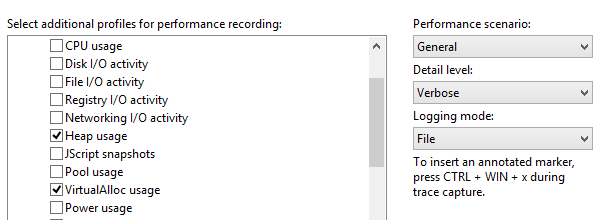

2.  单击**启动**以启动跟踪。

3.  启动**MemoryTestApp.exe**，并等待该进程终止 （应采取大约 30 秒）。

4.  返回到**WPR**、 跟踪，保存和打开**Windows 性能分析器 (WPA)**。

5.  打开**跟踪**菜单中，选择**配置符号路径**。

    -   指定符号高速缓存的路径。 符号的详细信息，请参阅 MSDN 上的[符号支持](https://go.microsoft.com/fwlink/?linkid=623019)页。

6.  打开**跟踪**菜单中，选择**加载符号**。

现在，您可以在其生存期中包含所有的内存分配模式的**MemoryTestApp.exe**进程的跟踪。

## <a name="step-2-review-virtualalloc-dynamic-allocations"></a>步骤 2︰ 查看 VirtualAlloc 动态分配


WPA 中的**VirtualAlloc 提交生存期**图通过公开详细的**VirtualAlloc**数据。 感兴趣的列如下所示︰

<table>
<colgroup>
<col width="50%" />
<col width="50%" />
</colgroup>
<thead>
<tr class="header">
<th>列</th>
<th>说明</th>
</tr>
</thead>
<tbody>
<tr class="odd">
<td><strong>混色</strong></td>
<td><p>执行通过<strong>VirtualAlloc</strong>内存分配的过程的名称。</p></td>
</tr>
<tr class="even">
<td><strong>提交堆栈</strong></td>
<td><p>调用堆栈显示导致所分配的内存的代码路径。</p></td>
</tr>
<tr class="odd">
<td><strong>提交时间</strong></td>
<td><p>分配内存时的时间戳。</p></td>
</tr>
<tr class="even">
<td><strong>解除的时间</strong></td>
<td><p>释放的内存时的时间戳。</p></td>
</tr>
<tr class="odd">
<td><strong>影响大小</strong></td>
<td><p>未完成分配的开始和结束的所选的时间间隔之间的大小差异的大小。 此大小调整根据所选的视图端口上。</p>
<p><strong>影响大小</strong>值将为零，如果由进程分配的所有内存都释放的可视化间隔结束<strong>WPA。</strong></p></td>
</tr>
<tr class="even">
<td><strong>大小</strong></td>
<td><p>在所选的时间间隔内的所有分配的累计之和。</p></td>
</tr>
</tbody>
</table>

 

请按照这些步骤分析**MemoryTestApp.exe**

1.  **图形资源管理器中**的**内存**类别中找到**VirtualAlloc 提交生存期**关系图。

2.  拖放到**分析**选项卡上的**VirtualAlloc 提交的生存期**。

3.  组织要显示这些列的表。 右键单击要添加或删除列的列标题。

    1.  **进程**

    2.  **影响类型**

    3.  **提交堆栈**

    4.  **提交时间**，并**解除时间**

    5.  **计数**

    6.  **影响大小**和**大小**

4.  进程列表中查找**MemoryTestApp.exe** 。

5.  应用过滤器，以便在图表上保留仅**MemoryTestApp.exe** 。

    -   用鼠标右键单击，并选择对选定内容的**筛选器**。

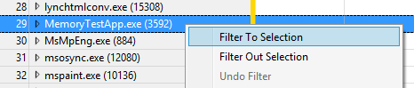

分析视看起来应该类似于这样︰


在前面的示例中，两个值感兴趣︰

-   **大小**为 126 MB︰ 这表明**MemoryTestApp.exe**分配总数 125 MB 在其生命周期的过程。 它代表所有**VirtualAlloc** API 的调用过程及其依赖项的累计之和。

-   **影响大小**为 0 MB︰ 这表示所有由进程分配的内存被释放由当前正在分析的时间间隔结束。 从其稳态内存使用量的增加，系统没有受到影响。

### <a name="step-21-analyze-steady-state-memory-usage"></a>步骤 2.1︰ 分析稳态内存使用情况

当调查内存分配，您应尝试回答的问题:"为什么是稳定状态内存使用量是否在增长对于这种情况？" 在**MemoryTestApp.exe**的示例中，您可以看到，它大约 10MB 稳定状态分配的内存的开头，然后它增加为 20 MB 到一半。

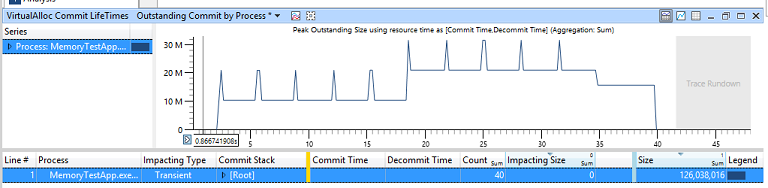

若要调查这种现象，缩小缩放到四周的时间间隔在跟踪中间突然增加时。

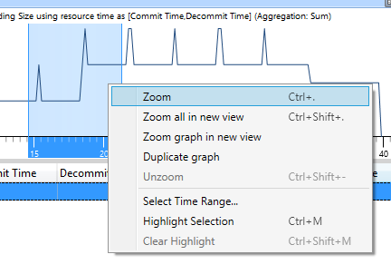

您的视区应如下所示。

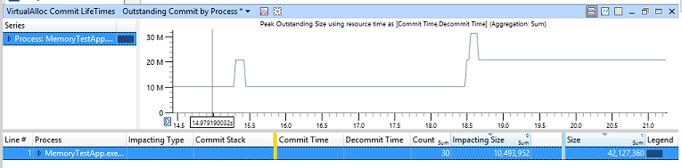

如您所见，**影响大小**现在是**10 MB**。 这意味着，开始之间正在分析的时间间隔结束，没有稳定状态内存使用量增幅是 10 MB。

1.  通过单击列标题按**影响大小**进行排序。

2.  展开的**MemoryTestApp.exe**行 （在**进程**列中）。

3.  展开的**Impacting**行 （在**影响类型**列中）。

4.  通过**提交堆栈**的过程中浏览直到找到 10 MB 的内存分配函数。

    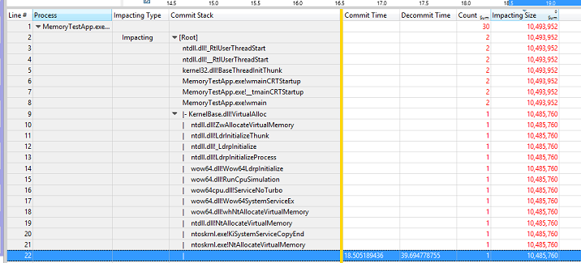

在此示例中， **MemoryTestApp.exe**的**Main**函数通过直接调用**VirtualAlloc**分配 10 MB 的内存负载的中间。 在现实生活中，应用程序开发人员应该确定分配是合理的否则代码可能重新排列，以最小化稳定状态内存使用率增加。

您可以现在**unzoom**在 WPA 的视区。

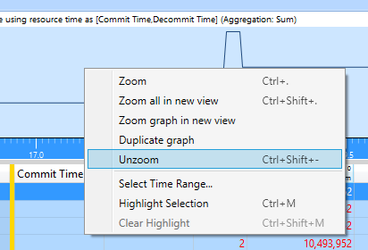

### <a name="step-22-analyze-transient-or-peak-memory-usage"></a>步骤 2.2︰ 分析瞬态 （或峰值） 的内存使用情况

当调查内存分配，您应尝试回答的问题:"为什么有方案的这一部分内存使用量瞬时峰值吗？" 暂时分配导致内存使用率峰值，并当存在内存压力时可能导致的碎片和有价值的内容推送出系统待机状态缓存。

在**MemoryTest**的示例中，您可以看到有均匀地分散在跟踪内存使用量 （10 MB) 的 10 个不同的峰值。


缩小缩放到最后四个尖峰，专注于感兴趣的一个小区域，并从非相关行为减少噪音。

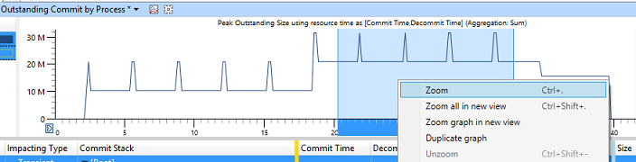

您的视区应如下所示︰

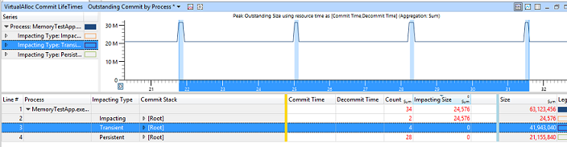

1.  通过单击列标题按**大小**排序。

2.  展开的**MemoryTestApp.exe**行 （在**进程**列中）。

3.  （中**影响 Type**列） 的**瞬态**行上单击。

    -   这应以蓝色加亮视区中的内存使用情况的所有的高峰。

4.  请注意不同的列的值︰

    1.  **计数**= 4︰ 这表示该时间间隔期间进行了四个暂时内存分配。

    2.  **影响大小**= 0 MB︰ 这表示的时间间隔结束时未释放的所有四个暂时内存分配。

    3.  **大小**= 40 MB︰ 这表示所有四个暂时内存分配 40 mb 的内存量的总和。

5.  通过**提交堆栈**的过程中浏览直到找到分配 40 MB 内存的函数。

    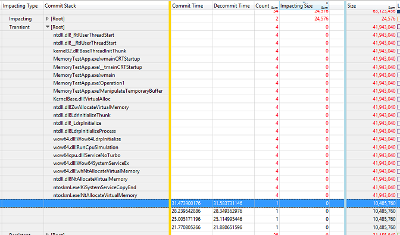

在此示例中， **MemoryTestApp.exe**的**Main**函数调用一个名为**Operation1**，反过来调用的函数名为**ManipulateTemporaryBuffer**的函数。 此**ManipulateTemporaryBuffer**函数然后直接调用**VirtualAlloc**四次，创建和释放 10 MB 内存缓冲区每次。 只有最后一次 100 ms 每个缓冲区。 缓冲区的分配和释放时间所表示的**提交时间**和**解除时间**的列。

在现实生活中，应用程序开发人员可以确定那些短期暂时的临时缓冲区分配的必要，是否他们可以替换操作中使用的永久内存缓冲区。

您可以现在**unzoom**在**WPA**的视区。

## <a name="step-3-review-heap-dynamic-allocations"></a>步骤 3︰ 检查堆动态分配


到目前为止，分析一直只着眼于由**VirtualAlloc** API 提供服务的大内存分配。 下一步是确定是否有其他小的分配所做的过程中，使用最初收集的堆数据的问题。

WPA 中的**"堆分配"**图通过公开详细的堆数据。 感兴趣的列如下所示︰

<table>
<colgroup>
<col width="50%" />
<col width="50%" />
</colgroup>
<thead>
<tr class="header">
<th>列</th>
<th>说明</th>
</tr>
</thead>
<tbody>
<tr class="odd">
<td><strong>混色</strong></td>
<td>正在执行内存分配的过程的名称。</td>
</tr>
<tr class="even">
<td><strong>句柄</strong></td>
<td><p>用来为服务分配的堆标识符。</p>
<p>可以创建堆，因此可能存在多个堆的进程的句柄。</p></td>
</tr>
<tr class="odd">
<td><strong>Stack</strong></td>
<td>调用堆栈显示导致所分配的内存的代码路径。</td>
</tr>
<tr class="even">
<td><strong>分配时间</strong></td>
<td>分配内存时的时间戳。</td>
</tr>
<tr class="odd">
<td><strong>影响大小</strong></td>
<td>未完成分配或区别的开始和结束的选取的视区的大小。 此大小调整根据选定的时间间隔。</td>
</tr>
<tr class="even">
<td><strong>大小</strong></td>
<td>所有分配/释放的累计之和。</td>
</tr>
</tbody>
</table>

 

请按照这些步骤分析**MemoryTestApp.exe**

1.  **图形资源管理器中**的**内存**类别中找到的**堆分配**图。

2.  拖放到**分析**选项卡上的**堆分配**。

3.  要显示这些列的表来组织︰

    1.  **进程**

    2.  **句柄**

    3.  **影响类型**

    4.  **堆栈**

    5.  **AllocTime**

    6.  **计数**

    7.  **影响大小**和**大小**

4.  进程列表中查找**MemoryTestApp.exe** 。

5.  应用过滤器，以便在图表上保留仅**MemoryTestApp.exe** 。

    -   用鼠标右键单击并选择对选定内容的**筛选器**。

您的视区应如下所示︰

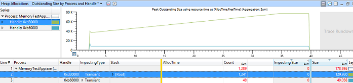

在此示例中，您可以看到，一堆持续增长的大小随时间以恒定速率。 有 1200年该间隔年底核算的 130 KB 的内存使用的堆上的内存分配。

1.  在跟踪过程放大较小的时间间隔 （例如，10 秒）。

2.  展开头**处理**，显示分配的最大容量 （**影响大小**列所示）。

3.  展开的**Impacting**类型。

4.  浏览**堆栈**的过程，直到找到负责分配所有此内存的函数。

    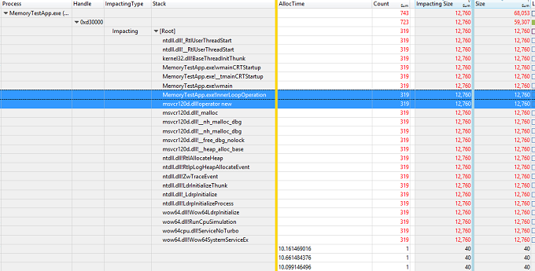

在此示例中， **Main**函数的**MemoryTestApp.exe**调用一个名为**InnerLoopOperation**的函数。 该**InnerLoopOperation**函数然后分配 40 个字节的内存 319 次通过 c + + 的**新**运算符。 进程终止一直分配此内存。

在现实生活中，应用程序开发人员应该再确定这种行为意味着可能的内存泄漏并解决该问题。

## <a name="step-4-clean-up-the-test-system"></a>步骤 4︰ 清除测试系统


分析完成后，您应清理注册表以确保堆跟踪禁用的进程。 在提升的命令提示符下运行以下命令︰

``` syntax
reg delete "HKLM\Software\Microsoft\Windows NT\CurrentVersion\Image File Execution Options\MemoryTestApp.exe" /v TracingFlags /f
```

 

 


